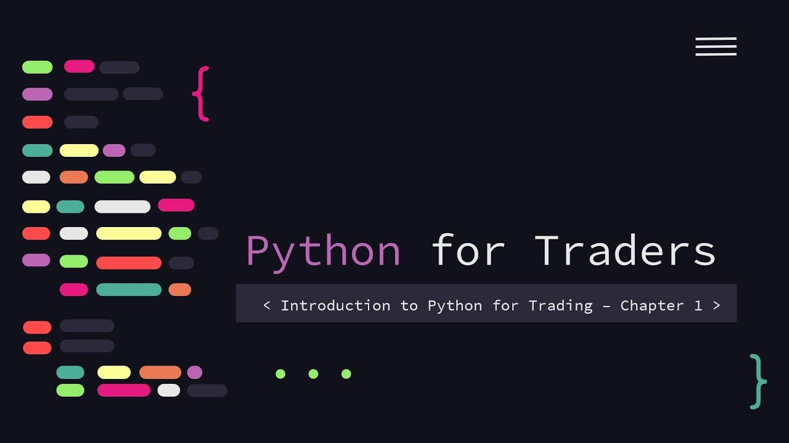

## Table of Contents

## What is Python and why is it popular for trading?

Python is a computer programming language that's easy to learn and use. It's like a set of instructions that you can give to a computer to do different tasks. People like Python because it's simple to read and write, kind of like writing in everyday language. You don't need to be a computer expert to start using it.

Python is very popular for trading because it helps traders analyze data and make decisions quickly. Traders use Python to look at stock prices, make predictions, and even buy or sell stocks automatically. It's great for trading because it can handle lots of information fast and there are many tools and libraries specifically made for finance and trading. This makes it easier for traders to do their work without needing to build everything from scratch.

## How can beginners start using Python for trading?

To start using Python for trading, beginners should first learn the basics of the Python language. This means understanding how to write simple programs, work with numbers and text, and use loops and conditions. There are many free resources online, like tutorials and courses, that can help you learn Python step by step. Once you feel comfortable with the basics, you can start looking at how Python is used in trading. Websites like Codecademy, Coursera, and freeCodeCamp offer great starting points for learning Python.

After getting a good grasp of Python, the next step is to explore libraries specifically designed for trading and finance. Libraries like Pandas, NumPy, and Matplotlib help you work with data and create charts, which are crucial for analyzing stock prices and trends. You can also look into more advanced libraries like Quantopian, which is made for quantitative trading. Start by downloading these libraries and practicing with sample data. Many online communities and forums, like Stack Overflow and Reddit, can provide help and advice as you learn. Remember, it's important to practice regularly and start with simple projects before moving on to more complex trading strategies.

## What are the essential Python libraries for trading?

For trading with Python, you'll want to use a few key libraries. Pandas is really helpful because it lets you work with big sets of data easily. You can use it to organize and analyze stock prices and other financial information. NumPy is another important library. It's great for doing math and calculations quickly, which is something you need a lot in trading. Matplotlib is useful for making charts and graphs. When you're looking at trends and patterns in the market, these visual tools can make things clearer and easier to understand.

Another important library is yfinance, which helps you pull financial data from Yahoo Finance. This can save you time because you don't have to find and download data manually. For more advanced trading, you might want to look into libraries like Quantopian or Backtrader. These are designed specifically for building and testing trading strategies. They can help you see how your ideas might work in the real world without risking actual money. By learning to use these libraries, you'll be better equipped to handle the data and decisions that come with trading.

## How do you set up a trading environment with Python?

To set up a trading environment with Python, you first need to install Python on your computer. You can download it from the official Python website. Once Python is installed, you'll need to set up a way to manage your projects and libraries. A popular tool for this is a virtual environment. It helps keep your project organized and makes sure that the libraries you use don't mess with other projects. You can create a virtual environment using a command like `python -m venv my_trading_env` and then activate it.

Next, you'll need to install the essential libraries for trading. You can do this using a package manager like pip, which comes with Python. Start by installing Pandas, which helps you work with data, by running `pip install pandas`. Then, add NumPy for math operations with `pip install numpy`, and Matplotlib for creating charts with `pip install matplotlib`. If you want to pull financial data, install yfinance with `pip install yfinance`. For more advanced trading strategies, consider installing Quantopian or Backtrader. Once these libraries are installed, you can start writing your trading scripts and analyzing data in your new trading environment.

## What are the basics of algorithmic trading with Python?

Algorithmic trading with Python involves using computer programs to make trading decisions automatically. You write code that tells the computer what to buy or sell based on certain rules or data. For example, you might write a program that buys a stock when its price goes below a certain level and sells it when it goes above another level. To do this, you use Python libraries like Pandas to work with data, NumPy for calculations, and yfinance to get stock prices. These tools help you collect and analyze information quickly, so your trading decisions can be based on up-to-date data.

Once you have your data and rules set up, you can test your trading strategy using historical data. This is called backtesting, and it helps you see how your strategy would have worked in the past. Libraries like Backtrader or Quantopian can help you with this. After backtesting, you might find that you need to adjust your rules to make your strategy better. When you're ready, you can start using your algorithm in real-time trading, but it's important to keep an eye on it and make changes if the market changes or if your strategy isn't working as expected. Algorithmic trading can be a powerful tool, but it takes practice and careful planning to use it well.

## How can you use Python to analyze financial data?

Using Python to analyze financial data is pretty straightforward. You start by gathering data from different sources, like stock prices or economic indicators. You can use libraries like yfinance to pull this data right into your Python program. Once you have the data, you use Pandas to organize it into a neat table called a DataFrame. This makes it easy to look at and work with the data. You can then use Pandas to do simple things like finding the average price of a stock over a period of time, or more complex tasks like figuring out how different stocks move together.

After organizing and cleaning your data, you can start analyzing it to find patterns and trends. NumPy helps you do math and calculations quickly, so you can figure out things like how much a stock's price changes over time. You can also use Matplotlib to create charts and graphs that show this information visually. For example, you might make a line chart to see how a stock's price has moved over the past year. By looking at these charts, you can spot trends that might help you make better trading decisions. Python makes all of this easier because it has powerful tools that are simple to use, even if you're not a coding expert.

## What are some common trading strategies you can implement with Python?

One common trading strategy you can implement with Python is the moving average crossover strategy. This strategy involves using two moving averages, one short-term and one long-term, to decide when to buy or sell a stock. When the short-term moving average crosses above the long-term one, it's a signal to buy. When the short-term average crosses below the long-term one, it's time to sell. You can use Python to calculate these moving averages with libraries like Pandas and NumPy, and then automate the buying and selling based on these signals. This strategy is popular because it's easy to understand and code, making it a good starting point for beginners.

Another strategy is the mean reversion strategy. This strategy is based on the idea that prices will eventually return to their average after moving away from it. You can use Python to identify when a stock's price is significantly above or below its historical average, and then buy or sell based on the expectation that it will revert to the mean. Libraries like Pandas can help you calculate the historical average price, and you can use statistical tools from SciPy to determine if the current price is far enough from the mean to be a good trading opportunity. This strategy can be more complex but is still within reach for someone learning to use Python for trading.

## How do you backtest trading strategies using Python?

Backtesting a trading strategy with Python means you're checking how well your trading rules would have worked in the past. You start by gathering historical data for the stocks or assets you're interested in. You can use a library like yfinance to pull this data into Python. Then, you use Pandas to organize this data into a DataFrame, making it easy to work with. Once you have your data set up, you write a Python script that follows your trading strategy rules. For example, if your strategy is to buy a stock when its 50-day moving average crosses above its 200-day moving average, your script will check for this condition in the historical data and pretend to buy or sell based on these signals.

After you've written your strategy into a script, you run it on the historical data to see how it would have performed. Libraries like Backtrader or Quantopian can help you do this backtesting easily. They let you see how much money you would have made or lost, and how often your strategy would have been right or wrong. It's important to look at different time periods and different stocks to make sure your strategy works well in different situations. Once you've backtested your strategy, you can tweak it to make it better before you start using it in real trading. Backtesting helps you feel more confident that your strategy can work in the real world.

## What advanced techniques can be used for optimizing trading algorithms in Python?

To optimize trading algorithms in Python, you can use machine learning to make your strategy smarter. Machine learning can help you find patterns in stock prices that are hard to see with just simple rules. Libraries like scikit-learn can help you build models that predict future prices based on past data. You can also use techniques like feature selection to decide which pieces of data are most important for your predictions. This can make your algorithm more accurate and faster. Another technique is to use genetic algorithms, which are like a digital version of natural selection. They help you find the best set of rules for your trading strategy by testing many different combinations and keeping the ones that work best.

Another advanced technique is to use high-frequency trading, where you buy and sell stocks very quickly. Python can help you do this by using libraries like Zipline to run your algorithm in real-time. You can also use optimization techniques like grid search or random search to fine-tune the parameters of your strategy. This means trying out different settings to see which ones make your algorithm perform the best. It's also important to keep an eye on how much your algorithm costs to run, because high-frequency trading can be expensive. By using these advanced techniques, you can make your trading algorithms more effective and potentially more profitable.

## How can Python be integrated with trading platforms and APIs?

Python can be easily integrated with trading platforms and APIs to automate trading and gather real-time data. Many trading platforms offer APIs that allow you to connect to them using Python. For example, you can use the Interactive Brokers API or the Alpaca API to send buy and sell orders directly from your Python script. To do this, you'll need to install the specific library for the platform, like ibapi for Interactive Brokers, and then use it to log in and send commands. This way, you can automate your trading strategy without having to manually enter orders on the platform.

Additionally, Python can be used to fetch real-time data from financial APIs like the IEX Cloud API or Alpha Vantage. These APIs provide up-to-date stock prices, financial news, and other important data that you can use in your trading algorithms. By using libraries like requests or pandas-datareader, you can pull this data into your Python program and use it to make trading decisions. Integrating Python with these platforms and APIs makes your trading more efficient and allows you to respond quickly to market changes.

## What are the best practices for risk management in Python-based trading systems?

Risk management is really important when you're trading with Python. One good way to manage risk is to set stop-loss orders. This means you tell your trading program to sell a stock if its price drops too much. This can help you avoid losing too much money on one trade. Another way is to not put all your money into one stock. Instead, spread it out over different stocks or assets. This is called diversification, and it can help protect you if one stock does badly. You can use Python to keep track of how much you're investing in each stock and make sure you're not putting too much in one place.

It's also a good idea to test your trading strategy a lot before you use real money. You can use historical data to see how your strategy would have worked in the past. This is called backtesting, and it can help you find problems with your strategy before you start trading for real. Also, keep an eye on how much you're spending on trading fees and other costs. These can add up and eat into your profits. By using Python to keep track of these costs, you can make sure you're not spending too much. Remember, the goal is to make money, but also to keep your losses small.

## How do experts use machine learning and AI in Python for trading?

Experts use machine learning and AI in Python to make their trading strategies smarter. They use libraries like scikit-learn to build models that can predict how stock prices might change. For example, they might use historical stock prices and other financial data to train a model. This model can then guess if a stock's price will go up or down in the future. By using these predictions, traders can decide when to buy or sell stocks. Machine learning can also help find patterns in data that are hard for people to see, like how different stocks move together or how news affects stock prices.

Another way experts use AI in Python for trading is through reinforcement learning. This is a type of machine learning where the computer learns by doing. The AI tries different trading strategies and sees which ones make the most money. Over time, it gets better at choosing the right actions to take. This can be really useful for high-frequency trading, where you need to make quick decisions. Python libraries like TensorFlow and PyTorch make it easier to set up and train these AI models. By using AI, traders can automate their strategies and respond to the market faster than they could on their own.

## References & Further Reading

[1]: [High-frequency trading in the foreign exchange market - Bank for International Settlements](https://www.bis.org/publ/mktc05.pdf)

[2]: [The Man Who Solved the Market: How Jim Simons Launched the Quant Revolution - Gregory Zuckerman](https://www.amazon.com/Man-Who-Solved-Market-Revolution/dp/073521798X)

[3]: [Alpha Vantage Official Documentation](https://www.alphavantage.co/documentation/)

[4]: [WebSocket API for real-time data](https://developer.mozilla.org/en-US/docs/Web/API/WebSocket)

[5]: [Backtrader Documentation](https://www.backtrader.com/docu/)

[6]: [pyfolio GitHub](https://github.com/quantopian/pyfolio)

[7]: [QuantConnect Documentation](https://www.quantconnect.com/docs)

[8]: [Fastquant Documentation](https://github.com/enzoampil/fastquant)

[9]: [QuantLib Documentation](https://quantlib.org/docs.shtml)

[10]: [Matplotlib Official Documentation](https://matplotlib.org/stable/contents.html)

[11]: [Pandas Visualization](https://pandas.pydata.org/docs/user_guide/visualization.html)

[12]: [Seaborn Official Documentation](https://seaborn.pydata.org/)

[13]: [Plotly Official Documentation](https://plotly.com/python/)

[14]: [pyfolio GitHub Repository](https://github.com/quantopian/pyfolio)

[15]: Devlin, J., Chang, M. W., Lee, K., & Toutanova, K. (2018). [BERT: Pre-training of Deep Bidirectional Transformers for Language Understanding](https://arxiv.org/abs/1810.04805). arXiv preprint arXiv:1810.04805.

[16]: [Hyperparameters and Model Validation in Deep Learning](https://jakevdp.github.io/PythonDataScienceHandbook/05.03-hyperparameters-and-model-validation.html)

[17]: "[Advances in Financial Machine Learning](https://www.amazon.com/Advances-Financial-Machine-Learning-Marcos/dp/1119482089)", Marcos Lopez de Prado, 2018.

[18]: [Interactive Brokers TWS API](https://www.interactivebrokers.com/en/index.php?f=5041)

[19]: [ib_insync GitHub Repository](https://github.com/erdewit/ib_insync)

[20]: [Binance Websocket API Documentation](https://binance-docs.github.io/apidocs/spot/en/#websocket-market-streams)