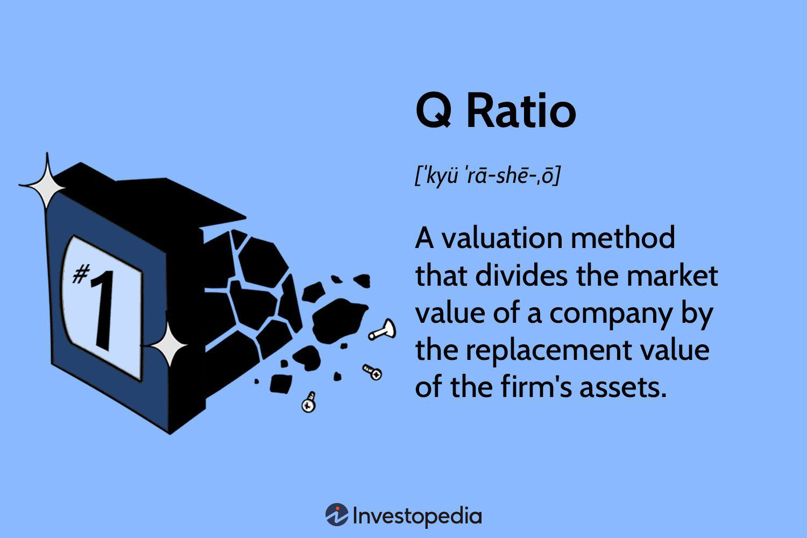

## Table of Contents

## What is the Q Ratio?

The Q Ratio, also known as Tobin's Q, is a way to figure out if a company or the whole stock market is priced right. It compares the market value of a company, which is how much its stock is worth, to the replacement cost of its assets. If the Q Ratio is more than 1, it means the market thinks the company is worth more than what it would cost to build it from scratch. If it's less than 1, the market value is lower than the cost to replace the assets.

This ratio can help investors decide if stocks are a good buy. If the Q Ratio is high, it might mean stocks are overpriced and could be a bad time to buy. If it's low, stocks might be undervalued, suggesting a good time to invest. Economists also use the Q Ratio to understand how the economy is doing. When the ratio is high, it might mean the economy is doing well, but it could also mean a bubble is forming, which could lead to a crash.

## What is Tobin's Q?

Tobin's Q is a way to see if a company or the whole stock market is priced fairly. It compares the market value of a company, which is what people are willing to pay for its stock, to the cost of replacing all its assets. If Tobin's Q is more than 1, it means the market thinks the company is worth more than what it would cost to build it from scratch. If it's less than 1, the market value is lower than the cost to replace the assets.

This ratio can help investors decide if it's a good time to buy stocks. If Tobin's Q is high, it might mean stocks are too expensive and it could be a bad time to buy. If it's low, stocks might be a good deal, suggesting it's a good time to invest. Economists also use Tobin's Q to understand the economy. A high Q might mean the economy is doing well, but it could also mean there's a bubble that might burst later.

## How is the Q Ratio calculated?

The Q Ratio is calculated by dividing the market value of a company by the replacement cost of its assets. The market value is what people are willing to pay for all the company's stock. The replacement cost is how much it would cost to buy all the things the company owns, like buildings and machines, if you had to start from scratch.

To find the market value, you add up the value of all the company's stock. To find the replacement cost, you need to estimate how much it would cost to buy everything the company owns at today's prices. If the Q Ratio is more than 1, it means the market thinks the company is worth more than what it would cost to build it from scratch. If it's less than 1, the market value is lower than the cost to replace the assets.

## How is Tobin's Q calculated?

Tobin's Q is calculated by dividing the market value of a company by the replacement cost of its assets. The market value is what people are willing to pay for all the company's stock. You find this by adding up the value of all the stock. The replacement cost is how much it would cost to buy all the things the company owns, like buildings and machines, if you had to start from scratch. You estimate this by figuring out today's prices for those assets.

If Tobin's Q is more than 1, it means the market thinks the company is worth more than what it would cost to build it from scratch. If it's less than 1, the market value is lower than the cost to replace the assets. This ratio helps investors decide if stocks are a good buy. A high Q might mean stocks are too expensive, while a low Q might mean they're a good deal. Economists also use Tobin's Q to understand the economy. A high Q might mean the economy is doing well, but it could also mean there's a bubble that might burst later.

## What is the difference between the Q Ratio and Tobin's Q?

The Q Ratio and Tobin's Q are two names for the same thing. They both measure how much a company or the whole stock market is worth compared to what it would cost to replace all its stuff. The Q Ratio and Tobin's Q are calculated the same way: you take the market value of the company, which is how much people are willing to pay for its stock, and divide it by the replacement cost of its assets, which is how much it would cost to buy everything the company owns at today's prices.

People use the Q Ratio and Tobin's Q to see if stocks are a good buy. If the Q Ratio or Tobin's Q is more than 1, it means the market thinks the company is worth more than what it would cost to build it from scratch. This might mean stocks are too expensive. If it's less than 1, the market value is lower than the cost to replace the assets, which might mean stocks are a good deal. Economists also use the Q Ratio and Tobin's Q to understand the economy. A high Q might mean the economy is doing well, but it could also mean there's a bubble that might burst later.

## What do the Q Ratio and Tobin's Q measure?

The Q Ratio and Tobin's Q measure if a company or the whole stock market is priced fairly. They do this by comparing the market value of a company, which is how much people are willing to pay for its stock, to the cost of replacing all its stuff. If the Q Ratio or Tobin's Q is more than 1, it means the market thinks the company is worth more than what it would cost to build it from scratch. If it's less than 1, the market value is lower than the cost to replace the stuff.

Investors use the Q Ratio and Tobin's Q to decide if it's a good time to buy stocks. If the Q Ratio or Tobin's Q is high, it might mean stocks are too expensive and it could be a bad time to buy. If it's low, stocks might be a good deal, suggesting it's a good time to invest. Economists also use the Q Ratio and Tobin's Q to understand the economy. A high Q might mean the economy is doing well, but it could also mean there's a bubble that might burst later.

## How are the Q Ratio and Tobin's Q used in financial analysis?

The Q Ratio and Tobin's Q are important tools in financial analysis because they help investors and economists figure out if stocks are priced right. They do this by comparing what the market thinks a company is worth to what it would cost to build the company from scratch. If the Q Ratio or Tobin's Q is more than 1, it means the market value of the company is higher than the cost to replace its assets, suggesting that stocks might be too expensive. On the other hand, if the Q Ratio or Tobin's Q is less than 1, it means the market value is lower than the replacement cost, which could mean stocks are undervalued and a good buy.

Economists also use the Q Ratio and Tobin's Q to get a sense of how the economy is doing. A high Q Ratio or Tobin's Q can mean the economy is strong, but it can also be a warning sign that a bubble is forming, which could lead to a crash later. By keeping an eye on these ratios, financial analysts can make better decisions about when to buy or sell stocks, and policymakers can use this information to help guide economic policy.

## Can you provide a simple example of calculating the Q Ratio?

Let's say we have a small company called "BikeCo" that makes bikes. The market value of BikeCo is how much people are willing to pay for all its stock, which is $1 million. The replacement cost of BikeCo's assets, like its factory and machines, is how much it would cost to buy all those things new today, which is $800,000.

To calculate the Q Ratio for BikeCo, we divide the market value by the replacement cost. So, we take $1 million (the market value) and divide it by $800,000 (the replacement cost). This gives us a Q Ratio of 1.25. Since the Q Ratio is more than 1, it means the market thinks BikeCo is worth more than what it would cost to build it from scratch.

## Can you provide a simple example of calculating Tobin's Q?

Let's say we have a small company called "ToyCo" that makes toys. The market value of ToyCo is how much people are willing to pay for all its stock, which is $500,000. The replacement cost of ToyCo's assets, like its factory and machines, is how much it would cost to buy all those things new today, which is $400,000.

To calculate Tobin's Q for ToyCo, we divide the market value by the replacement cost. So, we take $500,000 (the market value) and divide it by $400,000 (the replacement cost). This gives us a Tobin's Q of 1.25. Since Tobin's Q is more than 1, it means the market thinks ToyCo is worth more than what it would cost to build it from scratch.

## What are the limitations of using the Q Ratio and Tobin's Q?

Using the Q Ratio and Tobin's Q can have some problems. One big issue is that it can be hard to figure out the replacement cost of a company's stuff. This is because the value of things like buildings and machines can change a lot over time, and it's not always easy to know what they would cost to buy new today. Also, different people might guess different amounts for what things are worth, which can make the Q Ratio or Tobin's Q not very accurate.

Another problem is that the Q Ratio and Tobin's Q don't take into account things like how well a company is run or how good its future plans are. These things can make a big difference in what a company is really worth, but they don't show up in the Q Ratio or Tobin's Q. So, even if the Q Ratio or Tobin's Q is high, it doesn't always mean the company is a bad buy, and if it's low, it doesn't always mean it's a good buy. It's just one piece of information to think about when deciding if a company's stock is a good investment.

## How do the Q Ratio and Tobin's Q correlate with stock market performance?

The Q Ratio and Tobin's Q can help us understand how the stock market is doing. When these ratios are high, it means that the market value of companies is a lot more than what it would cost to replace their stuff. This can mean that the stock market is doing really well, and people are feeling good about buying stocks. But, if the Q Ratio or Tobin's Q gets too high, it might mean that stocks are too expensive, and there could be a big drop in the market later on. This is called a bubble, and it can be risky for investors.

On the other hand, when the Q Ratio and Tobin's Q are low, it means that the market value of companies is less than what it would cost to replace their stuff. This can be a sign that the stock market isn't doing so well, and people might not want to buy stocks. But, a low Q Ratio or Tobin's Q can also mean that stocks are a good deal, and it might be a good time for investors to buy. So, by looking at the Q Ratio and Tobin's Q, investors can get a sense of whether the stock market is a good place to put their money right now.

## What advanced applications or research have been conducted using the Q Ratio and Tobin's Q?

Researchers have used the Q Ratio and Tobin's Q to study how companies grow and make decisions. For example, some studies have looked at how these ratios can help predict if a company will invest more in new projects or buy other companies. By comparing the Q Ratio or Tobin's Q of different companies, researchers can figure out which ones are more likely to grow and why. They've also used these ratios to see if companies with a high Q Ratio or Tobin's Q are more likely to do things like research and development, because they have more money to spend on new ideas.

Another way the Q Ratio and Tobin's Q have been used in research is to look at how the whole economy is doing. Economists have used these ratios to see if the stock market is overvalued or undervalued compared to the real economy. This can help them understand if there's a bubble in the market that might burst, or if the market is a good place to invest. Some studies have also looked at how changes in the Q Ratio or Tobin's Q over time can tell us about economic cycles, helping policymakers make better decisions about things like interest rates and government spending.

## What are the Q Ratio and Tobin's Q in understanding financial metrics?

The Q Ratio and Tobin's Q are two pivotal financial metrics used extensively to evaluate market valuations and corporate performance. 

### Detailed Explanation of the Q Ratio

The Q Ratio is defined as the market value of a firm divided by the replacement cost of its assets. Essentially, it provides insights into whether the market value reflects or exceeds the asset value underlying a corporation. When the Q Ratio is greater than one, it suggests that the market might be overvaluing the company, whereas a ratio less than one may indicate undervaluation.

Mathematically, the Q Ratio is calculated as: 

$$
Q\ Ratio = \frac{\text{Market Value of Firm}}{\text{Replacement Cost of Assets}}
$$

The market value of a firm typically considers the total market value of equity plus the book value of total liabilities. The replacement cost is an estimation of how much it would cost to replace the firm's assets at current prices.

### Historical Background and Theoretical Foundation of Tobin's Q

Tobin's Q, introduced by economist James Tobin, shares conceptual similarities but is grounded in macroeconomic theory. Tobin postulated that investment is determined by the ratio of the market value of capital stocks to their replacement cost. In theory, if Tobin's Q is greater than one, additional investment is justified as firms can gain more from producing new capital than the cost of acquiring it. Conversely, a Q less than one suggests diminished incentives for new investments.

Formally, Tobin's Q is calculated as:

$$
Tobin's\ Q = \frac{\text{Market Value of Firm}}{\text{Replacement Cost of Assets}}
$$

It's important to note that this approach underscores long-term investment decisions in macroeconomic contexts.

### Comparison Between the Q Ratio and Tobin's Q

While both metrics measure the relationship between market and replacement values, their applications and interpretations can vary. Notably, the Q Ratio is more focused on immediate market situations, while Tobin's Q addresses longer-term investment dynamics. Also, while calculations can be similar, Tobin's Q is theoretically oriented towards the macroeconomic implications of investment incentives.

### Practical Applications in Assessing Market Valuations

These metrics are employed widely by investors and analysts to discern whether stocks are overvalued or undervalued relative to the company's assets. They assist in making informed decisions regarding investment, mergers, and acquisitions. Investment firms leverage these ratios to evaluate potential returns on asset investments.

### Case Studies and Historical Contexts

Historically, these metrics have served as precursors to identifying market bubbles or downturns. For instance, during the late 1990s tech boom, both the Q Ratio and Tobin's Q surged, signaling overvaluations which eventually led to the tech bubble burst. Similarly, their application can be observed in the real estate markets pre-2008 when elevated Q Ratios indicated underlying market stress.

In conclusion, the Q Ratio and Tobin's Q play instrumental roles in evaluating corporate and market health. Their integration into investment analyses provides robust insights into market capitalization compared to asset valuations, guiding strategic investment decisions and offering predictive insights into market trends.

## How can Q Ratio and Tobin's Q be implemented in algorithmic trading models?

Implementing the Q Ratio and Tobin's Q into algorithmic trading models involves several steps, technical considerations, and optimizations to maximize the utility of these metrics in automated decision-making processes.

### Step-by-Step Guide to Incorporating Q Ratio and Tobin's Q

1. **Data Collection and Preparation**: The first step is to gather accurate and comprehensive financial data. The Q Ratio typically requires data on the market value of equity, market value of debt, and replacement cost of a firm's assets. Tobin's Q, on the other hand, necessitates calculating the ratio between market capitalization and the replacement cost of assets. Reliable sources for this data include financial databases such as Bloomberg, Reuters, and online APIs like Yahoo Finance or Alpha Vantage.

2. **Calculation of Metrics**: 
    - **Q Ratio Formula**: 
$$
      Q \text{ Ratio} = \frac{\text{Market Value of Equity + Market Value of Debt}}{\text{Replacement Cost of Assets}}

$$
    - **Tobin's Q Formula**: 
$$
      \text{Tobin's Q} = \frac{\text{Market Capitalization}}{\text{Replacement Cost of Assets}}

$$
   Automated scripts to calculate these ratios from your data are crucial. Python's `pandas` library can be instrumental in handling and manipulating large datasets.

3. **Algorithm Development and Integration**: 
    - Develop a trading algorithm that uses these metrics as key indicators. The algorithm could be structured to buy undervalued (low Q Ratio) and sell overvalued (high Q Ratio) assets. 
    - One could employ conditional statements or machine learning models within Python to decide on trades based on calculated Q Ratios or Tobin's Q values.

4. **Technical Considerations and Data Requirements**: 
    - Ensure real-time data processing capabilities if the trading strategy demands up-to-date market conditions.
    - Maintain data accuracy by handling missing or outlier data points appropriately.
    - Consider computational efficiency, especially if integrating these metrics with high-frequency trading strategies.

5. **Optimization Techniques**: 
    - Utilize machine learning models such as regression analysis to better predict asset movements based on Q Ratios.
    - Implement backtesting to refine the algorithm by testing it on historical data, using libraries like `backtrader` in Python.
    - Tune parameters such as stop-loss limits and asset weighting to enhance strategy resilience.

6. **Common Pitfalls and Avoidance Strategies**:
    - Overfitting the model to historical data can lead to poor future performance. Use cross-validation techniques to ensure the strategy's robustness.
    - Over-reliance on a single metric can be mitigated by integrating additional indicators for a more holistic view.
    - Ensure liquidity and market impact are considered, particularly for large trades.

7. **Tools and Platforms for Development**:
    - Python frameworks such as `pyalgotrade` and `zipline` offer comprehensive tools for developing and backtesting trading strategies.
    - Platforms like QuantConnect and QuantLib provide cloud-based services for algorithmic trading model development, allowing for community engagement and resource sharing.

By carefully implementing these elements into algorithmic models, one can effectively utilize the Q Ratio and Tobin's Q for improved trading decisions, maximizing returns and managing risks effectively in the financial markets.

## References & Further Reading

[1]: Tobin, J. (1969). ["A General Equilibrium Approach to Monetary Theory."](https://www.jstor.org/stable/1991374) Journal of Money, Credit and Banking.

[2]: Smithers, A., & Wright, S. (2000). ["Valuing Wall Street: Protecting Wealth in Turbulent Markets."](https://www.amazon.com/Valuing-Wall-Street-Protecting-Turbulent/dp/0071387838) McGraw-Hill.

[3]: Kay, J. A. (1976). ["Accountants, Too, Could be Happy in a Golden Age: The Accounting Concept of Profit and the Economic Theory of Income."](https://www.jstor.org/stable/2662733) Oxford Review of Economic Policy.

[4]: Montier, J. (2009). ["The Little Book of Behavioral Investing: How not to be your own worst enemy."](https://www.amazon.com/Little-Book-Behavioral-Investing-worst/dp/0470686022) Wiley Finance.

[5]: Black, F. (1972). ["Capital Market Equilibrium with Restricted Borrowing."](https://econpapers.repec.org/RePEc:ucp:jnlbus:v:45:y:1972:i:3:p:444-55) The Journal of Business.

[6]: Damodaran, A. (2002). ["Investment Valuation: Tools and Techniques for Determining the Value of Any Asset."](https://books.google.com/books/about/Investment_Valuation.html?id=5SRHAAAAQBAJ) Wiley.

[7]: Lopez de Prado, M. (2018). ["Advances in Financial Machine Learning."](https://www.wiley.com/en-us/Advances+in+Financial+Machine+Learning-p-9781119482086) Wiley.

[8]: Chan, E. P. (2009). ["Quantitative Trading: How to Build Your Own Algorithmic Trading Business."](https://github.com/ftvision/quant_trading_echan_book) Wiley.

[9]: Fabozzi, F. J. (2001). ["The Theory and Practice of Investment Management."](https://onlinelibrary.wiley.com/doi/book/10.1002/9781118267028) Wiley Financial Series.