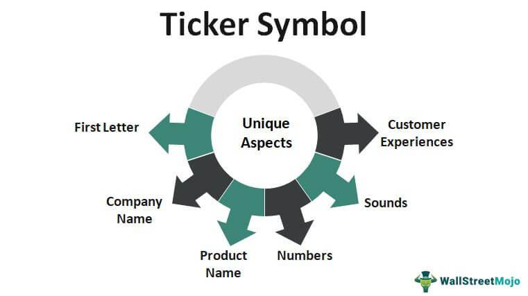

A ticker symbol represents a unique identifier assigned to publicly traded stocks, providing a standard shorthand for financial entities on exchanges globally. These symbols historically served to streamline the complexities of stock exchange communications and have become essential for traders in accessing real-time stock data and executing transactions efficiently. Algorithmic trading, an innovation reliant on computer algorithms to execute trades at high speeds and frequencies, has become increasingly significant in the finance sector. The interplay between ticker symbols and algorithmic trading is crucial as ticker symbols act as essential inputs for these automated systems, enabling seamless processing of stock transactions and price analysis.

As trading technology advances, understanding ticker symbols' function and their integration into algorithmic trading systems offers substantial benefits for investors. These include increased transaction speeds, the ability to handle complex data across multiple sources, and improved precision in executing trading strategies. This article outlines how ticker symbols are defined and used, the evolution and workings of algorithmic trading, and the combined influence they exert on stock market operations. It also highlights emerging trends, challenges, and potentials for growth, providing readers insights into these technologies' impact on the current and future state of financial markets.



## Table of Contents

## Understanding Ticker Symbols

Ticker symbols are unique series of letters assigned to publicly traded companies on stock exchanges. These symbols serve as shorthand identifiers for securities in financial markets, allowing quick and efficient communication among traders, investors, and financial systems. The inception of ticker symbols dates back to the late 19th century with the introduction of the stock ticker machine by Edward A. Calahan. This invention significantly advanced the dissemination of stock prices by providing a continuous stream of data reflecting market movements.

Historically, ticker symbols were designed to be as concise as possible to fit the mechanical limitations of early stock ticker machines. Typically, these symbols consist of one to five characters. For example, the New York Stock Exchange (NYSE) often uses one to three-character symbols, while the NASDAQ, which began as an electronic exchange, uses four-character symbols. In some cases, companies listed on multiple exchanges might have different ticker symbols on each one, reflecting variances in exchange policies and history.

Stock exchanges assign ticker symbols based on a regulated process that ensures uniqueness and prevents overlap with existing listings. An exchange considers several criteria, including the company's name, industry, and any pre-existing trademarks, before finalizing a ticker symbol. Regulatory bodies, such as the Securities and Exchange Commission (SEC) in the United States, play a crucial role in overseeing the process to maintain transparency and orderliness in stock markets.

The primary advantage of ticker symbols is their ability to facilitate the instantaneous recognition of securities. With just a few characters, market participants can swiftly access a wealth of information about a stock's performance, historical data, and financial reports. This efficiency is particularly valuable in fast-paced trading environments where time is of the essence.

Common examples of ticker symbols include ‘AAPL’ for Apple Inc., ‘MSFT’ for Microsoft Corporation, and ‘AMZN’ for Amazon.com, Inc. These symbols are widely recognized and used across various financial platforms and news outlets, underscoring their role as a fundamental element of stock market infrastructure.

In summary, ticker symbols are integral components of the financial ecosystem, serving as vital tools for identifying and trading stocks efficiently. Their historical development and current regulatory frameworks ensure they remain effective identifiers in dynamic trading environments.

## Overview of Algorithmic Trading

Algorithmic trading, commonly referred to as algo trading, is a method used in financial markets where computer algorithms are designed to follow a defined set of rules for placing trades. These rules can be based on various factors such as timing, price, quantity, or any mathematical model, enabling the execution of trades at speeds and frequencies that are impossible for a human trader. The primary purpose of [algorithmic trading](/wiki/algorithmic-trading) is to make the trading process as efficient and profitable as possible by removing human emotion and discretion from trading decisions.

Algorithmic trading fundamentally relies on data and mathematical models. This reliance is evident in how strategies are formulated, taking into account historical price data, trading volumes, and other market indicators. Algorithms analyze these vast datasets to identify patterns and generate trading signals. The mathematical models behind these algorithms often involve statistical methods, [machine learning](/wiki/machine-learning) techniques, or complex quantitative finance models. For instance, mean reversion strategies are based on the statistical premise that asset prices will revert to their long-term mean values, using formulas such as:

$$
\text{Signal} = \frac{\text{Price} - \text{Moving Average}}{\text{Standard Deviation}}
$$

where a significant deviation from the mean indicates a potential trading opportunity.

Technology and tools in algorithmic trading encompass robust computing power, high-speed internet connections, and specialized software platforms. Traders utilize programming languages like Python for [backtesting](/wiki/backtesting) strategies and real-time data analysis. Trading platforms such as MetaTrader and [Interactive Brokers](/wiki/interactive-brokers-api) provide APIs that allow for seamless execution of algorithmic strategies directly on the exchanges.

There are several types of algorithms employed by traders, each catering to different trading objectives:

1. **High-Frequency Trading (HFT):** Involving the rapid execution of a large number of orders, HFT relies on low-latency systems to exploit minute price changes occurring over seconds or fractions of a second.

2. **Market Making Algorithms:** These algorithms provide liquidity to the markets by quoting both buy and sell prices, aiming to earn the spread between them.

3. **Arbitrage Strategies:** Exploiting price discrepancies between markets or related instruments, these algorithms ensure profit from converging prices.

4. **Quantitative Models:** These involve complex mathematical calculations and risk management techniques to predict market movements. Examples include statistical arbitrage and momentum strategies.

One of the principal advantages of algorithmic trading is its speed and precision. Algorithms can process information and execute trades much faster than any human, reducing the lag between decision-making and action. Additionally, algorithms execute trades with precision, minimizing the likelihood of human errors. The consistency of executing predefined rule sets also aids in maintaining trading discipline, free from emotional biases.

In conclusion, algorithmic trading serves to enhance the trading landscape through its efficiency and advanced utilization of technology. By leveraging data and complex mathematical models, it empowers traders to make informed, rapid, and objective trading decisions, significantly transforming the dynamics of the financial markets.

## The Importance of Ticker Symbols in Algorithmic Trading

Ticker symbols are essential components in the architecture of algorithmic trading systems. At their core, these alphanumeric codes serve as unique identifiers for publicly traded securities, enabling precise communication and execution of trading strategies. In algorithmic trading, ticker symbols act as critical inputs that guide automated systems in the decision-making process for buying and selling securities.

The role of ticker symbols in automating trading processes is multifaceted. First and foremost, they allow algorithms to swiftly identify and access market data for specific securities. This functionality is crucial for executing trades at speeds unattainable by human traders. Algorithms utilize ticker symbols to continuously monitor price movements, [volume](/wiki/volume-trading-strategy) changes, historical performance, and other financial metrics. For example, when an algorithm detects a predefined pattern or set of conditions (e.g., a moving average crossover), it triggers a trade execution, referencing the relevant ticker symbol to direct the trade.

The ability of algorithms to leverage ticker symbols for tracking stock performance is pivotal. Algorithms can process massive amounts of data linked to ticker symbols to generate insights and predict future movements. These systems employ various statistical methods and machine learning models to analyze trends associated with each ticker, thus informing trading strategies. For instance, an algorithm might calculate the exponential moving average (EMA) for a stock denoted by its ticker symbol:

```python
def calculate_ema(prices, window):
    alpha = 2 / (window + 1)
    ema = [sum(prices[:window]) / window]
    for price in prices[window:]:
        ema.append((price - ema[-1]) * alpha + ema[-1])
    return ema
```

In this example, the algorithm could use the EMA to assess whether a stock is experiencing an upwards or downwards trend, prompting either a buy or a sell action.

Accuracy and timeliness are paramount when using ticker symbols in trading algorithms, as decisions are often made in fractions of a second. Any delay or error in interpreting ticker symbol data can lead to suboptimal trading decisions, potentially causing financial losses. For this reason, reliable data feeds and robust data management systems are integral components of successful algorithmic trading setups.

Despite the evident advantages, reliance on ticker symbols introduces certain risks. One potential risk is the misinterpretation of ticker data, which can occur due to inadequate data feeds or erroneous inputs. Such misinterpretations could result in incorrect trading signals, triggering unintended trades or missing lucrative opportunities. Moreover, discrepancies in ticker symbol formats or changes imposed by stock exchanges can disrupt algorithmic operations, underscoring the necessity for systems to adapt in real time to maintain accuracy and efficiency. Overall, while ticker symbols provide a crucial foundation for algorithmic trading, their effective utilization requires precision, consistency, and adaptability to mitigate associated risks.

## Real-world Examples of Algorithmic Trading with Ticker Symbols

Algorithmic trading has become a critical component of modern financial markets, with many companies and platforms leveraging these technologies to optimize trading operations. Notable players in this field include firms like Renaissance Technologies, Two Sigma, and Citadel, all of which utilize complex algorithms to gain competitive advantages in stock trading. These organizations harness massive computing power and vast datasets, continuously refining their strategies to exploit market inefficiencies.

For instance, Two Sigma employs data science and technology to create sophisticated trading models. Their approach focuses on quantitative analysis and the systematic application of machine learning algorithms to predict market movements, using ticker symbols as pivotal inputs. These symbols allow the algorithms to identify and trade stocks with precision and speed, demonstrating the effectiveness of algorithmic methods.

One notable case study involves the use of high-frequency trading ([HFT](/wiki/high-frequency-trading-strategies)) by Virtu Financial, a company that has consistently reported profitable trading days. Virtu's algorithms execute trades in milliseconds, capitalizing on fleeting price discrepancies in the market. Ticker symbols serve as crucial identifiers, enabling their systems to quickly process and react to real-time market data. This reliance on accurate and timely ticker information showcases the symbols' importance in successful algorithmic trading.

Ticker symbols have also played a key role in events such as the 2010 Flash Crash, where algorithmic trading led to extreme market [volatility](/wiki/volatility-trading-strategies). During this incident, the Dow Jones Industrial Average plummeted around 1,000 points within minutes, largely due to automatic trading programs reacting to erroneous signals linked to stock prices. This highlighted the strong influence of ticker symbols in algorithmic actions and the potential systemic risks when misinterpretations occur.

Innovations in [artificial intelligence](/wiki/ai-artificial-intelligence) (AI) have significantly enhanced the capabilities of trading algorithms. AI-driven algorithms can process unstructured data, including news articles and social media posts, integrating this information with ticker-based data to improve decision-making. For example, Alpaca, a commission-free trading platform, uses AI to empower individual traders with algorithmic strategies, showcasing the democratization of these technologies.

However, algorithmic trading systems face several challenges. One primary concern is data quality, where discrepancies or errors in ticker symbols can lead to erroneous trades. Regulatory bodies, such as the Securities and Exchange Commission (SEC), impose strict guidelines to ensure transparency and fairness, affecting how algorithmic systems operate. Additionally, the rapid pace of technological advancements poses integration and scalability challenges, prompting firms to continuously adapt their infrastructure.

In conclusion, algorithmic trading, underpinned by the robust use of ticker symbols, continues to evolve with technological innovations, presenting both opportunities and challenges for market participants. The precise use of ticker data enhances trading algorithms, enabling efficient capital allocation and [liquidity](/wiki/liquidity-risk-premium) provision. As the financial landscape evolves, the strategic implementation of these systems, supported by AI and other emerging technologies, remains a key focus for future advancements.

## Challenges and Considerations in Using Ticker Symbols for Algorithmic Trading

When analyzing the challenges and considerations associated with using ticker symbols for algorithmic trading, several key factors come into play. Among them, data quality and consistency in ticker symbol reporting are prominent concerns. Ticker symbols serve as fundamental identifiers in the stock market, yet discrepancies can occur due to inconsistencies in exchange reporting, mergers and acquisitions, or human errors during input. This can lead to erroneous data feeds, which algorithms might misinterpret, causing incorrect trading decisions.

Regulatory considerations also significantly impact the use of ticker symbols in trading. Each stock exchange adheres to its guidelines for assigning and altering ticker symbols. Regulatory bodies, such as the U.S. Securities and Exchange Commission (SEC), oversee these practices to ensure market stability and investor protection. Traders and algorithm designers must stay informed about these regulations to ensure compliance and adapt their trading strategies accordingly.

From an ethical standpoint, algorithmic trading, particularly high-frequency trading (HFT), poses challenges related to market fairness. HFT can manipulate minute price discrepancies to execute large volumes of trades in milliseconds, often outpacing traditional market participants. This can lead to inequities where individual investors and smaller firms find it hard to compete. Ethical concerns extend to the potential for market volatility and flash crashes, scenarios where the algorithmic trading exacerbates rapid declines in stock prices.

Technological disruptions, such as system failures or cyber-attacks, pose risks that could affect the integration of ticker symbols in trading systems. As trading platforms become increasingly sophisticated, the risk of technological obsolescence rises, necessitating constant updates and security enhancements to maintain operational integrity.

To mitigate the risks associated with algorithmic trading, traders can employ several strategies. Firstly, they should ensure robust data validation processes to detect and correct discrepancies in ticker symbol data promptly. Implementing comprehensive risk management frameworks that include stop-loss mechanisms and volatility hedging can help constrain potential losses. Furthermore, staying updated with regulatory changes and actively participating in ethical discussions about the impact of algorithmic strategies can foster a more equitable trading environment.

By understanding these challenges and implementing diligent oversight, traders can enhance their algorithmic trading operations while contributing to a fairer and more stable financial market.

## Future Trends in Ticker Symbols and Algorithmic Trading

As trading becomes increasingly digitized, the future of ticker symbols and algorithmic trading is poised for significant transformation. One notable development is the integration of blockchain technology, which promises to enhance the transparency and security of financial transactions. By providing an immutable ledger, blockchain could facilitate the tracking of stock movements and transactions with higher confidence and integrity. This near real-time data access could streamline algorithmic trading strategies, leading to more accurate assessments and executions. 

Additionally, the adoption of machine learning and artificial intelligence (AI) is reshaping how algorithms interact with ticker symbols. Machine learning models can analyze vast amounts of historical and real-time data, identifying patterns that may elude human traders. AI-driven systems can interpret and predict stock performance by continuously learning from market behaviors, even adapting strategies as market conditions change. For instance, [deep learning](/wiki/deep-learning) models can process complex data sets that include not only ticker symbols but also news sentiment analysis, providing a more holistic approach to trading decisions.

Emerging technologies, such as quantum computing, also hold the potential to revolutionize algorithmic trading. Quantum computers could solve complex optimization problems, like determining optimal trading paths, exponentially faster than classical computers. This computational power could significantly increase the speed and efficiency with which trading algorithms operate, offering a competitive edge in markets where microseconds can influence profitability.

Global market trends and economic shifts will also play a pivotal role in shaping these systems. As markets continue to globalize, cross-border trading will become more prevalent, necessitating the need for a harmonized system of ticker symbols and regulatory standards. Economic shifts, such as changes in fiscal policies or geopolitical tensions, will require algorithms to be adaptable and sensitive to these external influences, ensuring that trading strategies remain robust under varying conditions.

In conclusion, the intersection of ticker symbols and trading algorithms is poised for substantial growth and innovation. As technology continues to evolve, the integration of advanced analytical tools and emerging technologies will drive the development of more sophisticated and efficient trading systems. This evolution offers substantial opportunities for traders and investors to capitalize on more dynamic and responsive market strategies, ultimately leading to a more efficient and transparent financial ecosystem.

## Conclusion

The integration of ticker symbols and algorithmic trading has transformed the landscape of modern financial markets. Ticker symbols serve as essential identifiers that streamline the complex process of stock trading, while algorithmic trading has brought unprecedented speed and precision to market operations. Together, these tools empower traders and investors to make more informed decisions, automate trading processes, and capitalize on market opportunities with efficiency.

The significance of ticker symbols and algorithmic trading lies in their ability to handle large volumes of data with exceptional accuracy. Ticker symbols ensure quick and clear identification of stocks, facilitating seamless communication between trading platforms and financial institutions. Meanwhile, algorithmic trading, driven by sophisticated data analysis and mathematical models, mitigates human error and executes trades with remarkable speed, harnessing market dynamics more effectively than traditional methods.

The evolving landscape of the stock market, characterized by rapid technological advancements, presents both opportunities and challenges. As technology continues to progress, the tools and strategies surrounding ticker symbols and algorithmic trading are expected to evolve, incorporating innovations such as artificial intelligence and machine learning. These developments promise to enhance predictive analytics and decision-making capabilities, offering traders a competitive edge.

Prospective traders and investors should consider deepening their understanding of algorithmic trading, possibly seeking the guidance of professionals in the field. Engaging with automated trading systems holds potential benefits, as these platforms are designed to leverage cutting-edge technologies for optimized trading outcomes.

Readers are encouraged to reflect on their experiences or share insights regarding automated trading systems. This engagement fosters a community of knowledge-sharing and dialogue, contributing to the continuous improvement and adaptation of trading practices in a tech-driven stock market environment.

## References & Further Reading

[1]: Bergstra, J., Bardenet, R., Bengio, Y., & Kégl, B. (2011). ["Algorithms for Hyper-Parameter Optimization."](https://dl.acm.org/doi/10.5555/2986459.2986743) Advances in Neural Information Processing Systems 24.

[2]: ["Advances in Financial Machine Learning"](https://www.amazon.com/Advances-Financial-Machine-Learning-Marcos/dp/1119482089) by Marcos Lopez de Prado

[3]: ["Evidence-Based Technical Analysis: Applying the Scientific Method and Statistical Inference to Trading Signals"](https://www.amazon.com/Evidence-Based-Technical-Analysis-Scientific-Statistical/dp/0470008741) by David Aronson

[4]: ["Machine Learning for Algorithmic Trading"](https://github.com/stefan-jansen/machine-learning-for-trading) by Stefan Jansen

[5]: ["Quantitative Trading: How to Build Your Own Algorithmic Trading Business"](https://www.amazon.com/Quantitative-Trading-Build-Algorithmic-Business/dp/1119800064) by Ernest P. Chan