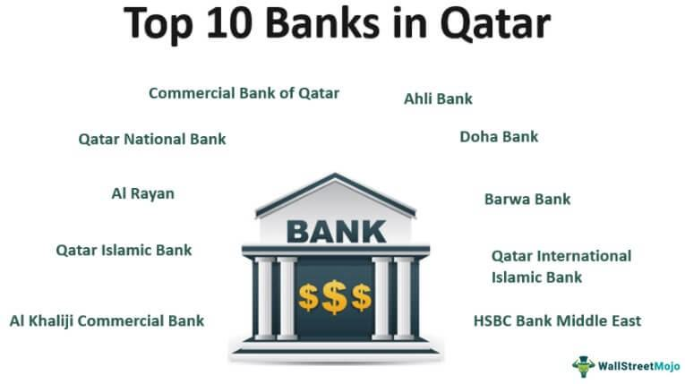

The Qatar Investment Authority (QIA) stands as one of the most influential sovereign wealth funds globally. Established in 2005, QIA was founded with a primary mission to manage and grow the wealth of Qatar through strategic diversification, sustainability, and global investments. The creation of QIA was a pivotal step for Qatar, especially considering its abundant natural resources, to ensure the long-term financial stability of the nation for future generations. By moving beyond dependence on hydrocarbon revenues, QIA aims to develop a more diversified and resilient economy. This article aims to explore various facets of QIA, elucidating its history, diversified investment strategies, and the integral role that algorithmic trading plays within its operations to optimize investment efficiency and manage risks. Understanding these aspects highlights QIA's strategic approach to portfolio management, affirming its position as a key player in the international financial markets.

## Table of Contents



## Understanding Sovereign Wealth Funds

A sovereign wealth fund (SWF) is a state-owned investment fund designed to manage a country's reserves and achieve financial growth. These funds are typically derived from a surplus in government revenues, commonly sourced from commodities like oil and gas. The strategic purpose of such funds is to ensure long-term financial stability and economic security for a nation's future, making them vital financial instruments for countries rich in natural resources.

Sovereign wealth funds operate by investing in a diversified portfolio across various asset classes, including equities, bonds, real estate, and alternative investments. By employing a diverse investment strategy, these funds aim to achieve a balance between risk and return, thus safeguarding their assets against global financial market volatility and inflationary pressures.

Specific to Qatar, the Qatar Investment Authority (QIA) manages the country's sovereign wealth fund. Established using the nation's resource wealth, especially from its abundant oil and gas reserves, QIA's primary objective is to secure financial and economic stability for future generations. This involves not only the preservation of wealth but also the diversification of investments to reduce dependence on hydrocarbons, thereby promoting a sustainable economic trajectory for Qatar.

## The Establishment of Qatar Investment Authority

The Qatar Investment Authority (QIA) was established in 2005 under Amiri Decision No. 22, marking a significant step in Qatar's economic strategy. This decision was driven by the recognition of the importance of managing the country’s substantial state reserves effectively to ensure long-term financial security and economic stability. The primary objective of the QIA is to diversify Qatar's economy and reduce its reliance on hydrocarbons, which are finite resources subject to global market fluctuations. 

The establishment of QIA was part of a broader strategy to reinvest revenues from the nation’s rich oil and natural gas resources into diverse assets worldwide. This strategy aims to foster sustainable development by transitioning from a single-resource-dependent economy to a more varied and resilient economic model. Since its inception, QIA's establishment has been integral to strengthening Qatar's fiscal position by turning resource wealth into a source of ongoing income, thereby securing economic prosperity for future generations.

In the years following its establishment, QIA has grown to become one of the largest sovereign wealth funds globally, with assets under management that total hundreds of billions of dollars. This growth has been fueled by its strategic investments across a wide array of asset classes and industries. By diversifying its investment portfolio, QIA seeks not only to optimize returns but also to mitigate risks associated with economic [volatility](/wiki/volatility-trading-strategies) and geopolitical uncertainties. 

The authority’s commitment to expanding and optimizing its investment framework has been pivotal in its ascent as a global financial powerhouse. As QIA continues to evolve, its ongoing efforts to balance growth with economic diversification underline its role as a fundamental pillar in safeguarding Qatar's future economic landscape.

## Investment Strategies of QIA

The Qatar Investment Authority (QIA) employs a comprehensive investment strategy that focuses on strategic asset allocation to balance growth and stability. This involves distributing investments across a diverse array of asset classes to optimize returns while managing risk. The asset classes include, but are not limited to, equities, real estate, and alternative investments. Each category serves a specific role in the portfolio, contributing uniquely towards achieving diversified growth.

Equities, representing ownership in companies, provide QIA with both capital appreciation and dividend income. These investments are spread across various international markets allowing QIA to benefit from global economic growth. Real estate investments, on the other hand, offer income generation and capital preservation through property appreciation in well-located assets. QIA's involvement in real estate spans from residential to commercial and industrial properties, ensuring exposure to varied segments within the sector.

Alternative investments present opportunities for diversification beyond traditional asset classes. This category includes hedge funds, private equity, infrastructure, and commodities. These investments tend to exhibit low correlation with standard market indices, thereby offering the potential to stabilize returns particularly during volatile market conditions.

Incorporating Environmental, Social, and Governance ([ESG](/wiki/esg-investing)) factors into investment decisions is a significant aspect of QIA's strategy. ESG considerations help evaluate the sustainability and societal impact of investments, aligning financial goals with ethical standards and long-term value creation. By integrating ESG criteria, QIA aims to mitigate risks associated with environmental and social issues, and to capitalize on investment opportunities arising from the global shift towards sustainable practices.

The strategic allocation framework employed by QIA is designed to adapt to changing economic conditions and financial markets. By maintaining flexibility and focusing on sustainable, responsible investment, QIA ensures robust financial performance and supports Qatar's economic diversification goals.

## History and Milestones of QIA

The Qatar Investment Authority (QIA) has demonstrated significant achievements since its establishment in 2005. Among its earliest milestones was the adoption of the Santiago Principles, a set of voluntary guidelines designed to promote transparency, good governance, accountability, and prudent investment practices among sovereign wealth funds (SWFs). These principles have been instrumental in standardizing the operational procedures of SWFs globally, and QIA’s involvement underscores its commitment to maintaining high standards of governance.

In 2017, QIA furthered its leadership role in sustainable investment by becoming a founding member of the One Planet Sovereign Wealth Fund Group. This collective initiative aims to integrate climate-related risks and sustainable investment strategies into the decision-making processes of SWFs. It highlights QIA’s proactive stance on addressing environmental challenges and aligning its investment portfolio with global sustainability objectives.

Adaptability has been a defining characteristic of QIA's strategy, especially as the global financial landscape undergoes rapid changes. Notably, around 2020, QIA shifted its focus more intently towards sustainable investments. This strategic pivot reflects an understanding of the growing importance of environmental, social, and governance (ESG) considerations in investment decisions, both in terms of mitigating risks and identifying new opportunities.

Throughout its history, QIA has concentrated on expanding its investment teams, enhancing its capacity and expertise across diverse asset classes and regions. This expansion facilitates the fund's ability to respond effectively to evolving market conditions and geopolitical dynamics. By continuously refining its strategic focus and expanding its operational capabilities, QIA maintains a competitive edge in the global investment arena, securing its position as a leading sovereign wealth fund dedicated to the long-term economic prosperity of Qatar.

## Algorithmic Trading and QIA

Algorithmic trading is a sophisticated technique that utilizes computer algorithms to execute trade orders, aiming for efficiency and precision in investment operations. This method leverages advanced mathematical models and high-speed data processing to capitalize on market opportunities that are often too fast for human traders to exploit.

The Qatar Investment Authority (QIA) has recognized the potential of [algorithmic trading](/wiki/algorithmic-trading) to streamline its investment strategies and enhance risk management. By integrating cutting-edge technology, QIA can optimize trading decisions, reduce transaction costs, and systematically manage investment risks. 

The success of algorithmic trading at QIA involves several key components:

1. **Data Analysis and Machine Learning**: QIA employs data-driven approaches and machine learning algorithms to analyze vast amounts of financial data. These technologies assist in identifying trading patterns and signals that inform investment decisions. For example, Python libraries such as pandas for data manipulation and scikit-learn for machine learning are often used to develop predictive models.

   ```python
   import pandas as pd
   from sklearn.linear_model import LinearRegression

   # Example of loading market data and fitting a linear regression model
   market_data = pd.read_csv('market_data.csv')
   X = market_data[['feature1', 'feature2']]
   y = market_data['target']

   model = LinearRegression().fit(X, y)
   ```

2. **Risk Management**: Algorithmic trading allows for robust risk management through real-time monitoring of market conditions and portfolio performance. Algorithms can be programmed to automatically adjust positions in response to predefined risk metrics, such as Value at Risk (VaR) or drawdown limits.

3. **High-Frequency Trading (HFT)**: While it is not explicitly confirmed that QIA engages in high-frequency trading, the use of high-speed execution is a notable aspect of algorithmic trading strategies. HFT involves the rapid execution of trades and capitalizes on small price fluctuations, demanding sophisticated infrastructure to ensure minimal latency.

4. **Portfolio Optimization**: Algorithmic trading facilitates the optimal allocation of assets within a portfolio, adhering to specified constraints and investment goals. Techniques such as mean-variance optimization can be implemented to achieve a balance between expected return and risk.

5. **Execution Algorithms**: QIA utilizes various execution algorithms to efficiently implement trading strategies without significantly impacting market prices. Commonly used algorithms include VWAP (Volume Weighted Average Price) and TWAP (Time Weighted Average Price), which are designed to execute large orders gradually to minimize market impact.

The integration of algorithmic trading within QIA not only boosts portfolio performance but also provides a strategic advantage in navigating complex and volatile markets. This capability ensures that QIA maintains competitive relevance and operational efficiency in the global financial landscape.

## Impact and Global Reach of QIA Investments

Qatar Investment Authority's (QIA) investments are strategically distributed across various global markets, reflecting its commitment to diversification and economic influence. The fund holds significant stakes in diverse sectors such as real estate, infrastructure, and equity markets, prominently including substantial investments in renowned companies like Volkswagen and Harrods. These investments not only solidify QIA's presence in international markets but also contribute to the enhancement of its global network and resource allocation.

Internationally, QIA's investment in automotive giant Volkswagen illustrates its focus on aligning with high-performance, environmentally conscious, and technologically driven companies. By holding a considerable stake, QIA gains influence in innovative automotive technologies and sustainability initiatives. Similarly, its ownership of Harrods, a prestigious retail establishment, exemplifies QIA's strategic interest in luxury markets and retail sector, positioning Qatar as a player with significant influence over consumer trends and high-value assets.

Domestically, QIA's investment strategy is geared towards fostering economic development and enhancing the quality of life for Qatari citizens. The fund channels capital into essential sectors such as healthcare, education, and infrastructure, aiming to modernize and diversify the national economy. These investments are integral to the nation's developmental goals, reducing Qatar's dependency on hydrocarbon revenues and promoting sustainable growth.

QIA's strategic approach to investments has elevated Qatar's position on the global stage, enabling it to engage and compete within international markets effectively. This global outreach complements domestic economic initiatives, positioning QIA not only as a powerful financial entity but also as a catalyst for economic resilience and innovation. By investing in key global economies and influential sectors, QIA reinforces Qatar's status as a significant contributor to global economic dynamics and future sustainability.

## Challenges and Future Outlook

QIA faces numerous challenges that could impact its ability to fulfill its strategic objectives. Market volatility remains a significant concern, as fluctuations in global markets can affect the profitability and value of QIA's diverse portfolio. The fund is also exposed to geopolitical risks, which can arise from political instability, regulatory changes, or international conflicts. Such risks can have direct and indirect effects on investment outcomes, necessitating a proactive risk management approach.

The global shift towards sustainable finance presents both opportunities and challenges for QIA. As environmental, social, and governance (ESG) considerations become integral to investment strategies worldwide, QIA is required to adapt its investment framework to meet evolving expectations. This adaptation involves integrating ESG principles into the investment decision-making process, thereby aligning with global sustainability trends.

QIA emphasizes diversification and sustainability as foundational elements for navigating future uncertainties. Diversification helps mitigate risks by spreading investments across various asset classes and geographical regions, reducing dependency on a single market or sector. Sustainability is increasingly becoming central to QIA's strategies, as it seeks to invest in industries and projects that support long-term environmental and economic health.

Looking forward, the future outlook for QIA involves strengthening its investment strategy to ensure Qatar's financial stability. This includes seeking new investment opportunities in emerging markets and industries that offer substantial growth potential. QIA is also likely to enhance its focus on technology-driven sectors and innovations that promise robust returns.

To effectively address these challenges, QIA may employ advanced analytical tools and models to predict market trends and assess risk factors. The integration of [artificial intelligence](/wiki/ai-artificial-intelligence) and [machine learning](/wiki/machine-learning) could be beneficial in identifying optimal asset allocations and minimizing exposure to adverse conditions. By balancing traditional investment strategies with innovative approaches, QIA aims to sustain its role as a leading sovereign wealth fund.

## Conclusion

The Qatar Investment Authority (QIA) plays a pivotal role in managing one of the most substantial sovereign wealth funds globally. By prioritizing diversification, sustainability, and cutting-edge trading strategies, QIA has strategically positioned itself for enduring success. The fund's diversified investment approach allows it to mitigate risks and seize opportunities across various sectors and regions. This strategy not only enhances financial returns but also contributes to greater economic stability and resilience.

Focusing on environmental, social, and governance (ESG) factors, QIA ensures its investments align with sustainable development goals. This focus is critical in navigating the contemporary shift towards sustainable finance, providing long-term benefits that extend beyond immediate financial gains. By integrating algorithmic trading and technological advancements into its operations, QIA enhances its ability to manage risks and optimize portfolio performance.

Furthermore, QIA's global investment footprint and strategic domestic investments contribute significantly to the financial landscapes worldwide. The fund's influence bolsters Qatar's position as a formidable player in international markets and aids in improving the economic prosperity of the nation. Through these efforts, QIA not only secures financial stability for future generations but also fosters a resilient and sustainable economic environment.

## References & Further Reading

[1]: Qatar Investment Authority. ([Official Website](https://www.qia.qa/en/About/pages/default.aspx)) 

[2]: Al-Kuwari, D. (2009). ["The development of Qatar’s natural gas industry."](https://scholar.google.com/citations?user=bn-dBisAAAAJ&hl=en) Energy Policy, 37(10), 4038-4048.

[3]: Gelpern, A., & Gulati, M. (2018). ["Sovereign wealth funds and bondholder rights."](https://www.researchgate.net/profile/Anna-Gelpern) Journal of International Economic Law, 21(3), 535-563.

[4]: Truman, E. M. (2008). ["A blueprint for sovereign wealth fund best practices."](https://ciaotest.cc.columbia.edu/pbei/iie/0001182/index.html) Peterson Institute for International Economics, Policy Brief No. PB08-3. 

[5]: Clark, G. L., Dixon, A. D., & Monk, A. H. (Eds.). (2013). ["Sovereign Wealth Funds: Legitimacy, Governance, and Global Power."](https://academic.oup.com/princeton-scholarship-online/book/23983)

[6]: Lopez de Prado, M. (2018). ["Advances in Financial Machine Learning."](https://www.amazon.com/Advances-Financial-Machine-Learning-Marcos/dp/1119482089) Wiley. 

[7]: The Santiago Principles: Generally Accepted Principles and Practices for Sovereign Wealth Funds. ([PDF Document](https://www.ifswf.org/sites/default/files/santiagoprinciples_0_0.pdf)) 

[8]: Aguiar, M., & Amador, M. (2011). ["Growth in the Shadow of Expropriation."](https://www.theigc.org/sites/default/files/2015/02/Aguiar-Amador-2011-Working-Paper.pdf) Econometrica, 79(2), 615-663.

[9]: Scherer, B. (2004). ["Portfolio Construction and Risk Budgeting."](https://archive.org/details/portfolioconstru0000sche) Risk Books.

[10]: Fernholz, R., & Fernholz, R. (2013). ["Sovereign wealth funds in the global economy."](https://scholar.google.com/citations?user=W7S-iJwAAAAJ) Academic Press.