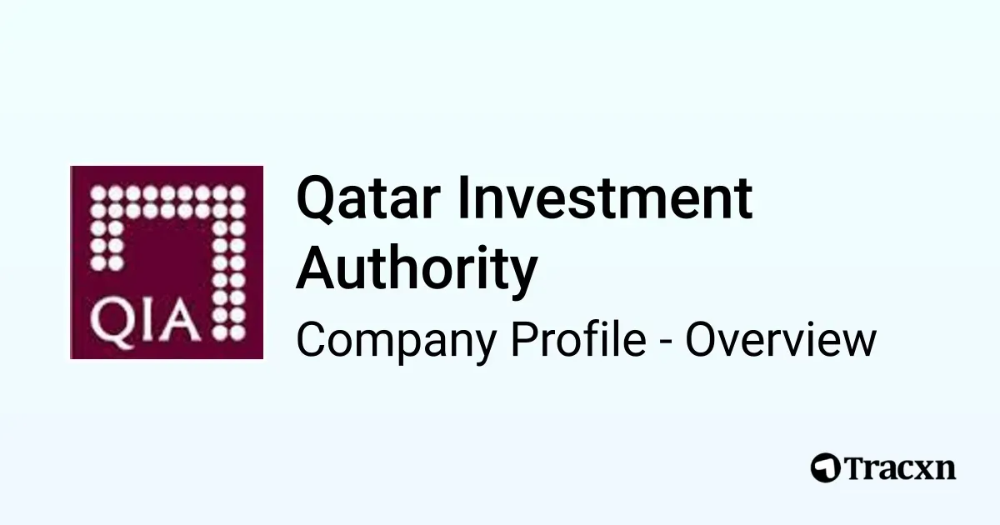

## Table of Contents

## What is the Qatar Investment Authority (QIA)?

The Qatar Investment Authority (QIA) is a big group that manages money for the country of Qatar. It was started in 2005 and its job is to invest Qatar's extra money in different things around the world, like businesses, buildings, and other countries' money. This helps Qatar make more money and grow its economy.

QIA is very important because it helps Qatar be part of the world's money markets. It invests in many places, like the United States, Europe, and Asia. By doing this, QIA helps Qatar have a bigger role in the world and makes sure the country's money keeps growing.

## When was the Qatar Investment Authority established?

The Qatar Investment Authority (QIA) was established in 2005. This was done to manage Qatar's extra money and invest it in different places around the world.

QIA helps Qatar by investing in businesses, buildings, and other countries' money markets. This way, Qatar can make more money and grow its economy. It's important because it helps Qatar be a bigger part of the world's money markets.

## What is the primary objective of the QIA?

The main goal of the Qatar Investment Authority (QIA) is to take care of Qatar's extra money and use it to make more money. QIA does this by investing in different things around the world, like businesses, buildings, and money markets in other countries. This helps Qatar's economy grow and become stronger.

QIA is important because it helps Qatar be a part of the world's money markets. By investing in places like the United States, Europe, and Asia, QIA makes sure that Qatar's money keeps growing. This way, Qatar can have a bigger role in the world and its economy can keep getting better.

## How is the QIA structured?

The Qatar Investment Authority (QIA) is set up in a way that helps it manage Qatar's money well. At the top, there's a Board of Directors that makes the big decisions. They are chosen by the Emir of Qatar, who is like the country's leader. The Board then picks a CEO to run the day-to-day work of QIA. The CEO has a team of people who help with different parts of the job, like investing in businesses or managing money.

QIA also has different groups inside it that focus on specific things. For example, there's a group that only looks at investments in the United States, and another group that deals with investments in Europe. This helps QIA make smart choices about where to put Qatar's money. By having these special groups, QIA can make sure it's investing in the best places to help Qatar's economy grow.

## What types of investments does the QIA focus on?

The Qatar Investment Authority (QIA) focuses on a wide range of investments to help grow Qatar's money. They invest in businesses all over the world, including big companies in places like the United States, Europe, and Asia. QIA also puts money into real estate, which means they buy buildings and land that can make money over time. This helps Qatar have a strong presence in different markets and industries.

Another big part of QIA's investments is in financial markets. They buy stocks, bonds, and other financial products to make more money for Qatar. QIA also looks at new and growing areas like technology and renewable energy, where they think they can get good returns. By spreading their investments across different types and places, QIA tries to keep Qatar's money safe and growing.

Overall, QIA's goal is to find the best opportunities to invest Qatar's extra money. They look at traditional areas like real estate and stocks, but also newer areas like technology. This mix helps QIA make smart choices and keep Qatar's economy strong.

## Can you name some major investments made by the QIA?

The Qatar Investment Authority (QIA) has made many big investments around the world. One of their biggest investments is in the company called Volkswagen, which makes cars. QIA bought a part of Volkswagen to help the company grow and to make money for Qatar. They also invested in the company called Barclays, which is a big bank in the United Kingdom. This investment helped Barclays during tough times and gave QIA a chance to earn money from the bank's success.

QIA also likes to invest in real estate. They bought a famous building in London called The Shard. The Shard is a very tall building with offices and apartments, and it makes money for QIA by renting out space. In the United States, QIA invested in a company called Empire State Realty Trust, which owns the famous Empire State Building in New York City. These real estate investments help QIA make money from renting and selling property.

In addition to cars, banks, and buildings, QIA also invests in other areas. They put money into a company called Rosneft, which is a big oil company in Russia. QIA also invested in a company called Credit Suisse, which is another big bank, but this time in Switzerland. By investing in different kinds of businesses and places, QIA tries to keep Qatar's money safe and growing.

## How has the QIA contributed to Qatar's economic diversification?

The Qatar Investment Authority (QIA) has played a big role in helping Qatar's economy grow in different ways. Before, Qatar mostly made money from oil and gas. But QIA has been investing in many other things around the world, like businesses, buildings, and new technology. By doing this, QIA helps Qatar not just depend on oil and gas anymore. This is important because it means Qatar's economy can keep growing even if the price of oil and gas goes down.

QIA's investments in different industries help bring in money from many places. For example, when QIA invests in a company like Volkswagen or buys buildings like The Shard in London, it makes money from those investments. This money can then be used to build more things in Qatar, like new businesses and projects. By spreading its investments across the world and in different types of businesses, QIA makes sure that Qatar's economy stays strong and keeps growing, no matter what happens with oil and gas prices.

## What role does the QIA play in global financial markets?

The Qatar Investment Authority (QIA) is a big player in the world's money markets. It invests Qatar's extra money in many different places, like the United States, Europe, and Asia. By doing this, QIA helps Qatar have a bigger role in the world and makes sure the country's money keeps growing. When QIA buys parts of big companies like Volkswagen or banks like Barclays, it shows that Qatar is interested in being a part of the global economy. These investments help QIA make money and also help the companies they invest in to grow.

QIA also invests in things like buildings and land, which is called real estate. For example, they own The Shard in London and part of the Empire State Building in New York. These investments help QIA make money from renting and selling property. By spreading its investments across different countries and types of businesses, QIA helps keep Qatar's money safe and growing. This way, QIA makes sure that Qatar can keep being a big part of the world's money markets and helps the country's economy stay strong.

## How does the QIA manage its investment portfolio?

The Qatar Investment Authority (QIA) manages its investment portfolio by spreading its money across different types of investments and places around the world. They invest in big companies like Volkswagen and banks like Barclays, which helps these companies grow and makes money for Qatar. QIA also buys buildings and land, like The Shard in London and part of the Empire State Building in New York. By doing this, they can make money from renting and selling property. This way, QIA makes sure that Qatar's money is safe and keeps growing.

QIA has a special way of organizing its work to manage its investments well. At the top, there's a Board of Directors that makes the big decisions. They choose a CEO who runs the day-to-day work and has a team to help with different parts of the job. QIA also has different groups inside it that focus on specific things, like investments in the United States or Europe. This helps QIA make smart choices about where to put Qatar's money. By having these special groups, QIA can make sure it's investing in the best places to help Qatar's economy grow.

## What are the governance and ethical standards followed by the QIA?

The Qatar Investment Authority (QIA) follows strict rules to make sure it does things the right way. They have a Board of Directors that makes the big decisions, and these people are chosen by the Emir of Qatar. The Board picks a CEO to run the day-to-day work. QIA also has a special group called the Audit and Risk Committee that checks to make sure everything is done correctly and safely. They have rules about how to invest money and how to treat people fairly. This helps QIA make good choices and keep Qatar's money safe.

QIA also cares about being ethical and responsible. They have rules about how to act in a way that is good for the world, like being kind to the environment and treating workers well. QIA tries to invest in companies that do good things and help make the world a better place. They also make sure to be open about what they do, so people can trust them. By following these rules, QIA helps Qatar be a good part of the world's money markets and keeps its investments strong and safe.

## How has the QIA's strategy evolved over the years?

The Qatar Investment Authority (QIA) started in 2005 with the main goal of managing Qatar's extra money and making it grow. At first, they focused a lot on big investments in companies and real estate around the world. They bought parts of big companies like Volkswagen and banks like Barclays, and they also invested in famous buildings like The Shard in London and the Empire State Building in New York. This helped Qatar have a bigger role in the world's money markets and made sure their money kept growing.

Over the years, QIA's strategy has changed to focus more on different types of investments and new areas. They still invest in big companies and real estate, but now they also look at new and growing areas like technology and renewable energy. QIA wants to spread its investments across many different places and industries to keep Qatar's money safe and growing, even if some areas don't do well. By doing this, QIA helps Qatar's economy grow in many ways and not just depend on oil and gas.

## What challenges and criticisms has the QIA faced in its operations?

The Qatar Investment Authority (QIA) has faced some challenges and criticisms over the years. One big challenge is making sure their investments are safe and growing. Since QIA invests in many different places and types of businesses, they have to be very careful to pick the best opportunities. If they make a bad choice, it could lose money for Qatar. Another challenge is dealing with changes in the world's money markets. Things like the price of oil and gas or problems in other countries can affect QIA's investments, so they always have to be ready for these changes.

QIA has also faced some criticisms. Some people worry about how transparent QIA is, which means how open they are about what they do. They want to know more about QIA's decisions and how they manage Qatar's money. Another criticism is about the ethical and environmental impact of their investments. Some people think QIA should be more careful about investing in companies that are good for the world and the environment. Despite these challenges and criticisms, QIA keeps working to manage Qatar's money well and help the country's economy grow in different ways.

## References & Further Reading

[1]: Qatar Investment Authority. ([Official Website](https://www.qia.qa/en/About/pages/default.aspx)) 

[2]: Al-Kuwari, D. (2009). ["The development of Qatar’s natural gas industry."](https://scholar.google.com/citations?user=bn-dBisAAAAJ&hl=en) Energy Policy, 37(10), 4038-4048.

[3]: Gelpern, A., & Gulati, M. (2018). ["Sovereign wealth funds and bondholder rights."](https://www.researchgate.net/profile/Anna-Gelpern) Journal of International Economic Law, 21(3), 535-563.

[4]: Truman, E. M. (2008). ["A blueprint for sovereign wealth fund best practices."](https://ciaotest.cc.columbia.edu/pbei/iie/0001182/index.html) Peterson Institute for International Economics, Policy Brief No. PB08-3. 

[5]: Clark, G. L., Dixon, A. D., & Monk, A. H. (Eds.). (2013). ["Sovereign Wealth Funds: Legitimacy, Governance, and Global Power."](https://academic.oup.com/princeton-scholarship-online/book/23983)

[6]: Lopez de Prado, M. (2018). ["Advances in Financial Machine Learning."](https://www.amazon.com/Advances-Financial-Machine-Learning-Marcos/dp/1119482089) Wiley. 

[7]: The Santiago Principles: Generally Accepted Principles and Practices for Sovereign Wealth Funds. ([PDF Document](https://www.ifswf.org/sites/default/files/santiagoprinciples_0_0.pdf)) 

[8]: Aguiar, M., & Amador, M. (2011). ["Growth in the Shadow of Expropriation."](https://www.theigc.org/sites/default/files/2015/02/Aguiar-Amador-2011-Working-Paper.pdf) Econometrica, 79(2), 615-663.

[9]: Scherer, B. (2004). ["Portfolio Construction and Risk Budgeting."](https://archive.org/details/portfolioconstru0000sche) Risk Books.

[10]: Fernholz, R., & Fernholz, R. (2013). ["Sovereign wealth funds in the global economy."](https://scholar.google.com/citations?user=W7S-iJwAAAAJ) Academic Press.