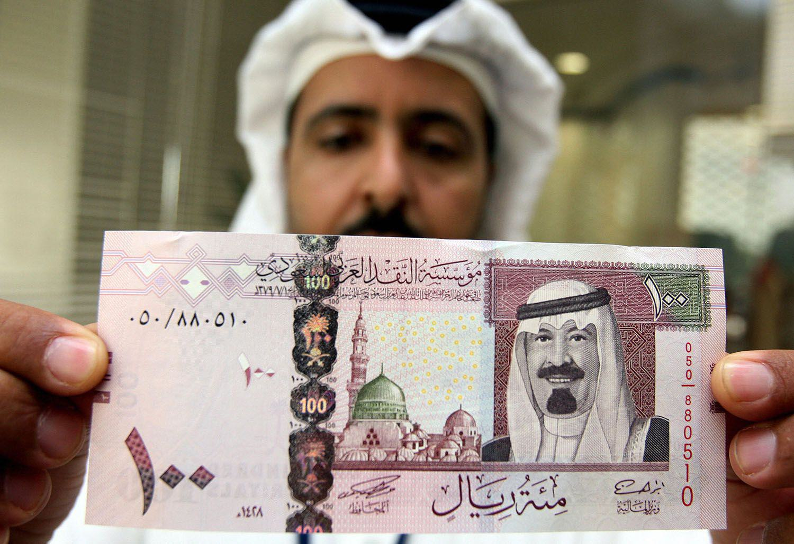

The world of finance is continuously evolving, and algorithmic trading is at the forefront of this transformation. Qatar, a burgeoning economic hub, plays a significant role in global finance through its currency, the Qatari Riyal (QAR). The QAR is characterized by a stable exchange rate, pegged to the US Dollar (USD) at a fixed rate of 1 USD to 3.64 QAR. This fixed exchange rate offers both unique opportunities and challenges for investors and traders, particularly those utilizing algorithmic trading strategies. 

Algorithmic trading, which involves the use of automated algorithms to execute trades, is becoming increasingly prevalent in the global financial markets. In Qatar, the stability of the QAR provides algorithmic traders with a predictable trading environment. This is particularly advantageous for strategies that profit from small, consistent movements rather than large, volatile swings. The Qatari economy, heavily reliant on natural resources such as oil and gas, provides an additional layer of predictability and stability that is attractive to both traditional and algorithmic traders.

Understanding the dynamics of the Qatari Riyal and its interaction with algorithmic trading is crucial for investors seeking to capitalize on opportunities in the region. The fixed currency peg, while offering stability, also limits potential gains from currency volatility—a factor that algorithmic traders must navigate strategically. As Qatar continues to develop and diversify its economy, the landscape for algorithmic trading will likely expand, presenting new avenues for innovation and profit. This intersection of financial stability and technological advancement positions Qatar as an intriguing market for those at the cutting edge of algorithmic trading.

## Table of Contents

## Overview of the Qatari Riyal (QAR)

The Qatari Riyal (QAR) is the official currency of Qatar, a small yet affluent nation on the Arabian Peninsula, notably rich in energy resources. Introduced in 1973, the QAR replaced the Qatar and Dubai Riyal, marking Qatar's autonomy in monetary control. The Qatar Central Bank (QCB) is responsible for the issuance and regulation of the Qatari Riyal, playing a pivotal role in maintaining the nation's monetary stability.

A distinguishing feature of the Qatari Riyal is its fixed exchange rate system, where 1 USD is pegged to 3.64 QAR. This peg to the U.S. dollar provides a level of stability that is attractive to investors, as it significantly reduces the volatility that is often seen in other currencies that float according to market conditions. Such stability is crucial, particularly in a region where economic reliance is predominantly on energy exports, specifically oil and natural gas.

The currency peg acts as a double-edged sword for investors. On one hand, it serves to mitigate financial risks associated with currency fluctuations, thereby creating a secure environment for international transactions and investments. This is particularly beneficial for sectors like energy that form the backbone of Qatar's economy and involve extensive international trade. On the other hand, the fixed exchange rate also constrains the opportunities for substantial gains that can arise from currency fluctuations in more volatile exchange systems.

This well-calibrated monetary strategy underscores Qatar's economic management, focusing on stable growth and investor confidence. While the peg limits speculative currency trading to some extent, it supports long-term economic planning and investment strategies, thereby reinforcing Qatar's position as a stable and reliable partner in the global economy.

## Algorithmic Trading and Its Impact

Algorithmic trading signifies a transformative approach to executing trade strategies through the use of sophisticated automated algorithms, facilitating operations at speeds beyond human capability. This technological advancement is particularly significant in trading the Qatari Riyal (QAR) against the US Dollar (USD) due to the inherent stability offered by the currency's peg to the USD. 

The fixed exchange rate of 1 USD to 3.64 QAR provides an attractive proposition for implementing low-risk [algorithmic trading](/wiki/algorithmic-trading) strategies. Traders can capitalize on minor price movements in the QAR/USD currency pair, which, while relatively stable compared to more volatile currency pairs, still offers opportunities for gain through precision and timing. Unlike trading in volatile markets, where swings can be dramatic, the QAR/USD market's predictability becomes an asset when employing high-frequency trading algorithms designed to detect and exploit minute market inefficiencies.

Furthermore, advanced algorithms can enhance the precision and efficiency of trades by incorporating global economic indicators and local market conditions into their decision-making processes. For instance, algorithms can be programmed to consider changes in global energy prices, which are significant for Qatar's economy due to its large oil and gas exports. These algorithms use data analysis to predict and react to shifts in economic indicators that may affect currency valuation subtly and over time.

However, the fixed exchange rate presents unique challenges. It limits the amount of significant [arbitrage](/wiki/arbitrage) opportunities that can be exploited. Arbitrage involves the simultaneous buying and selling of an asset across different markets to benefit from price discrepancies. In the case of the QAR, this is less feasible due to the lack of significant exchange rate fluctuations. As a result, the primary opportunity in this market lies in employing high-frequency, low-risk trading strategies that focus on achieving gains from minimal and less frequent fluctuations.

Algorithmic traders must therefore tailor their strategies to fit these unique conditions, leveraging the stability and gradual economic changes of the Qatari Riyal market to execute numerous small, yet profitable trades over time. Such approaches not only require robust computational tools but also demand a nuanced understanding of Qatar's economic landscape and external factors influencing it. Through strategic innovation and adaptation, algorithmic trading in Qatar continues to evolve, aligning with both current economic realities and emerging technological advancements.

## Economic Factors Influencing Qatari Riyal

Qatar's economy is heavily influenced by its substantial oil and gas reserves, which are pivotal in driving its GDP. The country's position as one of the world's top exporters of liquefied natural gas (LNG) underscores the critical role these resources play in its economic structure. The revenue generated from the energy sector provides a significant cushion for the country's economic stability and underpins the strength of the Qatari Riyal (QAR). 

To maintain a stable currency, Qatar implements proactive economic policies and maintains robust foreign exchange reserves. These reserves act as a safety net, safeguarding the QAR against potential economic shocks and ensuring its stability. The strategic management of these reserves is crucial for supporting the fixed exchange rate regime, which pegs the QAR to the US dollar at a rate of 3.64 QAR per USD. This peg helps in minimizing currency [volatility](/wiki/volatility-trading-strategies), which is advantageous for both local and international investors.

Efforts to diversify the economy beyond hydrocarbons have gained [momentum](/wiki/momentum) in recent years. The government of Qatar recognizes the vulnerabilities associated with reliance on a single economic sector and has actively invested in other areas like tourism, technology, and infrastructure development. These initiatives aim to create a more resilient economic environment by reducing dependency on oil and gas revenues. The development of new sectors also presents opportunities for economic growth and job creation, contributing positively to the strength and stability of the QAR.

However, the Qatari economy, and by extension the QAR, is not immune to global energy price fluctuations. Changes in oil and gas prices can have a direct impact on government revenues and economic growth, influencing investor sentiment and currency performance. Therefore, the performance of global energy markets needs to be closely monitored by investors involved with Qatari assets.

Moreover, the geopolitical landscape plays a crucial role in the economic health of Qatar. The nation’s diplomatic relations and regional stability are key factors that affect investor confidence and, consequently, the strength of the QAR. Positive diplomatic relations and a stable geopolitical environment are essential for attracting foreign investment and fostering economic growth, thereby supporting the currency.

In summary, the Qatari Riyal's stability is a product of multiple interrelated factors, including the wealth derived from oil and gas reserves, strategic economic policies, diversification efforts, global energy market trends, and geopolitical dynamics. Understanding these elements is imperative for investors and traders engaging with Qatari financial markets. The balance between leveraging natural resource wealth and pursuing economic diversification is central to sustaining the long-term stability and strength of the Qatari Riyal.

## Challenges and Opportunities for Algo Traders

Algorithmic trading within the Qatari market presents distinct challenges and opportunities due to the unique financial environment shaped by the Qatari Riyal's (QAR) fixed peg to the US Dollar (USD). While this currency peg underpins a stable trading climate, it simultaneously restricts potential gains from currency volatility, making it crucial for traders to employ strategies that operate within these confines.

One significant consideration for algo traders is the cost associated with currency conversion. Given the stable QAR/USD pegged rate, those engaging in trades involving non-USD denominations need to account for conversion fees, which can erode profit margins. Traders should optimize algorithms to minimize unnecessary conversions or process them efficiently, possibly by aggregating transactions to reduce costs.

Geopolitical events pose another layer of complexity for algorithmic trading in Qatar. Regional tensions, diplomatic negotiations, and international relations can lead to substantial shifts in market conditions and investor sentiment. Algorithms must be designed with the capability to [factor](/wiki/factor-investing) in such real-time geopolitical indicators and adjust trading strategies accordingly. By integrating data feeds that capture geopolitical news, traders can maintain a robust adaptive response to these external influences.

Qatar’s ongoing economic diversification—aimed at reducing dependency on oil and gas—opens a wealth of opportunities for investment across various burgeoning sectors such as tourism, technology, and finance. For algo traders, this diversification signifies a broader spectrum of market opportunities to explore. Strategic involvement in these sectors could enable traders to capitalize on growth trends independent of global oil price fluctuations, focus on equities, and other financial instruments associated with these sectors.

Technological innovations within Qatar further enrich the prospects for algorithmic trading. The rise of fintech solutions is transforming the Qatari financial environment, offering traders advanced tools and platforms for optimizing their algorithms. The increased adoption of blockchain, AI, and [machine learning](/wiki/machine-learning) technologies in finance creates a conducive space for testing and deploying sophisticated trading algorithms. Trading platforms that provide real-time data analytics, risk assessment, and algorithmic [backtesting](/wiki/backtesting) are becoming increasingly accessible, allowing traders to refine their strategies in alignment with the latest market trends.

In summary, the Qatari market offers a mixed landscape for algorithmic traders; its stable currency environment demands careful consideration of conversion costs and geopolitical analysis while also providing diverse opportunities through economic diversification and technological advancements. Successful traders will be those who can adeptly navigate these dynamics, leveraging technology and data to enhance their trading strategies amidst a stable yet evolving market.

## Conclusion

The Qatari Riyal offers traders a distinctive environment shaped by its stable exchange rate and the country's solid economic foundation. This stability is largely attributed to the fixed peg of the QAR to the USD at a rate of 3.64 QAR to 1 USD. Algorithmic trading within this context benefits from such predictability, allowing strategies that capitalize on these small yet consistent fluctuations. However, traders must be adept at strategizing around the limitations posed by restricted currency movement.

Qatar's economic diversification, with investments in sectors such as tourism and technology, further enhances the attractiveness of its financial landscape. This shift not only reduces dependence on hydrocarbon revenues but also opens up new sectors for investment, increasing the heterogeneity and potential of algorithmic trading opportunities. Such a diversified economy, combined with technological advancements, provides fertile ground for innovative algorithmic trading strategies.

Investors and traders need a thorough understanding of both local and international economic factors to fully harness the potential of algorithmic trading in Qatar. This means being aware of global economic indicators, geopolitical developments, and technological trends that can impact market dynamics and inform strategic decisions.

As Qatar continues to establish itself as a significant financial hub, changes in its trading environment will present new opportunities for algorithmic traders. The ongoing evolution of Qatar's economy and advancements in fintech are likely to unlock enhanced trading possibilities, making it an increasingly promising landscape for those engaged in this sophisticated form of trading.

## References & Further Reading

[1]: ["Algorithmic Trading: Winning Strategies and Their Rationale"](https://www.wiley.com/en-us/Algorithmic+Trading%3A+Winning+Strategies+and+Their+Rationale-p-9781118460146) by Ernie Chan

[2]: Kearns, M., Nevmyvaka, Y. (2013). ["Machine Learning for Market Microstructure and High Frequency Trading."](https://www.cis.upenn.edu/~mkearns/papers/KearnsNevmyvakaHFTRiskBooks.pdf)

[3]: ["Qatar Central Bank: Annual Reports"](https://www.qcb.gov.qa/PublicationFiles/2020_annual_year.pdf) - Official economic and financial insights into the stability of the Qatari Riyal.

[4]: Lo, Andrew W., MacKinlay, A. Craig. (1999). ["A Non-Random Walk Down Wall Street"](https://www.amazon.com/Non-Random-Walk-Down-Wall-Street/dp/0691092567) - Discusses market strategies including those relevant to algorithmic trading.

[5]: ["Qatar National Vision 2030"](https://www.gco.gov.qa/en/about-qatar/national-vision2030/) - Insight into Qatar's economic diversification and development efforts impacting financial markets. 

[6]: Ait-Sahalia, Y., & Jacklin, C. (2009). ["High-Frequency Financial Econometrics."](https://press.princeton.edu/books/hardcover/9780691161433/high-frequency-financial-econometrics) Journal of Financial and Quantitative Analysis.

[7]: ["International Journal of Financial Markets and Derivatives"](https://www.inderscience.com/jhome.php?jcode=ijfmd) - Research articles on the evolving dynamics of global financial markets, including algorithmic trading influences.