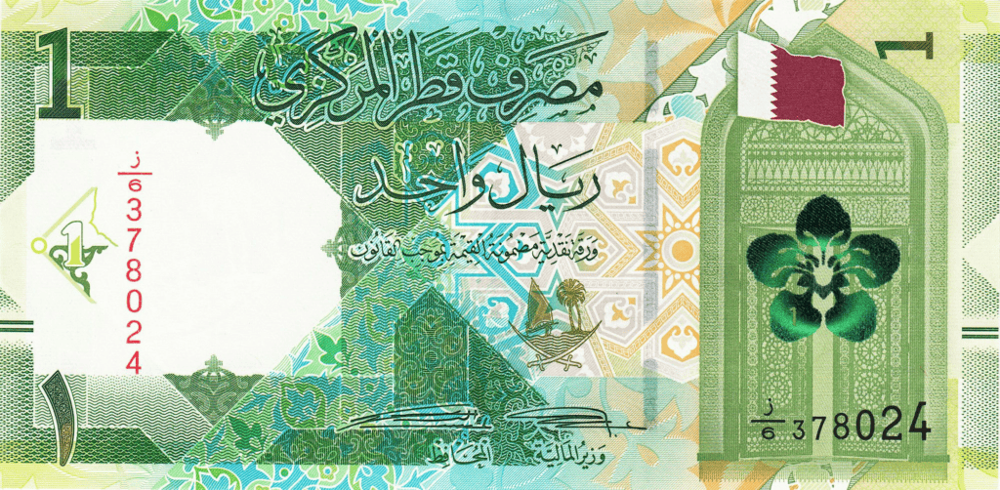

## Table of Contents

## What is the Qatari Riyal?

The Qatari Riyal is the official money used in Qatar, a country in the Middle East. It is written as 'QAR' and symbolized as '﷼'. The Riyal is divided into 100 dirhams. People in Qatar use the Riyal to buy things, pay for services, and save money.

The Qatari Riyal has been the currency of Qatar since 1966. Before that, Qatar used the Gulf Rupee and the Saudi Riyal. The Qatar Central Bank controls the Riyal and makes sure it stays stable. This helps the economy of Qatar to grow and makes it easier for people to do business.

## What is the symbol and currency code for the Qatari Riyal?

The symbol for the Qatari Riyal is '﷼'. This symbol is used on money and in shops to show prices in Qatar.

The currency code for the Qatari Riyal is 'QAR'. This code is used when people need to talk about the Qatari Riyal in a short way, like in banks or on computers.

## How is the Qatari Riyal abbreviated?

The Qatari Riyal is abbreviated as 'QAR'. This is the short way to write the name of the money used in Qatar. People use this code when they need to talk about the Qatari Riyal quickly, like in banks or on computers.

The symbol for the Qatari Riyal is '﷼'. This symbol is used on money and in shops to show prices in Qatar. It helps people know that the price is in Qatari Riyals.

## What is the history of the Qatari Riyal?

The Qatari Riyal became the official money of Qatar in 1966. Before that, people in Qatar used the Gulf Rupee, which was used by many countries around the Persian Gulf. When Qatar decided to use its own money, it first used the Saudi Riyal for a short time. Then, Qatar and Dubai worked together to make their own money, called the Qatar and Dubai Riyal. This money was used until 1973 when Dubai started using the United Arab Emirates Dirham, and Qatar kept using the Qatari Riyal.

The Qatar Central Bank was created in 1993 to take care of the Qatari Riyal and make sure it stays strong. The bank helps keep the economy of Qatar growing by making sure the Riyal is stable. Over the years, the Qatari Riyal has changed a little bit, with new designs on the money to show important things about Qatar, like its culture and history. Today, the Qatari Riyal is used every day by people in Qatar to buy things, pay for services, and save money.

## Which country uses the Qatari Riyal as its official currency?

The country that uses the Qatari Riyal as its official money is Qatar. Qatar is a small country in the Middle East, and it uses the Qatari Riyal for all its buying and selling.

The Qatari Riyal has been used in Qatar since 1966. Before that, Qatar used other types of money like the Gulf Rupee and the Saudi Riyal. Now, the Qatar Central Bank takes care of the Qatari Riyal to make sure it stays strong and helps the country's economy grow.

## What are the different denominations of the Qatari Riyal?

The Qatari Riyal comes in different amounts of money, called denominations. For paper money, you can find Qatari Riyals in 1, 5, 10, 50, 100, and 500 Riyal notes. These notes have different colors and pictures on them to help people tell them apart easily. The 1 Riyal note is the smallest paper money, and the 500 Riyal note is the biggest.

For coins, the Qatari Riyal has smaller amounts. You can find coins in 1, 5, 10, 25, and 50 dirhams. Remember, 100 dirhams make up 1 Riyal. So, the 1 dirham coin is the smallest coin, and the 50 dirham coin is the biggest. These coins are useful for buying small things or giving exact change.

## How does the exchange rate of the Qatari Riyal work?

The exchange rate of the Qatari Riyal tells you how much of another country's money you can get for one Qatari Riyal. This rate changes all the time because many things can affect it, like how strong Qatar's economy is or what's happening in the world's money markets. For example, if the exchange rate is 1 QAR = 0.27 USD, that means you can get 0.27 US dollars for every Qatari Riyal.

The Qatar Central Bank helps to keep the Qatari Riyal stable by setting a peg to the US dollar. This means the Qatari Riyal is always worth about 3.64 US dollars. This peg makes it easier for people and businesses in Qatar to know how much their money is worth in US dollars, which helps them plan and do business with other countries. If you want to know the exact exchange rate at any time, you can look it up on a money exchange website or ask at a bank.

## Is the Qatari Riyal pegged to any other currency? If so, which one?

Yes, the Qatari Riyal is pegged to the US dollar. This means the value of the Qatari Riyal is set to always be about 3.64 US dollars. The Qatar Central Bank does this to keep the Qatari Riyal stable and make it easier for people and businesses in Qatar to know how much their money is worth in US dollars.

This peg helps Qatar's economy stay steady because it makes it easier for people and businesses to plan and do business with other countries. If the Qatari Riyal were not pegged, its value could go up and down a lot, which could make it hard for people to buy things from other countries or for businesses to make plans. By pegging the Qatari Riyal to the US dollar, Qatar makes sure its money stays strong and reliable.

## What are the key features of Qatari Riyal banknotes and coins?

Qatari Riyal banknotes come in different amounts like 1, 5, 10, 50, 100, and 500 Riyals. Each note has a different color and pictures to help people tell them apart easily. For example, the 1 Riyal note might be one color, while the 500 Riyal note is another. The notes show important things about Qatar, like its culture and history. They also have special marks to stop people from making fake money, like watermarks and special ink.

Qatari Riyal coins are smaller amounts of money, in 1, 5, 10, 25, and 50 dirhams. Remember, 100 dirhams make up 1 Riyal. The coins are useful for buying small things or giving exact change. Each coin has a different size and look, so you can easily see which one is which. The coins often show important symbols of Qatar, like the national emblem or important buildings. Like the notes, the coins are made to be hard to copy, so they stay real and trusted.

## How does the Qatari Central Bank manage the Qatari Riyal?

The Qatar Central Bank is in charge of taking care of the Qatari Riyal. They make sure the Riyal stays strong and stable. One way they do this is by pegging the Riyal to the US dollar. This means the Riyal is always worth about 3.64 US dollars. By keeping this peg, the bank helps people and businesses in Qatar know how much their money is worth, which makes it easier for them to plan and do business with other countries.

The Qatar Central Bank also works to stop people from making fake money. They put special marks on the Riyal notes and coins, like watermarks and special ink, to make it hard for anyone to copy them. This helps keep the money real and trusted. The bank also watches the economy to make sure the Riyal is doing well and can change things if they need to keep the money stable. By doing all these things, the Qatar Central Bank helps keep the Qatari Riyal strong and helps Qatar's economy grow.

## What impact does the Qatari Riyal have on Qatar's economy?

The Qatari Riyal is very important for Qatar's economy because it is the money people use every day to buy things, pay for services, and save. The Qatar Central Bank makes sure the Riyal stays strong by keeping it pegged to the US dollar. This means the Riyal is always worth about 3.64 US dollars. This peg helps businesses and people in Qatar know how much their money is worth, which makes it easier for them to plan and do business with other countries. When the Riyal is stable, it helps the economy grow because people and businesses feel safe using it.

Having a stable Qatari Riyal also makes it easier for Qatar to trade with other countries. When the Riyal is strong and reliable, other countries trust it more, which can help Qatar sell its things like oil and gas to other places. This brings more money into Qatar, which can be used to build new things and make life better for people living there. So, the Qatari Riyal is a big part of making sure Qatar's economy stays strong and keeps growing.

## What are the future prospects and potential reforms for the Qatari Riyal?

The future of the Qatari Riyal looks stable because it is pegged to the US dollar. This means it will likely stay at about 3.64 US dollars for each Riyal. The Qatar Central Bank will keep watching the economy to make sure the Riyal stays strong. They might make small changes to keep it stable, but big changes are not expected soon. The Riyal's stability helps Qatar's economy grow and makes it easier for people and businesses to plan and do business with other countries.

There could be some small changes or reforms to the Qatari Riyal in the future. For example, the Qatar Central Bank might update the designs on the notes and coins to show new important things about Qatar. They might also add new security features to stop people from making fake money. But these changes would be to keep the Riyal safe and trusted, not to change how much it is worth. Overall, the Qatari Riyal is expected to stay a strong and reliable part of Qatar's economy.

## References & Further Reading

[1]: ["Algorithmic Trading: Winning Strategies and Their Rationale"](https://www.wiley.com/en-us/Algorithmic+Trading%3A+Winning+Strategies+and+Their+Rationale-p-9781118460146) by Ernie Chan

[2]: Kearns, M., Nevmyvaka, Y. (2013). ["Machine Learning for Market Microstructure and High Frequency Trading."](https://www.cis.upenn.edu/~mkearns/papers/KearnsNevmyvakaHFTRiskBooks.pdf)

[3]: ["Qatar Central Bank: Annual Reports"](https://www.qcb.gov.qa/PublicationFiles/2020_annual_year.pdf) - Official economic and financial insights into the stability of the Qatari Riyal.

[4]: Lo, Andrew W., MacKinlay, A. Craig. (1999). ["A Non-Random Walk Down Wall Street"](https://www.amazon.com/Non-Random-Walk-Down-Wall-Street/dp/0691092567) - Discusses market strategies including those relevant to algorithmic trading.

[5]: ["Qatar National Vision 2030"](https://www.gco.gov.qa/en/about-qatar/national-vision2030/) - Insight into Qatar's economic diversification and development efforts impacting financial markets. 

[6]: Ait-Sahalia, Y., & Jacklin, C. (2009). ["High-Frequency Financial Econometrics."](https://press.princeton.edu/books/hardcover/9780691161433/high-frequency-financial-econometrics) Journal of Financial and Quantitative Analysis.

[7]: ["International Journal of Financial Markets and Derivatives"](https://www.inderscience.com/jhome.php?jcode=ijfmd) - Research articles on the evolving dynamics of global financial markets, including algorithmic trading influences.