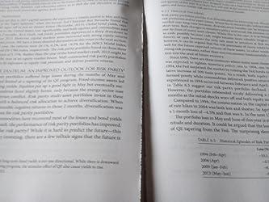

In recent years, algorithmic trading has revolutionized the financial markets by allowing traders to execute orders with unparalleled speed and precision. This technological advancement in trading has marked a significant shift from traditional manual trading methods, leveraging complex algorithms to reduce human error and emotion. Algorithmic trading, often referred to as 'algo trading,' employs mathematical models and automated execution strategies that optimize the trading process.

Among the prominent figures in this transformative landscape is Qian Edward, renowned for his expertise and innovation in quantitative finance. Edward's work is pivotal, shaping the methodologies and tools used in modern algorithmic trading. His contributions have impacted how trading strategies are developed and executed, demonstrating the power of integrating technology into finance. This article aims to explore Qian Edward's significant contributions to the field of algo trading, providing valuable insights into his methodologies and the broader impact on the financial industry. As algorithmic trading continues to evolve, understanding the work of leading contributors like Edward is essential for appreciating the past and anticipating future trends in the field.

## Table of Contents

## Who is Qian Edward?

Qian Edward is a prominent figure in the field of quantitative finance and algorithmic trading. With an advanced degree in finance, he has established a strong foothold in the financial sector, contributing significantly through the development of innovative trading strategies. His professional work centers around risk management, portfolio theory, and the application of quantitative models, underlining his role in shaping modern financial practices.

Edward's career is marked by a seamless blend of academic insight and practical application, positioning him as a pioneer in integrating theoretical finance with real-world trading. His research has been pivotal in advancing [algorithmic trading](/wiki/algorithmic-trading), providing a bridge between scholarly research and market practices. By focusing on optimizing risk management techniques and enhancing portfolio efficiency, Edward has helped to push the boundaries of what is possible in trading strategy development.

His contributions have not only enriched the quantitative finance landscape but have also set new benchmarks for innovation in algorithmic trading. His work emphasizes the synthesis of mathematical models and financial theories to improve decision-making processes in trading environments, significantly reducing human error and emotional biases. Through his efforts, Edward has left an indelible mark on the industry, as both a thinker and a practitioner.

## Contributions to Algorithmic Trading

Qian Edward has made significant contributions to the field of algorithmic trading by advancing the development of sophisticated trading algorithms. His primary focus has been on optimizing trading strategies, employing [machine learning](/wiki/machine-learning), and leveraging statistical models to enhance market trend predictions. By integrating these complex models, Edward has improved the accuracy and effectiveness of trading decisions.

One of Edward's key innovations lies in the emphasis on robust [backtesting](/wiki/backtesting) as a critical process in algorithm development. Backtesting involves simulating a trading strategy using historical data to evaluate its potential effectiveness. This process allows for the identification and rectification of any weaknesses before actual deployment in the live markets. By incorporating real-time data, his methodologies enable continuous refinement and adjustment of algorithms, ensuring adaptability to current market conditions.

Edward's work also extends to the practical application of these refined algorithms in the financial industry. His strategies are particularly valuable to investment firms aiming to increase the precision and profitability of their trades. By minimizing human intervention and enhancing decision-making processes through rigorous data analysis and pattern recognition, these firms can operate more efficiently and with reduced risk.

Furthermore, Edward's integration of machine learning models helps recognize complex patterns and correlations in large datasets that traditional methods might overlook. This ability to process and analyze massive quantities of data enables the early detection of market anomalies and opportunities, offering a competitive edge.

Investment firms utilizing Edward's strategies benefit from the reduced transaction costs, improved execution speed, and increased accuracy in forecasting financial markets. As a result, his contributions are highly regarded within the industry, with many firms relying on his methodologies to maintain a competitive advantage in the rapidly evolving world of algorithmic trading.

## Methodologies and Innovations

Qian Edward has been instrumental in advancing the methodologies behind algorithmic trading. His significant contribution lies in the application of predictive analytics to develop sophisticated trading strategies. By harnessing the power of historical data alongside machine learning techniques, Edward has improved the ability to anticipate market trends. This fusion allows for a more precise prediction of asset price movements, which is a critical [factor](/wiki/factor-investing) in optimizing trading strategies.

Edward's work emphasizes the importance of dynamic risk management models that are essential for adapting to market [volatility](/wiki/volatility-trading-strategies). Traditional risk management approaches often fall short in rapidly changing market conditions, but Edward's methodologies allow trading systems to adjust in real-time. This adaptability is crucial, considering the unpredictable nature of financial markets. His models incorporate various risk factors and continuously update them as new data becomes available. 

Moreover, Edward has pioneered techniques that enable trading algorithms to autonomously adapt to changing market conditions. These algorithms use machine learning models, which iteratively learn from new market data, to refine their trading decisions. This process involves backtesting strategies against historical data to assess their viability and tweak them in response to fresh inputs. His innovative approaches ensure that trading systems are not only reactive but also proactive in seizing market opportunities.

In summary, Edward's methodologies utilize predictive analytics and dynamic risk management to address market volatility. His work has provided foundational advancements in creating adaptable trading algorithms that enhance the efficiency and effectiveness of executing trades.

## Impact on the Industry

Qian Edward's work in algorithmic trading has left a significant mark on both institutional and retail trading sectors. His pioneering insights into integrating advanced technology within trading frameworks have led to substantial improvements in transaction cost analysis and execution efficiency. By employing sophisticated algorithms that enhance precision in trade execution, his contributions have minimized market impact and slippage, thereby optimizing transaction costs. This advancement is particularly crucial for institutional traders where even marginal cost reductions can translate into substantial financial gains.

Edward’s research has also expanded the accessibility of algorithmic trading by equipping smaller trading firms and individual traders with the tools and knowledge necessary to leverage these technologies. His methodologies advocate for the adoption of trading algorithms that are not only reserved for large financial institutions but can also be tailored for less resource-intensive environments. This democratization of algorithmic trading allows a broader range of market participants to compete more effectively, leveling the playing field.

Furthermore, by challenging the boundaries of technological applications in trading, Qian Edward has played a pivotal role in opening up high-frequency trading systems to a wider audience. High-frequency trading, which requires executing a large number of orders at extremely fast speeds, was traditionally dominated by large institutions with significant capital and technological resources. However, through Edward's work, the barriers to entry have been lowered, making these advanced trading systems more accessible to diverse market participants.

His contributions underline a movement towards more equitable and efficient markets, propelled by cutting-edge algorithmic solutions. As the industry continues to evolve, Edward's foundational work in the integration of technology in trading serves as a vital resource and inspiration for continued advancements in the field.

## Conclusion

Qian Edward stands as a towering figure in the world of algorithmic trading, blending academic rigor with practical application. His extensive work demonstrates the efficacy of algorithmic strategies, providing a framework that guides both current and future technological innovations in the trading industry. Edward's contributions underscore the importance of integrating advanced computational techniques with financial theory, thereby setting a precedent for subsequent advancements in the field.

As financial markets continue to evolve alongside rapid technological developments, figures like Edward are pivotal in steering the industry toward new horizons. His pioneering efforts in incorporating machine learning and predictive analytics into trading algorithms illustrate the potential for technology-driven strategies to optimize market interactions. Edward's influence is evident in the way trading strategies now routinely include complex data analysis methods to anticipate market movements and adjust positions dynamically.

For individuals and institutions at the intersection of finance and technology, Edward's body of work serves as a valuable source of knowledge and inspiration. By demonstrating the practicality and effectiveness of algorithmic trading, he encourages continued exploration and experimentation within the domain. His legacy is not only one of technical achievement but also of fostering an environment where innovation thrives, ensuring that the potential of algorithmic trading is fully realized.

## References & Further Reading

[1]: Bergstra, J., Bardenet, R., Bengio, Y., & Kégl, B. (2011). ["Algorithms for Hyper-Parameter Optimization."](https://papers.nips.cc/paper/4443-algorithms-for-hyper-parameter-optimization) Advances in Neural Information Processing Systems 24.

[2]: ["Advances in Financial Machine Learning"](https://www.amazon.com/Advances-Financial-Machine-Learning-Marcos/dp/1119482089) by Marcos Lopez de Prado

[3]: ["Evidence-Based Technical Analysis: Applying the Scientific Method and Statistical Inference to Trading Signals"](https://www.amazon.com/Evidence-Based-Technical-Analysis-Scientific-Statistical/dp/0470008741) by David Aronson

[4]: ["Machine Learning for Algorithmic Trading"](https://github.com/PacktPublishing/Machine-Learning-for-Algorithmic-Trading-Second-Edition) by Stefan Jansen

[5]: ["Quantitative Trading: How to Build Your Own Algorithmic Trading Business"](https://www.amazon.com/Quantitative-Trading-Build-Algorithmic-Business/dp/0470284889) by Ernest P. Chan