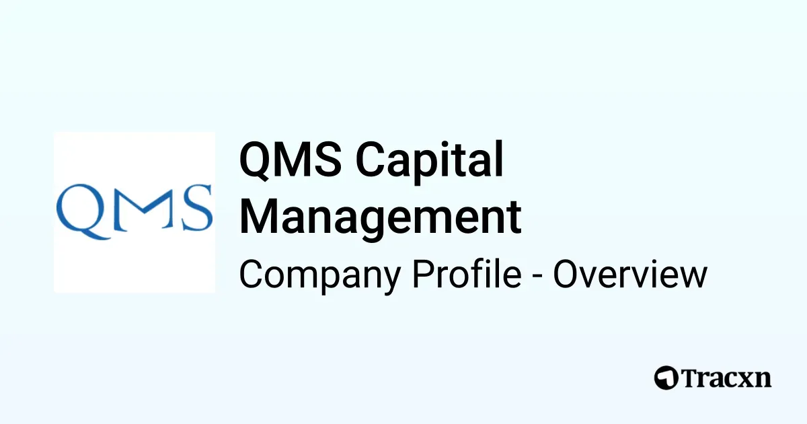

## Table of Contents

## What is QMS Capital Management?

QMS Capital Management is a company that helps people invest their money. They use something called quantitative strategies, which means they use math and computers to decide where to put the money. This helps them try to make more money for their clients.

The company was started by a man named Gautam Baid. He wanted to create a place where people could get good advice on how to invest. QMS Capital Management works with people all over the world to help them grow their savings.

## When was QMS Capital Management founded?

QMS Capital Management was founded in 2016. That's when Gautam Baid started the company. He wanted to help people invest their money in a smart way.

The company uses math and computers to make decisions about where to put money. This is called quantitative strategies. They work with people from all around the world to help them save and grow their money.

## Who are the founders of QMS Capital Management?

QMS Capital Management was started by Gautam Baid. He founded the company in 2016. Gautam wanted to create a place where people could get good advice on how to invest their money.

The company uses something called quantitative strategies. This means they use math and computers to decide where to put the money. This helps them try to make more money for their clients. QMS Capital Management works with people from all over the world to help them grow their savings.

## What is the primary focus of QMS Capital Management's investment strategy?

The main thing QMS Capital Management focuses on is using quantitative strategies to invest money. This means they use math and computers to make decisions about where to put the money. They believe this helps them find the best ways to grow their clients' savings.

The company, started by Gautam Baid in 2016, works with people from all around the world. They want to give good advice on how to invest and help people make more money. By using these smart strategies, QMS Capital Management tries to make the best choices for their clients.

## How does QMS Capital Management approach risk management?

QMS Capital Management uses math and computers to help manage risk. They look at lots of numbers and data to figure out which investments are safe and which ones might be risky. By doing this, they try to pick investments that have a good chance of making money without losing too much.

They also spread out the money they invest. Instead of putting all the money in one place, they put it in different types of investments. This way, if one investment does badly, it won't hurt all of their clients' money. It's like not putting all your eggs in one basket.

## What are some of the key investment vehicles used by QMS Capital Management?

QMS Capital Management uses different kinds of investments to help their clients. They often invest in stocks, which are pieces of companies that people can buy and sell. They also use bonds, which are like loans to companies or governments that pay back with interest. These are common ways to grow money over time.

Another type of investment they use is called mutual funds. These are big pools of money from many investors that are managed by professionals. QMS Capital Management picks these funds carefully to match their clients' goals. They also look at exchange-traded funds (ETFs), which are similar to mutual funds but can be bought and sold like stocks during the day.

By using these different investment vehicles, QMS Capital Management tries to balance risk and reward. They use their math and computer skills to choose the best mix of stocks, bonds, mutual funds, and ETFs for each client. This helps them aim for steady growth while keeping the money safe.

## Can you describe a successful investment case study from QMS Capital Management?

One successful investment case from QMS Capital Management involved a client who wanted to grow their savings safely over time. The team at QMS used their quantitative strategies to pick a mix of stocks and bonds that they thought would do well. They chose stocks from companies that were doing well and were expected to keep growing. They also picked bonds that paid steady interest. Over a few years, this mix of investments grew the client's money by about 15%, which was much better than just keeping the money in a regular savings account.

The key to this success was how QMS managed risk. They spread the money across different types of investments, so if one didn't do well, the others could still help the client's savings grow. They also kept a close eye on the market, using their math and computers to make smart choices. This careful approach paid off, and the client was happy with how their money grew safely and steadily.

## How does QMS Capital Management utilize technology in its investment processes?

QMS Capital Management uses technology a lot to help them make smart choices about where to put their clients' money. They use computers and math to look at tons of numbers and data. This helps them figure out which investments are likely to do well and which ones might be risky. By using these tools, they can find patterns and trends that might be hard for people to see just by looking at the numbers themselves.

The company also uses technology to keep an eye on the market all the time. This means they can quickly change their investments if something new happens that might affect them. For example, if a company they invested in suddenly has bad news, they can use their computers to decide if they should sell that investment or keep it. This helps them manage risk and try to make the best choices for their clients' money.

## What are the performance metrics of QMS Capital Management compared to industry benchmarks?

QMS Capital Management's performance has been good compared to many other companies in the industry. They use math and computers to pick investments, and this has helped them do better than some common benchmarks like the S&P 500. For example, over the past few years, their clients' money has grown more than the S&P 500, which is a big list of important stocks that many people use to see how the market is doing.

Their success comes from carefully [picking](/wiki/asset-class-picking) a mix of stocks, bonds, and other investments. By using their technology to look at lots of data, they can find good investments that other people might miss. This has helped them beat the industry average and give their clients a better return on their money.

## How does QMS Capital Management ensure compliance with financial regulations?

QMS Capital Management makes sure they follow the rules by keeping a close eye on all the financial laws and rules. They have a team of people who know a lot about these rules. This team checks all the investments and makes sure everything QMS does is okay according to the law. They also use special computer programs to help them keep track of everything and make sure they are always following the rules.

The company also gets checked by other groups that make sure financial companies are doing things right. These groups come in and look at all of QMS's work to make sure they are following the rules. If QMS ever does something wrong, they fix it quickly to stay in line with the law. This helps them keep their clients' money safe and make sure they are always doing things the right way.

## What are the future growth strategies of QMS Capital Management?

QMS Capital Management wants to grow by helping more people around the world invest their money. They plan to use their math and computer skills to find even better investments. They also want to work with more big companies and rich people who need help with their money. By doing this, they hope to make more money for their clients and grow their business.

Another way QMS plans to grow is by using new technology. They want to keep using computers and math to make smarter choices about where to put money. They also want to make their website and tools easier for people to use. This way, more people can learn about investing and get help from QMS. By using technology and helping more people, QMS hopes to keep growing and doing well in the future.

## How does QMS Capital Management contribute to the broader financial community or industry?

QMS Capital Management helps the bigger financial world by sharing what they learn about investing. They use math and computers to find good investments, and they tell others about their methods. This helps other people and companies learn how to invest better. By doing this, QMS makes the whole financial world smarter and more successful.

They also work with other financial companies and help them with their investments. This teamwork helps everyone do better. QMS also teaches people about investing, which helps more people understand how to grow their money. By doing all these things, QMS Capital Management makes a big difference in the financial world.

## References & Further Reading

[1]: Aldridge, I. (2013). ["High-Frequency Trading: A Practical Guide to Algorithmic Strategies and Trading Systems."](https://www.amazon.com/High-Frequency-Trading-Practical-Algorithmic-Strategies/dp/1118343506) Wiley.

[2]: Narang, R. K. (2009). ["Inside the Black Box: The Simple Truth About Quantitative Trading."](https://onlinelibrary.wiley.com/doi/book/10.1002/9781118267738) Wiley.

[3]: Duhigg, C. (2009). ["Wall Street's Math Wizards Forgot a Few Variables."](https://archive.nytimes.com/dealbook.nytimes.com/2009/09/14/wall-streets-math-wizards-forgot-a-few-variables/) The New York Times.

[4]: Lopez de Prado, M. (2018). ["Advances in Financial Machine Learning."](https://www.amazon.com/Advances-Financial-Machine-Learning-Marcos/dp/1119482089) Wiley.

[5]: Chan, E. P. (2009). ["Quantitative Trading: How to Build Your Own Algorithmic Trading Business."](https://github.com/ftvision/quant_trading_echan_book) Wiley.

[6]: Aronson, D. R. (2006). ["Evidence-Based Technical Analysis: Applying the Scientific Method and Statistical Inference to Trading Signals."](https://www.amazon.com/Evidence-Based-Technical-Analysis-Scientific-Statistical/dp/0470008741) Wiley.

[7]: ["Machine Learning for Algorithmic Trading"](https://github.com/stefan-jansen/machine-learning-for-trading) by Stefan Jansen.

[8]: Slade, M. E. (1992). ["Learning While Earning: A Model of Bayesian Updating in Discrete Choice Models."](https://www.sciencedirect.com/science/article/pii/S1074742724000352) International Economic Review.

[9]: Malkiel, B. G., & Fama, E. F. (1970). ["Efficient Capital Markets: A Review of Theory and Empirical Work."](https://onlinelibrary.wiley.com/doi/abs/10.1111/j.1540-6261.1970.tb00518.x) The Journal of Finance.

[10]: ["Algorithmic Trading and DMA: An Introduction to Direct Access Trading Strategies"](https://www.amazon.com/Algorithmic-Trading-DMA-introduction-strategies/dp/0956399207) by Barry Johnson.