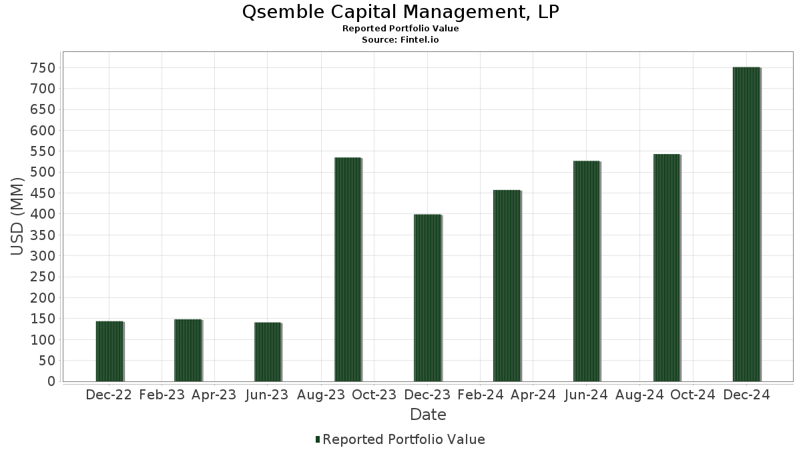

## Table of Contents

## What is Qsemble Capital Management?

Qsemble Capital Management is a company that helps people invest their money. They focus on using computer programs and math to make smart choices about where to put money. This way, they try to make more money for their clients.

The company was started by Ramkumar Ravikumar, who used to work at big companies like Goldman Sachs and Citadel. He wanted to use his experience to help people invest better. Qsemble is known for using new technology and ideas to find good investments.

## When was Qsemble Capital Management founded?

Qsemble Capital Management was founded in 2017. It was started by Ramkumar Ravikumar, who wanted to use his experience from big companies like Goldman Sachs and Citadel to help people invest their money better.

The company uses computers and math to make smart choices about where to invest. They focus on using new technology and ideas to find good investments for their clients.

## Who are the founders of Qsemble Capital Management?

Qsemble Capital Management was started by Ramkumar Ravikumar. He used to work at big companies like Goldman Sachs and Citadel. Ramkumar wanted to use what he learned to help people invest their money better.

The company uses computers and math to make smart choices about where to put money. They focus on using new technology and ideas to find good investments. This helps them try to make more money for their clients.

## What is the investment philosophy of Qsemble Capital Management?

Qsemble Capital Management believes in using computers and math to make smart choices about where to invest money. They think that by using new technology and ideas, they can find good investments that will make more money for their clients. This means they look at a lot of data and use special programs to help them decide where to put money.

Their main goal is to help people grow their money over time. They do this by always trying to find the best places to invest. Qsemble thinks that by being smart and using the latest tools, they can make better choices than other companies. This way, they can help their clients make more money and reach their financial goals.

## What types of investments does Qsemble Capital Management focus on?

Qsemble Capital Management focuses on investing in stocks. They use computers and math to pick stocks that they think will go up in value. They look at a lot of information to find the best stocks to buy. This way, they try to make more money for their clients.

They also use new technology and ideas to find good investments. This means they are always looking for new ways to make smart choices about where to put money. By doing this, they hope to help their clients grow their money over time.

## How does Qsemble Capital Management select its investments?

Qsemble Capital Management uses computers and math to pick the best stocks to invest in. They look at a lot of information to find stocks that they think will go up in value. This means they use special programs to help them make smart choices about where to put money. They believe that by using new technology and ideas, they can find good investments that will make more money for their clients.

They focus on using data to make their decisions. This means they look at things like how a company is doing, what people think about it, and how the stock market is doing. By looking at all this information, they try to find the best places to invest. Their goal is to help their clients grow their money over time by always trying to find the best stocks to buy.

## What are the performance metrics of Qsemble Capital Management?

Qsemble Capital Management has done well since it started. They look at how much money they make compared to how much risk they take. They use a special number called the Sharpe Ratio to see if they are doing a good job. A higher Sharpe Ratio means they are making more money for the risk they are taking. Qsemble's Sharpe Ratio has been good, which means they are doing well compared to other companies.

They also look at how much money they make each year. This is called the annual return. Qsemble's annual returns have been strong, which means they are helping their clients make more money. They try to beat the stock market, and they have been doing that most of the time. This shows that their way of [picking](/wiki/asset-class-picking) stocks using computers and math is working well.

## How does Qsemble Capital Management manage risk?

Qsemble Capital Management tries to keep the money they manage safe by being careful about the risks they take. They use computers and math to figure out how much risk they are taking with each investment. This helps them pick stocks that they think will make money without losing too much if things go wrong. They always look at how much risk they are taking compared to how much money they could make.

They also spread out their investments so that if one stock does badly, it won't hurt all their money. This is called diversification. By putting money into different kinds of stocks, they try to make sure that they can still make money even if some stocks go down. This way, they can help their clients keep their money safe while still trying to make more money.

## What are some notable successes of Qsemble Capital Management?

Qsemble Capital Management has done really well since it started. They have made good money for their clients by picking the right stocks. One big success is how they use computers and math to find good investments. This has helped them beat the stock market most of the time. Their way of investing has shown that using new technology and ideas can make a big difference.

Another success is how they manage risk. They are careful about the risks they take and use special ways to keep their clients' money safe. By spreading out their investments and always looking at how much risk they are taking, they have been able to make money without losing too much if things go wrong. This shows that their careful way of investing works well.

## What are the fees associated with investing in Qsemble Capital Management?

Qsemble Capital Management charges fees for managing the money of their clients. The main fee they charge is called a management fee. This is a percentage of the money they are managing, and it is usually charged every year. For Qsemble, this fee is around 2% of the total money they manage. This means if you have $100,000 with them, you would pay $2,000 a year just for them to manage your money.

They also charge a performance fee. This fee is only charged if they make more money than a certain amount. The performance fee is usually around 20% of the extra money they make for you. So, if they make $10,000 more than the set amount, you would pay them $2,000 as a performance fee. These fees help Qsemble keep running and pay for the smart people and computers they use to pick good investments.

## How does Qsemble Capital Management compare to other hedge funds in its class?

Qsemble Capital Management does well when compared to other hedge funds in its class. They use computers and math to pick stocks, which helps them make good choices about where to put money. Their way of investing has helped them beat the stock market most of the time. This means they are doing better than many other hedge funds that use different ways to pick investments. Qsemble's focus on using new technology and ideas has been a big reason for their success.

Qsemble also manages risk well. They are careful about the risks they take and use special ways to keep their clients' money safe. By spreading out their investments and always looking at how much risk they are taking, they have been able to make money without losing too much if things go wrong. This careful way of investing helps them stand out from other hedge funds that might take bigger risks. Overall, Qsemble's smart use of technology and careful risk management makes them a strong choice compared to other hedge funds in their class.

## What future strategies is Qsemble Capital Management planning to implement?

Qsemble Capital Management is always looking for new ways to make smart choices about where to put money. They plan to keep using computers and math to find good investments. They want to use even newer technology and ideas to pick the best stocks. This means they will keep looking at a lot of data to find stocks that will go up in value. By doing this, they hope to keep making more money for their clients.

They also plan to keep managing risk carefully. They will keep spreading out their investments so that if one stock does badly, it won't hurt all their money. They will use new ways to figure out how much risk they are taking. This will help them keep their clients' money safe while still trying to make more money. By doing these things, Qsemble hopes to keep doing well and help their clients reach their financial goals.

## References & Further Reading

[1]: Varian, H. R. (2014). ["Big Data: New Tricks for Econometrics."](https://www.aeaweb.org/articles?id=10.1257/jep.28.2.3) Journal of Economic Perspectives, 28(2), 3-28.

[2]: Lopez de Prado, M. (2018). ["Advances in Financial Machine Learning."](https://www.amazon.com/Advances-Financial-Machine-Learning-Marcos/dp/1119482089) Wiley.

[3]: Jansen, S. (2020). ["Machine Learning for Algorithmic Trading."](https://github.com/stefan-jansen/machine-learning-for-trading) Packt Publishing.

[4]: Chan, E. (2009). ["Quantitative Trading: How to Build Your Own Algorithmic Trading Business."](https://github.com/ftvision/quant_trading_echan_book) Wiley.

[5]: Aronson, D. (2006). ["Evidence-Based Technical Analysis: Applying the Scientific Method and Statistical Inference to Trading Signals."](https://www.amazon.com/Evidence-Based-Technical-Analysis-Scientific-Statistical/dp/0470008741) Wiley.