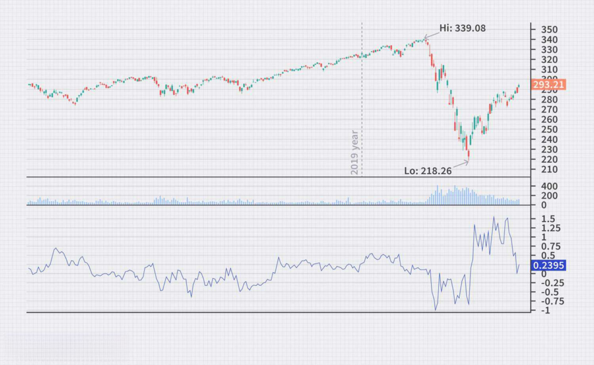

Technical analysis in stock trading involves examining historical price data to predict future price movements. This method relies heavily on various tools and indicators that help traders discern patterns and make informed decisions. Among these tools, the Qstick indicator stands out, not for its popularity, but for its unique ability to provide deep insights into market trends by evaluating the balance of buying and selling pressures over time.

The Qstick indicator was developed by Tushar Chande, an influential figure in the field of technical analysis. This indicator is designed to measure momentum, a critical element in understanding market conditions. It achieves this by calculating the average difference between closing and opening prices over a specified period. Consequently, it offers a numerical representation of these dynamics, indicating whether the market is currently exhibiting bullish or bearish tendencies. For traders who prioritize gaining granular insights into market behavior, the Qstick indicator is particularly beneficial.



As trading systems increasingly incorporate algorithmic strategies, the Qstick finds its utility in automating decision-making processes based on quantified market trends. This article scrutinizes the Qstick indicator's methodology, its practical calculation, and its deployment within algorithmic trading frameworks. Through detailed examination, traders and analysts can augment their technical analysis toolkit with the Qstick indicator, thereby enhancing their ability to navigate the complexities of modern financial markets effectively.

## Table of Contents

## Understanding the Qstick Indicator

The Qstick indicator is a momentum-based tool designed to provide insight into the buying and selling pressures within a financial market over a specified period. It achieves this by calculating the average difference between the closing and opening prices of an asset, thus offering a numerical representation of ongoing price trends. This calculation helps traders to assess the market sentiment and the prevailing direction of asset prices.

A positive Qstick value emerges when the average closing price is higher than the average opening price over the chosen period. This scenario reflects a predominant upward trend, characterized by buying pressure as the demand for the asset drives its price higher. Conversely, a negative Qstick value suggests a predominant downward trend, indicating selling pressure as sellers outnumber buyers and the asset's price trends downward.

The Qstick indicator's primary advantage lies in its simplicity and its ability to smooth out price data, reducing the noise inherent in daily market fluctuations. By focusing on the difference between closing and opening prices, it provides a clearer picture of the strength of buying or selling pressure over time. This makes it a valuable tool for traders looking to identify trends and make informed decisions about entry and [exit](/wiki/exit-strategy) points in their trading strategies.

## Calculating the Qstick Indicator

The Qstick Indicator is a [momentum](/wiki/momentum)-based tool used to identify buying and selling pressures, allowing traders to make informed decisions by analyzing the differences between closing and opening prices over a particular time frame. Calculating the Qstick Indicator involves several steps, focusing on the moving average of these differences.

First, compute the difference between the closing price and the opening price for each time period. Mathematically, this can be expressed as:

$$
\text{Difference} = \text{Closing Price} - \text{Opening Price}
$$

Next, determine the moving average of these differences over a specified number of periods. The choice of moving average—Simple Moving Average (SMA) or Exponential Moving Average (EMA)—depends on the trader's preference. The SMA is calculated by averaging the differences over the chosen period:

$$
\text{SMA} = \frac{1}{N} \sum_{i=1}^{N} (\text{Closing Price}_i - \text{Opening Price}_i)
$$

where $N$ is the number of periods used in the calculation.

Alternatively, the EMA places a greater weight on recent differences, which can make it more responsive to recent price changes. The formula for EMA is:

$$
\text{EMA}_{\text{today}} = (\text{Difference}_{\text{today}} \times \alpha) + (\text{EMA}_{\text{yesterday}} \times (1 - \alpha))
$$

where $\alpha = \frac{2}{N + 1}$.

Choosing a longer period for the moving average can smooth out the indicator, reducing the number of false signals and aiding in identifying macro trends. This smoothing process makes the Qstick particularly effective for long-term trading strategies.

In a trading algorithm, the Qstick Indicator can be calculated using a programming language such as Python. Here’s an example of how to implement it:

```python
import pandas as pd

def calculate_qstick(price_data, period, method='SMA'):
    # Calculate differences between closing and opening prices
    price_data['Difference'] = price_data['Close'] - price_data['Open']

    if method == 'SMA':
        # Calculate Simple Moving Average of the differences
        price_data['Qstick'] = price_data['Difference'].rolling(window=period).mean()
    elif method == 'EMA':
        # Calculate Exponential Moving Average of the differences
        price_data['Qstick'] = price_data['Difference'].ewm(span=period, adjust=False).mean()

    return price_data

# Example usage:
# Assuming 'data' is a DataFrame with 'Open' and 'Close' columns
# qstick_data = calculate_qstick(data, period=14, method='EMA')
```

This code calculates the Qstick Indicator for a given dataset, applying either an SMA or EMA based on the selected period and method. Implementing such calculations in [algorithmic trading](/wiki/algorithmic-trading) systems enhances the precision of trend analysis by providing a clearer picture of market dynamics over time.

## Using the Qstick Indicator in Algorithmic Trading

Algorithmic trading leverages technical indicators like the Qstick to streamline decision-making processes and enhance trading efficiency. The Qstick indicator is particularly useful for generating trade signals based on zero-line crossovers or signal line crossovers. A zero-line crossover occurs when the Qstick value transitions from negative to positive or vice versa. Specifically, a buy signal is triggered when the Qstick crosses above zero, indicating emerging buying pressure. Conversely, a sell signal is prompted when the Qstick dips below zero, signifying increasing selling pressure.

Signal line crossovers offer an additional layer of analysis. This involves using a moving average of the Qstick indicator itself as a signal line. For instance, a buy signal may be generated when the Qstick crosses above its own moving average, while a sell signal is produced when it moves below.

To illustrate the application of the Qstick in an automated trading system, consider the following Python code snippet for implementing a basic algorithmic strategy using the Qstick indicator:

```python
import pandas as pd
import numpy as np

def calculate_qstick(data, period):
    qstick = pd.Series((data['Close'] - data['Open']).rolling(window=period).mean(), name='Qstick')
    return qstick

def trading_signals(data, qstick, signal_period):
    signal_line = qstick.rolling(window=signal_period).mean()
    data['Buy_Signal'] = (qstick > 0) & (qstick.shift(1) <= 0)
    data['Sell_Signal'] = (qstick < 0) & (qstick.shift(1) >= 0)
    data['Signal_Line_Buy'] = (qstick > signal_line) & (qstick.shift(1) <= signal_line)
    data['Signal_Line_Sell'] = (qstick < signal_line) & (qstick.shift(1) >= signal_line)
    return data

# Import historical price data to calculate the Qstick
data = pd.read_csv('historical_price_data.csv')

# Specify the period for Qstick and signal line
qstick_period = 14
signal_period = 9

# Calculate Qstick and generate trading signals
qstick = calculate_qstick(data, qstick_period)
data_with_signals = trading_signals(data, qstick, signal_period)

# Review generated signals
print(data_with_signals[['Date', 'Qstick', 'Buy_Signal', 'Sell_Signal', 'Signal_Line_Buy', 'Signal_Line_Sell']])
```

Backtesting strategies that incorporate the Qstick indicator reveal its potential in automated trading systems. By analyzing historical data, traders can assess the effectiveness and reliability of the Qstick-generated signals. The [backtesting](/wiki/backtesting) process assists in refining trading strategies and optimizing parameters, such as period lengths for the Qstick and its signal line, to better suit various market conditions. 

Integrating the Qstick indicator into algorithmic trading frameworks allows traders to capitalize on nuanced changes in buying and selling pressures, enhancing the precision and robustness of their trading strategies.

## Comparing the Qstick Indicator with Other Indicators

The Qstick indicator is distinguished by its focus on the relationship between opening and closing prices, setting it apart from other momentum indicators that typically assess the rate of change in closing prices, such as the Rate of Change (ROC) indicator. The unique methodological underpinnings of the Qstick offer distinct advantages for traders seeking to discern nuanced market dynamics. Unlike the ROC, which calculates the percentage change between the current closing price and a previous closing price, the Qstick centers on quantifying the average difference between daily closing and opening prices over a specified period. This approach provides insights into the daily price activity that might be overlooked by other indicators.

The differentiation between these indicators can be attributed to their core formulas. The ROC is defined as:

$$
\text{ROC} = \frac{{\text{Close Price (t)}} - \text{Close Price (t-n)}}{\text{Close Price (t-n)}} \times 100
$$

where $t$ is the current period and $n$ is the number of periods in the past.

In contrast, the Qstick is calculated using:

$$
\text{Qstick} = \frac{1}{N} \sum_{i=0}^{N-1} (\text{Close at } i - \text{Open at } i)
$$

where $N$ is the period over which the average is computed.

A comparison with other indicators also reveals differences in application and insight. For instance, the Moving Average Convergence Divergence (MACD) indicator focuses on the convergence and divergence of two moving averages of closing prices, capturing longer-term trends, whereas the Qstick can be more sensitive to short-term price pressures, owing to its daily price difference methodology.

The Qstick's emphasis on opening and closing price dynamics can be particularly advantageous in volatile markets, where daily fluctuations provide early signals of changing trends. Yet, it also introduces potential limitations, such as sensitivity to market noise, influenced by transient opening and closing activities. This can lead to susceptibility to false signals if used in isolation, unlike more smoothed indicators like the MACD which mitigates short-lived market [volatility](/wiki/volatility-trading-strategies).

However, the Qstick’s unique focus can be seen as complementary when used alongside other indicators. Its ability to capture daily sentiment through the lens of opening and closing price interactions can add a valuable dimension to a comprehensive technical analysis strategy, thereby enhancing decision-making processes for traders looking to exploit specific price movements.

## Limitations and Best Practices

The Qstick indicator, while providing valuable insights into market trends by quantifying buying and selling pressures, has several limitations that traders must consider. Particularly, the Qstick may lag during rapid price movements or in markets experiencing gaps. This lag occurs because the Qstick relies on averaging the differences between closing and opening prices over a specified period, which inherently introduces a delay. Such delay can result in late signals, reducing the indicator's effectiveness in swiftly changing market conditions.

To enhance the reliability of the Qstick indicator, traders are advised to use it alongside other technical indicators or analysis methods. For instance, combining it with indicators like the Relative Strength Index (RSI) or Moving Average Convergence Divergence (MACD) can provide a more comprehensive view of market conditions, thus mitigating the impact of any one indicator's potential shortcomings.

Risk management strategies are crucial when utilizing the Qstick indicator. Since it is prone to generating false signals during volatile or choppy market conditions, traders should implement stop-loss orders and position sizing to protect against unexpected market movements. By doing so, traders can manage risk effectively and preserve capital while seeking profitable opportunities.

Understanding the specific contexts in which the Qstick indicator performs best is essential for optimizing its use in trading strategies. The Qstick is particularly effective in trending markets where the relationship between opening and closing prices offers clearer insights into price movements. Traders should therefore assess market conditions regularly and adjust their strategies to ensure that they are employing the Qstick where it can add the most value to their analysis.

In summary, while the Qstick indicator can be a valuable tool in technical analysis, traders need to be mindful of its limitations. By combining it with other indicators, employing robust risk management tactics, and recognizing ideal market conditions for its use, traders can significantly enhance the effectiveness of the Qstick in their trading toolkit.

## Conclusion

The Qstick indicator offers traders a comprehensive view of market dynamics by effectively quantifying the underlying buying and selling pressures within a given timeframe. Although it may not enjoy the same widespread recognition as some other mainstream technical indicators, the Qstick's unique methodology of averaging price differences endows it with a distinctive utility in the analyst's toolkit. By focusing on the interplay between opening and closing prices, it highlights trends that may be overlooked by indicators primarily reliant on past closing prices alone.

When strategically incorporated into algorithmic trading systems, the Qstick indicator can significantly enhance decision-making processes. Algorithmic strategies, which automate trades based on pre-defined criteria, benefit from the Qstick's capability to signal shifts in market momentum via zero-line or signal line crossovers. These automated insights can lead to improved trading outcomes by optimizing the timing and nature of trade executions.

This article emphasizes the critical importance of diversifying the range of indicators used in trading strategies. Understanding and applying various technical tools like the Qstick can enrich a trader's analysis, improving their ability to navigate complex market conditions. As traders seek to refine their strategies, the Qstick indicator serves as an advantageous addition, offering nuanced perspectives that can complement more conventional analysis methods.

## References & Further Reading

[1]: Chande, T. S. (1997). ["The New Technical Trader: Boost Your Profit by Plugging into the Latest Indicators"](https://www.amazon.com/New-Technical-Trader-Plugging-Indicators/dp/0471597805). Wiley.

[2]: Murphy, J. J. (1999). ["Technical Analysis of the Financial Markets: A Comprehensive Guide to Trading Methods and Applications"](https://archive.org/details/technicalanalysi0000murp). New York Institute of Finance.

[3]: Pring, M. J. (2002). ["Technical Analysis Explained: The Successful Investor's Guide to Spotting Investment Trends and Turning Points"](https://www.amazon.com/Technical-Analysis-Explained-Fifth-Successful/dp/0071825177). McGraw-Hill Education.

[4]: Schwager, J. D. (2012). ["Market Wizards: Interviews with Top Traders"](https://www.amazon.com/Market-Wizards-Interviews-Top-Traders/dp/1592802974). Wiley.

[5]: Van Tharp, D. R. (2006). ["Trade Your Way to Financial Freedom"](https://www.amazon.com/Trade-Your-Way-Financial-Freedom/dp/007147871X). McGraw-Hill Education.