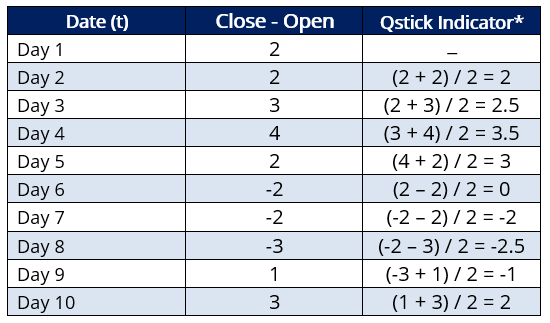

## Table of Contents

## What is the Qstick indicator?

The Qstick indicator is a tool used in technical analysis to measure the strength of a trend in the stock market. It helps traders understand whether the market is dominated by buyers or sellers by calculating the difference between the closing and opening prices of a stock over a set period. A positive Qstick value indicates that the closing prices are generally higher than the opening prices, suggesting a bullish trend where buyers are in control. Conversely, a negative Qstick value shows that the closing prices are lower than the opening prices, indicating a bearish trend where sellers dominate.

Traders often use the Qstick indicator in combination with other technical analysis tools to make more informed trading decisions. For example, if the Qstick shows a strong positive value and other indicators like moving averages also suggest an upward trend, a trader might feel more confident in making a buy decision. The Qstick can be customized to different time frames, allowing traders to analyze trends over various periods, from short-term daily movements to longer-term weekly or monthly trends. This flexibility makes the Qstick a versatile tool for different trading strategies.

## Who developed the Qstick indicator and when?

The Qstick indicator was developed by Tushar Chande in the 1990s. Tushar Chande is a well-known technical analyst and author who has contributed many tools and concepts to the field of technical analysis.

Chande created the Qstick to help traders understand the strength of trends by looking at the difference between the opening and closing prices of stocks. This simple yet effective indicator has become popular among traders who want a quick way to gauge whether the market is being driven by buyers or sellers.

## What is the purpose of using the Qstick indicator in trading?

The Qstick indicator helps traders see if the market is going up or down by looking at the difference between where a stock's price starts and ends each day. If the Qstick number is positive, it means the stock is usually closing higher than it opened, which shows that buyers are in charge and the market is going up. If the Qstick number is negative, it means the stock is closing lower than it opened, showing that sellers are in charge and the market is going down.

Traders use the Qstick to make better choices about when to buy or sell stocks. By watching the Qstick along with other tools, traders can get a clearer picture of the market's direction. For example, if the Qstick shows a strong positive number and other signs also point to an upward trend, a trader might decide it's a good time to buy. The Qstick can be set to look at different time periods, so it's useful for traders who want to understand both short-term and long-term trends.

## How is the Qstick indicator calculated?

The Qstick indicator is calculated by taking the difference between the closing price and the opening price of a stock for each day over a certain number of days. Usually, traders use a period of about 8 to 14 days. For each day, if the closing price is higher than the opening price, the difference is positive. If the closing price is lower than the opening price, the difference is negative. You add up all these differences over the chosen period and then divide by the number of days to get the average.

This average value is the Qstick number for that period. If the Qstick number is positive, it means that, on average, the stock closed higher than it opened over those days, suggesting a bullish trend. If the Qstick number is negative, it means the stock closed lower than it opened on average, indicating a bearish trend. Traders use this number to help decide whether to buy or sell, often looking at it alongside other indicators to get a fuller picture of the market's direction.

## What time periods are commonly used for calculating the Qstick indicator?

The Qstick indicator is often calculated using time periods of 8 to 14 days. These lengths are popular because they give a good balance between seeing short-term trends and understanding longer-term patterns. Traders like using 8 days if they want to focus more on quick changes in the market, while 14 days helps them see bigger trends over time.

Choosing the right time period depends on what the trader is trying to find out. Shorter periods like 8 days are good for people who trade often and need to react fast to what's happening in the market. Longer periods like 14 days are better for those who want to understand the overall direction of the market and make decisions based on bigger trends.

## Can you provide a simple example of calculating the Qstick indicator for a given set of data?

Let's say we want to calculate the Qstick indicator for a stock over 5 days. Each day, we need to find the difference between the closing price and the opening price. On Day 1, the stock opened at $50 and closed at $52, so the difference is $2. On Day 2, it opened at $52 and closed at $51, so the difference is -$1. On Day 3, it opened at $51 and closed at $53, so the difference is $2. On Day 4, it opened at $53 and closed at $52, so the difference is -$1. On Day 5, it opened at $52 and closed at $54, so the difference is $2.

To find the Qstick value, we add up all these differences and then divide by the number of days. So, we add $2 + (-$1) + $2 + (-$1) + $2, which equals $4. Then, we divide $4 by 5 days, which gives us a Qstick value of $0.80. This positive Qstick value means that, on average, the stock closed higher than it opened over these 5 days, suggesting a bullish trend.

## How is the Qstick indicator typically displayed on a chart?

The Qstick indicator is usually shown on a chart as a line that moves above or below a zero line. If the line is above zero, it means the Qstick value is positive, which shows that the stock is closing higher than it opened on average. This suggests that buyers are in control and the market is going up. If the line is below zero, it means the Qstick value is negative, showing that the stock is closing lower than it opened on average. This indicates that sellers are in charge and the market is going down.

Traders often put the Qstick line at the bottom of the main price chart or in a separate window below the price chart. This makes it easy to see how the Qstick value changes over time alongside the stock's price movements. By looking at the Qstick line, traders can quickly tell if the market is bullish or bearish and use this information to help decide when to buy or sell.

## What are the common settings or parameters for the Qstick indicator?

The Qstick indicator usually has one main setting: the number of days it looks at to calculate its value. Most traders use a period of 8 to 14 days. An 8-day period is good for seeing quick changes in the market, while a 14-day period helps show bigger trends over time. The choice depends on what the trader wants to know. Someone who trades a lot might pick a shorter time like 8 days to react fast, while someone looking at the big picture might choose 14 days.

Traders can change the time period to fit their own trading style. If they want to see even longer trends, they might use a period longer than 14 days. But if they need to see what's happening right now, they might go shorter than 8 days. No matter what time period they choose, the Qstick helps them understand if the market is going up or down by showing if stocks are closing higher or lower than they opened on average.

## How can the Qstick indicator be used to identify bullish and bearish trends?

The Qstick indicator helps traders see if the market is going up or down by looking at the difference between where a stock's price starts and ends each day. If the Qstick number is positive, it means the stock is usually closing higher than it opened. This shows that buyers are in charge and the market is in a bullish trend. Traders can spot this by seeing the Qstick line above zero on the chart. When the Qstick stays above zero for a while, it's a sign that the upward trend might keep going, and traders might decide it's a good time to buy.

On the other hand, if the Qstick number is negative, it means the stock is closing lower than it opened on average. This shows that sellers are in control and the market is in a bearish trend. Traders can see this when the Qstick line is below zero on the chart. If the Qstick stays below zero for a while, it suggests that the downward trend might continue, and traders might think about selling or waiting for a better time to buy. By watching the Qstick, traders get a quick way to understand if the market is being pushed up by buyers or pulled down by sellers.

## What are the limitations or potential pitfalls of using the Qstick indicator?

The Qstick indicator can be helpful, but it has some limits. It looks at the difference between where a stock's price starts and ends each day, but it doesn't tell you everything about the market. For example, it doesn't show you how much the price moved during the day or what other things might be affecting the stock's price. If you only use the Qstick, you might miss important signs that other tools could show you. Also, the Qstick can give you false signals sometimes. The market can change quickly, and just because the Qstick says the market is going up or down doesn't mean it will keep doing that.

Another thing to watch out for is that the Qstick works best when you use it with other tools. If you rely on it too much by itself, you might make wrong guesses about the market. The time period you choose for the Qstick can also make a big difference. A short time period might show you quick changes, but it could also make the Qstick jump around a lot and be hard to read. A longer time period might smooth things out but could make you miss out on seeing what's happening right now. So, it's good to use the Qstick along with other indicators and keep an eye on how the market is acting overall.

## How does the Qstick indicator compare to other momentum indicators like the RSI or MACD?

The Qstick indicator is different from other momentum indicators like the RSI (Relative Strength Index) and MACD (Moving Average Convergence Divergence) because it looks at the difference between where a stock's price starts and ends each day. The Qstick is simple and focuses on whether buyers or sellers are in control by showing if the stock usually closes higher or lower than it opened. On the other hand, the RSI measures how fast and how much a stock's price is changing to see if it's overbought or oversold. The RSI helps traders know if a stock might be due for a price change soon. The MACD, meanwhile, uses moving averages to show the strength and direction of a trend, helping traders spot when a trend might be changing.

While the Qstick, RSI, and MACD all help traders understand the market, they do it in different ways. The Qstick is easy to understand and gives a quick look at whether the market is going up or down. It's good for traders who want a simple way to see if buyers or sellers are winning. The RSI and MACD, though, give more detailed information. The RSI can show if a stock is getting too expensive or too cheap, which can help traders decide when to buy or sell. The MACD can help spot when a trend might be starting or ending, which is useful for traders who want to jump in or out of the market at the right time. Using the Qstick along with the RSI and MACD can give traders a fuller picture of what's happening in the market.

## Can you provide an advanced example of using the Qstick indicator in a trading strategy?

In an advanced trading strategy, a trader might use the Qstick indicator alongside the RSI and MACD to make better decisions about when to buy or sell a stock. For example, the trader could set up their charts to show the Qstick, RSI, and MACD all at once. They would watch for times when the Qstick shows a strong positive value, indicating that the stock is closing higher than it opened on average over the last 14 days. If the RSI is also above 70, suggesting the stock might be overbought, and the MACD line crosses above the signal line, showing a strong upward trend, the trader might decide it's a good time to buy. This combination of indicators helps the trader feel more confident that the bullish trend will continue.

However, the trader also needs to be careful and watch for signs that the trend might be changing. If the Qstick starts to drop and goes below zero, showing that the stock is now closing lower than it opened on average, it could mean the bullish trend is losing steam. If the RSI also drops below 30, indicating the stock might be oversold, and the MACD line crosses below the signal line, it could be a sign that the market is turning bearish. In this case, the trader might decide to sell or wait for a better time to buy. By using the Qstick along with other indicators like the RSI and MACD, the trader can get a more complete picture of the market and make smarter trading choices.

## How do you calculate the Qstick Indicator?

The Qstick Indicator is a [momentum](/wiki/momentum)-based tool used to identify buying and selling pressures, allowing traders to make informed decisions by analyzing the differences between closing and opening prices over a particular time frame. Calculating the Qstick Indicator involves several steps, focusing on the moving average of these differences.

First, compute the difference between the closing price and the opening price for each time period. Mathematically, this can be expressed as:

$$
\text{Difference} = \text{Closing Price} - \text{Opening Price}
$$

Next, determine the moving average of these differences over a specified number of periods. The choice of moving average—Simple Moving Average (SMA) or Exponential Moving Average (EMA)—depends on the trader's preference. The SMA is calculated by averaging the differences over the chosen period:

$$
\text{SMA} = \frac{1}{N} \sum_{i=1}^{N} (\text{Closing Price}_i - \text{Opening Price}_i)
$$

where $N$ is the number of periods used in the calculation.

Alternatively, the EMA places a greater weight on recent differences, which can make it more responsive to recent price changes. The formula for EMA is:

$$
\text{EMA}_{\text{today}} = (\text{Difference}_{\text{today}} \times \alpha) + (\text{EMA}_{\text{yesterday}} \times (1 - \alpha))
$$

where $\alpha = \frac{2}{N + 1}$.

Choosing a longer period for the moving average can smooth out the indicator, reducing the number of false signals and aiding in identifying macro trends. This smoothing process makes the Qstick particularly effective for long-term trading strategies.

In a trading algorithm, the Qstick Indicator can be calculated using a programming language such as Python. Here’s an example of how to implement it:

```python
import pandas as pd

def calculate_qstick(price_data, period, method='SMA'):
    # Calculate differences between closing and opening prices
    price_data['Difference'] = price_data['Close'] - price_data['Open']

    if method == 'SMA':
        # Calculate Simple Moving Average of the differences
        price_data['Qstick'] = price_data['Difference'].rolling(window=period).mean()
    elif method == 'EMA':
        # Calculate Exponential Moving Average of the differences
        price_data['Qstick'] = price_data['Difference'].ewm(span=period, adjust=False).mean()

    return price_data

# Example usage:
# Assuming 'data' is a DataFrame with 'Open' and 'Close' columns
# qstick_data = calculate_qstick(data, period=14, method='EMA')
```

This code calculates the Qstick Indicator for a given dataset, applying either an SMA or EMA based on the selected period and method. Implementing such calculations in [algorithmic trading](/wiki/algorithmic-trading) systems enhances the precision of trend analysis by providing a clearer picture of market dynamics over time.

## How does the Qstick Indicator compare with other indicators?

The Qstick indicator is distinguished by its focus on the relationship between opening and closing prices, setting it apart from other momentum indicators that typically assess the rate of change in closing prices, such as the Rate of Change (ROC) indicator. The unique methodological underpinnings of the Qstick offer distinct advantages for traders seeking to discern nuanced market dynamics. Unlike the ROC, which calculates the percentage change between the current closing price and a previous closing price, the Qstick centers on quantifying the average difference between daily closing and opening prices over a specified period. This approach provides insights into the daily price activity that might be overlooked by other indicators.

The differentiation between these indicators can be attributed to their core formulas. The ROC is defined as:

$$
\text{ROC} = \frac{{\text{Close Price (t)}} - \text{Close Price (t-n)}}{\text{Close Price (t-n)}} \times 100
$$

where $t$ is the current period and $n$ is the number of periods in the past.

In contrast, the Qstick is calculated using:

$$
\text{Qstick} = \frac{1}{N} \sum_{i=0}^{N-1} (\text{Close at } i - \text{Open at } i)
$$

where $N$ is the period over which the average is computed.

A comparison with other indicators also reveals differences in application and insight. For instance, the Moving Average Convergence Divergence (MACD) indicator focuses on the convergence and divergence of two moving averages of closing prices, capturing longer-term trends, whereas the Qstick can be more sensitive to short-term price pressures, owing to its daily price difference methodology.

The Qstick's emphasis on opening and closing price dynamics can be particularly advantageous in volatile markets, where daily fluctuations provide early signals of changing trends. Yet, it also introduces potential limitations, such as sensitivity to market noise, influenced by transient opening and closing activities. This can lead to susceptibility to false signals if used in isolation, unlike more smoothed indicators like the MACD which mitigates short-lived market [volatility](/wiki/volatility-trading-strategies).

However, the Qstick’s unique focus can be seen as complementary when used alongside other indicators. Its ability to capture daily sentiment through the lens of opening and closing price interactions can add a valuable dimension to a comprehensive technical analysis strategy, thereby enhancing decision-making processes for traders looking to exploit specific price movements.

## References & Further Reading

[1]: Chande, T. S. (1997). ["The New Technical Trader: Boost Your Profit by Plugging into the Latest Indicators"](https://www.amazon.com/New-Technical-Trader-Plugging-Indicators/dp/0471597805). Wiley.

[2]: Murphy, J. J. (1999). ["Technical Analysis of the Financial Markets: A Comprehensive Guide to Trading Methods and Applications"](https://archive.org/details/technicalanalysi0000murp). New York Institute of Finance.

[3]: Pring, M. J. (2002). ["Technical Analysis Explained: The Successful Investor's Guide to Spotting Investment Trends and Turning Points"](https://www.amazon.com/Technical-Analysis-Explained-Fifth-Successful/dp/0071825177). McGraw-Hill Education.

[4]: Schwager, J. D. (2012). ["Market Wizards: Interviews with Top Traders"](https://www.amazon.com/Market-Wizards-Interviews-Top-Traders/dp/1592802974). Wiley.

[5]: Van Tharp, D. R. (2006). ["Trade Your Way to Financial Freedom"](https://www.amazon.com/Trade-Your-Way-Financial-Freedom/dp/007147871X). McGraw-Hill Education.