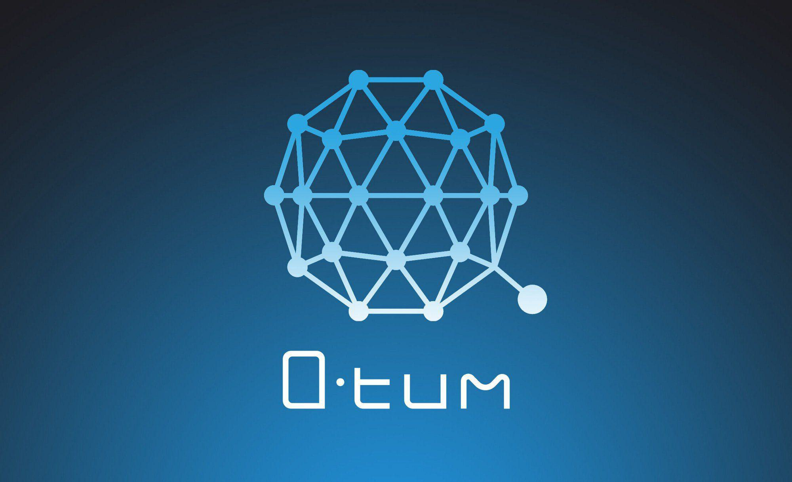

In the ever-evolving landscape of digital currencies, blockchain technology continues to revolutionize financial systems, ushering in innovative models for conducting business. Central to this transformation is the cryptocurrency Qtum, which exemplifies the fusion of traditional and decentralized financial mechanisms. Qtum uniquely combines the secure Unspent Transaction Output (UTXO) model from Bitcoin with the versatile smart contract capabilities of Ethereum. This hybrid approach enables the development of decentralized applications (dApps) and streamlined financial transactions while maintaining a high level of security and reliability.

Simultaneously, algorithmic trading has emerged as an advantageous strategy in modern financial markets. By employing computer algorithms, traders can execute transactions with precision and speed based on pre-defined instructions. This method mitigates human error, enhances decision-making efficiency, and adapts swiftly to market changes, ultimately optimizing trading outcomes. The growing adoption of algorithmic trading underscores its potential to process vast amounts of data and transactions, making it a staple in contemporary financial ecosystems.



This article investigates the synergy between blockchain technology, represented by Qtum cryptocurrency, and algorithmic trading. By examining how these elements interact and the benefits they bring, we gain insight into the future potential of finance. The convergence of blockchain and algorithmic trading not only improves transaction transparency and security but also offers revolutionary approaches to automated financial strategies, presenting a compelling vision for the future of digital finance.

## Table of Contents

## Understanding Qtum: A Hybrid Cryptocurrency

Qtum is a distinctive public blockchain platform designed to bridge the functional capabilities of two major blockchain technologies—Ethereum and Bitcoin. Established in 2016 by Patrick Dai and a team of developers, Qtum seeks to harness the decentralized application (DApp) potential of Ethereum while maintaining the sturdy transaction model of Bitcoin, known as the Unspent Transaction Output (UTXO) model.

A key feature that sets Qtum apart is its utilization of the proof-of-stake (PoS) consensus model. This model provides a notable advantage over the proof-of-work (PoW) system generally associated with Bitcoin, as it reduces the resource-heavy demands of mining activities. In contrast to PoW, PoS offers enhanced efficiency and security by relying on validators who possess and "stake" a certain amount of cryptocurrency to validate transactions and create new blocks. This method leads to a more energy-efficient network operation.

Central to Qtum's architecture is the Account Abstraction Layer (AAL). This innovative layer functions as a mediator that allows seamless interaction between the UTXO model, known for its transaction accuracy and reliability, and the smart contract capabilities prevalent in Ethereum. By enabling these interactions, the AAL significantly boosts the flexibility and broad applicability of the Qtum platform, permitting a wide range of decentralized applications to operate efficiently.

In summary, Qtum stands out as a hybrid blockchain solution, striking a balance between the robust transaction security of Bitcoin and the versatile smart contract functionality of Ethereum, supported by a sustainable proof-of-stake consensus mechanism and enhanced by the Account Abstraction Layer.

## The Mechanics of Algorithmic Trading

Algorithmic trading employs sophisticated computer algorithms to analyze vast market data and execute transactions based on predefined rules and conditions. This approach is marked by its ability to enhance trading efficiency, primarily by removing the potential for human error and ensuring that trades are executed at the optimal speed. By utilizing high-frequency trading systems, these algorithms can process large volumes of transactions in fractions of a second, which is critical in capitalizing on market opportunities that arise from minute price fluctuations.

One of the primary advantages of [algorithmic trading](/wiki/algorithmic-trading) is its capacity to operate without the emotional biases often associated with manual trading. By following a programmatic approach, trades are executed consistently according to the set parameters, eliminating impulsive decisions driven by market sentiment or momentary emotional states. This consistency contributes to a more systematic and reliable trading strategy, improving long-term profitability and risk management.

Algorithmic strategies vary in complexity and execution, ranging from simple moving average crossovers to more intricate statistical [arbitrage](/wiki/arbitrage) models. For instance, a basic moving average crossover strategy might look like this in Python:

```python
import numpy as np
import pandas as pd

# Assuming df is your DataFrame with Time, Close columns
short_window = 40
long_window = 100

signals = pd.DataFrame(index=df.index)
signals['signal'] = 0.0

# Create short simple moving average
signals['short_mavg'] = df['Close'].rolling(window=short_window, min_periods=1, center=False).mean()

# Create long simple moving average
signals['long_mavg'] = df['Close'].rolling(window=long_window, min_periods=1, center=False).mean()

# Create buy signals
signals['signal'][short_window:] = np.where(signals['short_mavg'][short_window:] > signals['long_mavg'][short_window:], 1.0, 0.0)

# Create positions
signals['positions'] = signals['signal'].diff()
```

This simple algorithm triggers buy signals when the short moving average crosses above the long moving average and signals to sell when the opposite occurs. Although rudimentary, such strategies can be significantly expanded with complexity, incorporating a variety of financial indicators and data inputs.

The increasing prevalence of algorithmic trading is largely credited to its scalability and efficiency. With advanced computing technologies, it is possible to integrate and process data from various sources—be it news outlets, social media, or historical price data—allowing for more refined and comprehensive strategies. As this technology continues to evolve, algorithmic trading remains a preferred method in the financial markets due to its speed, accuracy, and ability to manage vast portfolios with precision.

## Integrating Qtum with Algorithmic Trading

Qtum's blockchain architecture presents a compelling solution for algorithmic trading by integrating the fundamental strengths of Bitcoin's Unspent Transaction Output (UTXO) model and Ethereum's advanced smart contract framework. This hybrid model is particularly advantageous for algorithmic trading because it enables the execution of complex trading strategies while safeguarding the integrity and security of transactions through robust cryptographic protocols.

The smart contract capabilities inherent in Qtum facilitate automated trading strategies. Smart contracts are self-executing contracts with the terms directly written into code. The inclusion of these contracts on the Qtum platform enables algorithmic traders to automate processes, reducing the need for manual intervention and consequently minimizing the scope for errors. This capability is critical for executing trades at optimal times and ensuring that strategies are deployed exactly as intended.

Moreover, Qtum enhances its smart contract operations with the Account Abstraction Layer (AAL), which allows for the seamless interaction between the UTXO model and the smart contracts. This layer introduces flexibility for developers and traders, permitting the adaptation of the platform to varied use cases without compromising the underlying security and efficiency.

Qtum employs a proof-of-stake (PoS) consensus mechanism that supports a scalable and sustainable trading environment. Unlike the proof-of-work (PoW) model, which requires significant computational power and energy consumption, PoS is more resource-efficient, allowing Qtum's network to process high volumes of data with reduced energy expenditure. This efficiency makes Qtum an attractive option for algorithmic traders looking to deploy high-frequency trading strategies, which require the processing of large numbers of transactions rapidly and reliably.

In summary, the integration of Qtum's blockchain with algorithmic trading platforms offers a robust solution by combining Bitcoin's transactional security with Ethereum's programmability in a sustainable manner. This unique blend of features not only supports the development of advanced trading algorithms but also ensures a scalable and secure environment for such activities.

## Benefits of Utilizing Qtum for Algorithmic Trading

Qtum's decentralized architecture provides numerous benefits for algorithmic trading, primarily through enhanced transparency and diminished risk of trade manipulation. In centralized trading systems, the trade data and [order book](/wiki/order-book-trading-strategies) may not be fully visible to all market participants, potentially leading to opaque pricing and opportunities for exploitation. However, Qtum's decentralized nature ensures that all transactions are recorded on a public ledger, allowing traders to verify market activity independently and facilitating a trust-rich trading environment.

One critical advantage of using Qtum for algorithmic trading is its scalability, which supports high-frequency trading activities. High-frequency trading requires a blockchain that can accommodate rapid execution of numerous trades without bottlenecking the network. Qtum achieves this through a combination of its lightweight proof-of-stake (PoS) consensus mechanism and its efficient handling of transactions via the unspent transaction output (UTXO) model. The platform's infrastructure can manage a high throughput of transactions, making it well-suited for algorithmic trading strategies that demand swift market entries and exits.

Moreover, Qtum's ability to integrate with existing financial systems through smart contracts provides a significant strategic benefit. Smart contracts on Qtum enable the automation of complex trading strategies and the seamless interaction with traditional financial systems. Traders can build sophisticated trading algorithms that leverage pre-existing financial data and instruments, while benefiting from the decentralized and trustless features of blockchain technology. This integration signifies that traditional financial governance, compliance, and risk management practices can be implemented in a decentralized context, broadening Qtum's applicability for algorithmic traders.

In summary, Qtum offers a robust platform for algorithmic trading through its transparency, scalability, and seamless integration capabilities, addressing many of the limitations faced by traders using traditional and centralized trading systems.

## Challenges and Considerations

While algorithmic trading on Qtum offers numerous advantages, it necessitates considerable technical expertise and a robust infrastructure to effectively develop, test, and deploy trading algorithms. Building such infrastructure entails ensuring seamless integration with the Qtum platform and maintaining high-performance computing resources. This technical complexity can create barriers to entry for traders without advanced programming skills or access to specialized technology stacks.

Market [volatility](/wiki/volatility-trading-strategies) and [liquidity](/wiki/liquidity-risk-premium) constraints are inherent challenges in algorithmic trading, and they are not exempt in the context of Qtum. Volatility can lead to rapid price fluctuations, which may trigger frequent trades and unexpected losses if not adequately managed. Liquidity constraints can impede the efficient execution of large orders without significantly impacting the price. To mitigate these risks, sophisticated algorithms are often employed. These might include volatility-based trading strategies or liquidity provision algorithms that adapt in real-time to market conditions.

Regulatory considerations pose another significant challenge. The [cryptocurrency](/wiki/cryptocurrency) market is subject to evolving regulations, which vary by jurisdiction and can affect how algorithmic trading operations are conducted. Traders must be cognizant of legal requirements related to data privacy, anti-money laundering (AML), and know your customer (KYC) protocols. Compliance with these regulations is crucial to avoid legal repercussions and ensure the legitimacy of trading operations.

Managing these challenges requires a comprehensive understanding of the legal landscape and the ability to adapt trading algorithms to meet compliance standards. In this context, consulting with legal experts and adhering to best practices in financial compliance is advisable. As algorithmic trading continues to expand within cryptocurrency markets like Qtum, ongoing developments in regulatory frameworks and market dynamics should be closely monitored to maintain competitive and compliant trading strategies.

## Conclusion

The integration of Qtum’s blockchain technology with algorithmic trading is transforming digital finance by introducing innovative approaches to trading operations. This combination leverages the high-speed, efficient nature of algorithmic trading with the secure and adaptable features of Qtum’s blockchain, offering a robust platform for modern financial activities. 

One of the most compelling benefits of this synergy is the ability to execute trading strategies more quickly and securely. Qtum’s smart contract functionality enables automated trading systems that reduce human error and enhance operational transparency. The platform’s inherent decentralized architecture minimizes the risk of central authority manipulation, fostering a more trustworthy trading environment. 

Additionally, the transparency afforded by blockchain technology enhances data integrity and market confidence, essential factors in today's financial landscape. As more traders and institutions recognize these advantages, the adoption of blockchain solutions like Qtum for algorithmic trading is likely to accelerate. This trend underscores the potential for these technologies to redefine how trading is conducted, heralding a shift towards more efficient and equitable financial systems.

As blockchain technology continues to mature, Qtum emerges as a promising candidate for supporting advanced algorithmic trading strategies. Its hybrid nature, combining Bitcoin's UTXO model with Ethereum's smart contracts, uniquely positions Qtum to meet the demands of contemporary financial markets. This adaptability not only future-proofs the platform against evolving market dynamics but also ensures its relevancy in the deployment of sophisticated trading algorithms. 

In summary, while challenges such as regulatory compliance and technical complexity persist, the integration of blockchain technology like Qtum in algorithmic trading holds significant promise for enhancing the speed, security, and transparency of trading processes. As financial ecosystems continue to evolve, Qtum is well-positioned to be at the forefront of this transformation, providing a versatile and resilient framework for the future of digital finance.

## References & Further Reading

[1]: ["Algorithms for Hyper-Parameter Optimization"](https://dl.acm.org/doi/10.5555/2986459.2986743) by Bergstra, J., Bardenet, R., Bengio, Y., & Kégl, B. Advances in Neural Information Processing Systems 24.

[2]: Lopez de Prado, Marcos. ["Advances in Financial Machine Learning"](https://www.amazon.com/Advances-Financial-Machine-Learning-Marcos/dp/1119482089).

[3]: Aronson, David. ["Evidence-Based Technical Analysis: Applying the Scientific Method and Statistical Inference to Trading Signals"](https://www.amazon.com/Evidence-Based-Technical-Analysis-Scientific-Statistical/dp/0470008741).

[4]: Jansen, Stefan. ["Machine Learning for Algorithmic Trading"](https://github.com/stefan-jansen/machine-learning-for-trading).

[5]: Chan, Ernest P. ["Quantitative Trading: How to Build Your Own Algorithmic Trading Business"](https://github.com/ftvision/quant_trading_echan_book).