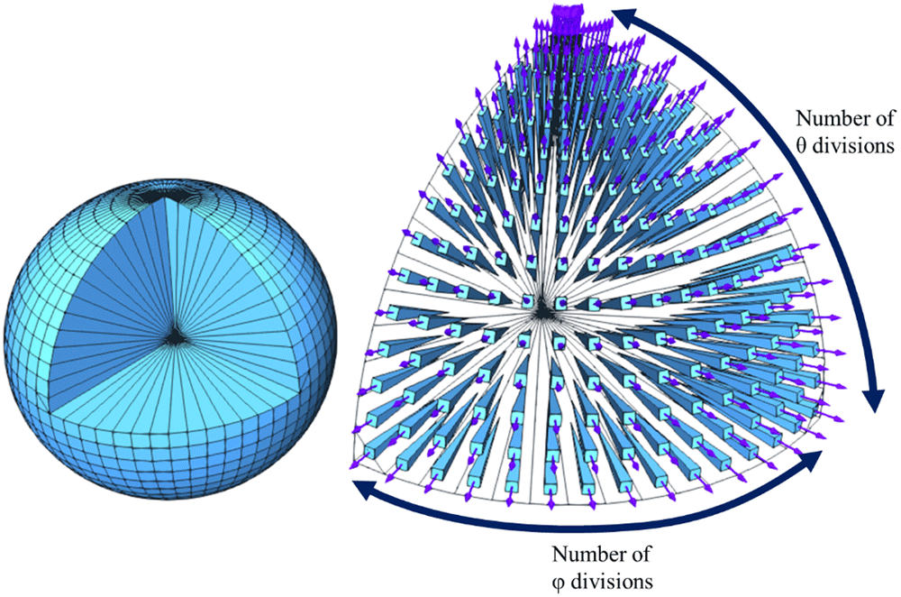

## Table of Contents

## What is quadrature in mathematics?

Quadrature in mathematics is a way to find the area under a curve. Imagine you have a graph with a wavy line on it. The area under that line is what quadrature helps you figure out. This is really useful in many fields like physics and engineering, where you might need to calculate things like the total distance traveled by an object or the amount of work done by a force.

To do quadrature, mathematicians often use something called numerical integration. This means they break the area under the curve into lots of tiny shapes, like rectangles or trapezoids, and then add up the areas of these shapes. While this isn't always exact, it can be very close if you use enough small shapes. There are also other methods, like using calculus to find an exact answer, but numerical integration is often easier and quicker for complex curves.

## How does quadrature relate to integration?

Quadrature and integration are closely related because they both aim to find the area under a curve. Integration is a part of calculus that gives you a way to calculate this area exactly. It uses formulas and rules to figure out the total area, no matter how wiggly the curve is. When you integrate, you're finding the antiderivative of a function, which is like reversing the process of finding a derivative.

Quadrature, on the other hand, often refers to numerical methods used to approximate the area under a curve. Instead of finding an exact answer like integration, quadrature breaks the area into smaller, simpler shapes like rectangles or trapezoids. By adding up the areas of these shapes, you get a close estimate of the total area. Quadrature is especially useful when the curve is too complicated for easy integration or when you need a quick answer. So, while integration gives you the exact area, quadrature helps you get a good guess that's often close enough for practical purposes.

## What are the basic methods of numerical quadrature?

The simplest method of numerical quadrature is the rectangle method. Imagine you want to find the area under a curve. You can draw a bunch of rectangles under the curve, where the height of each rectangle touches the curve at one point. If you add up the areas of all these rectangles, you get a rough estimate of the area under the curve. There are two ways to do this: the left rectangle method, where you use the left side of each rectangle to touch the curve, and the right rectangle method, where you use the right side. Both methods give you a good guess, but they might be a bit off depending on how the curve bends.

Another common method is the trapezoidal rule. Instead of using rectangles, you use trapezoids. A trapezoid is like a rectangle but with slanted sides. You draw these trapezoids under the curve, and the top of each trapezoid touches the curve at two points. When you add up the areas of all these trapezoids, you usually get a better estimate of the area under the curve than with rectangles. This method works well because it takes into account the curve's shape a bit more accurately.

The last basic method is Simpson's rule. This method is a bit more complicated but can give you an even better estimate. Instead of using rectangles or trapezoids, Simpson's rule uses parabolas, which are curved shapes. You fit these parabolas under the curve and calculate their areas. Because parabolas can bend and match the curve more closely, Simpson's rule often gives a very accurate estimate of the area under the curve. It's like using a more advanced tool to get a closer guess.

## Can you explain the difference between the trapezoidal rule and Simpson's rule?

The trapezoidal rule and Simpson's rule are both ways to guess the area under a curve, but they do it a bit differently. The trapezoidal rule uses shapes called trapezoids, which are like rectangles with slanted sides. You draw these trapezoids under the curve, and the top of each trapezoid touches the curve at two points. When you add up the areas of all these trapezoids, you get a pretty good guess of the area under the curve. It's better than using rectangles because it takes into account the curve's shape a bit more accurately.

Simpson's rule, on the other hand, uses curved shapes called parabolas to guess the area. Instead of drawing straight-sided shapes like trapezoids, you fit these parabolas under the curve. Because parabolas can bend and match the curve more closely, Simpson's rule often gives a very accurate guess of the area under the curve. It's like using a more advanced tool to get a closer guess. So, while the trapezoidal rule is simpler and still pretty good, Simpson's rule can be more accurate, especially for curves that are really wiggly.

## What is Gaussian quadrature and how does it work?

Gaussian quadrature is a smart way to guess the area under a curve more accurately than some other methods. It's like a special recipe that picks certain points under the curve to use for the calculation. Instead of using equal spaces between points like the trapezoidal or Simpson's rule, Gaussian quadrature chooses points and weights that make the guess more precise. These points and weights are picked in a way that the method can give a very good estimate of the area even if you use fewer points than other methods.

The way Gaussian quadrature works is by using these carefully chosen points and weights to calculate the area. Imagine you're trying to guess how much water is in a funny-shaped pool. Instead of measuring the depth at equal distances, you measure at specific spots that give you a better overall picture. These spots are the Gaussian points, and the weights are like how much each measurement counts towards the total. By doing this, Gaussian quadrature can give you a very accurate guess of the area under the curve with fewer calculations, which makes it really useful for complicated curves.

## How do you choose the appropriate quadrature rule for a given function?

Choosing the right quadrature rule for a given function depends on how wiggly the function is and how accurate you need your answer to be. If the function is pretty smooth and doesn't have many ups and downs, the trapezoidal rule might be good enough. It's simple and quick, using trapezoids to guess the area under the curve. But if you need a more accurate guess and the function is a bit more complicated, Simpson's rule could be better. It uses parabolas, which can match the curve more closely, so it gives a more precise answer.

For really tricky functions with lots of twists and turns, Gaussian quadrature might be the best choice. It uses special points and weights that make the guess very accurate, even if you don't use many points. This can save time and still give you a good answer. So, think about how smooth or wiggly your function is and how precise you need to be, then pick the rule that fits best.

## What are the advantages and disadvantages of using adaptive quadrature?

Adaptive quadrature is like a smart way to guess the area under a curve. It keeps checking its work and splits up the area into smaller pieces if it thinks it's not accurate enough. This means it can be really good at giving you a precise answer, even if the curve is wiggly or has sudden changes. It's also helpful because it can save you time and effort by not using more points than you need. If the curve is simple in some places, it won't waste time making tiny pieces there.

But, there are some downsides to adaptive quadrature. It can be a bit tricky to set up because you need to decide when it's accurate enough and how to split the area. This might need some extra thinking and tweaking. Also, it can take longer to run on a computer because it's always checking and rechecking its work. So, while it's great for getting a precise answer, it might not be the fastest or easiest method for every situation.

## How does Monte Carlo integration compare to deterministic quadrature methods?

Monte Carlo integration is like guessing the area under a curve by throwing darts randomly. Instead of using a set pattern like the trapezoidal rule or Simpson's rule, it picks random points and sees if they fall under the curve. This can be really handy if the curve is super complicated or if you're not sure what the shape looks like. It's also good for high-dimensional problems, where other methods might take too long or be too hard to use. But, because it's random, you might need to throw a lot of darts to get a good guess, and even then, it might not be as exact as other methods.

Deterministic quadrature methods, like the trapezoidal rule, Simpson's rule, or Gaussian quadrature, follow a strict plan to guess the area. They use specific points and shapes, like rectangles, trapezoids, or parabolas, to calculate the area under the curve. These methods can be very accurate, especially if you use enough points, and they're usually faster than Monte Carlo integration for simple curves. But, they can struggle with really wiggly or high-dimensional curves, where setting up all the points and shapes can be tough. So, while they're more precise and often quicker for simpler problems, they might not be the best choice for every situation.

## What are some advanced techniques used in multidimensional quadrature?

When you need to guess the area under a curve in more than one direction, things can get tricky. One advanced way to do this is called Monte Carlo integration. It's like throwing darts randomly at a target and seeing how many land under the curve. This method is really good for problems that have a lot of dimensions because it doesn't need to follow a strict pattern. But, because it's random, you might need to throw a lot of darts to get a good guess, and even then, it might not be as exact as other methods.

Another smart way to handle multidimensional quadrature is using sparse grids. Imagine you have a big puzzle, and instead of filling in every single piece, you only fill in some of them in a special pattern. This saves time and effort but still gives you a good picture of the whole puzzle. Sparse grids work like this by choosing certain points in each dimension to use for the calculation. They're especially helpful when you want a good balance between accuracy and the amount of work you have to do.

## How can quadrature be applied in solving differential equations?

Quadrature can help solve differential equations by finding the area under curves that represent how things change over time or space. Imagine you're trying to figure out how fast a car is going if you know how its speed changes. A differential equation can tell you this, but solving it often means finding the total distance traveled, which is like finding the area under the curve of speed versus time. Quadrature methods, like the trapezoidal rule or Simpson's rule, can break this area into smaller, easier-to-handle pieces and add them up to get a good guess of the total distance.

In more complicated cases, quadrature can be used to solve differential equations that describe how things change in multiple directions, like heat spreading through a metal block. Here, you might use advanced methods like Monte Carlo integration or sparse grids to guess the area under a curve in several dimensions. These methods are good at handling the extra complexity, helping you find out how the heat moves through the block over time. By using quadrature, you can turn the tricky problem of solving a differential equation into a more manageable task of calculating areas.

## What are the challenges in high-dimensional quadrature and how are they addressed?

High-dimensional quadrature can be really tough because as you add more dimensions, the number of points you need to check grows super fast. Imagine trying to guess the area under a curve, but now you have to do it in many directions at once. This can make things slow and hard to manage. Also, the more dimensions you have, the harder it is to keep your guess accurate because the curve can get really wiggly and complicated in all those directions.

To tackle these challenges, smart people have come up with some clever tricks. One popular trick is Monte Carlo integration, which is like throwing darts randomly at a target. Instead of trying to check every point, you pick random spots and see if they fall under the curve. This can be a lot quicker and easier for high-dimensional problems. Another trick is using sparse grids, which is like filling in only some parts of a puzzle in a special pattern. This saves time and effort but still gives you a good guess of the whole area. Both methods help make high-dimensional quadrature more manageable and accurate.

## What recent developments have been made in the field of quadrature?

In the world of quadrature, recent developments have focused on making guesses more accurate and quicker, especially for tricky, high-dimensional problems. One cool new idea is called quasi-Monte Carlo methods. These are like the regular Monte Carlo method, where you throw darts randomly, but with a twist. Instead of truly random points, quasi-Monte Carlo uses points that are spread out more evenly. This can give you a better guess of the area under the curve without needing to throw as many darts. Another exciting development is the use of machine learning to help with quadrature. By using computers to learn from past guesses, these methods can figure out where to check next to get a more accurate answer faster.

Another big step forward is the improvement in adaptive quadrature techniques. These methods are smart because they keep checking their work and split the area into smaller pieces if they think their guess isn't good enough. Recent work has made these methods even better by using more advanced rules to decide when and how to split the area. This can help a lot when dealing with curves that are really wiggly or have sudden changes. Overall, these new developments are making quadrature more powerful and useful for solving all sorts of problems, from figuring out how heat spreads through a material to predicting how things move in complicated systems.

## What is Understanding Quadrature?

Quadrature, in mathematical terms, refers to the numerical technique of estimating the definite integral of a function, essentially calculating the area under a curve. This process is a cornerstone in numerical analysis, enabling the solution of equations that are challenging or impossible to integrate analytically due to their complexity or lack of a closed-form expression.

Numerical integration techniques have a rich history, tracing back to ancient methods like the trapezoidal rule, where the area under a curve is approximated by dividing it into trapezoids and summing their areas. Mathematically, the trapezoidal rule can be expressed as:

$$
\int_{a}^{b} f(x) \, dx \approx \frac{b-a}{2} \left( f(a) + f(b) \right)
$$

Simpson's rule is another classical method, which improves upon the trapezoidal rule by using parabolic segments instead of linear ones to approximate the curve. This is given by:

$$
\int_{a}^{b} f(x) \, dx \approx \frac{b-a}{6} \left( f(a) + 4f\left(\frac{a+b}{2}\right) + f(b) \right)
$$

As computational tools have advanced, modern quadrature techniques, such as Gaussian quadrature, have emerged. These methods provide high precision and efficiency by optimally selecting the points and weights for evaluating the function, rather than relying on equally spaced points as in classical methods. Gaussian quadrature is particularly powerful because it can achieve exact results for polynomials of degree $2n-1$ or lower using $n$ carefully chosen points, significantly reducing the computational effort.

Understanding these fundamentals is crucial, especially in fields like [algorithmic trading](/wiki/algorithmic-trading), where accurate numerical integration is essential for options pricing and risk management. Quadrature methods enable the precise evaluation of integrals that appear in financial models, ensuring robust and accurate predictions in trading algorithms. By leveraging advanced quadrature techniques, traders can enhance their decision-making processes, gaining a better understanding of market dynamics and financial instrument behaviors.

## References & Further Reading

[1]: Press, W. H., Teukolsky, S. A., Vetterling, W. T., & Flannery, B. P. (2007). ["Numerical Recipes: The Art of Scientific Computing."](https://assets.cambridge.org/97805218/80688/frontmatter/9780521880688_frontmatter.pdf) Cambridge University Press.

[2]: Jackel, P. (2002). ["Monte Carlo Methods in Finance."](https://www.amazon.com/Monte-Carlo-Methods-Finance-Jaeckel/dp/047149741X) Wiley.

[3]: Hull, J. C. (2017). ["Options, Futures, and Other Derivatives."](https://www.semanticscholar.org/paper/Options%2C-Futures%2C-and-Other-Derivatives-Hull/89bdee500c8623864fc9eb7a471546aa713acc44) Pearson Education.

[4]: Glasserman, P. (2003). ["Monte Carlo Methods in Financial Engineering."](https://link.springer.com/book/10.1007/978-0-387-21617-1) Springer.

[5]: Golub, G. H., & Van Loan, C. F. (2013). ["Matrix Computations."](https://books.google.com/books/about/Matrix_Computations.html?id=X5YfsuCWpxMC) Johns Hopkins University Press.

[6]: Nielsen, F. (2014). ["Gaussian Measures on Metric and Topological Spaces."](https://en.wikipedia.org/wiki/Gaussian_measure) Springer.

[7]: Wilmott, P. (2006). ["Paul Wilmott Introduces Quantitative Finance."](https://www.amazon.com/Paul-Wilmott-Introduces-Quantitative-Finance/dp/0470319585) Wiley. 

[8]: Glasserman, P., & Kou, S. G. (2003). "The Laplace Transform and the Box‐Muller Method for Generating Correlated Gaussian Random Variables." Journal of Computational Finance.