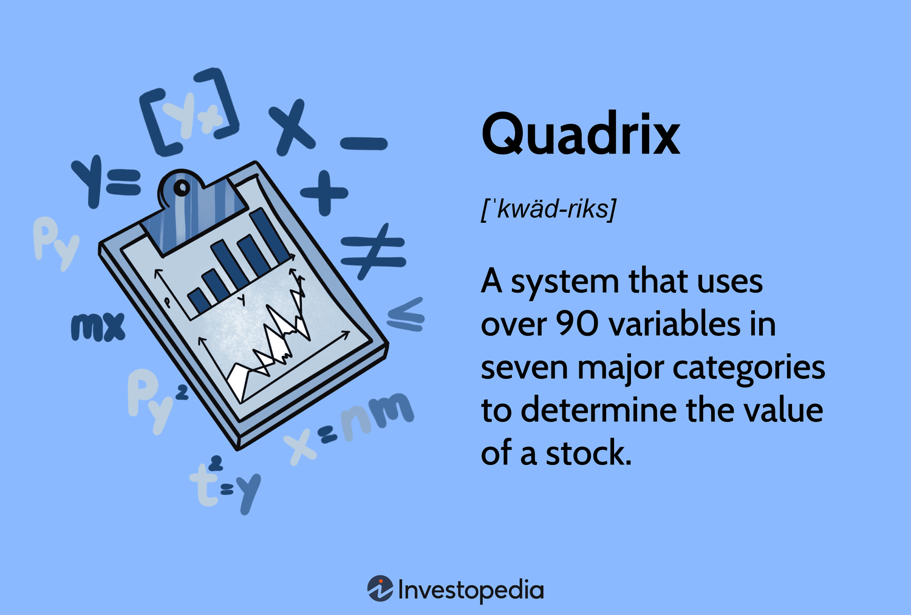

Algorithmic trading, commonly referred to as algo trading, represents a significant paradigm shift in the financial industry. By automating trading strategies through complex mathematical models and computational algorithms, this innovative approach has streamlined processes and enhanced the speed and accuracy of trading activities. A critical component of algo trading is its reliance on sophisticated mathematical concepts to drive informed decision-making.

Among the myriad of mathematical tools employed in algorithmic trading, Quadrix Geometry stands out as a significant method. Quadrix Geometry introduces a structured framework that evaluates stocks by analyzing a broad array of variables, thereby providing a comprehensive measure of stock performance. This integration of advanced geometry with algorithmic trading offers a multitude of benefits that are transforming investment strategies.



This article examines the interplay between Quadrix Geometry and algorithmic trading, illustrating its potential to enhance trading efficacy. The exploration includes a detailed overview of the foundational principles of Quadrix, its application within algo trading systems, and the resulting impacts on investment strategies. By scrutinizing these aspects, we aim to uncover the potential advantages Quadrix Geometry holds for traders seeking to optimize their algorithmic approaches.

## Table of Contents

## Understanding Quadrix Geometry

Quadrix Geometry is a sophisticated stock rating system designed to evaluate the potential performance of stocks by analyzing them through a multi-variable approach. Developed by Horizon Investment Services, the Quadrix system assesses stocks using over 90 variables which are categorized into seven major components: momentum, quality, value, financial strength, earnings estimates, performance, and technical indicators.

1. **Momentum**: This category evaluates the rate at which a stock's price is changing. Momentum investors believe that stocks which have had high returns over the past will continue to perform well.

2. **Quality**: This involves examining factors such as return on equity, profitability ratios, and other indicators of a company's operational efficiency.

3. **Value**: Value metrics include price-to-earnings ratio, price-to-book ratio, and other measures that assess whether a stock is undervalued relative to its intrinsic worth.

4. **Financial Strength**: This category considers a company's financial stability and its ability to generate cash flow, often measured through debt-to-equity ratios and liquidity ratios.

5. **Earnings Estimates**: This involves the analysis of analysts' forecasts for a company's future profits and revenues. It helps in predicting the stock behavior based on expected performance.

6. **Performance**: Historical performance data is used to provide a comparison against market benchmarks and peers.

7. **Technical Indicators**: These are statistical analyses used to predict future price movements based on past data such as moving averages or relative strength indices.

The primary goal of the Quadrix system is to provide an initial screening tool that helps investors identify stocks with strong prospects. Unlike risk-based portfolio builders or robo-advisors, which typically diversify investments based on risk tolerance, Quadrix focuses solely on the intrinsic attributes of individual stocks to guide investment decisions.

In [algorithmic trading](/wiki/algorithmic-trading), Quadrix Geometry is invaluable for processing large data sets and uncovering statistical insights that can inform trading strategies. It's not merely about filtering stocks based on current market trends, but rather about extracting and quantifying broad-ranging financial metrics to support decision-making.

For example, a Python-based implementation might use libraries like `pandas` for data manipulation and `scikit-learn` for statistical analysis, enabling traders to incorporate multiple Quadrix metrics into a cohesive model:

```python
import pandas as pd
from sklearn.preprocessing import StandardScaler
from sklearn.decomposition import PCA

# Sample data loading
data = pd.read_csv('stock_data.csv')

# Selecting Quadrix relevant variables
variables = ['momentum', 'quality', 'value', 'financial_strength', 'earnings_estimates', 'performance', 'technical_indicators']

# Standardizing the data
scaler = StandardScaler()
scaled_features = scaler.fit_transform(data[variables])

# Applying PCA for dimensionality reduction
pca = PCA(n_components=2)
principal_components = pca.fit_transform(scaled_features)

# Understanding the explained variance
print(pca.explained_variance_ratio_)
```

Incorporating such a system within algorithmic frameworks enhances the ability of traders to sift through financial complexities and focus on highly potential investment opportunities. As an analytical tool, Quadrix Geometry adds a structured, multi-faceted dimension to the analysis of stock performance, crucial for both individual traders and institutional investors aiming to optimize their trading strategies.

## Quadrix Geometry in Algorithmic Trading

In the algorithmic trading ecosystem, Quadrix Geometry plays a pivotal role by allowing investors to swiftly single out stocks that meet defined criteria, thereby streamlining decision-making processes. Algorithmic trading strategies capitalize on Quadrix scores by incorporating them into complex algorithms that can systematically assess stock metrics. These scores are derived from multiple financial indicators, providing a comprehensive framework for evaluating a stock's potential.

The integration of Quadrix scores into trading algorithms enables more nuanced predictions of market movements. These scores, which consider a range of factors such as [momentum](/wiki/momentum), quality, value, and financial strength, serve as quantitative benchmarks, allowing algorithms to adjust trading positions in response to shifts in these variables. By systematically evaluating these scores, algorithms can detect trends and correlations that may not be immediately apparent through traditional analysis.

Moreover, utilizing Quadrix scores facilitates the refinement of trading strategies by incorporating extensive datasets that reflect diverse market conditions. This integration ensures that algorithms can adapt to changing market environments, accounting for various economic indicators and external factors that affect stock performance. As a result, trading strategies become more robust and flexible, capable of anticipating market [volatility](/wiki/volatility-trading-strategies) with greater accuracy.

For instance, a Python algorithm might quantify stock strengths based on Quadrix metrics and decide on portfolio adjustments accordingly. Here is an example of how such an algorithm can be structured:

```python
import pandas as pd

# Load stock data and Quadrix scores
stock_data = pd.read_csv('stock_data.csv')
quadrix_scores = pd.read_csv('quadrix_scores.csv')

# Merge datasets
merged_data = pd.merge(stock_data, quadrix_scores, on='stock_id')

# Define a function to evaluate stocks
def evaluate_stock(row):
    if row['quadrix_score'] > 90:  # hypothetical threshold
        return 'Buy'
    elif row['quadrix_score'] < 50:
        return 'Sell'
    else:
        return 'Hold'

# Apply the evaluation function
merged_data['decision'] = merged_data.apply(evaluate_stock, axis=1)

# Output decisions
print(merged_data[['stock_id', 'decision']])
```

This example demonstrates the practical application of Quadrix scores in formulating trades. By integrating these scores into algorithmic models, investors gain a strategic edge, harnessing the power of mathematical analysis and computational efficiency to optimize investment returns.

## Mathematical Concepts Supporting Quadrix Geometry

Algorithmic trading and its integration with Quadrix Geometry rely on foundational mathematical principles, including descriptive [statistics](/wiki/bayesian-statistics), linear algebra, and probability theory.

Descriptive statistics serve as critical tools to summarize and interpret stock data features. By calculating measures such as mean, median, variance, and standard deviation, traders can infer the central tendency, variability, and overall distribution of stock attributes. This statistical insight aids in comprehending past market behavior and informing future predictions. For example, the mean might reveal the average return on a stock over a period, while the standard deviation can indicate the risk or volatility involved.

Linear algebra provides the framework for handling and manipulating large datasets typical in trading algorithms. Matrices and vectors are vital components for representing complex equations and systems that model financial markets. For example, consider a vector of stock returns $\mathbf{r} = \begin{bmatrix} r_1 \\ r_2 \\ \vdots \\ r_n \end{bmatrix}$, where $r_i$ represents the return for stock $i$. Linear transformations can then be applied to these vectors to perform operations such as rotation, scaling, and transformation, which are essential in optimizing portfolio allocations and constructing algorithmic trading strategies.

Probability theory underpins the modeling of uncertainties and stochastic processes inherent to financial markets. Variables such as expected returns, volatilities, and correlations are modeled probabilistically to aid in risk management. A fundamental application of probability in trading is the calculation of expected return $E[R]$, which can be expressed as:

$$
E[R] = \sum_{i=1}^{n} p_i \cdot r_i
$$

where $p_i$ is the probability of outcome $i$, and $r_i$ is the return associated with that outcome.

Monte Carlo simulations, a tool derived from probability theory, allow traders to model multiple scenarios by simulating random draws of uncertain parameters. This approach provides a probabilistic framework for assessing the potential outcomes of trading strategies and mitigating risks associated with unpredictable market movements. By using these simulations, traders can visualize the distribution of possible returns and the likelihood of achieving specific investment goals.

In summary, the integration of these mathematical concepts within Quadrix Geometry enables sophisticated analytical capabilities, facilitating better-informed trading decisions and enhancing the effectiveness of algorithmic trading strategies.

## Implementation Challenges and Advantages

Incorporating Quadrix Geometry into algorithmic trading comes with its unique set of challenges, demanding both advanced data processing capabilities and sophisticated programming skills. One of the primary hurdles is the integration of complex mathematical and financial datasets. This process requires proficiency not only in quantitative analysis but also in technology. Such integration is vital for accurately computing Quadrix scores, which involve processing large volumes of data across multiple categories like momentum, quality, and value.

The implementation process involves sophisticated coding, often requiring expertise in programming languages such as Python. For instance, data processing and analysis using libraries such as Pandas and NumPy is essential for handling the intricate calculations associated with Quadrix scores. Complex algorithms must be developed to ensure that these scores are effectively incorporated into trading strategies. Here is a basic example of how one might begin to process stock data using Python:

```python
import pandas as pd

# Sample data representation
data = pd.read_csv('stock_data.csv')

# Calculate a hypothetical composite score based on momentum, quality, and value
data['quadrix_score'] = (data['momentum'] * 0.3) + (data['quality'] * 0.5) + (data['value'] * 0.2)

# Rank stocks based on Quadrix scores
ranked_stocks = data.sort_values(by='quadrix_score', ascending=False)

print(ranked_stocks.head())
```

Another challenge is ensuring the seamless integration of these scores into automated trading systems. Financial markets' dynamic nature necessitates algorithms that can adapt quickly, reacting to real-time data and enhancing decision-making processes. This agility requires continuous refinement of models to incorporate new patterns and insights gleaned from the market.

Despite these challenges, the integration of Quadrix Geometry offers significant advantages. By improving the accuracy of trading strategies, Quadrix scores facilitate more nuanced market analysis. They help traders anticipate and adapt to changing market conditions, which is crucial given the volatility of financial markets. This adaptability not only enhances investment returns but also provides a competitive edge, as traders can swiftly respond to transitions within the market landscape.

Moreover, Quadrix Geometry enables traders to employ a more structured approach to stock evaluation, leveraging comprehensive datasets to make informed decisions. This methodical analysis translates into the potential for higher returns, as traders are better equipped to identify lucrative investment opportunities and mitigate risks associated with market fluctuations. Consequently, the effective implementation of Quadrix Geometry in algorithmic trading holds substantial promise for elevating trading performance and profitability.

## Case Studies and Practical Applications

Several case studies illustrate the successful integration of Quadrix Geometry within trading algorithms, underscoring its substantial impact on investment decision-making. Notably, firms adopting Quadrix Geometry report enhanced capabilities in anticipating and responding to market transitions—a critical advantage in the fast-paced trading environment.

For instance, a prominent [quantitative trading](/wiki/quantitative-trading) firm integrated the Quadrix stock rating system with its algorithmic trading model, which utilized hundreds of data points to calculate Quadrix scores for potential stock selections. By incorporating these scores, the firm systematically evaluated stock metrics, thereby filtering and ranking stocks not only based on historical performance but also on predictive analytics. This innovative application of Quadrix Geometry enabled the firm to adjust its trading strategies dynamically, resulting in improved portfolio performance and more robust risk management.

Moreover, a case study involving a mid-sized [hedge fund](/wiki/hedge-fund-trading-strategies) demonstrated the efficacy of Quadrix scores in refining market predictions. By embedding Quadrix Geometry into their algorithmic platforms, the hedge fund was able to precisely map market shifts and adjust its positions accordingly. Their algorithm encompassed multiple categories such as momentum, financial strength, and valuation, providing a comprehensive analysis of stock potentials. As a direct consequence, the fund enhanced its return on investment and reduced exposure to volatile market conditions.

These examples highlight the practical application of combining advanced mathematical models with cutting-edge technological enhancements. By leveraging Quadrix Geometry, companies reported not only improved accuracy in stock selection and investment predictions but also the ability to swiftly adapt to rapidly changing market dynamics. This synergy of mathematics and technology affords financial practitioners a competitive edge, ensuring a more strategic approach to securities trading and investment management.

## Conclusion

Quadrix Geometry offers a powerful tool in the arsenal of algorithmic trading, merging rigorous mathematical analysis with real-time market data application. This innovative approach systematically assesses stocks using a robust set of variables, providing traders with crucial insights necessary for successful navigation in dynamic trading climates. By employing a structured methodology to scrutinize stocks, Quadrix Geometry empowers traders to make informed decisions, increasing their chances of thriving amidst volatile market conditions.

Despite the challenges that arise when incorporating Quadrix Geometry—such as the need for substantial data processing capabilities and advanced coding skills—the potential benefits it presents are significant. Its ability to refine trading strategies through meticulous data evaluation and application promises to enhance investment return prospects. The practice of systematically integrating extensive datasets allows traders to achieve a more precise analysis and adapt swiftly to market changes, which can lead to higher returns.

Moreover, the trajectory of algorithmic trading appears closely linked with the advancing development of sophisticated geometrical and mathematical innovations like Quadrix Geometry. As market dynamics continue to evolve, such advanced tools are anticipated to play an increasingly pivotal role, supporting traders in crafting strategies that are both adaptive and resilient. This integration of mathematical rigor with algorithmic precision underlines the growing complexity and capability of trading systems, signifying a promising horizon for the future of algorithmic trading.

## References & Further Reading

[1]: Bergstra, J., Bardenet, R., Bengio, Y., & Kégl, B. (2011). ["Algorithms for Hyper-Parameter Optimization."](https://dl.acm.org/doi/10.5555/2986459.2986743) Advances in Neural Information Processing Systems 24.

[2]: ["Advances in Financial Machine Learning"](https://www.amazon.com/Advances-Financial-Machine-Learning-Marcos/dp/1119482089) by Marcos Lopez de Prado

[3]: ["Evidence-Based Technical Analysis: Applying the Scientific Method and Statistical Inference to Trading Signals"](https://www.amazon.com/Evidence-Based-Technical-Analysis-Scientific-Statistical/dp/0470008741) by David Aronson

[4]: ["Machine Learning for Algorithmic Trading"](https://github.com/stefan-jansen/machine-learning-for-trading) by Stefan Jansen

[5]: ["Quantitative Trading: How to Build Your Own Algorithmic Trading Business"](https://www.amazon.com/Quantitative-Trading-Build-Algorithmic-Business/dp/1119800064) by Ernest P. Chan