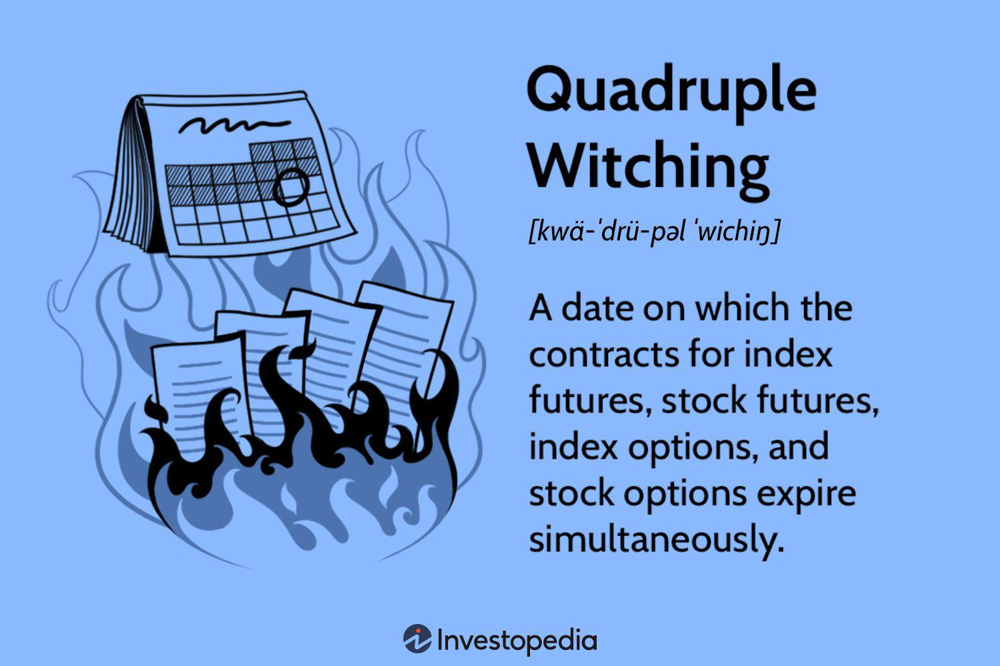

The stock market is a complex ecosystem affected by a myriad of factors that traders consider when making decisions. Among the notable phenomena influencing market dynamics is quadruple witching, a term describing a specific occurrence in the trading calendar with significant implications. Quadruple witching refers to the simultaneous expiration of various derivative contracts, including stock index futures, stock index options, stock options, and single stock futures. This convergence, happening four times a year, often leads to heightened trading activity and market volatility.

With the advancement of technology, particularly in trading, algorithmic trading has brought about transformative changes in how market participants operate, especially during periods like quadruple witching. Algorithmic trading leverages computer algorithms to automate and optimize trading decisions and executions, enabling traders to navigate the complexities of the stock market with speed and precision.



This article explores the impact of quadruple witching on the stock market and examines the role of algorithmic trading in enhancing trading activities during these volatile periods. For investors aiming to understand and mitigate the risks associated with modern trading environments, recognizing these dynamics is essential. By leveraging technology and informed strategies, traders can effectively handle the challenges and opportunities presented by the stock market's cyclical events.

## Table of Contents

## Understanding Quadruple Witching

Quadruple witching is a notable event in the stock market, occurring on the third Friday of March, June, September, and December each year. This day is marked by the simultaneous expiration of four types of financial derivatives: stock index futures, stock index options, stock options, and single stock futures. The convergence of these expirations tends to result in significant trading activity and increased market volatility.

The expiration of these contracts is significant for several reasons. For stock index futures and options, expiration means that all contracts need to be settled, either through delivery of the underlying asset or by cash settlement. This requirement increases trading volume as investors and traders adjust their positions to navigate the shifts in strategy that typically accompany these expirations. This surge in activity often leads to heightened volatility in the markets, especially in the equities sector.

Understanding the dynamics of quadruple witching is crucial for traders and investors. During these days, market participants may observe atypical patterns, including sudden price swings and increased liquidity as large institutional investors and hedge funds adjust their portfolios. These movements can create both challenges and opportunities, emphasizing the need for well-thought-out trading strategies that account for the volatility inherent in such market conditions.

To develop effective strategies around quadruple witching days, a comprehensive analysis of historical data and market behavior is essential. Traders should be prepared for increased levels of order execution as they manage expiring contracts. Moreover, price discovery can be influenced by the mechanical rather than fundamental movements due to the expiration-related trading volumes, which can distort short-term market pricing.

In summary, quadruple witching is a pivotal period for market participants, characterized by the increased complexity of synchronizing expiring derivative contracts. Market actors must stay informed and vigilant, carefully monitoring market trends and preparing to adapt their strategies in response to the unique challenges posed by these quarterly occurrences.

## The Impact of Quadruple Witching on Market Volatility

Quadruple witching days are significant events in the stock market, marked by the simultaneous expiration of four major types of derivatives: stock index futures, stock index options, stock options, and single stock futures. These events occur quarterly, on the third Friday of March, June, September, and December. Such expirations result in heightened market [volatility](/wiki/volatility-trading-strategies), primarily due to the large [volume](/wiki/volume-trading-strategy) of contracts expiring simultaneously. This elevated volatility emerges as traders and investors engage in portfolio rebalancing or rollover activities to adjust their positions in response to the expirations. 

The convergence of contract expirations prompts a notable increase in trading activity as market participants attempt to close out their positions, roll them over to future contracts, or establish new positions. This activity can lead to significant price swings and abrupt market movements, as the sheer volume of trading often amplifies market dynamics. As a result, [liquidity](/wiki/liquidity-risk-premium) can be both a facilitator and a hindrance, as large orders can move the market more than they typically would outside these periods.

During quadruple witching, the market is often characterized by large buy and sell orders. Traders aim to optimize their portfolios, reacting swiftly to the evolving market conditions, which may involve the tactical closing of positions or initiation of new ones. These transactions contribute to an intense trading environment, marked by brisk price movement and increased bid-ask spreads.

The impact of quadruple witching often reaches a crescendo in the final hour of trading, colloquially known as the 'witching hour.' This period is notorious for its unpredictability, as the culmination of day's trading efforts coincides with last-minute attempts to settle positions. This final trading hour can experience a surge in volatility, exacerbated by the need for positions to align with the closing prices, which often serve as benchmarks for settlement processes. The confluence of these factors requires traders to be exceptionally vigilant and strategic, as the decisions made during this period can significantly influence portfolio outcomes.

In conclusion, understanding the dynamics and market behaviors associated with quadruple witching is essential for market participants. Being prepared for increased volatility and recognizing the potential for dramatic price movements allows traders to exploit opportunities while mitigating risks. As such, these unique trading days present both challenges and openings for those adept at navigating the volatile market landscapes they provoke.

## Algorithmic Trading and Its Role

Algorithmic trading refers to the use of computer algorithms to automate trading decisions and execution processes. These algorithms are designed to analyze large datasets and make decisions at speeds far beyond human capability, a feature crucial during periods of high market activity such as quadruple witching. On quadruple witching days, when multiple derivatives contracts expire simultaneously, trading volumes can surge, leading to heightened complexity and volatility in market operations. In such scenarios, algorithms are particularly useful in managing the rapid execution of high-volume orders.

The primary advantage of [algorithmic trading](/wiki/algorithmic-trading) systems lies in their ability to process vast amounts of financial data in real time. By employing mathematical models and sophisticated algorithms, these systems can identify trading opportunities and respond almost instantaneously. For instance, algorithms can be programmed to detect [arbitrage](/wiki/arbitrage) opportunities emerging from price discrepancies between different markets or instruments, a strategy particularly useful on quadruple witching days when price swings are frequent.

Additionally, algorithmic trading mitigates risks by ensuring optimal trade execution, even amid volatile market conditions. By pre-programming criteria such as price, timing, and quantity, algorithms can execute trades with precision, reducing human error and emotional biases. This capability allows traders to maintain consistent trading strategies, regardless of the market's turbulence.

The transformation brought by algorithmic trading in handling quadruple witching days is profound. Traders now rely on these automated systems to execute large numbers of trades efficiently, manage the increased volatility, and capitalize on rapid market movements. The precision and speed provided by algorithmic systems are unparalleled, making them indispensable tools in modern trading, particularly during complex periods marked by events like quadruple witching.

## Strategizing with Algo Trading During Quadruple Witching

Successful trading strategies during quadruple witching leverage the advanced capabilities of algorithmic trading to navigate the complexities of increased market volatility. Algorithms are integral to identifying patterns and arbitrage opportunities that arise due to the heightened trading activity associated with the simultaneous expiration of contracts.

During these volatile periods, the speed and precision of algorithms enable traders to exploit inefficiencies in the market. Algorithms are adept at processing large volumes of data to pinpoint temporary price discrepancies. These trading programs execute transactions in an automated fashion, capitalizing on brief windows where pricing anomalies might occur. A common algorithmic approach is [statistical arbitrage](/wiki/statistical-arbitrage), which entails the real-time analysis of price differences in correlated securities to inform trading decisions.

Consider the following Python code snippet that outlines a simple template for a statistical arbitrage strategy during quadruple witching:

```python
import numpy as np
import pandas as pd

def identify_arbitrage_opportunity(prices):
    mean_price = np.mean(prices)
    std_dev_price = np.std(prices)
    z_score = (prices[-1] - mean_price) / std_dev_price
    return z_score

# Example prices data
prices = pd.Series([...])  # Load your time series data

# Identify arbitrage opportunity
z_score = identify_arbitrage_opportunity(prices)
if abs(z_score) > 2:  # Threshold for statistical significance
    trade_signal = "buy" if z_score < 0 else "sell"
    print(f"Arbitrage opportunity detected: {trade_signal}")
```

Another critical aspect where algorithmic trading proves beneficial is portfolio rebalancing. Algorithms can automate the rebalancing process by continuously evaluating portfolio allocations and executing trades to maintain desired asset weightings. This automation is essential to react swiftly to the sudden market movements typical of quadruple witching days, thereby optimizing portfolio performance.

Risk management is a crucial component of algorithmic trading systems, designed to contain exposure to sudden market fluctuations. Algorithms incorporate risk assessment tools and predefined limits to manage potential losses. These systems can execute stop-loss orders or hedging strategies instantly, reducing human error and emotional biases that can negatively impact decision-making during volatile market conditions.

In preparation for quadruple witching, traders who utilize algorithmic strategies are better equipped to enhance the performance of their portfolios. By integrating sophisticated trading algorithms, traders can harness technology to mitigate risks, improve trade execution, and maximize returns amidst the complexities of the stock market.

## The Future of Trading: Integrating Technology and Market Dynamics

The influence of technology on financial markets, particularly during significant trading events like quadruple witching, is undeniably on an upward trajectory. With the rapid development of [artificial intelligence](/wiki/ai-artificial-intelligence) (AI) and [machine learning](/wiki/machine-learning), the integration of these technologies into algorithmic trading strategies is becoming increasingly sophisticated. AI and machine learning offer enhanced predictive capabilities, enabling algorithms to detect intricate market patterns and predict price movements with greater accuracy. These technological tools not only aid in formulating effective strategies but also provide traders with the ability to execute trades at unparalleled speeds, thereby leveraging even the smallest market fluctuations.

Investing in advanced technology offers traders and financial firms a competitive edge, especially in managing the complexities of events such as quadruple witching. By deploying state-of-the-art algorithms, traders can efficiently handle the increased trading volumes and volatility associated with these periods. Furthermore, the ability to analyze vast data sets in real-time allows algorithmic systems to optimize trading outcomes, reducing risks while capitalizing on arbitrage opportunities.

With these advancements, there is a pressing need for regulatory frameworks to evolve in tandem with trading technologies. As algorithms become more autonomous in decision-making, ensuring market integrity and protecting investors from algorithmic errors are critical concerns. Regulators face the challenge of crafting policies that facilitate innovation while maintaining market stability and fairness.

The evolution of trading, therefore, necessitates a balance between embracing technological advancements and preserving market stability. While technology can enhance trading efficiency and profitability, it must be integrated thoughtfully to prevent disruptive market dynamics. As markets continue to evolve, traders and firms that can strike this balance are likely to find the greatest success in navigating the future financial landscape.

## Conclusion

Quadruple witching presents both challenges and opportunities in the stock market, significantly influenced by heightened market volatility. During these periods, the simultaneous expiration of various derivatives contracts creates complex trading conditions that require astute navigation. Algorithmic trading has emerged as a powerful tool, offering sophisticated methods to manage the volatile trading environment efficiently. These algorithms are capable of processing vast amounts of market data at high speeds, enabling traders to execute optimized trades and manage risks more effectively.

For traders who leverage advanced algorithmic strategies, there is potential to capitalize on short-lived arbitrage opportunities and execute trades with greater precision. Algorithms designed to recognize market patterns and respond promptly can enhance portfolio performance, particularly during the erratic trading that quadruple witching induces.

As technology progresses, its influence on trading and market dynamics is expected to expand further. Innovations in artificial intelligence and machine learning provide traders with enhanced analytical capabilities, enabling more informed decision-making and strategic planning. In this evolving landscape, staying informed about technological advancements and adopting these tools are crucial for maintaining a competitive edge in the stock market. Embracing technology not only aids in navigating the unpredictable conditions of quadruple witching but also prepares traders to adapt to future changes in the trading environment.

## References & Further Reading

[1]: Moyer, L. (2017). ["Quadruple Witching: What It Means for Investors"](https://www.nasdaq.com/articles/quadruple-witching-what-it-and-why-you-should-know-2016-06-17) Investopedia.

[2]: Harris, L. (1989). "The October 1987 S&P 500 Stock-Futures Basis." *The Journal of Finance*, 44(1), 77-91. [DOI:10.1111/j.1540-6261.1989.tb02407.x](https://onlinelibrary.wiley.com/doi/10.1111/j.1540-6261.1989.tb02405.x)

[3]: Bouchaud, J.P., Bonart, J., Donier, J., & Gould, M. (2018). ["Trades, Quotes and Prices: Financial Markets Under the Microscope"](https://www.semanticscholar.org/paper/Trades%2C-Quotes-and-Prices%3A-Financial-Markets-Under-Bouchaud-Bonart/5822f8496a8a497f7038d15bb3413fb54528da8b) Cambridge University Press.

[4]: Lopez de Prado, M. (2018). ["Advances in Financial Machine Learning"](https://books.google.com/books/about/Advances_in_Financial_Machine_Learning.html?id=oU9KDwAAQBAJ) Wiley.

[5]: Chan, E. (2009). ["Quantitative Trading: How to Build Your Own Algorithmic Trading Business"](https://github.com/ftvision/quant_trading_echan_book) Wiley.

[6]: Jansen, S. (2020). ["Machine Learning for Algorithmic Trading"](https://github.com/stefan-jansen/machine-learning-for-trading) Packt Publishing.

[7]: Biais, B., Foucault, T., & Moinas, S. (2019). "Equilibrium Fast Trading." *The Journal of Financial Economics*, 130(3), 668-691. [DOI:10.1016/j.jfineco.2018.09.010](https://www.sciencedirect.com/science/article/abs/pii/S0304405X15000288)