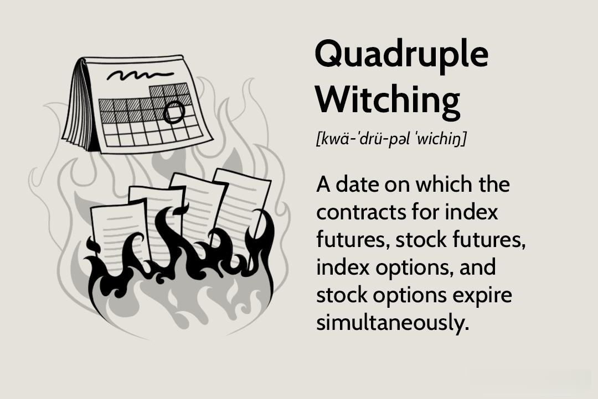

Quad witching, a term often whispered with a mix of anticipation and trepidation among traders, signifies a pivotal event in the financial markets that occurs four times a year. It takes place on the third Friday of March, June, September, and December, each time punctuated by the simultaneous expiration of four significant types of derivative contracts: stock index futures, stock index options, single stock options, and single stock futures. This synchronization can lead to increased volatility and trading volumes, creating an environment filled with both opportunities and challenges for traders and investors.

The expiration of these derivative contracts prompts a flurry of activity in the financial markets as traders and institutions rush to roll over their positions or close them out, leading to significant shifts in stock prices and trading volumes. For instance, the process of "rolling over" involves closing contracts nearing expiration and opening new ones with later expiration dates. This convergence of expirations often results in unusually high market activity, which can amplify price movements and enhance liquidity.



In the context of algorithmic trading, quad witching days are especially noteworthy. Algorithms, designed to execute trades swiftly and efficiently, must be adjusted to account for the sudden surges in volume and volatility. This makes quad witching periods both an opportunity to capture quick gains through arbitrage and a period riskier than usual due to increased market noise that can result in false signals.

In this article, we will explore the concept of quad witching in detail, examining its impacts on algorithmic trading and strategies that traders use to navigate its complexities. Through understanding the underlying mechanics and the resultant market dynamics, traders can position themselves to manage the challenges and capitalize on the potential financial opportunities that arise during these synchronized expirations.

## Table of Contents

## Understanding Quad Witching

Quad witching occurs on the third Friday of March, June, September, and December, marking a significant event in the financial markets when four types of derivative contracts expire simultaneously. These contracts include stock index futures, stock index options, single stock options, and single stock futures. The term "quadruple" aptly reflects the simultaneous expiration of these four derivative types. The origins of the term 'witching' are rooted in the market superstition tied to the unpredictable and often volatile conditions observed during these periods. 

Despite the initial impression of chaos suggested by the term, quad witching days are often characterized more by strategic market maneuvers than sheer disorder. Traders engage in strategic positioning to either roll over contracts or close positions, aiming to manage or leverage the inherent volatility these expirations can introduce. This activity can involve a variety of tactics, including hedging existing portfolios against potential price swings or taking advantage of market inefficiencies that may briefly arise.

The heightened activity on quad witching days often results in increased market [liquidity](/wiki/liquidity-risk-premium), providing traders opportunities to execute large trades more efficiently. However, the swift price movements can also pose risks, demanding careful planning and adjustment of trading strategies. Understanding the mechanics of quad witching and the reasons behind the increased market activity is crucial for traders looking to either exploit the opportunities it presents or minimize its potential adverse effects.

## Impact of Quad Witching on Algo Trading

Algorithmic trading, characterized by its reliance on speed and efficiency, can be markedly influenced by the dynamics of quad witching days. These days are known for their heightened [volatility](/wiki/volatility-trading-strategies) and significantly increased trading [volume](/wiki/volume-trading-strategy), owing to the simultaneous expiration of multiple derivative contracts. The rapid fluctuations present on quad witching days necessitate that algorithms be meticulously tuned to effectively manage swift price movements and the burst of market activity that occurs as traders reposition their holdings.

A critical challenge for [algorithmic trading](/wiki/algorithmic-trading) systems during these periods involves correctly interpreting the rampant price movements. Algorithms designed to execute trades in milliseconds must be agile enough to differentiate between genuine market opportunities and misleading price signals, often caused by short-lived market noise. This environment underscores the necessity for sophisticated risk management strategies to mitigate the impact of potential false signals that could lead to unintentional trades.

For tech-savvy traders, these conditions also present opportunities to leverage advanced algorithms to capitalize on [arbitrage](/wiki/arbitrage) opportunities. Arbitrage exploits short-term discrepancies in price between derivatives or between a derivative and its underlying asset. Given the price dislocations that can occur during quad witching due to mismatches in supply and demand, well-optimized algorithms can identify and act on these opportunities to generate profits.

Furthermore, during quad witching, the configuration of algorithms may often need to be adjusted to balance risk and reward effectively. One potential approach is to implement [machine learning](/wiki/machine-learning) techniques that allow an algorithm to adapt to patterns observed in historical market data from previous quad witching days. Another strategy could include setting dynamic thresholds for entering and exiting trades, which could help manage the unpredictability of price swings.

Ensuring robustness in algorithmic trading systems during such volatile periods is achieved by simulating a variety of market scenarios in back-testing environments. These simulations can help traders assess how their algorithms may react under the unique pressures of quad witching days. By doing so, algorithms can be refined to act efficiently even as they navigate the noise and complexity introduced by these simultaneous expirations.

In summary, while the increased activity during quad witching can challenge even the most proficient algorithmic trading systems, it also presents opportunities for gains through arbitrage and other strategies, provided that one places equal emphasis on risk management and systems adaptability.

## Volatility and Volume Insights

Quad witching days are generally characterized by heightened market volatility due to the simultaneous expiration of multiple derivative contracts, leading to notable shifts in investor sentiment and trading behavior. The intersection of these expirations instigates substantial fluctuations as market participants, including institutional investors and traders, reposition their portfolios. This often results in significant swings in stock prices as positions are rolled over or closed.

The increase in trading volume during quad witching provides additional liquidity in the market, facilitating the execution of large trades with less price impact. Liquidity is crucial during these periods, as it can alleviate the potential costs associated with trading large volumes and reduce the bid-ask spread, allowing for more efficient market functioning. This dynamic is particularly advantageous for institutional investors who need to execute substantial orders without adversely affecting the market price.

Investors often escalate trading activities on quad witching days to hedge their portfolios against anticipated risks or to rebalance their holdings in compliance with pre-defined investment strategies. The urge to protect against uncertainty drives a surge in options and futures trading volumes. This proactive stance often results in synchronized buying or selling pressures, amplifying market volatility.

Understanding the patterns of volume spikes on quad witching days is vital for traders aiming to identify optimal entry and [exit](/wiki/exit-strategy) points. By analyzing historical data and monitoring real-time market conditions, traders can discern the typical behaviors that accompany these expirations. Algorithmic and [quantitative trading](/wiki/quantitative-trading) strategies can be particularly effective in navigating these market conditions by employing statistical models and historical patterns to predict price movements and identify potential arbitrage opportunities.

Overall, while quad witching presents challenges due to increased market turbulence, it also offers opportunities for traders who can adeptly manage their strategies and exploit the resulting market dynamics. The intricate interplay of increased volume and liquidity, combined with strategic positioning by market participants, underscores the importance of vigilant market analysis and sophisticated trading techniques during these critical trading periods.

## Trading Strategies for Quad Witching

Traders often employ a variety of strategies to navigate the complexities of quad witching days, which are characterized by heightened volatility and significant trading volume. A fundamental approach involves options trading, where traders can utilize various options strategies such as straddles and strangles. These allow them to capitalize on anticipated price swings without betting on a specific directional move.

Hedging is another strategy commonly adopted during quad witching. It involves the use of financial instruments to offset potential losses in one's portfolio. For example, traders might buy put options to protect against unexpected declines in stock prices or use futures contracts to lock in current prices.

Arbitrage techniques are also prevalent as traders seek to exploit price inefficiencies that arise during these volatile periods. Such inefficiencies may occur due to the temporary mispricing of derivatives relative to their underlying assets. Skilled traders can design algorithmic strategies to identify and execute these opportunities promptly.

For day traders, the high volatility of quad witching days presents an advantage through [scalping](/wiki/gamma-scalping)—a trading style focused on benefiting from small price changes. Scalping requires quick execution and the ability to react rapidly to market signals, often facilitated by advanced trading software and direct market access.

Long-term investors, in contrast, might opt to adjust their holdings to reduce exposure to the transient risks posed by quad witching. This could involve rebalancing their portfolio to maintain a desired asset allocation or diversifying across sectors to mitigate sector-specific volatility.

Risk management is crucial during quad witching. Setting stop-loss orders can help traders limit potential losses by triggering automatic sell orders when a security reaches a predetermined price. Additionally, limiting leverage is advisable, as the amplified price swings can lead to significant losses if positions are over-leveraged. Ensuring robust risk management strategies not only protects capital but also positions traders to take advantage of promising opportunities that arise amidst the chaos of quad witching days.

## Historical Performance and Market Trends

Historical data suggests that while quad witching weeks may show robust returns, the individual quad witching days often result in less favorable outcomes. This discrepancy can be attributed to the heightened anticipation and strategic positioning preceding these days, leading to a mass rollover of contracts and an adjustment of portfolios as the expiration approaches.

The impact of quad witching varies across sectors, with some exhibiting greater sensitivity to the expirations of derivative contracts. For instance, sectors with higher volatility or those heavily reliant on options for hedging strategies might show pronounced reactions. The heightened activity stemming from quad witching can create distinctive patterns in sector behavior, influencing short-term price movements. Traders can benefit from recognizing these patterns, as they provide insights into which sectors might outperform or underperform during these periods.

Analyzing historical trends, it becomes evident that while asset prices may see amplified fluctuations due to speculative and reactive trading, the overall market usually stabilizes shortly thereafter. However, the influence of concurrent macroeconomic conditions or company-specific news can exacerbate these movements, making it essential for traders to consider the broader market context when assessing potential strategies for quad witching days.

Although quad witching days introduce unique market dynamics, it's important for traders to understand that each occurrence is shaped by its specific market context at the time. External factors, such as monetary policy decisions, geopolitical events, or quarterly earnings reports, can significantly alter how these days play out. Thus, while historical data can provide a framework for anticipating market behavior, each quad witching day should be approached as a distinct event requiring careful analysis and a tailored strategy.

## Conclusion

Quad witching remains a fascinating and complex aspect of trading that encapsulates the intricate interdependencies present within the financial markets. As derivative contracts converge for expiration, the resultant dynamics emphasize the significance of both preemptive readiness and adaptive capability among market participants. This event serves as a critical reminder for algorithmic traders of the necessity to remain agile in their strategies to effectively handle the surge in volatility and volume that characterizes these periods. 

Flexibility in trading algorithms becomes paramount as these systems must be capable of responding to rapid price fluctuations and increased market activity. This adaptability not only reduces the potential impact of adverse conditions but also allows traders to take advantage of transient arbitrage opportunities that may emerge. To illustrate, consider the Python snippet below that could form part of an algorithm’s logic:

```python
def adjust_strategy(volatility, volume):
    if volatility > threshold_v and volume > threshold_vol:
        # Increase frequency of monitoring positions
        monitor_frequency *= 2
        # Tighten stop-loss limits to safeguard against volatility
        stop_loss_limit = initial_stop_loss / 2
    else:
        # Revert to standard strategies
        monitor_frequency = regular_frequency
        stop_loss_limit = initial_stop_loss
    return monitor_frequency, stop_loss_limit

# Example usage within an algorithm
threshold_v = 1.5  # Example volatility threshold
threshold_vol = 100000  # Example volume threshold
monitor_frequency, stop_loss = adjust_strategy(current_volatility, current_volume)
```

By understanding the mechanics and implications of quad witching, and employing robust risk management practices with algorithms like the one shown, traders can strive to harness the potential opportunities while mitigating the risks associated with these unique market events. Success in this domain requires not only technical proficiency but also a strategic mindset geared towards continuous monitoring and adaptation to the ever-evolving landscape of the financial markets.

## References & Further Reading

[1]: Bergstra, J., Bardenet, R., Bengio, Y., & Kégl, B. (2011). ["Algorithms for Hyper-Parameter Optimization."](https://dl.acm.org/doi/10.5555/2986459.2986743) Advances in Neural Information Processing Systems 24.

[2]: ["Advances in Financial Machine Learning"](https://www.amazon.com/Advances-Financial-Machine-Learning-Marcos/dp/1119482089) by Marcos Lopez de Prado

[3]: ["Evidence-Based Technical Analysis: Applying the Scientific Method and Statistical Inference to Trading Signals"](https://www.amazon.com/Evidence-Based-Technical-Analysis-Scientific-Statistical/dp/0470008741) by David Aronson

[4]: ["Machine Learning for Algorithmic Trading"](https://github.com/stefan-jansen/machine-learning-for-trading) by Stefan Jansen

[5]: ["Quantitative Trading: How to Build Your Own Algorithmic Trading Business"](https://www.amazon.com/Quantitative-Trading-Build-Algorithmic-Business/dp/1119800064) by Ernest P. Chan