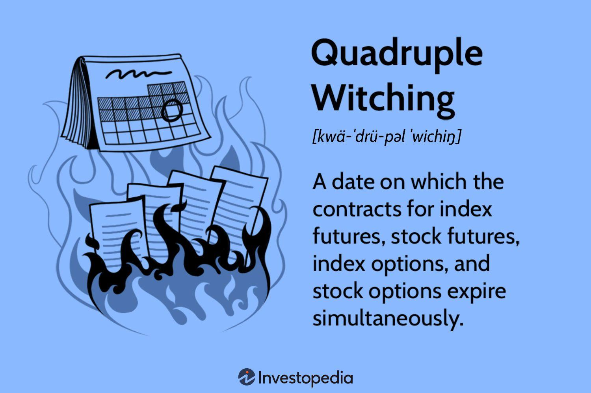

## Table of Contents

## What is Quadruple Witching?

Quadruple Witching is a term used in the stock market. It happens four times a year on the third Friday of March, June, September, and December. On these days, four different types of financial contracts expire at the same time. These contracts are stock options, stock index futures, stock index options, and single stock futures. Because so many contracts expire at once, it can lead to more trading and bigger price changes in the market.

When all these contracts expire on the same day, it can cause more activity in the stock market. Traders might buy or sell a lot of stocks to manage their contracts before they expire. This can make the market more volatile, meaning prices can go up and down a lot. However, not every Quadruple Witching day will be very exciting. Sometimes, the market might not change much at all. It really depends on what is happening in the market at that time.

## When does Quadruple Witching occur?

Quadruple Witching happens four times every year. It takes place on the third Friday of March, June, September, and December. This is when four types of financial contracts all expire at the same time.

These contracts are stock options, stock index futures, stock index options, and single stock futures. When they all expire together, it can make the stock market busier and prices can change a lot. But sometimes, the market might stay calm on these days too. It depends on what's going on in the market at that time.

## What types of financial instruments are involved in Quadruple Witching?

Quadruple Witching involves four types of financial instruments that all expire on the same day. These instruments are stock options, stock index futures, stock index options, and single stock futures. Stock options give the holder the right to buy or sell a specific stock at a set price before the option expires. Stock index futures are contracts to buy or sell a stock index at a future date. Stock index options are similar, but they give the right to buy or sell a stock index at a set price. Single stock futures are contracts to buy or sell a specific stock at a future date.

When all these instruments expire at the same time, it can lead to a lot of activity in the stock market. Traders need to close out or roll over their positions before the contracts expire, which can cause more buying and selling. This increased activity can make the market more volatile, meaning prices can go up and down a lot. However, the impact of Quadruple Witching can vary. Sometimes the market might not change much at all. It depends on what is happening in the market at that time.

## How does Quadruple Witching affect the stock market?

Quadruple Witching can make the stock market busier and more unpredictable. It happens four times a year, on the third Friday of March, June, September, and December. On these days, four types of financial contracts expire at the same time: stock options, stock index futures, stock index options, and single stock futures. When all these contracts expire together, traders have to buy or sell a lot of stocks to close out or roll over their positions. This can lead to a lot of trading and can make stock prices go up and down a lot.

However, the effect of Quadruple Witching is not always the same. Sometimes, the market can be very calm on these days. It depends on what is happening in the market at that time. If there are other big news or events happening, they might affect the market more than the expiring contracts. But even if the market doesn't change much, traders still need to pay attention to Quadruple Witching because it can lead to sudden changes in stock prices.

## What is the difference between Quadruple Witching and Triple Witching?

Quadruple Witching and Triple Witching are both special days in the stock market when certain financial contracts expire. The main difference is the number of types of contracts that expire on these days. Quadruple Witching happens four times a year, on the third Friday of March, June, September, and December. On these days, four types of contracts expire: stock options, stock index futures, stock index options, and single stock futures. This can make the market very busy and prices can change a lot.

Triple Witching, on the other hand, used to be the term for these days before single stock futures were introduced. It happens on the same days as Quadruple Witching but involves only three types of contracts: stock options, stock index futures, and stock index options. The addition of single stock futures made it Quadruple Witching. Both days can lead to more trading and bigger price changes, but Quadruple Witching can have an even bigger impact because there are more contracts expiring.

## Can you explain the historical context of Quadruple Witching?

Quadruple Witching started as Triple Witching. It began in 1982 when the stock market started using a new rule. Before that, only stock options and stock index futures expired at the same time. In 1982, stock index options were added to the mix. This made the third Friday of March, June, September, and December very busy days in the stock market. People called these days Triple Witching because three types of contracts expired at the same time.

In 2002, single stock futures were introduced. This added a fourth type of contract that expired on the same days. Now, the days became known as Quadruple Witching. The name changed because there were now four types of financial contracts expiring at once: stock options, stock index futures, stock index options, and single stock futures. This made these days even busier and more important for traders to watch.

## What are some strategies traders use during Quadruple Witching?

During Quadruple Witching, traders often use a strategy called "rolling over" their positions. This means they close out their current contracts before they expire and open new ones with a later expiration date. This helps them keep their investment positions without having to settle the contracts right away. Another common strategy is "pinning," where traders try to push the price of a stock close to the strike price of an expiring option. This can make the option expire worthless or in-the-money, depending on what the trader wants.

Traders also might use "gamma hedging" to manage the risk of their options positions. Gamma hedging involves buying or selling the underlying stock to keep the options position balanced as the stock price changes. This can be especially important during Quadruple Witching when prices can move a lot. Some traders might also look for "[arbitrage](/wiki/arbitrage) opportunities," where they can buy and sell the same asset in different markets to make a profit from the price difference. These strategies help traders navigate the increased activity and [volatility](/wiki/volatility-trading-strategies) that can come with Quadruple Witching days.

## How can investors prepare for Quadruple Witching?

Investors can prepare for Quadruple Witching by keeping an eye on the calendar and knowing when these days are coming up. They happen four times a year, on the third Friday of March, June, September, and December. By knowing these dates, investors can plan their trading strategies ahead of time. They might want to check their current positions and decide if they need to make any changes before the contracts expire. It's also a good idea to stay informed about what's happening in the market, as other news or events can affect how the market reacts on Quadruple Witching days.

Another way to prepare is to think about how much risk they are willing to take. Quadruple Witching can make the market more unpredictable, so investors might want to adjust their strategies to be safer. They could consider using stop-loss orders to limit potential losses if the market moves against them. It's also helpful to have a clear plan for what to do if prices start to move a lot. By being prepared and understanding what might happen, investors can handle the increased activity and volatility that comes with Quadruple Witching days.

## What impact does Quadruple Witching have on market volatility?

Quadruple Witching can make the stock market more volatile. This means that stock prices can go up and down a lot more than usual. It happens because four types of financial contracts all expire at the same time on these days. These contracts are stock options, stock index futures, stock index options, and single stock futures. When they expire, traders need to close out or roll over their positions. This can lead to a lot of buying and selling, which makes the market busier and prices can change a lot.

However, the impact of Quadruple Witching on market volatility is not always the same. Sometimes, the market might stay calm on these days. It really depends on what else is happening in the market at that time. If there are other big news or events, they might affect the market more than the expiring contracts. Even if the market doesn't change much, traders still need to be careful because Quadruple Witching can lead to sudden changes in stock prices.

## Are there any specific risks associated with trading during Quadruple Witching?

Trading during Quadruple Witching can be riskier because the market can be more unpredictable. On these days, four types of financial contracts expire at the same time. This can lead to a lot of buying and selling as traders try to close out or roll over their positions. The increased activity can make stock prices move a lot, which means there's a bigger chance of losing money if the market goes against your trades.

Another risk is that other big news or events happening at the same time can make the market even more volatile. If something important is going on, it might affect the market more than the expiring contracts. Traders need to be careful and watch the market closely. Even if the market doesn't change much, sudden price movements can still happen, so it's important to have a plan and be ready for anything.

## How has the frequency and impact of Quadruple Witching changed over time?

Quadruple Witching started as Triple Witching in 1982. Back then, only three types of financial contracts expired at the same time: stock options, stock index futures, and stock index options. These days were already busy and could make the market move a lot. In 2002, single stock futures were added, which turned Triple Witching into Quadruple Witching. Now, four types of contracts expire at the same time, making these days even busier and potentially more impactful on the market.

The impact of Quadruple Witching on the market can change from year to year. Sometimes, these days can lead to a lot of trading and big price changes. Other times, the market might not move much at all. It depends on what else is happening in the market. Over time, traders have gotten better at preparing for these days, which might make the market less wild. But Quadruple Witching can still cause sudden price movements, so traders need to be careful and have a plan ready.

## What are the global implications of Quadruple Witching on financial markets?

Quadruple Witching can affect not just the U.S. stock market, but also financial markets around the world. When these days happen, a lot of buying and selling can happen in the U.S., which can make stock prices move a lot. Because the U.S. market is so big and important, what happens there can affect other markets too. If the U.S. market goes up or down a lot on Quadruple Witching days, it can cause prices to change in other countries as well. Investors and traders in other countries need to watch what's happening in the U.S. and be ready for their markets to move too.

The global impact of Quadruple Witching can be different each time it happens. Sometimes, the effects might be small if the U.S. market doesn't change much. But if there are big moves in the U.S., it can make other markets more unpredictable too. Traders all over the world need to be careful on these days and think about how the U.S. market might affect their own investments. Even though Quadruple Witching happens in the U.S., it's something that everyone in the global financial world needs to pay attention to.

## References & Further Reading

[1]: Bergstra, J., Bardenet, R., Bengio, Y., & Kégl, B. (2011). ["Algorithms for Hyper-Parameter Optimization."](https://dl.acm.org/doi/10.5555/2986459.2986743) Advances in Neural Information Processing Systems 24.

[2]: ["Advances in Financial Machine Learning"](https://www.amazon.com/Advances-Financial-Machine-Learning-Marcos/dp/1119482089) by Marcos Lopez de Prado

[3]: ["Evidence-Based Technical Analysis: Applying the Scientific Method and Statistical Inference to Trading Signals"](https://www.amazon.com/Evidence-Based-Technical-Analysis-Scientific-Statistical/dp/0470008741) by David Aronson

[4]: ["Machine Learning for Algorithmic Trading"](https://github.com/stefan-jansen/machine-learning-for-trading) by Stefan Jansen

[5]: ["Quantitative Trading: How to Build Your Own Algorithmic Trading Business"](https://www.amazon.com/Quantitative-Trading-Build-Algorithmic-Business/dp/1119800064) by Ernest P. Chan