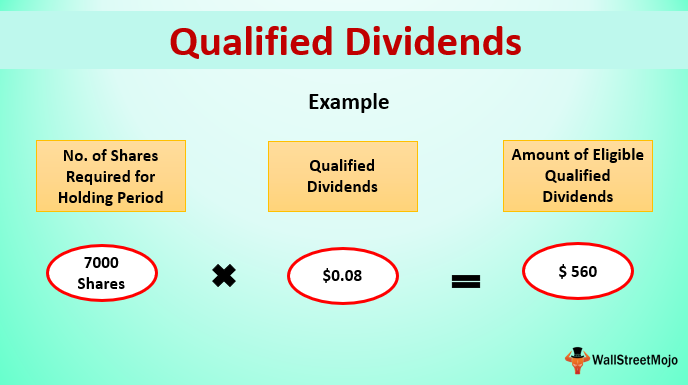

In this digital age, generating income through investments has become a common financial strategy. Dividends, particularly, play a crucial role in this process. As investors seek to maximize their returns, understanding the intricacies of dividend taxation becomes essential. Dividends are essentially payments made by a corporation to its shareholders, usually derived from profits. They can be categorized into two types: qualified and ordinary dividends. This distinction significantly affects the tax obligations of the investor.

Qualified dividends are taxed at the more favorable long-term capital gains rates, which are generally lower than standard income tax rates. Conversely, ordinary dividends are subject to the higher, ordinary income tax rates. The criteria that determine whether a dividend is qualified include the nature of the company distributing the dividends and the duration for which the investor holds the stock.



Furthermore, the rise of algorithmic trading introduces new dimensions to dividend taxation. Algorithmic trading, or algo trading, utilizes complex algorithms to execute trades at high speeds and volumes, often influencing stock prices around critical dividend dates. This can affect an investor's ability to meet the holding period requirements necessary for qualifying dividends, presenting both opportunities and challenges in tax planning.

This article aims to unravel these complexities, focusing on the taxation of qualified dividends and the implications of algo trading, enabling investors to optimize their financial strategies for better returns.

## Table of Contents

## Understanding Qualified Dividends

Qualified dividends are a particular category of ordinary dividends that fulfill specific criteria, allowing them to be taxed at the favorable long-term capital gains tax rates rather than the standard income tax rates. This treatment provides a tax advantage to investors, enabling them to retain a larger portion of their dividend income.

For a dividend to be classified as qualified, it must be paid by either a U.S. corporation or a qualifying foreign corporation. A qualifying foreign corporation can be one that is incorporated in a U.S. possession, eligible for benefits under a comprehensive income tax treaty with the United States, or whose stock is readily tradable on a major U.S. securities market.

Additionally, investors must meet the requisite holding period to benefit from the qualified dividend tax treatment. Generally, the holding period stipulates that the investor must have held the stock for more than 60 days during the 121-day period that begins 60 days before the ex-dividend date. The ex-dividend date is the cutoff day when the stock is traded without its next dividend payout. This requirement ensures that the tax advantages are extended to investors who maintain their positions for a relatively sustained period, mitigating short-term trading behaviors.

Investors appreciate qualified dividends for their lower tax implications compared to ordinary income tax rates that apply to non-qualified dividends. While qualified dividends are taxed at the long-term capital gains rate of 0%, 15%, or 20%, depending on the taxpayer's taxable income, ordinary dividends can be taxed at rates as high as 37%, as they are treated as ordinary income. This disparity in tax rates underscores the potential savings and incentives for investors to structure their portfolios in favor of holding qualified dividend-paying stocks.

## Taxation of Qualified Dividends

Qualified dividends benefit from a preferential tax treatment that aligns with long-term capital gains tax rates. Specifically, these rates are structured as 0%, 15%, or 20%, and the applicable rate depends on the investor's taxable income bracket. This tax structure creates a notable incentive for investors to retain ownership of their stock holdings for extended periods, as the potential tax savings can be substantial compared to ordinary income tax rates.

In 2023, the tax brackets for qualified dividends for individuals are structured as follows: for single filers, a 0% tax rate applies to income up to $44,625, a 15% rate applies to income between $44,626 and $492,300, and income above $492,300 is taxed at 20%.[\[1\]](https://www.irs.gov/taxtopics/tc409). These brackets are subject to annual adjustments for inflation.

It is crucial for investors to be aware that reinvesting dividends, a common practice where dividends are used to purchase additional shares of the issuing stock or fund, does not exempt those dividends from being taxed. Upon receipt, dividends are taxable to the investor in the year they are paid out, regardless of whether they are reinvested. This means that even as accrued dividends are automatically reinvested in a company's dividend reinvestment plan (DRIP), the investor must include these amounts in their gross income for tax purposes. 

Thus, while reinvesting dividends can enhance the compounding growth of an investment, it does not provide immediate tax relief since the reinvested dividends are still treated as taxable income. Awareness and strategic planning around these elements are vital for investors aiming to maximize their after-tax income from dividends.

## Qualified vs. Ordinary Dividends

Ordinary dividends and qualified dividends differ primarily in their tax treatment. Ordinary dividends do not meet the criteria for qualified dividends and are taxed at the same rates as ordinary income. This means they can be taxed at federal income tax rates ranging from 10% to 37%, depending on the taxpayer’s income bracket. This often results in a higher tax liability compared to qualified dividends, which benefit from more favorable tax treatment.

Qualified dividends, on the other hand, are taxed at the long-term capital gains tax rates, which are significantly lower, at 0%, 15%, or 20%. To qualify, dividends must be paid by a U.S. corporation or a qualified foreign corporation and meet specific holding period requirements. These requirements stipulate that the investor must have held the stock for more than 60 days during the 121-day period that begins 60 days before the ex-dividend date.

For instance, if an investor is in the 22% income tax bracket and receives $1,000 in ordinary dividends, they could be liable for $220 in taxes on that income. However, if these dividends were qualified, and the applicable tax rate was 15%, the tax would be only $150.

Understanding the distinction between ordinary and qualified dividends is essential for effective tax planning. Knowing the criteria that determine whether dividends are qualified allows investors to strategize their investment choices efficiently. This can involve selecting stocks that are likely to yield qualified dividends or holding investments for the duration required to qualify for long-term capital gains tax rates.

Effective tax planning can significantly impact an investor's net returns. By prioritizing qualified dividends and managing investment portfolios to meet the holding period criteria, investors can minimize their tax liabilities. Additionally, being aware of one's tax bracket and the impact it has on dividend income allows for more intentional investment decisions, potentially maximizing post-tax returns.

## Algorithmic Trading and Dividend Taxation

Algorithmic trading, often referred to as algo trading, leverages sophisticated computational techniques to execute trades at speeds and frequencies that would be difficult for a human trader to match. This method of trading can have significant implications on dividend timing and the related taxation frameworks.

One of the primary strategies employed by certain algorithms is to capitalize on the price fluctuations that occur around ex-dividend dates. The ex-dividend date marks the cutoff for when buyers of a stock are entitled to receive the upcoming dividend. Typically, a stock’s price drops by approximately the dividend amount on the ex-dividend date to reflect this payout. Algorithms can be programmed to exploit these predictable price movements, for instance, by buying a stock just before the ex-dividend date and selling shortly after capturing the dividend, a strategy known as dividend capture.

However, this approach presents both advantages and pitfalls. Algorithms that successfully capture dividends and sell shortly after can generate short-term gains and dividend income. Yet, these gains are often subject to higher short-term capital gains tax rates unless the investor ensures that dividends received qualify for favorable tax treatment, such as meeting the holding period requirements for qualified dividends. Typically, for a dividend to be considered qualified, an investor must hold the stock for more than 60 days during the 121-day period that starts 60 days before the ex-dividend date.

Moreover, while [algorithmic trading](/wiki/algorithmic-trading) can increase the frequency of trades and potentially enhance returns through exploiting dividend timing, it can also lead to increased transaction costs and potential market impact costs. These costs can erode the benefits gained from any favorable price movements or dividend captures.

Investors utilizing algorithmic strategies need to be particularly mindful of these aspects:

```python
def is_qualified_dividend(holding_days, ex_dividend_date):
    period_start = ex_dividend_date - 60
    period_end = ex_dividend_date + 60
    return holding_days > 60 and holding_days < period_end - period_start

# Example usage:
holding_days = 65
ex_dividend_date = 100  # hypothetical date
qualified = is_qualified_dividend(holding_days, ex_dividend_date)
print(f"Dividend Qualified: {qualified}")
```

The example above in Python checks if the dividend received from a stock would be qualified based on the holding period relative to the ex-dividend date. Effective tax strategy planning requires understanding these nuances and strategically timing trades to optimize tax treatment while leveraging the speed and efficiency of algorithmic trading.

## How Investors Can Optimize Dividend Strategies

Optimizing dividend strategies requires a nuanced understanding of the tax implications associated with dividends and the strategic use of financial vehicles and timing. One fundamental aspect is grasping the holding period requirements that determine whether dividends qualify for favorable tax rates. For dividends to be considered qualified, shareholders must adhere to a specified holding period: typically, more than 60 days during the 121-day period that begins 60 days before the ex-dividend date. Meeting this requirement allows dividends to be taxed at the lower long-term capital gains rates, as opposed to the higher rates for ordinary income.

Another strategy involves leveraging retirement accounts, such as Individual Retirement Accounts (IRAs) or 401(k)s, to shelter dividend income. These accounts allow for tax-deferred growth, where dividends are not immediately subject to taxation when they are received. Taxes are paid upon withdrawal, ideally when the investor is in a lower income bracket, or potentially not at all in the case of Roth IRAs where qualified distributions are tax-free. This deferral can lead to significant long-term growth by maximizing the compounding effect.

Dividend Reinvestment Plans (DRIPs) also serve as a robust tool for improving dividend strategies. By automatically reinvesting cash dividends to purchase additional shares of a company's stock, DRIPs can amplify compounding growth without incurring immediate taxation. Typically, dividends used to purchase additional shares are still subject to tax in the year they are received; however, the reinvestment allows for the accumulation of more shares, which can appreciate over time and generate more dividend income in future periods.

Planning plays a crucial role in optimizing these strategies. Regularly reviewing dividend yields, ex-dividend dates, and changes in tax laws can help investors align their actions with their long-term financial goals. By reassessing their portfolios and potential tax liabilities, investors can make informed decisions that minimize their tax obligations and maximize after-tax returns, thereby strategically enhancing their dividend income over time.

## Conclusion

Understanding the nuances of dividend taxation is essential for investors aiming to maximize their returns. Qualified dividends offer distinct advantages due to their favorable tax treatment, with rates aligned with long-term capital gains rather than ordinary income. This distinction can result in substantial tax savings, particularly for those in higher income brackets where ordinary dividend rates may reach up to 37%.

The addition of algorithmic trading introduces new challenges and opportunities in managing dividend portfolios. Algorithmic strategies can influence the timing and holding periods of dividend-centric investments. For instance, algorithms designed to capitalize on stock price variations around ex-dividend dates can potentially affect the qualification status of dividends, altering their tax implications. Such strategies necessitate a comprehensive understanding of both tax regulations and trading algorithms.

Optimizing dividend strategies requires a coherent approach combining knowledge of tax laws, investment horizons, and trading technologies. Investors can benefit from leveraging retirement accounts to defer or reduce taxes on dividends. Furthermore, a strategic use of dividend reinvestment plans can help compound growth while simultaneously considering the tax effects.

In summary, navigating dividend taxation with a keen eye on qualified and ordinary distinctions, while integrating algorithmic trading insights, is pivotal. Mastery in these areas can confer significant tax benefits, ultimately enhancing investment returns. Through judicious planning and strategic execution, investors can achieve a more tax-efficient investment posture, yielding improved financial outcomes over the long term.

## References & Further Reading

[1]: Internal Revenue Service. [Topic No. 409 Capital Gains and Losses](https://www.irs.gov/taxtopics/tc409).

[2]: Malkiel, B. G. (2019). ["A Random Walk Down Wall Street: The Time-Tested Strategy for Successful Investing"](https://www.amazon.com/Random-Walk-Down-Wall-Street/dp/1324002182). W.W. Norton & Company.

[3]: Bodie, Z., Kane, A., & Marcus, A. J. (2013). ["Investments"](https://www.mheducation.com/highered/product/investments-bodie-kane/M9781264412662.html). McGraw-Hill Education.

[4]: Kissell, R. (2013). ["The Science of Algorithmic Trading and Portfolio Management"](https://www.sciencedirect.com/book/9780124016897/the-science-of-algorithmic-trading-and-portfolio-management). Academic Press.

[5]: Van K. Tharp. (2006). ["Trade Your Way to Financial Freedom"](https://www.amazon.com/Trade-Your-Way-Financial-Freedom/dp/007147871X). McGraw-Hill Education.