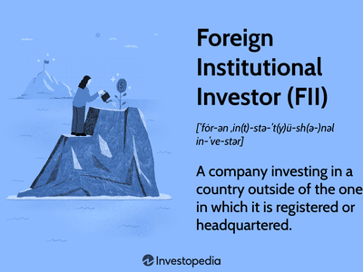

In today’s rapidly evolving financial landscape, domestic investors are increasingly looking for opportunities to diversify their portfolios beyond national borders. Globalization and technological advancements have fundamentally transformed investment paradigms, prompting investors to reconsider the traditional boundaries of domestic investing. The rising interest in international markets is driven largely by the pursuit of diversification, which helps mitigate risks associated with economic fluctuations and geopolitical tensions inherent within any single market.

The emergence of programs like the Qualified Domestic Institutional Investor (QDII) has been pivotal in facilitating this international investment strategy. First introduced in China in 2006, the QDII program allows institutional investors, such as insurance companies, banks, and mutual funds, to invest in foreign securities markets. This initiative has opened a channel for large domestic investors to explore overseas opportunities, thereby broadening their investment horizons and accessing global economic growth.



Simultaneously, algorithmic trading has gained substantial traction in the financial industry, offering domestic investors advanced tools to refine their investment strategies within QDII programs. Algorithmic trading leverages computer algorithms to automate trading decisions and execution, enabling higher speed and precision while minimizing human error and emotional bias. This form of trading facilitates the analysis of vast volumes of market data, identification of trading patterns, and real-time execution of trades, aligning with the complex requirements of QDII investment.

This article explores the relationship between domestic investors, QDII, and algorithmic trading, highlighting both the advantages and challenges associated with these innovations. By integrating algorithmic trading with QDII programs, investors can optimize portfolio performance, manage risks, and potentially enhance returns. However, this fusion also presents challenges, such as technical complexities and regulatory compliance, which necessitate careful consideration and strategic planning.

Ultimately, this discussion will guide domestic investors on how to effectively leverage QDII and algorithmic trading to achieve enhanced returns and robust portfolio diversification. As the financial landscape continues to evolve, staying informed and adopting innovative investment strategies will be crucial for sustaining growth and capitalizing on global market opportunities.

## Table of Contents

## Understanding QDII: A Gateway to Global Markets

Qualified Domestic Institutional Investor (QDII) is a program introduced in China in 2006, designed to grant domestic institutional entities the ability to invest in foreign securities. The primary motivation behind its establishment was to facilitate outbound investments and diversify investment portfolios, allowing Chinese investors to mitigate risks associated with the domestic market by exploring global opportunities.

Participation in QDII programs is typically open to a broad array of financial institutions including insurance companies, banks, trust companies, funds, and securities firms. To qualify, these entities must secure approval from the State Administration of Foreign Exchange (SAFE) and are allocated an investment quota that dictates the scope of their foreign investment capacity. This regulatory framework ensures that investments align with China's broader economic policies and financial stability goals. Each participant is subject to certain eligibility criteria and compliance requirements, safeguarding both the investors and the economic interests of the country.

QDII programs offer access to a diverse range of international financial instruments and markets. Investors can engage with global equities, fixed income securities, and various derivatives markets. This spectrum of investment opportunities not only allows participants to enhance their portfolios with geographical diversification but also positions them to capitalize on prevalent growth trends and developments across different economic environments. Such diversification is a strategic tool for optimizing returns and minimizing risk exposure to any single market or economic [factor](/wiki/factor-investing).

By using QDII, domestic institutional investors can break geographical barriers to tap into higher-yielding markets, obtain exposure to industries not prevalent locally, and distribute risk across a wider array of economic conditions. As China's economy continues to integrate with global financial systems, QDII remains a vital conduit for aligning domestic investment strategies with global investment landscapes, reinforcing its role as a cornerstone in international market participation for Chinese institutions.

## Algorithmic Trading: Revolutionizing Investment Strategies

Algorithmic trading utilizes sophisticated computer algorithms to automate trading decisions and execution processes in financial markets. This method significantly enhances the speed and efficiency of trades, offering several advantages over traditional trading methods. One of the key benefits is the reduction of human error and the mitigation of emotional biases, which often influence manual trading decisions. By relying on predefined instructions to execute trades, [algorithmic trading](/wiki/algorithmic-trading) ensures consistent decision-making based on analytical data rather than human intuition.

The application of algorithms enables domestic investors to process and analyze vast amounts of market data — far beyond human capabilities — thus identifying market trends and patterns with increased accuracy. This ability to swiftly execute trades in response to market conditions empowers investors to react to opportunities and risks more effectively.

Several algorithmic trading strategies have been developed to cater to different market conditions and investment goals. Popular strategies include:

1. **Arbitrage**: This involves exploiting price differences of the same asset in different markets. Algorithms can rapidly identify these discrepancies and execute simultaneous buy and sell orders to capitalize on the differential.

2. **Market Making**: Algorithms continuously quote buying and selling prices to capture spreads in volatile markets. By providing liquidity, they enable smoother market operations and potentially capture profits from the bid-ask spread.

3. **Trend Following**: This strategy involves algorithms identifying long-term market movements and trends, entering trades consistent with these trends, and exiting positions as the trends show signs of reversal.

4. **Statistical Arbitrage**: This involves using mathematical models to identify and exploit statistical mispricings between securities. Complex statistical algorithms analyze historical data to predict future price movements based on statistical relationships.

The integration of [artificial intelligence](/wiki/ai-artificial-intelligence) (AI) and [machine learning](/wiki/machine-learning) has further transformed algorithmic trading by enhancing the decision-making capabilities of algorithms. With these technologies, algorithms can dynamically learn and adapt to new market conditions, constantly refining their strategies based on historical data and real-time inputs. Machine learning models can identify nuanced patterns and correlations in market data, leading to more informed trading decisions.

For instance, given a historical dataset of stock prices, a machine learning model can be trained to predict future price movements. The following Python code snippet illustrates how one might use a simple machine learning model for such purposes using the `scikit-learn` library:

```python
from sklearn.model_selection import train_test_split
from sklearn.ensemble import RandomForestRegressor
import pandas as pd

# Load historical market data
data = pd.read_csv('market_data.csv')

# Feature extraction and preprocessing
features = data[['Open', 'High', 'Low', 'Volume']]
target = data['Close']

# Split data into training and test sets
X_train, X_test, y_train, y_test = train_test_split(features, target, test_size=0.2, random_state=42)

# Train a RandomForestRegressor model
model = RandomForestRegressor(n_estimators=100, random_state=42)
model.fit(X_train, y_train)

# Predict future prices using the test set
predictions = model.predict(X_test)
```

In summary, algorithmic trading has revolutionized investment strategies by introducing sophisticated techniques that provide speed and accuracy. The ability to analyze immense data volumes and execute trade strategies efficiently offers domestic investors leveraging QDII programs improved opportunities for enhanced returns on a global scale.

## How QDII and Algorithmic Trading Complement Each Other

QDII programs and algorithmic trading collectively provide a powerful framework for domestic investors seeking to maximize their presence in global financial markets. The Qualified Domestic Institutional Investor (QDII) scheme allows investors to access a variety of international markets, including equities, fixed income, and derivatives. Algorithmic trading complements the QDII framework by dynamically optimizing trading strategies, thereby enhancing the efficiency and responsiveness of international investments.

Automated trading strategies can rapidly adapt to fluctuations in global markets. This is critical for domestic investors who must navigate international markets that may possess distinct regulatory environments, trading hours, and market behaviors compared to their home markets. Algorithm-driven approaches are capable of assessing large volumes of data and reacting to market shifts with speed and precision that human traders may struggle to match.

In the context of QDII, algorithms can be custom-designed to adhere to specific regulatory requirements and align with particular investment objectives. This customization ensures that automated trading strategies are not only efficient but also compliant and goal-oriented. For example, algorithms can be coded to respect the investment quotas set by the State Administration of Foreign Exchange (SAFE) while simultaneously adjusting strategies in real-time based on market conditions or asset performance.

Moreover, algorithmic trading facilitates more effective risk management by enabling diversification across various markets and asset classes. Algorithms can quickly identify and exploit [arbitrage](/wiki/arbitrage) opportunities or adjust portfolio allocations to hedge against potential downturns in specific sectors or geographical regions. Such strategic diversification is a fundamental advantage provided by the intersection of QDII access and algorithmic methods.

Lastly, the combination of QDII programs and algorithmic trading allows investors to maximize potential returns while prudently managing risks. Through automated and efficient market interactions, investors lay the groundwork for constructing robust, globally diversified portfolios that can weather market [volatility](/wiki/volatility-trading-strategies) and capitalize on growth opportunities internationally. This results in a sophisticated investment strategy capable of yielding superior returns over time.

## Challenges and Considerations in Algorithmic Trading and QDII

Algorithmic trading has transformed investment strategies with its ability to process large volumes of data and execute trades at high speeds. However, these advantages come with inherent challenges that investors must navigate carefully to optimize their outcomes when participating in Qualified Domestic Institutional Investor (QDII) programs.

One primary challenge in algorithmic trading is the risk of technical failures. These systems depend heavily on advanced infrastructure and technology to function. A minor glitch in the system, a delay in processing data, or an unexpected hardware malfunction can lead to significant financial losses. Therefore, investors must prioritize the establishment and maintenance of reliable, high-performance infrastructure. Ensuring redundancy and real-time monitoring of systems can help detect and mitigate problems before they become critical.

Market volatility also poses a significant challenge for algorithmic traders. While algorithms can swiftly adjust to volatile market conditions, extreme fluctuations can lead to erratic behavior of trading models. Robust risk management frameworks are essential in mitigating potential losses from such instances. Investors should develop strategies that can quickly adapt to varying market climates while maintaining a keen focus on real-time data analysis and dynamic capital allocation.

Compliance with international regulations is another complex aspect that investors must consider when engaging in QDII. Each country has its regulatory framework governing foreign investments, which can differ significantly. Investors must thoroughly understand these regulations to avoid legal pitfalls and ensure smooth operational functioning. Partnering with local regulatory experts and leveraging compliance software can facilitate this process.

Staying updated with the latest technological advancements and regulatory changes is imperative for success in algorithmic trading and QDII. Investors should prioritize continuous learning and adaptation, leveraging cutting-edge technologies such as artificial intelligence and machine learning. Regularly updating and testing algorithms can enhance their effectiveness and resilience against rapidly evolving market conditions and regulatory environments.

Maintaining data integrity is central to effective algorithmic trading, especially in diverse international markets accessed through QDII. This involves not only securing data against unauthorized access but also ensuring the accuracy and consistency of data used for making trading decisions. Implementing stringent cybersecurity measures and data validation protocols is critical for protecting sensitive information and maintaining the reliability of trading strategies.

In summary, while algorithmic trading and QDII offer considerable opportunities, navigating these complexities requires a strategic approach. Investors must integrate robust technological infrastructure, adhere to rigorous compliance standards, and implement comprehensive risk management strategies to maximize their investment potential.

## Best Practices for Domestic Investors in QDII and Algorithmic Trading

Domestic investors interested in participating in Qualified Domestic Institutional Investor (QDII) programs and utilizing algorithmic trading must adopt best practices to optimize their investments and mitigate associated risks. The following guidelines offer insights for making informed decisions and effectively harnessing these advanced investment avenues.

Thorough Research and Professional Advice: Prior to engaging in QDII and algorithmic trading, investors should undertake comprehensive research to understand the complexities and opportunities associated with international markets and algorithmic strategies. Engaging with financial advisors and industry experts can provide valuable guidance tailored to individual investment goals and risk appetites.

Diversification Strategy: Diversification is a cornerstone of sound investment management. Domestic investors should aim to spread their investments across various geographical regions and asset classes to reduce exposure to localized risks. Diversifying investments enhances the potential for stable returns by balancing the performance of different holdings within a portfolio.

Performance Reviews and Strategic Adjustments: Regular performance reviews are essential to evaluate the effectiveness of current investment strategies. Investors should systematically analyze their portfolios and make necessary adjustments to align with changing market conditions. This dynamic approach helps in capitalizing on emerging opportunities while averting potential losses.

Cybersecurity Measures: With the increasing reliance on digital platforms for trading, safeguarding sensitive data and trading systems has become paramount. Investors should invest in robust cybersecurity measures, including encryption, multi-factor authentication, and secure networks, to protect their assets from cyber threats and unauthorized access.

Continuous Learning: Staying informed about the latest developments in financial markets and technology is crucial for maintaining a competitive edge in global investments. Domestic investors should commit to lifelong learning, attending workshops, webinars, and training programs to enhance their understanding of market trends, regulatory changes, and evolving technologies.

By implementing these best practices, domestic investors can enhance their ability to navigate the complexities of international investments and algorithmic trading, ultimately leading to more robust and resilient portfolios.

## Conclusion

Domestic investors are currently presented with unparalleled opportunities to broaden their investment scope through Qualified Domestic Institutional Investor (QDII) programs and algorithmic trading. These avenues allow investors to transcend geographical limitations and engage with global markets, fostering enhanced diversification and potentially greater returns. By capitalizing on technological advancements and the ability to access foreign securities, investors are well-positioned to mitigate risks associated with domestic market volatility.

However, navigating the international investment landscape is not without its challenges. It requires a strategic approach that combines robust risk management with an acute awareness of global market dynamics and regulatory frameworks. Investors must embrace flexibility and adaptability in their strategies to overcome the intricacies of cross-border investments and technological shifts. This adaptability is crucial for effectively utilizing the sophisticated tools available in algorithmic trading, which can optimize trade execution, data analysis, and strategic alignment with regulatory requirements.

QDII and algorithmic trading thus serve as powerful assets for well-informed investors committed to expanding their investment portfolios and seeking out new financial growth opportunities. As the investment landscape continues to evolve, the ability to stay informed about technological advancements and regulatory changes cannot be overstated. This continuous learning, coupled with strategic foresight, will be critical for domestic investors aiming to leverage these tools effectively.

Ultimately, by embracing the opportunities afforded by QDII and algorithmic trading, domestic investors can take significant strides toward securing future financial success. These methodologies empower investors to enrich their portfolios, enhance returns, and navigate the complexities of global investment with competence and confidence.

## References & Further Reading

[1]: Bergstra, J., Bardenet, R., Bengio, Y., & Kégl, B. (2011). ["Algorithms for Hyper-Parameter Optimization."](https://papers.nips.cc/paper/4443-algorithms-for-hyper-parameter-optimization) Advances in Neural Information Processing Systems 24.

[2]: ["Advances in Financial Machine Learning"](https://www.amazon.com/Advances-Financial-Machine-Learning-Marcos/dp/1119482089) by Marcos Lopez de Prado

[3]: ["Evidence-Based Technical Analysis: Applying the Scientific Method and Statistical Inference to Trading Signals"](https://www.amazon.com/Evidence-Based-Technical-Analysis-Scientific-Statistical/dp/0470008741) by David Aronson

[4]: ["Machine Learning for Algorithmic Trading"](https://github.com/stefan-jansen/machine-learning-for-trading) by Stefan Jansen

[5]: ["Quantitative Trading: How to Build Your Own Algorithmic Trading Business"](https://www.amazon.com/Quantitative-Trading-Build-Algorithmic-Business/dp/1119800064) by Ernest P. Chan