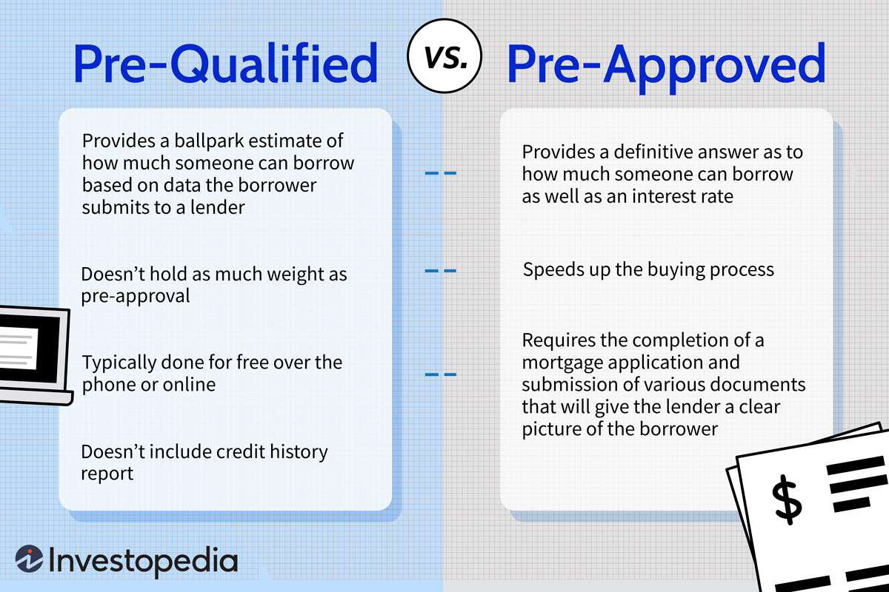

A Qualified Eligible Participant (QEP) is a designation in the financial industry that identifies individuals or entities as having a sophisticated understanding and capability to engage in complex investment activities. This status is particularly vital for accessing advanced financial instruments and markets that are generally closed to ordinary investors due to their inherent complexities and risks. QEPs, therefore, play a crucial role in the financial ecosystem by contributing to liquidity and promoting market efficiency through their participation in sophisticated financial transactions.

The significance of being classified as a QEP lies in the access it grants to specialized investment vehicles such as hedge funds, commodity pools, and algorithmic trading strategies. These investment options often involve intricate financial instruments that require a deep understanding of market dynamics and potential risks. As such, QEPs are typically experienced investors who meet specific regulatory requirements, including substantial assets and a robust history of managing investments. The ability to participate in these high-risk/high-reward opportunities allows QEPs to diversify their portfolios and pursue potentially lucrative returns that are beyond the reach of non-qualified investors.



This article aims to provide a comprehensive exploration of the role and requirements for QEPs within the investment landscape. It begins with a detailed understanding of what QEPs are and how they differ from other investor categories. The piece will further outline how these participants become eligible to engage in advanced investment strategies, particularly focusing on their involvement in algorithmic trading, a domain requiring exceptional precision and compliance with regulatory standards. Additionally, it will address the regulatory considerations surrounding QEPs, highlighting the oversight provided by entities such as the Commodity Futures Trading Commission (CFTC) and the National Futures Association (NFA). Finally, the article will compare investment opportunities available to QEPs versus non-QEPs, concluding with insights into the advantages of attaining QEP status for eligible investors.

## Table of Contents

## Understanding Qualified Eligible Participants (QEPs)

A Qualified Eligible Participant (QEP) is a regulatory classification within the financial industry, primarily associated with the Commodity Futures Trading Commission (CFTC) and defined under Rule 4.7 of the Commodity Exchange Act (CEA). This classification is intended to identify sophisticated investors who possess the requisite knowledge, financial acumen, and resources to engage in complex financial markets, including commodity pools, futures, and hedge funds. 

**Characteristics of QEPs**

QEPs are characterized by their significant financial experience and capacity to absorb higher levels of financial risk compared to average retail investors. Typically, they hold substantial assets and have considerable expertise or professional backgrounds in dealing with sophisticated financial products. This status enables them to access advanced investment opportunities that are beyond the reach of non-QEP investors.

**Regulatory Framework Under Rule 4.7**

Rule 4.7 of the CEA establishes the regulatory framework that delineates the eligibility criteria and privileges associated with QEPs. This rule allows for reduced disclosure and reporting requirements when dealing with QEPs, assuming their sophistication mitigates the necessity for detailed regulatory protections applicable to less experienced investors. The rationale is that QEPs, given their financial prowess and understanding, do not require the same level of protection and can manage their investments with more autonomy and flexibility.

**Comparison with Accredited Investors**

While QEPs and accredited investors share the common ground of being recognized as sophisticated market participants, key differences exist between the two classifications. Accredited investors are defined under the Securities Act of 1933, mainly focusing on income and net worth criteria to determine their ability to participate in certain investment opportunities, such as private equity or venture capital.

QEP status, meanwhile, often demands more stringent criteria, including specific financial experience and an understanding of particular markets or instruments, beyond mere income or net worth. Furthermore, while accredited investors can access a broad range of private investment opportunities, QEPs are specifically oriented towards derivatives and commodity-related markets. 

The classification of QEPs is pivotal in ensuring that only those investors who are truly capable of understanding complex financial instruments and managing high-risk investments gain access to these markets. This helps maintain a balance between investor protection and capital market efficiency, promoting a safe and equitable financial environment.

## Investment Eligibility for QEPs

Qualified Eligible Participants (QEPs) play a pivotal role in the investment landscape, particularly due to their ability to access sophisticated investment vehicles that often entail higher risks and rewards. To qualify as a QEP, certain stringent criteria and requirements must be fulfilled, ensuring that only those with substantial financial and investment acumen benefit from the privileges associated with this status.

### Criteria and Requirements for a QEP

According to the Commodity Exchange Act (CEA) and the CFTC Rule 4.7, an individual must meet specific financial and professional standards to be recognized as a QEP. These standards are in place to verify the participant's capability and preparedness to engage in high-stakes financial markets. The primary criteria include:

1. **Substantial Asset Ownership**: A QEP must have a substantial amount of invested capital, reflecting their ability to sustain potential losses and their familiarity with complex investment instruments. This requirement is typically quantified by a minimum threshold of net worth or assets under management (AUM).

2. **Experience with Complex Financial Instruments**: Individuals must demonstrate prior experience with sophisticated financial instruments such as futures contracts, hedge funds, swaps, or other derivative products. This experience ensures that the participant is well-versed in navigating the complexities and volatilities inherent in these markets.

3. **Professional Qualifications**: In some cases, professional qualifications such as being a registered broker-dealer or serving as a principal in a company engaged in similar investments can bolster an individual's eligibility. This reflects not only practical investment experience but also a deeper understanding of market dynamics and regulatory compliance.

### Importance of Assets and Experience

The need for substantial assets and experience underscores the heightened risk associated with the investment opportunities available to QEPs. These investments, often involving [algorithmic trading](/wiki/algorithmic-trading) and other sophisticated strategies, can offer high rewards but equally significant risks. The capacity to manage and absorb potential market downturns is crucial, as is the knowledge to make informed decisions in complex scenarios.

### Role of QEPs in High-Risk/High-Reward Investments

QEPs hold a distinctive position in accessing and capitalizing on high-risk/high-reward investments. They often influence market dynamics through their dealings in hedge funds, private placements, and various derivatives markets. By virtue of their qualifying status, QEPs contribute significantly to market [liquidity](/wiki/liquidity-risk-premium) and innovation, often venturing into emerging investment strategies and technologies that non-qualified investors cannot access.

Their strategic investments can lead to substantial gains, while also advancing the development of complex financial products. However, this sphere of high-stake opportunities necessitates a profound understanding of sophisticated trading mechanisms and a robust infrastructure for risk management.

In conclusion, achieving QEP status is not merely a marker of financial wealth but indicative of an investor's comprehensive understanding of advanced financial instruments and their associated risks. This status not only enhances one's investment portfolio potential but also supports the evolution and sophistication of global financial markets.

## QEPs in Algorithmic Trading

Qualified Eligible Participants (QEPs) play a significant role in algorithmic trading due to their capability to access sophisticated financial markets and instruments. Algorithmic trading involves the use of computer algorithms to automatically make trading decisions, typically based on multiple variables such as price, timing, and [volume](/wiki/volume-trading-strategy). QEPs, with their advanced financial acumen and resources, are well-positioned to capitalize on these technologies.

### Engagement in Algorithmic Trading

QEPs engage in algorithmic trading by leveraging advanced computational tools and strategies to optimize their trading performance. These participants typically work with quantitative models that can process large datasets to identify market patterns and execute trades at speeds unreachable by human traders. This form of trading often requires the integration of various programming languages, including Python, known for its comprehensive libraries like NumPy and pandas that facilitate data analysis.

For instance, a basic example in Python for calculating a moving average, which could be part of an algorithmic trading strategy, is as follows:

```python
import pandas as pd

# Assuming 'data' is a pandas DataFrame with a 'price' column
data['moving_average'] = data['price'].rolling(window=20).mean()
```

This snippet calculates the 20-period moving average of a price series, which could serve as an indicator for trading decisions.

### Benefits and Risks

Algorithmic trading presents several benefits for QEPs, including increased trading efficiency, reduced emotional bias, and the ability to execute complex strategies swiftly. The automation provided by algorithms allows QEPs to exploit market inefficiencies and implement high-frequency trading strategies that capture marginal price movements.

However, algorithmic trading is not without risks. The reliance on technology makes it vulnerable to system failures, and the high speed of trades can amplify losses. Additionally, algorithms may exhibit unintended behaviors if not thoroughly tested across various market conditions. The "flash crash" of May 2010 is a notable example of how algorithmic trading can exacerbate market [volatility](/wiki/volatility-trading-strategies).

### Compliance and Risk Management

Compliance and effective risk management are crucial for QEPs engaged in algorithmic trading. Regulatory bodies such as the Commodity Futures Trading Commission (CFTC) and the National Futures Association (NFA) have set forth guidelines to ensure transparency and accountability in trading practices.

To comply with these regulations, QEPs often implement rigorous back-testing of algorithms to evaluate performance under historical market data. This process involves using past market data to test the strategy's effectiveness and resilience:

```python
# Example of a simple back-testing setup
def backtest_strategy(data, buy_threshold, sell_threshold):
    position = 0  # No position
    for index, row in data.iterrows():
        if row['indicator'] > buy_threshold and position == 0:
            # Buy
            position = 1
        elif row['indicator'] < sell_threshold and position == 1:
            # Sell
            position = 0
```

Moreover, QEPs adopt sophisticated risk management protocols, such as setting stop-loss limits and diversifying their trading positions across various asset classes to mitigate the potential for catastrophic losses. Continuous monitoring of algorithm performance and market conditions is also essential to ensure strategies remain effective and do not contravene any legal frameworks.

By understanding and navigating these complexities, QEPs can harness the full potential of algorithmic trading while managing the inherent risks to optimize their investment outcomes.

## Regulatory Considerations for QEPs

Qualified Eligible Participants (QEPs) operate within a framework of regulations designed to ensure that their activities in the financial markets are conducted with due diligence and integrity. The primary regulatory bodies overseeing QEP activities are the Commodity Futures Trading Commission (CFTC) and the National Futures Association (NFA).

The CFTC establishes guidelines and rules to regulate the derivatives markets, which include futures and options contracts. According to the Commodity Exchange Act (CEA), Rule 4.7 sets forth the standards by which certain participants in these markets, such as QEPs, can be distinguished from the general public. This provision effectively reduces some regulatory demands on QEPs, under the assumption that they possess the requisite financial acumen and resources to manage complex investment strategies responsibly.

The NFA, a self-regulatory organization for the U.S. derivatives industry, complements the CFTC’s role by enforcing compliance among its members, which include commodity pool operators and commodity trading advisors catering to QEPs. The NFA's regulations are specifically aimed at maintaining market integrity and protecting participants from fraud and unethical practices. Members are required to adhere to stringent reporting and recordkeeping requirements, and they must implement robust risk management protocols.

The regulatory framework impacts the strategies and opportunities available to QEPs by allowing greater flexibility in investment approaches compared to non-QEPs. This may include more latitude in leveraging investments, accessing complex financial products, and engaging in sophisticated trading strategies, such as algorithmic trading. However, with these opportunities comes an increased responsibility to remain compliant with the regulatory standards set forth by the CFTC and NFA.

Non-compliance with these regulations can lead to severe consequences for QEPs, including penalties, fines, and bans from market participation. Furthermore, breaches in compliance damage reputations and can lead to legal actions, which might incur substantial financial losses. Therefore, adherence to CFTC and NFA regulations is not only a legal obligation but also a critical step in ensuring sustainable investment operations.

In summary, the regulatory landscape for QEPs is designed to balance market innovation with investor protection. It requires QEPs to be diligent, transparent, and responsible in their trading activities, fostering an environment where advanced investment strategies can be pursued within a structured and secure framework.

## Comparing QEPs and Non-QEPs

Qualified Eligible Participants (QEPs) and non-QEP investors experience markedly different landscapes in terms of investment opportunities and risk exposures. QEPs, due to their eligibility, have access to a broader array of complex investment vehicles which are not available to non-QEPs. This access is primarily due to the regulatory framework designed to protect less sophisticated investors from high-risk investments.

### Investment Opportunities and Risk Exposure

QEPs are often granted the privilege to engage in investment strategies involving hedge funds, commodity pools, and other sophisticated financial products. These vehicles often entail high degrees of leverage and complex derivatives structures, which can offer significantly higher returns – but also entail greater risk. The Commodity Exchange Act (CEA) Rule 4.7 recognizes the sophistication and financial stability of QEPs, allowing them to partake in these high-stakes markets which are otherwise restricted.

In contrast, non-QEP investors are limited to regulated products with more stringent disclosures, such as mutual funds, designed to protect them from potential adverse outcomes due to uncertainty or leveraged positions. This difference in exposure has significant implications; non-QEPs are often shielded from substantial risks, whereas QEPs must have the capability and knowledge to manage and assume such risks.

### Rights and Protections

The rights and protections afforded to QEPs and non-QEPs also differ substantially. QEPs, considered knowledgeable investors, are presumed to have the financial acumen and resources to evaluate sophisticated investments critically. As such, regulatory bodies impose fewer protections on QEP-targeted investments, leaving QEPs more vulnerable to potential fraud or mismanagement.

Non-QEPs enjoy more robust protective measures, including comprehensive disclosure requirements and certain investor rights, ensuring transparency and reducing information asymmetry. For instance, investments available to non-QEPs are often subject to strict limits on derivatives exposure to protect against excessive risk-taking.

### Advantages for QEPs

Being a QEP offers significant advantages for those qualified to navigate the landscape. The potential to engage in lightly regulated investment opportunities allows QEPs to pursue what might be lucrative, albeit risky, strategies. These can include algorithmic trading, as discussed in other sections, which exploits market inefficiencies that less experienced investors might not recognize.

The ability to diversify and balance portfolios with alternative investments is another key benefit—spreading portfolio risk through varied asset classes may enhance a QEP's risk-return profile. Moreover, access to early-stage venture capital and private equity opportunities through QEP-qualified funds can result in substantial long-term gains if the selections align with market trajectories.

In summary, the distinction between QEPs and non-QEP investors is primarily grounded in the level of financial sophistication and the consequent range of accessible investment strategies. While QEPs operate in a realm of potential high rewards, they must rigorously manage the associated risks, guided by their financial expertise, to leverage the unique opportunities this status affords.

## Final Thoughts

Qualified Eligible Participant (QEP) status is of paramount significance in the financial and investment landscape. It acts as a gateway, granting experienced investors access to sophisticated and potentially lucrative investment vehicles that are typically unavailable to the general public. The financial sophistication required for QEP status ensures that only individuals or entities with a robust understanding of complex financial instruments, such as futures and hedge funds, and a substantial asset base, can participate in high-stakes investment opportunities.

The rationale behind this exclusivity is to protect less experienced investors from potential high-risk exposures and to maintain the integrity of the financial markets. By filtering participants through strict qualification criteria, the market ensures that only those capable of mitigating and managing complex risks can access these investments. This selectiveness not only protects investors but also contributes to the stability and efficiency of the financial system.

For individuals and entities that meet these criteria, attaining QEP status can significantly expand their investment horizons. It enables them to diversify their portfolios with high-risk/high-reward assets and strategies, which could lead to superior returns compared to conventional investment avenues. With the rapidly evolving landscape of financial technology and algorithmic trading, being a QEP also means staying at the forefront of innovation in investment strategies and market opportunities.

The pursuit of QEP status thus presents a strategic decision for qualified investors aiming to leverage advanced financial instruments and strategies. Beyond the immediate financial benefits, it represents a commitment to financial education and ongoing investment in one's financial acumen. Therefore, qualified individuals and entities are encouraged to seek this status to harness the extensive opportunities it offers while making informed, strategic investment decisions.

## QEP FAQs

**QEP FAQs**

**Answers to common questions about qualifying as a QEP:**

1. **What is a Qualified Eligible Participant (QEP)?**
   A QEP is an investor classification defined by the Commodity Exchange Act (CEA) under Rule 4.7. These investors are considered sophisticated enough to understand complex and higher-risk investment strategies, such as those involving futures, and are eligible to participate in exempt offerings by commodity pool operators (CPOs).

2. **What are the basic requirements to qualify as a QEP?**
   An individual typically needs to demonstrate substantial investment experience and hold significant financial assets. The criteria include:
   - Possessing a net worth exceeding $2 million.
   - Having invested on discretionary basis at least $2 million in specific regulated investments.
   - Being an "accredited investor," as defined by the Securities and Exchange Commission (SEC), but with higher thresholds.
   - Showing experience in complex financial markets.

3. **Why is QEP status important?**
   QEP status allows individuals access to specialized investment funds and strategies unavailable to non-qualified investors. This can involve high-risk, high-reward financial products such as hedge funds and certain private offerings.

4. **What benefits does a QEP enjoy compared to non-QEP investors?**
   - **Access to Advanced Strategies:** QEPs can invest in commodity pools and engage in sophisticated strategies like algorithmic trading.
   - **Reduced Regulatory Constraints:** While still under regulatory oversight, QEPs are often subject to fewer restrictions, allowing more investment freedom.
   - **Potential for Higher Returns:** By participating in high-risk investments, QEPs potentially achieve higher returns, although the risk of loss is also greater.

5. **How can one start the process to become a QEP?**
   Interested investors should consult with financial advisors or legal professionals to review their financial status and investment goals. If eligible, documentation that proves their qualifications, such as financial statements and investment portfolio details, will be necessary.

**Additional resources for potential QEPs to learn more and pursue qualification:**

- **Commodity Futures Trading Commission (CFTC):** The CFTC provides comprehensive guidelines and updates on rules affecting QEP status.
- **National Futures Association (NFA):** NFA's resources can help understand the implications and responsibilities of being a QEP.
- **Financial Advisors:** Consulting with professionals who specialize in investment for sophisticated clients can provide personalized guidance.
- **Legal Consultations:** Engaging with attorneys familiar with commodities law and financial regulations ensures clarity on compliance and requirements.

These resources can be instrumental for individuals considering QEP status to properly evaluate their eligibility and fully understand the benefits and risks involved.

## References & Further Reading

[1]: [Commodity Futures Trading Commission (CFTC) Website](https://www.cftc.gov/) - Official site providing comprehensive guidelines and updates on rules affecting Qualified Eligible Participant (QEP) status.

[2]: [National Futures Association (NFA) Website](https://www.nfa.futures.org/) - Resources to help understand the implications and responsibilities of being a Qualified Eligible Participant.

[3]: ["Commodity Exchange Act & Regulations."](https://www.cftc.gov/LawRegulation/CommodityExchangeAct/index.htm) - The legal framework governing the designation of Qualified Eligible Participants.

[4]: Lopez de Prado, M. (2018). ["Advances in Financial Machine Learning."](https://www.amazon.com/Advances-Financial-Machine-Learning-Marcos/dp/1119482089) Wiley.

[5]: Chan, E. P. (2009). ["Quantitative Trading: How to Build Your Own Algorithmic Trading Business."](https://github.com/ftvision/quant_trading_echan_book) Wiley.

[6]: Aronson, D. R. (2006). ["Evidence-Based Technical Analysis: Applying the Scientific Method and Statistical Inference to Trading Signals."](https://www.amazon.com/Evidence-Based-Technical-Analysis-Scientific-Statistical/dp/0470008741) Wiley.

[7]: Jansen, S. (2020). ["Machine Learning for Algorithmic Trading."](https://github.com/stefan-jansen/machine-learning-for-trading) Packt Publishing.

[8]: Bergstra, J., Bardenet, R., Bengio, Y., & Kégl, B. (2011). ["Algorithms for Hyper-Parameter Optimization."](https://dl.acm.org/doi/10.5555/2986459.2986743) Advances in Neural Information Processing Systems 24.