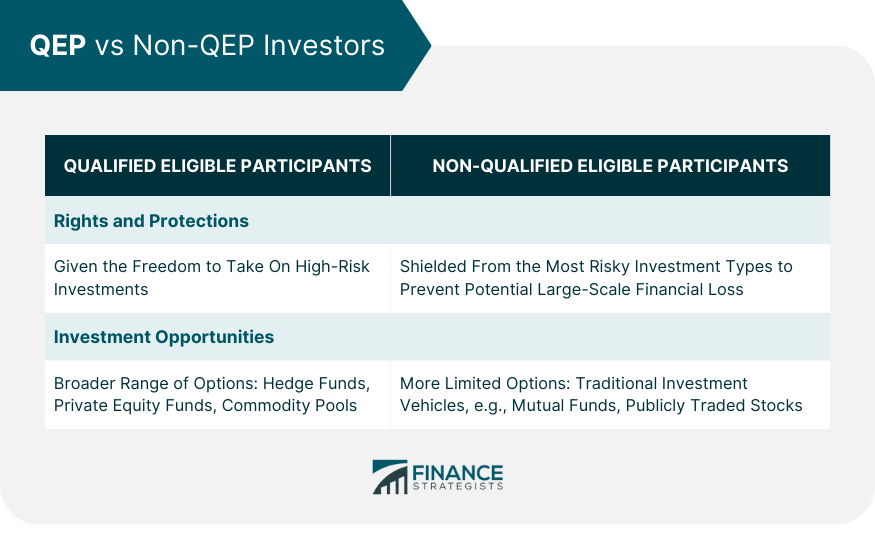

## Table of Contents

## What is a Qualified Eligible Participant (QEP)?

A Qualified Eligible Participant (QEP) is a type of investor who can invest in certain private investment funds that are not available to the general public. These funds are often referred to as commodity pools and are regulated by the Commodity Futures Trading Commission (CFTC). To be considered a QEP, an investor must meet specific financial and investment experience requirements set by the CFTC.

The requirements for becoming a QEP are designed to ensure that only investors with a certain level of financial sophistication and experience can participate in these potentially high-risk investments. For example, a QEP might need to have a certain amount of money invested in similar types of funds or have a certain level of income. This helps protect less experienced investors from the risks associated with these types of investments.

## What are the basic requirements to become a QEP?

To become a Qualified Eligible Participant (QEP), you need to meet certain financial and experience requirements set by the Commodity Futures Trading Commission (CFTC). One way to qualify is by having a significant amount of money invested in similar types of funds. For example, you might need to have at least $2 million in investments that you can sell easily, like stocks or bonds. Another way is if you are an investment professional, like a broker or an investment advisor, with a certain level of experience.

Another requirement could be based on your income. If you have earned a high income for the past two years and expect to earn the same or more this year, you might qualify as a QEP. For instance, you might need to have made at least $200,000 per year if you're single, or $300,000 if you're married. These rules are in place to make sure only people who understand the risks of these investments can participate.

## How does one qualify as a QEP under the Securities and Exchange Commission (SEC) rules?

The Securities and Exchange Commission (SEC) does not directly define what a Qualified Eligible Participant (QEP) is. Instead, the QEP definition comes from the Commodity Futures Trading Commission (CFTC). However, the SEC does have similar investor categories like the Accredited Investor, which has some overlap with the requirements for a QEP. If you're looking to invest in funds that require QEP status, you'll need to meet the CFTC's criteria, not the SEC's.

To become a QEP, you need to show that you have a good understanding of investing and enough money to handle the risks. This could mean having at least $2 million in investments that you can sell easily, like stocks or bonds. Or, if you're an investment professional, like a broker or an investment advisor, your experience might qualify you. Another way to qualify is by having a high income, like $200,000 per year if you're single, or $300,000 if you're married, for the past two years and expecting the same or more this year. These rules help make sure only people who know what they're doing can invest in these special funds.

## What types of investments are typically available to QEPs?

QEPs can invest in special funds called commodity pools. These funds are like big baskets where lots of different investments are put together. They often deal with things like futures contracts, which are agreements to buy or sell something at a future date. These investments can be risky but also have the chance to make a lot of money. Because of this, only people who know a lot about investing and have enough money to handle the risk can join these funds.

Another type of investment available to QEPs is private funds. These are funds that are not open to everyone and are usually managed by professionals. They might invest in things like real estate, private companies, or other special opportunities that regular investors can't easily access. These funds can also be risky, but they offer the chance for big returns. That's why only QEPs, who have the right experience and money, are allowed to invest in them.

## What are the benefits of being a QEP?

Being a QEP opens up a world of special investment opportunities that regular investors can't touch. These opportunities include commodity pools and private funds, which can be more risky but also have the potential for bigger rewards. Because QEPs have a good understanding of investing and enough money to handle the risks, they can take part in these special funds that might grow their money faster than regular investments.

Another benefit of being a QEP is the chance to work with professional fund managers who handle these special investments. These managers know a lot about the markets and can make smart choices about where to invest the money. This can help QEPs feel more confident about their investments and possibly see better results over time.

## How does the status of a QEP differ from that of an Accredited Investor?

A Qualified Eligible Participant (QEP) and an Accredited Investor are both types of investors that can access special investment opportunities, but they have different rules set by different agencies. A QEP is defined by the Commodity Futures Trading Commission (CFTC) and can invest in commodity pools, which are funds that deal with futures contracts and other complex investments. To become a QEP, you need to show that you have a lot of experience with investing and enough money to handle the risks, like having $2 million in investments or earning a high income.

On the other hand, an Accredited Investor is defined by the Securities and Exchange Commission (SEC). Accredited Investors can invest in private securities offerings, like startups or real estate deals, that are not available to the general public. To be an Accredited Investor, you need to have a net worth of over $1 million, not including your home, or have earned at least $200,000 per year ($300,000 if married) for the last two years and expect to earn the same or more this year. While there is some overlap in the financial requirements, the main difference is that QEPs focus on commodity pools and futures, while Accredited Investors focus on private securities.

## Can a QEP invest in private funds, and if so, what are the implications?

Yes, a QEP can invest in private funds. These funds are special because they are not open to everyone. They are managed by professionals who know a lot about investing in things like real estate, private companies, or other special opportunities. Because QEPs have shown they understand investing and have enough money to handle the risks, they are allowed to put their money into these private funds.

The implications of investing in private funds as a QEP are important to understand. These investments can be riskier than regular investments, but they also have the chance to make a lot more money. Because private funds are not as easy to sell quickly as stocks or bonds, QEPs need to be ready to keep their money in these funds for a longer time. This means they should be comfortable with the ups and downs of the market and be prepared to handle any losses that might come with these investments.

## What documentation is required to prove QEP status?

To prove you are a QEP, you need to show some papers that say you meet the rules set by the Commodity Futures Trading Commission (CFTC). These papers might include things like your bank statements, tax returns, or a letter from a financial advisor. The idea is to show that you have at least $2 million in investments that you can sell easily, or that you have made a lot of money, like $200,000 a year if you're single or $300,000 if you're married, for the past two years and expect to make the same or more this year.

If you are an investment professional, like a broker or an investment advisor, you might also need to show proof of your experience. This could be a license or a certificate that shows you have been working in the investment world for a while. All these papers help the people running the special funds know that you understand the risks and have the money to handle them.

## How can an individual or entity lose their QEP status?

An individual or entity can lose their QEP status if they no longer meet the financial or experience requirements set by the Commodity Futures Trading Commission (CFTC). This could happen if their investments drop below $2 million in value, or if their income falls below the required levels, like $200,000 a year if single or $300,000 if married. If they can't show that they still have enough money or the right experience, they won't be able to keep their QEP status.

Another way to lose QEP status is if there are changes in the rules or laws that make the requirements stricter. For example, if the CFTC decides that QEPs need more money or different kinds of experience, people who don't meet the new rules could lose their status. It's important for QEPs to keep an eye on any changes and make sure they still qualify under the new rules.

## What are the potential risks associated with investments available to QEPs?

Investing as a QEP can be exciting because you get to put your money into special funds like commodity pools and private funds. These funds can be riskier than regular investments because they often deal with things like futures contracts, which are agreements to buy or sell something at a future date. Futures can go up and down a lot, so if the market moves the wrong way, you could lose a lot of money quickly. Also, these special funds might invest in private companies or real estate, which can be hard to sell quickly if you need your money back fast.

Another risk is that these investments are not as easy to get out of as stocks or bonds. If you want to sell your investment in a private fund, it might take a long time to find someone to buy it. This means you need to be ready to keep your money in these funds for a while and be okay with not being able to use it right away. Because of these risks, it's really important for QEPs to understand what they're getting into and be prepared to handle any losses that might come their way.

## How do regulatory changes impact the criteria for QEPs?

Regulatory changes can shake things up for QEPs. If the rules change, the Commodity Futures Trading Commission (CFTC) might say that QEPs need more money or different kinds of experience to keep their status. For example, if the CFTC decides that QEPs need to have $3 million in investments instead of $2 million, some people might not qualify anymore. This means they wouldn't be able to invest in the special funds they used to.

These changes can happen because the government wants to make sure that only people who really understand the risks and have enough money to handle them can invest in these special funds. If the rules get stricter, it's to protect investors from losing too much money. QEPs need to keep an eye on any changes and make sure they still meet the new rules, or they could lose their QEP status and the chance to invest in those special funds.

## What advanced strategies can QEPs employ to optimize their investment portfolios?

QEPs can use some smart tricks to make their investment portfolios better. One way is to spread their money around in different kinds of investments, like stocks, bonds, and real estate. This is called diversification, and it helps lower the risk because if one investment goes down, the others might go up and balance things out. QEPs can also use something called leverage, which means borrowing money to invest more. This can make their profits bigger, but it can also make their losses bigger, so they need to be careful.

Another strategy QEPs can use is to pay close attention to the markets and make changes to their investments when things change. This is called active management. They might decide to sell some investments and buy others if they think the market is going to move in a certain way. QEPs can also use special tools like options and futures to protect their investments from big drops in the market. These tools can be complicated, but they can help QEPs make smarter choices and keep their money safer.

## References & Further Reading

[1]: [Commodity Futures Trading Commission (CFTC) Website](https://www.cftc.gov/) - Official site providing comprehensive guidelines and updates on rules affecting Qualified Eligible Participant (QEP) status.

[2]: [National Futures Association (NFA) Website](https://www.nfa.futures.org/) - Resources to help understand the implications and responsibilities of being a Qualified Eligible Participant.

[3]: ["Commodity Exchange Act & Regulations."](https://www.cftc.gov/LawRegulation/CommodityExchangeAct/index.htm) - The legal framework governing the designation of Qualified Eligible Participants.

[4]: Lopez de Prado, M. (2018). ["Advances in Financial Machine Learning."](https://www.amazon.com/Advances-Financial-Machine-Learning-Marcos/dp/1119482089) Wiley.

[5]: Chan, E. P. (2009). ["Quantitative Trading: How to Build Your Own Algorithmic Trading Business."](https://github.com/ftvision/quant_trading_echan_book) Wiley.

[6]: Aronson, D. R. (2006). ["Evidence-Based Technical Analysis: Applying the Scientific Method and Statistical Inference to Trading Signals."](https://www.amazon.com/Evidence-Based-Technical-Analysis-Scientific-Statistical/dp/0470008741) Wiley.

[7]: Jansen, S. (2020). ["Machine Learning for Algorithmic Trading."](https://github.com/stefan-jansen/machine-learning-for-trading) Packt Publishing.

[8]: Bergstra, J., Bardenet, R., Bengio, Y., & Kégl, B. (2011). ["Algorithms for Hyper-Parameter Optimization."](https://dl.acm.org/doi/10.5555/2986459.2986743) Advances in Neural Information Processing Systems 24.