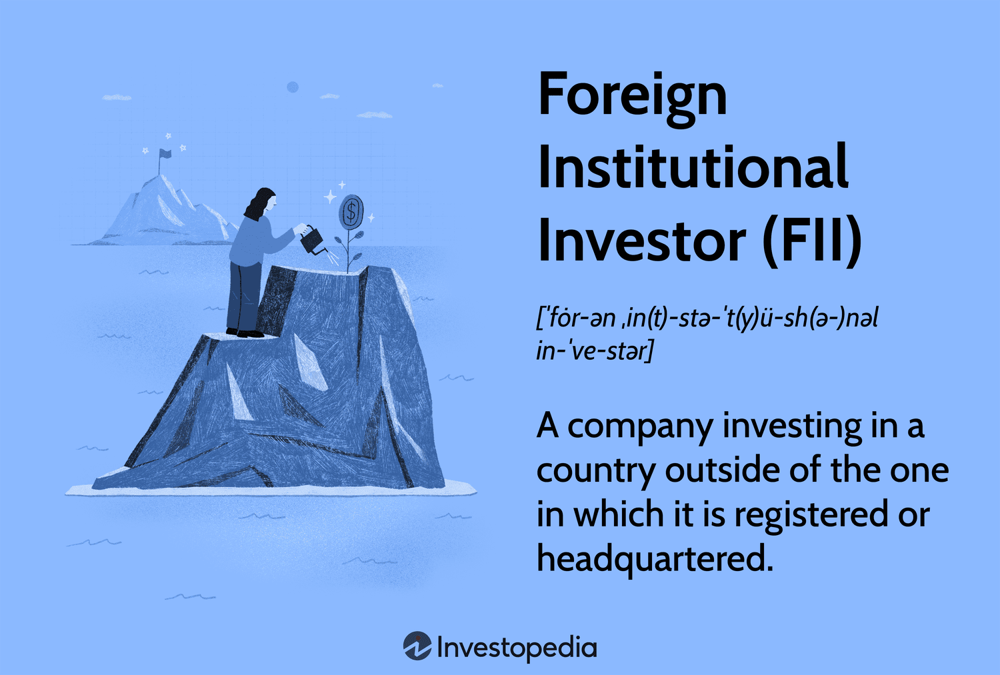

## Table of Contents

## What is a Qualified Foreign Institutional Investor (QFII)?

A Qualified Foreign Institutional Investor (QFII) is a program that allows certain foreign investors to invest in China's mainland stock markets. It was introduced by the Chinese government to slowly open up its financial markets to international investors. The program sets a quota for how much money each QFII can invest, which helps control the flow of foreign money into China's markets.

To become a QFII, an investor must meet certain requirements set by the Chinese regulators. These can include being a well-established financial institution with a good track record. Once approved, the QFII can buy and sell stocks, bonds, and other securities in China. This program has helped bring more foreign investment into China, which can help grow the economy and make the markets more global.

## What is the purpose of QFII regulations?

The purpose of QFII regulations is to control how much money from other countries can come into China's stock markets. By setting up rules and limits, the Chinese government can make sure that the markets stay stable and do not get too influenced by foreign money all at once. This helps protect the local economy and investors from big changes that could happen if a lot of foreign money came in quickly.

Another goal of the QFII regulations is to slowly open up China's financial markets to the rest of the world. By letting in foreign investors little by little, China can learn how to work with international markets better. This can help China's economy grow and become more connected with the global economy. Over time, this can make China's markets stronger and more attractive to investors from around the world.

## Which countries have implemented QFII regulations?

China is the main country that has used QFII regulations. They started this program to let foreign investors put money into their stock markets but with limits. This helps them keep their markets stable and slowly open up to the world.

Some other countries have looked at similar ideas, but China's QFII is the most well-known. These other places want to control foreign money coming in too, but they might call their programs different names or have different rules.

Overall, China's QFII program is the biggest example of this kind of regulation. It shows how a country can manage foreign investment to grow its economy while keeping things under control.

## How does one become a Qualified Foreign Institutional Investor?

To become a Qualified Foreign Institutional Investor (QFII), a foreign financial institution needs to meet certain rules set by the Chinese government. They need to be a well-known and trusted organization with a good history of following the law and managing money well. They also need to have enough money to invest. The institution must apply to China's regulators, like the China Securities Regulatory Commission (CSRC), and show that they meet all the requirements.

Once the application is approved, the QFII gets a quota, which is a limit on how much money they can invest in China's markets. This helps the Chinese government control how much foreign money comes in. The QFII can then buy and sell stocks, bonds, and other securities in China. They need to follow the rules and report what they are doing to make sure everything stays fair and open.

## What are the investment limits set by QFII regulations?

The QFII regulations set a limit on how much money each foreign investor can put into China's markets. This limit is called a quota. The Chinese government decides how big each quota is, and it can be different for each investor. The quota helps control the amount of foreign money coming into the country, so it doesn't cause big changes in the markets.

When a QFII gets their quota, they can use it to buy stocks, bonds, and other securities in China. They need to keep track of how much they are investing and make sure they don't go over their limit. If they want to invest more, they might need to ask for a bigger quota. This way, the Chinese government can keep an eye on how much foreign money is coming in and make sure the markets stay stable.

## How do QFII regulations affect foreign investment in a country's stock market?

QFII regulations help control how much money from other countries can come into a country's stock market. By setting limits, or quotas, on how much each foreign investor can invest, the government can make sure that the market stays stable. This means that foreign money doesn't come in too fast and cause big changes that could hurt the local economy. It's like having a gate that lets in only a certain amount of people at a time, so the place doesn't get too crowded.

These regulations also help a country slowly open up its markets to the rest of the world. By letting in foreign investors little by little, the country can learn how to work with international markets better. This can help the country's economy grow and become more connected with the global economy. Over time, this can make the country's markets stronger and more attractive to investors from around the world, bringing in more money and helping the economy grow even more.

## What are the key differences between QFII and other foreign investment schemes like RQFII?

QFII and RQFII are both ways for foreign investors to put money into China's markets, but they have some important differences. QFII, or Qualified Foreign Institutional Investor, lets investors use any currency to invest in China. On the other hand, RQFII, or Renminbi Qualified Foreign Institutional Investor, only lets investors use the Chinese currency, called the Renminbi or Yuan, to invest. This means that with RQFII, investors need to get Yuan first before they can invest, which can be more complicated.

Another difference is where the investors come from. QFII is open to investors from all over the world, while RQFII is mostly for investors from certain places, like Hong Kong, Singapore, and other areas where the Yuan is used a lot. Both programs help China control how much foreign money comes into its markets, but they do it in different ways. QFII helps bring in a wider range of foreign money, while RQFII focuses on money from places that already use the Yuan.

## How have QFII regulations evolved over time in major markets like China?

QFII regulations in China have changed a lot since they started in 2002. At first, the rules were very strict, and only a few big investors could join. The quotas, which are the limits on how much money investors can put in, were small too. But as time went on, China saw that letting in more foreign money could help its markets grow. So, they started to loosen the rules. They made the quotas bigger and let more types of investors join the program. This helped more money come into China's markets and made them more connected to the world.

Over the years, the Chinese government kept making changes to the QFII rules to make them better. They wanted to make it easier for foreign investors to put money in China while still keeping the markets stable. One big change was in 2019 when they got rid of the quotas completely. This meant that foreign investors could put in as much money as they wanted, as long as they followed the other rules. These changes show how China is slowly opening up its markets more and more to the rest of the world.

## What are the compliance requirements for QFIIs?

QFIIs have to follow a lot of rules to make sure they are investing the right way in China's markets. They need to report what they are doing to the Chinese regulators, like the China Securities Regulatory Commission (CSRC). This means telling them how much money they are investing, what they are buying and selling, and making sure they don't go over their quota. They also need to follow China's laws and rules about investing, which can be different from what they are used to in their own countries.

Another important part of being a QFII is keeping good records and being open about what they are doing. They need to have clear and honest reports that show where their money is going and how they are making their investment choices. This helps make sure that everything is fair and that they are not doing anything wrong. If they break the rules, they could lose their QFII status and not be allowed to invest in China anymore.

## How do QFII regulations impact the repatriation of funds?

QFII regulations in China have rules about how investors can take their money back out of the country. When investors want to move their money out, they need to follow certain steps and get permission from the Chinese government. This is called repatriation, and it helps the government keep an eye on how much money is leaving the country. By controlling this, they can make sure that the markets stay stable and that a lot of money doesn't leave all at once.

Before 2016, QFIIs had to wait a long time to take their money out, sometimes up to a year. But the rules have changed over time to make it easier. Now, QFIIs can take out their money more quickly, usually within a few days or weeks. This change has made it more attractive for foreign investors to put money into China's markets because they know they can get their money back when they need it. Even with these changes, QFIIs still need to report what they are doing and follow the rules to make sure everything is fair and open.

## What are the risks associated with investing through a QFII?

Investing through a QFII can come with some risks. One big risk is that the rules in China can change. The government might decide to make the rules stricter or change how much money investors can take out of the country. This can make it hard for investors to plan and can affect how much money they make or lose. Another risk is that the Chinese market can be different from what investors are used to. The way the market works and the rules about what investors can do might be new and hard to understand, which can lead to mistakes.

Another risk is that the value of the Chinese currency, the Yuan, can go up and down. If the Yuan gets weaker compared to the investor's home currency, they might lose money when they change it back. Also, because QFIIs have to follow strict rules and report what they are doing, there is a risk that they might make a mistake and break a rule. If this happens, they could get in trouble with the Chinese government and lose their right to invest in China. So, while QFII can be a good way to invest in China, it's important for investors to know these risks and be ready for them.

## How do QFII regulations influence global investment strategies?

QFII regulations in China can change how investors from other countries plan their investments. These rules set limits on how much money investors can put into China's markets, which means they need to think carefully about how much they want to invest there. Investors also need to keep an eye on the rules because they can change, which might affect their plans. For example, if China makes the rules easier, more investors might want to put money into China, but if the rules get stricter, they might decide to invest less.

These regulations also make investors think about how they can take their money out of China. Since there are rules about moving money back home, investors need to plan for this and make sure they can get their money when they need it. This can make them more careful and might lead them to spread their investments across different countries to lower the risk. Overall, QFII regulations make investors think more about how they invest in China and how it fits into their bigger plans for investing around the world.

## References & Further Reading

[1]: Huang, Y., & Temple, P. (2005). ["Flows of International Capital: China's Experience with Capital Controls."](https://www.semanticscholar.org/paper/Does-External-Trade-Promote-Financial-Development-Huang-Temple/1705f264db86aa9b6d2c59e05481fb93f4f2237b) Economic Development and Cultural Change, 54(2), 497-512.

[2]: Philpott, S. (2012). ["Unlocking China's Stock Market: Institutional Reforms, Financial Strategies, and Foreign Capital."](https://journals.sagepub.com/doi/full/10.1177/1611894420974252) Asian Securities Markets.

[3]: Wu, X. (2017). ["The Evolution of the QFII Program and its Impact on China's Securities Markets."](https://www.sciencedirect.com/science/article/pii/S0360319924052996) In: China's Financial Markets: Issues and Strategies. Springer.

[4]: Lopez de Prado, M. (2018). ["Advances in Financial Machine Learning."](https://www.amazon.com/Advances-Financial-Machine-Learning-Marcos/dp/1119482089) Wiley.

[5]: Dorsey, S. (2019). ["Algorithmic Trading: Winning Strategies and Their Rationale."](https://www.wiley.com/en-us/Algorithmic+Trading%3A+Winning+Strategies+and+Their+Rationale-p-9781118676998) Wiley.