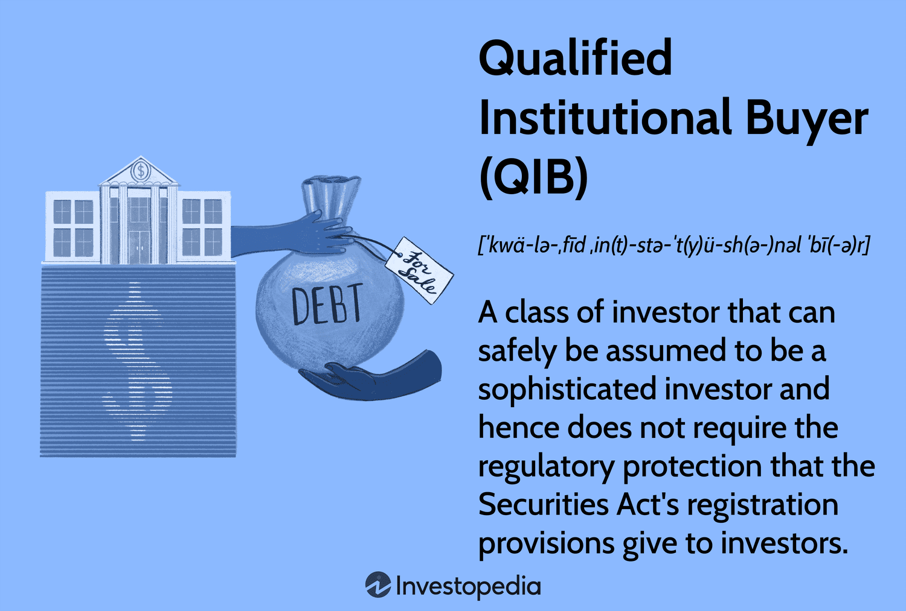

A Qualified Institutional Buyer (QIB) is an entity deemed eligible to engage in certain securities transactions that are not available to the general public. This designation exists in the regulatory frameworks of various jurisdictions, such as the United States, to facilitate the buying and selling of securities within private markets. QIBs must meet specific criteria outlined by financial authorities, which typically include financial institutions like banks, insurance companies, registered investment companies, employee benefit plans, and entities that manage at least $100 million in securities. These entities are considered more capable of assessing investment risks due to their experience, expertise, and substantial financial resources.

QIBs play a crucial role in financial markets by providing liquidity, contributing to price discovery, and facilitating capital formation. Their involvement in securities markets can stabilize prices and improve the efficiency with which markets operate. This influence is particularly evident in secondary markets, where QIBs engage in transactions that support funding opportunities for businesses and governmental entities.

Institutional investors, a broader category that encompasses QIBs, are pivotal in the economic landscape due to their extensive capital flows and significant market influence. This category includes pension funds, mutual funds, endowments, insurance companies, and hedge funds. These entities drive investment patterns, contribute to market liquidity, and have the power to sway corporate governance practices. Their investment strategies are typically characterized by large-scale transactions and are often directed towards achieving long-term financial returns for their beneficiaries or stakeholders.

Algorithmic trading has emerged as an essential component of modern financial markets, integrating technological advancements with trading strategies to automate the execution of large orders. Through complex algorithms, traders can process a vast amount of data at high speeds, making sophisticated investment decisions more efficient and less prone to human error. The use of algorithms has transformed trading by improving market liquidity and reducing transaction costs. However, it has also introduced challenges, such as increased market volatility and potential systemic risks.

This article aims to explore the intricate relationship between QIBs, institutional investors, and algorithmic trading. By examining the integration and impact of QIBs and technology in financial markets, the article seeks to provide insights into how these dynamics shape investment strategies and market behavior. Understanding this interplay is crucial for stakeholders seeking to navigate the evolving financial landscape effectively.

## Table of Contents

## What is a Qualified Institutional Buyer (QIB)?

A Qualified Institutional Buyer (QIB) is a category of institutional investor that meets specific requirements set by financial regulations, allowing them to trade securities that are typically unavailable to individual investors. According to Rule 144A of the U.S. Securities and Exchange Commission (SEC), QIBs are entities that, in the aggregate, own and invest on a discretionary basis at least $100 million in securities of issuers that are not affiliated with the entity. Certain banks and insurance companies qualify as QIBs if they own $100 million in unaffiliated securities, as do registered brokers and dealers with at least $10 million in securities owned and invested on a discretionary basis. The regulatory framework aims to ensure that entities deemed QIBs possess the requisite knowledge and sophistication to engage in substantial securities transactions without requiring the same level of protection afforded to retail investors.

QIBs hold a significant position in capital markets due to their substantial buying power and investment capabilities. They serve as pivotal [liquidity](/wiki/liquidity-risk-premium) providers and facilitate efficient capital allocation in financial markets. The status of QIB offers these entities access to private placements, including the purchase of unregistered securities issued by companies, thereby enabling companies to raise capital more efficiently. This arrangement proves beneficial for companies seeking to bypass the lengthy and often costly process of public offerings.

Typical entities that frequently qualify as QIBs include pension funds, mutual funds, insurance companies, and certain investment firms. For example, a pension fund managing over $100 million in discretionary investments in unassociated securities would qualify as a QIB. Similarly, a mutual fund or insurance company meeting this criteria can leverage the benefits associated with QIB status, gaining access to a broader range of investment opportunities not available to the general public.

Through their ability to engage in transactions involving unregistered securities and participate in exclusive investment opportunities, QIBs play a critical role in supporting market dynamics and contributing to economic growth. Their involvement in the market not only enhances liquidity but also facilitates the introduction of innovative financial products, thereby expanding the spectrum of investment options available within the industry.

## Understanding Institutional Investors

Institutional investors are entities that pool together large sums of money to invest in various financial instruments, real estate, and other investment types. They play a crucial role in financial markets due to the substantial capital they manage and their influence on market dynamics.

### Types of Institutional Investors

1. **Pension Funds**: These are investment pools that collect and invest funds set aside by employers or individuals to cover future retirement benefits. Pension funds are typically long-term investors with a conservative approach, aiming to provide steady returns to meet future liabilities. They hold substantial sway in markets due to the vast amount of assets under management.

2. **Insurance Companies**: These institutions manage large investments to ensure they can cover future claims. Their investment approach tends to be conservative, focusing on bonds and other fixed-income securities to match their liability schedules with asset cash flows. 

3. **Hedge Funds**: Hedge funds are investment funds that employ diverse and complex strategies to yield high returns for their investors or partners. They are known for a more aggressive investment style, often utilizing leverage, derivatives, and short-selling techniques. Hedge funds operate with greater flexibility compared to other institutional investors, and they often seek to exploit market inefficiencies.

4. **Mutual Funds**: Mutual funds pool capital from multiple investors to purchase a diversified portfolio of stocks, bonds, or other securities. They offer retail investors access to professionally managed portfolios and the ability to diversify their investments across various asset classes.

### Comparison Between QIBs and Other Institutional Investors

Qualified Institutional Buyers (QIBs) are a subset of institutional investors defined by specific regulatory criteria. In the United States, under Rule 144A of the Securities Act of 1933, QIBs are institutions that own and invest on a discretionary basis at least $100 million in securities of non-affiliated issuers. The criteria for a QIB are stringent to ensure that only highly sophisticated entities engage in certain private securities transactions.

While all QIBs are institutional investors, not all institutional investors qualify as QIBs. The primary distinction lies in the regulatory qualifications that QIBs must meet. This status grants them access to certain private markets and securities issues, which are typically not available to the broader public or other institutional investors. 

### The Role of Institutional Investors in the Stock Market

Institutional investors are major players in financial markets, influencing stock prices, market trends, and overall liquidity. Their large-scale transactions can lead to significant impacts on stock prices due to the sheer [volume](/wiki/volume-trading-strategy) of their trading activities. Institutional investors are often regarded as stabilizing forces in markets because they generally pursue long-term investment strategies, unlike individual investors who may react quickly to market trends.

Furthermore, by engaging in extensive research and analysis of market opportunities, institutional investors contribute to the efficiency and liquidity of financial markets. They also facilitate capital formation by providing companies with significant capital resources for expansion and operational activities.

In summary, institutional investors are pivotal in shaping the structure and dynamics of the stock market, providing essential liquidity and investment that fuel economic growth. Their diverse strategies and investment capacities form the backbone of global financial markets, including but not limited to, those qualified as QIBs.

 to Algorithmic Trading

Algorithmic trading refers to the use of computer algorithms to automate trading processes, which involves the execution of trades at a speed and frequency that a human trader cannot match. These algorithms are programmed to follow a defined set of instructions that consider timing, price, and volume, facilitating the rapid decision-making required to capitalize on fleeting trading opportunities.

The implementation of [algorithmic trading](/wiki/algorithmic-trading) has been revolutionized by advancements in technology, especially in computational power, data analytics, and [machine learning](/wiki/machine-learning) algorithms. These technologies enable traders to process vast amounts of market data in real-time, thus allowing for the analysis of complex patterns and trends that help inform trading decisions.

One of the primary benefits of algorithmic trading is its speed. By automating trade execution, algorithms can react to market conditions in milliseconds, reducing latency and enhancing the potential for profit generation. This speed is particularly advantageous in dynamic markets where the price of assets can fluctuate rapidly. Additionally, algorithmic trading enhances efficiency by minimizing human errors and the emotional biases that can affect trading decisions. Algorithms operate under predefined rules, ensuring consistent adherence to the intended strategy without the influence of emotions like fear or greed.

Algorithmic trading, however, is not without risks. One significant risk is the potential for technological failures or errors in code that can lead to unintended trading actions, which might result in substantial financial losses. Moreover, algorithmic trading can contribute to increased market [volatility](/wiki/volatility-trading-strategies), as a large volume of trades might be executed in a short period, leading to sharp price movements. Another concern is the potential for market manipulation through the use of algorithms, such as in the case of "spoofing," where traders place large orders with no intention of executing them to create misleading signals. 

Overall, while algorithmic trading offers considerable advantages in speed and efficiency, it also poses risks that necessitate robust risk management strategies and regulatory oversight to ensure market stability and integrity.

## The Relationship Between QIBs and Algorithmic Trading

Qualified Institutional Buyers (QIBs) are prominent players in financial markets, often leveraging sophisticated strategies to maximize returns. Algorithmic trading, which relies on computer algorithms to execute decisions based on predefined criteria, has become a critical component of their investment strategies.

QIBs utilize algorithmic trading primarily for its ability to process vast amounts of data rapidly, enabling them to capitalize on fleeting market opportunities. These algorithms can analyze numerous market indicators, such as price movements, trade volumes, and historical data, to execute trades at optimal times. One common use is in high-frequency trading ([HFT](/wiki/high-frequency-trading-strategies)), where executions occur in microseconds, providing QIBs with a competitive edge in acquiring or offloading assets before the market adjusts. This approach allows for reduced market impact costs and enhanced price precision.

The prevalence of algorithmic trading among QIBs is notably high, with [statistics](/wiki/bayesian-statistics) indicating that a significant proportion of equity trades—over 50%—are now executed algorithmically. This trend reflects an emphasis on efficiency and strategic complexity that human traders can hardly match. These systems can also be tailored to adapt to different asset classes, risk tolerances, and market conditions, offering a versatile toolset for QIBs.

The impact of QIB-led algorithmic trading activity on market volatility and liquidity is twofold. On one hand, these trades contribute to greater liquidity as the constant buy-sell actions improve the availability of assets. On the other hand, the rapid pace and large volume of trades had sparked concerns regarding increased market volatility. Sudden shifts caused by algorithmic decisions can, at times, lead to drastic market swings, as witnessed in events like the "Flash Crash" of 2010 where market indices plunged and rebounded within minutes due to algorithms exacerbating the sell-off.

Case studies of QIBs exploiting algorithmic trading illustrate its strategic value. For example, large hedge funds use these algorithms to deploy quantitative strategies that adapt to emerging patterns in market data. These funds often employ machine learning techniques, allowing the algorithms to evolve based on newly available data, enhancing decision-making processes over time.

In summary, QIBs employing algorithmic strategies benefit from increased processing speed, enhanced decision-making capabilities, and the ability to manage large volumes of transactions efficiently. Despite the potential for increased volatility, the integration of algorithmic trading remains an integral tool for QIBs aiming to optimize their investment strategies in today's dynamic financial marketplace.

## Regulatory Framework Surrounding QIBs and Algorithmic Trading

Qualified Institutional Buyers (QIBs) are pivotal participants in the financial markets, facilitating significant liquidity and capital flows. As major players, QIBs are subject to elaborate financial regulations that ensure market integrity and investor protection.

### Overview of Financial Regulations Governing QIBs

QIBs are defined by the U.S. Securities and Exchange Commission (SEC) under Rule 144A of the Securities Act of 1933. A QIB is primarily characterized by its minimum threshold of $100 million in securities owned and invested, which serves as a safeguard, ensuring that these entities have sufficient experience and resources to understand and bear the risks of large-scale investments [1]. This regulatory definition facilitates their participation in private placements of securities, providing issuers a streamlined process compared to public offerings.

### Regulations Affecting Algorithmic Trading in Global Markets

Algorithmic trading involves deploying automated systems to execute trades at speeds and frequencies beyond human capability. Regulations targeting this domain often aim to mitigate risks such as market manipulation, flash crashes, and systemic instability. In the United States, the SEC and Commodity Futures Trading Commission (CFTC) enforce rules like the Market Access Rule, which requires firms to establish risk controls before accessing the market [2]. Similarly, the European Union’s MiFID II framework mandates transparency and imposes stringent reporting requirements for algorithmic traders, thus strengthening market oversight.

### The Role of Regulatory Bodies in Monitoring QIB Activities

Regulatory bodies such as the SEC, CFTC, and equivalent institutions worldwide play a critical role in overseeing QIB activities. They ensure compliance with financial regulations, which includes monitoring trading patterns and ensuring that trades executed by algorithms are fair and non-disruptive. Mechanisms are in place for real-time surveillance and post-trade evaluations, which help in identifying irregularities and enforcing corrective measures.

### Recent Changes and Developments in Regulations Impacting QIBs and Algo Trading

Recent regulatory developments reflect the dynamic nature of market practices and advancements in technology. For instance, the Consolidated Audit Trail (CAT) in the U.S. represents a significant regulatory advancement, designed to enhance the ability of regulatory agencies to reconstruct trading activities and perform comprehensive market analyses [3]. Additionally, the SEC has proposed rules aimed at curbing the use of high-frequency trading strategies that may exploit market inefficiencies at the expense of long-term investors.

Moreover, regulatory authorities continue to emphasize the importance of cybersecurity in trading operations, prompting QIBs and algorithmic traders to bolster their systems against potential security breaches that could compromise market stability. As algorithms grow more complex, regulators strive to balance innovation with caution, ensuring that the technology's benefits do not outpace its risks.

In conclusion, QIBs and algorithmic trading are subject to a robust regulatory framework designed to uphold the integrity of financial markets. With continuing advancements in trading technologies, regulatory bodies remain vigilant, adapting to new challenges posed by such innovations.

**References:**

1. Securities and Exchange Commission. (n.d.). Rule 144A. [Online] Available: https://www.sec.gov/rules/final/33-6862.htm

2. Commodity Futures Trading Commission. (n.d.). Market Access Rule. [Online] Available: https://www.cftc.gov/PressRoom/PressReleases/opamemorandum

3. U.S. Securities and Exchange Commission. (n.d.). Consolidated Audit Trail. [Online] Available: https://www.sec.gov/spotlight/consolidated-audit-trail-cat

## Challenges and Opportunities for QIBs in Algorithmic Trading

Qualified Institutional Buyers (QIBs) operate within a financial landscape that is dynamically evolving, driven significantly by algorithmic trading. This landscape offers both challenges and opportunities that QIBs must navigate to remain competitive and compliant.

A primary challenge for QIBs in algorithmic trading is regulatory compliance. Regulatory frameworks across various jurisdictions demand rigorous adherence to standards designed to maintain market integrity and protect investors. The Securities and Exchange Commission (SEC) in the United States, for example, has implemented rules and amendments targeting algorithmic trading practices, addressing concerns such as market fairness, manipulation, and cyber risks. These regulations require QIBs to maintain robust systems and controls, often necessitating significant investments in compliance infrastructure and technology.

Market saturation poses another challenge. The proliferation of algorithmic trading has increased competition, compressing profit margins as multiple entities employ similar strategies. This saturation necessitates continuous innovation and differentiation in trading algorithms to maintain a competitive edge. Advanced analytics, machine learning, and [artificial intelligence](/wiki/ai-artificial-intelligence) are being leveraged to develop more sophisticated models capable of adapting to real-time market conditions and identifying unique opportunities.

Opportunities for growth through advanced trading algorithms remain significant. QIBs that invest in cutting-edge technology and data analytics can exploit market inefficiencies with higher precision and speed. Quantitative models allow for the processing of large data sets to uncover patterns and insights that are not readily apparent through traditional trading methods. This capability enables predictive analytics, allowing QIBs to anticipate market movements and execute trades that maximize returns on investment.

The future for QIBs in an increasingly automated market is promising, yet requires strategic foresight. Automation and algorithmic trading not only enhance execution efficiency but also reduce transaction costs. As markets continue to digitalize, the integration of blockchain technology and decentralized finance (DeFi) platforms could potentially reshape trading ecosystems, presenting new investment avenues and strategy innovations. 

Innovation in trading strategies is crucial. QIBs are increasingly adopting hybrid models that blend algorithmic trading with human oversight, enhancing decision-making processes. By integrating human judgment with algorithmic precision, QIBs can address scenarios requiring nuanced understanding, mitigate systemic risks, and adapt to unforeseen market events promptly.

In conclusion, while QIBs face challenges in regulatory compliance and market saturation, the opportunities afforded by advanced algorithms and automation present pathways for growth and strategic innovation. Adapting to an automated future involves embracing technology, enhancing compliance, and refining strategies to ensure resilience and competitiveness in the financial markets.

## Conclusion

In conclusion, understanding the dynamics of Qualified Institutional Buyers (QIBs) and their strategic utilization of algorithmic trading is vital for anyone engaged with financial markets. QIBs, by leveraging their significant financial resources and expertise, continue to exert a profound influence on market movements, liquidity, and volatility. This segment of institutional investors, distinct in their capacity to meet stringent regulatory requirements, remains pivotal in capital allocation and investment management.

Algorithmic trading, characterized by the employment of complex algorithms to automate and expedite trading processes, provides QIBs with unparalleled advantages in speed, efficiency, and data-driven decision making. Despite its benefits, this trading style introduces challenges, such as increased dependency on technology and implications for market stability, necessitating cautious regulatory oversight.

The evolution of institutional investment strategies underscores a shift towards more sophisticated, data-centric approaches, with QIBs often at the forefront of this transformation. The future of QIBs is poised for growth, capitalizing on advancements in technology while navigating the complexities of regulatory frameworks and emerging market trends.

As the financial landscape continues to evolve, further research and engagement with industry dynamics will enhance the understanding of the interplay between QIBs and algorithmic trading. Emphasizing collaboration amongst regulatory bodies, institutional investors, and technological innovators will be crucial in fostering a stable yet dynamic market environment.

## References & Further Reading

[1]: Securities and Exchange Commission. (n.d.). [Rule 144A.](https://www.law.cornell.edu/cfr/text/17/230.144A)

[2]: Commodity Futures Trading Commission. (n.d.). [Market Access Rule.](https://www.cftc.gov/LawRegulation/index.htm)

[3]: U.S. Securities and Exchange Commission. (n.d.). [Consolidated Audit Trail.](https://www.sec.gov/rules-regulations/2012/07/consolidated-audit-trail)

[4]: Bergstra, J., Bardenet, R., Bengio, Y., & Kégl, B. (2011). ["Algorithms for Hyper-Parameter Optimization."](https://dl.acm.org/doi/10.5555/2986459.2986743) Advances in Neural Information Processing Systems 24.

[5]: Lopez de Prado, M. (2018). ["Advances in Financial Machine Learning."](https://www.amazon.com/Advances-Financial-Machine-Learning-Marcos/dp/1119482089) Wiley.

[6]: Aronson, D. (2006). ["Evidence-Based Technical Analysis: Applying the Scientific Method and Statistical Inference to Trading Signals."](https://www.amazon.com/Evidence-Based-Technical-Analysis-Scientific-Statistical/dp/0470008741) Wiley.

[7]: Jansen, S. (2020). ["Machine Learning for Algorithmic Trading: Predictive Models to Extract Signals from Market and Alternative Data for Systematic Trading Strategies with Python."](https://www.amazon.com/Machine-Learning-Algorithmic-Trading-alternative/dp/1839217715) Packt Publishing.

[8]: Chan, E. P. (2008). ["Quantitative Trading: How to Build Your Own Algorithmic Trading Business."](https://github.com/ftvision/quant_trading_echan_book) Wiley.