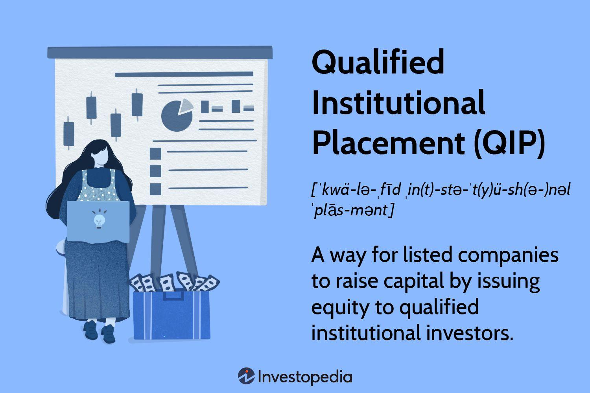

## Table of Contents

## What is a Qualified Institutional Placement (QIP)?

A Qualified Institutional Placement (QIP) is a way for listed companies in India to raise money by selling shares to big investors like banks, insurance companies, and mutual funds. It's a quick and easy method because the company doesn't have to go through a long process to get the shares approved. This helps the company get the money it needs faster.

QIPs are useful for companies that need money quickly for things like expanding their business or paying off debts. Only certain big investors can buy these shares, which makes the process simpler and faster. The company decides how many shares to sell and at what price, and then offers them to these big investors.

## Who can participate in a Qualified Institutional Placement?

Qualified Institutional Placements (QIPs) are open to certain big investors. These include banks, mutual funds, insurance companies, and other financial institutions. These big investors are called Qualified Institutional Buyers (QIBs). They have the money and knowledge to invest in these special share sales.

The reason only these big investors can join in is to make the process quick and simple. Regular people can't buy shares through a QIP. This helps the company get the money it needs faster without going through a long process to sell the shares to everyone.

## What are the basic requirements for a company to conduct a QIP?

A company that wants to do a Qualified Institutional Placement (QIP) must follow some basic rules. First, the company needs to be listed on a stock exchange in India. This means their shares are already being traded publicly. Also, the company must not have been banned from raising money in this way by the stock exchange or any other rules. The company should also make sure it has enough shares that are not already owned by the public, so it can sell new shares through the QIP.

The company also needs to follow certain steps when doing a QIP. They need to tell the stock exchange about the QIP before they start selling the shares. They also need to set a minimum price for the shares, which can't be less than the average price of the shares over the last few weeks. The company can only sell the shares to big investors, called Qualified Institutional Buyers (QIBs), like banks and insurance companies. This makes the process quicker and simpler for the company to get the money it needs.

## How does the pricing work in a QIP?

When a company does a Qualified Institutional Placement (QIP), they need to set a price for the shares they are selling. This price can't be lower than the average price of the company's shares over the last few weeks. This average price is usually calculated over the last two weeks before the QIP starts. By setting a minimum price like this, the company makes sure the shares are not sold too cheaply.

The company can choose to set the price higher than the minimum if they think they can get more money from the big investors. These big investors, called Qualified Institutional Buyers (QIBs), will decide if they want to buy the shares at the price the company sets. If the price is too high, the investors might not buy, and the company might not get the money it needs. But if the price is right, the company can quickly raise the money it wants from these big investors.

## What is the minimum issue size for a QIP?

When a company wants to do a Qualified Institutional Placement (QIP), there is a rule about how many shares they need to sell. The minimum issue size for a QIP must be at least Rs 100 crore. This means the company has to raise at least this amount of money through the QIP.

The reason for this rule is to make sure that the QIP is big enough to be worth the effort. It helps make sure that the company is raising a significant amount of money, which is important for things like expanding the business or paying off debts.

## What are the disclosure requirements for companies conducting a QIP?

When a company does a Qualified Institutional Placement (QIP), they have to tell everyone a lot of information. They need to share a document called a placement document with the big investors who might buy the shares. This document has all the important details about the company, like its financial health, any risks involved, and what the company plans to do with the money they raise. The company also has to tell the stock exchange about the QIP before they start selling the shares. This is to make sure everything is open and clear.

The company also has to tell everyone if there are any changes in the company's situation that could affect the investors. This means if something big happens, like a change in the company's management or if the company's financial situation changes a lot, they need to let the investors know. By doing this, the company makes sure that the big investors have all the information they need to make a good decision about buying the shares.

## How does the allotment process work in a QIP?

When a company does a Qualified Institutional Placement (QIP), they decide how many shares they want to sell and at what price. Then, they offer these shares to big investors, called Qualified Institutional Buyers (QIBs). These investors can decide if they want to buy the shares at the price the company set. The company usually sets a minimum amount of money they want to raise, which is at least Rs 100 crore.

Once the company gets offers from the big investors, they start the allotment process. They look at all the offers and decide how to give out the shares. If there are more offers than shares available, the company might have to choose who gets the shares. They usually try to be fair and might give a little bit to everyone who offered to buy, or they might give more to the investors who offered to buy at a higher price. After deciding, the company tells the investors how many shares they got and then gets the money from them.

## What are the restrictions on the transfer of securities issued through a QIP?

When a company does a Qualified Institutional Placement (QIP), they sell shares to big investors. These shares can be sold or transferred to other people, but there are some rules to follow. The big investors who buy the shares through a QIP have to wait at least one year before they can sell those shares to anyone else. This rule helps make sure the investors keep the shares for a while and don't just buy and sell them right away.

After the one-year waiting period, the big investors can sell the shares to anyone they want. But during that first year, if they want to sell the shares, they can only sell them to other big investors, like banks or insurance companies. This rule is to keep the shares in the hands of big investors for a while and make sure the company's stock price stays stable.

## How does a QIP differ from other forms of capital raising like an IPO or FPO?

A Qualified Institutional Placement (QIP) is different from an Initial Public Offering (IPO) and a Follow-on Public Offering (FPO) in a few key ways. A QIP is a way for a company that is already listed on a stock exchange to quickly raise money by selling shares to big investors like banks and insurance companies. These big investors are called Qualified Institutional Buyers (QIBs). Unlike an IPO, where a company sells shares to the public for the first time, a QIP is only open to these big investors. This makes the process faster and simpler because the company doesn't have to go through a long process to get the shares approved by everyone.

An IPO is when a company first sells its shares to the public, and it's a big deal because it's the first time the company's shares are traded on a stock exchange. It involves a lot of rules and steps to make sure the public has all the information they need to decide if they want to buy the shares. A Follow-on Public Offering (FPO) is similar to an IPO, but it happens after the company is already listed on a stock exchange. In an FPO, the company sells more shares to the public to raise more money. Both IPOs and FPOs take longer and are more open to everyone compared to a QIP, which is quicker and only for big investors.

In summary, a QIP is a quick and easy way for a listed company to raise money from big investors, while an IPO is for a company going public for the first time, and an FPO is for a listed company selling more shares to the public. The main difference is who can buy the shares and how long the process takes. QIPs are faster and only for big investors, while IPOs and FPOs are slower and open to the public.

## What are the tax implications for investors participating in a QIP?

When big investors buy shares through a Qualified Institutional Placement (QIP), they need to think about taxes. If they make money by selling the shares for more than they paid, they have to pay capital gains tax. The tax rate depends on how long they held the shares. If they sell the shares within a year, it's called short-term capital gains, and they pay a higher tax rate. If they wait more than a year before selling, it's called long-term capital gains, and the tax rate is lower. This is important for investors to know because it affects how much money they keep after selling the shares.

Investors also need to think about taxes when they get dividends from the shares they bought through a QIP. Dividends are payments companies make to shareholders from their profits. In India, dividends are usually taxed in the hands of the investors. This means the investors have to pay tax on the money they get as dividends. The tax rate on dividends can be different based on the investor's income and other factors. So, it's good for investors to understand these tax rules to plan their investments better.

## Can a company conduct multiple QIPs in a financial year, and what are the regulations surrounding this?

A company can do more than one Qualified Institutional Placement (QIP) in a financial year, but there are some rules they need to follow. The main rule is that they can't do another QIP until at least six months have passed since the last one. This waiting period is to make sure the company doesn't keep selling shares too often, which could affect the stock price and confuse investors.

Another important rule is that the company has to tell the stock exchange about the new QIP before they start selling the shares. They also need to make sure they follow all the other rules about how to set the price of the shares and who can buy them. These rules help keep everything fair and clear for the big investors who are buying the shares.

## What are the recent regulatory changes affecting QIPs and how do they impact issuers and investors?

Recently, there have been some changes to the rules about Qualified Institutional Placements (QIPs). One big change is that companies now have to wait at least 90 days between QIPs instead of 6 months. This change helps companies raise money more often if they need to. Another change is that companies can now offer shares at a lower price than before. They can set the price at a 5% discount to the floor price, which is the average price of the shares over the last two weeks. This makes it easier for companies to sell their shares and attract big investors.

These changes have a big impact on both the companies doing QIPs and the big investors buying the shares. For companies, being able to do QIPs more often and at a lower price means they can get the money they need faster and easier. This is helpful if they need to expand their business or pay off debts quickly. For big investors, the lower price might make the shares more attractive to buy, but they also need to be careful because the shorter waiting period between QIPs could mean more shares are being sold, which could affect the stock price. Overall, these changes make QIPs a more flexible way for companies to raise money, but investors need to stay alert to the changes in the market.

## References & Further Reading

[1]: Krugman, P., & Obstfeld, M. (2014). "International Economics: Theory and Policy." Pearson. [Link](https://www.pearson.com/se/Nordics-Higher-Education/subject-catalogue/economics/International-Economics-Theory-and-Policy-Krugman.html)

[2]: Reinganum, M.R. (1981). "Misspecification of Capital Asset Pricing: Empirical Anomalies Based on Earnings' Yields and Market Values." Journal of Financial Economics. [Link](https://www.sciencedirect.com/science/article/abs/pii/0304405X81900192)

[3]: Marcos Lopez de Prado (2018). "Advances in Financial Machine Learning." Wiley. [Link](https://www.wiley.com/en-us/Advances+in+Financial+Machine+Learning-p-9781119482086)

[4]: David Aronson (2006). "Evidence-Based Technical Analysis: Applying the Scientific Method and Statistical Inference to Trading Signals." Wiley. [Link](https://www.wiley.com/en-us/Evidence+Based+Technical+Analysis%3A+Applying+the+Scientific+Method+and+Statistical+Inference+to+Trading+Signals-p-9780470008744)

[5]: Stefan Jansen (2020). "Machine Learning for Algorithmic Trading." Packt Publishing. [Link](https://github.com/stefan-jansen/machine-learning-for-trading)

[6]: Ernest P. Chan (2009). "Quantitative Trading: How to Build Your Own Algorithmic Trading Business." Wiley. [Link](https://books.google.com/books/about/Quantitative_Trading.html?id=j70yEAAAQBAJ)