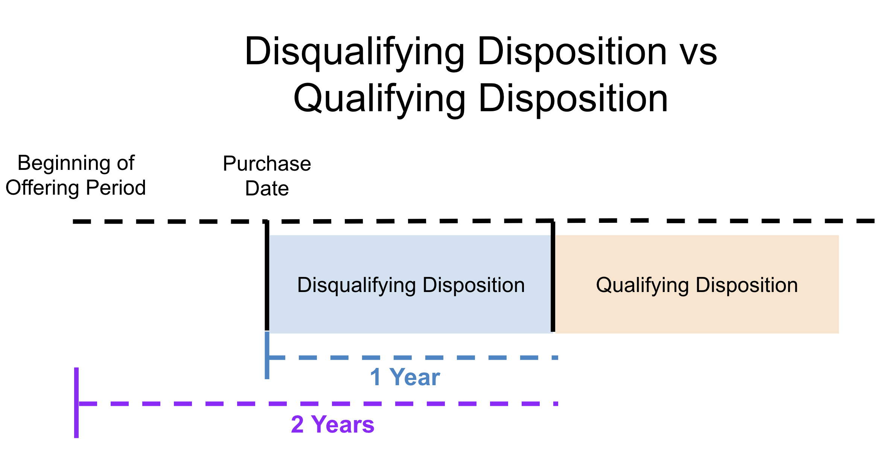

## Table of Contents

## What is a qualifying disposition?

A qualifying disposition is a term used in the United States tax law, specifically related to the sale of stock acquired through certain employee stock purchase plans (ESPPs) or incentive stock options (ISOs). It happens when an employee sells their stock after holding it for a specific period of time. For ESPPs, the stock must be held for at least one year from the date of purchase and two years from the beginning of the offering period. For ISOs, the stock must be held for at least one year from the date of exercise and two years from the date the option was granted.

When a sale meets these holding period requirements, it is considered a qualifying disposition. This type of disposition can have favorable tax treatment. For ESPPs, any gain up to the purchase price discount is taxed as ordinary income, and any additional gain is taxed as a long-term capital gain. For ISOs, there is no ordinary income at the time of exercise, and any gain upon sale is taxed as a long-term capital gain. This can result in significant tax savings for the employee compared to a disqualifying disposition, where the stock is sold before meeting the holding period requirements.

## How does a qualifying disposition differ from a disqualifying disposition?

A qualifying disposition and a disqualifying disposition are terms used when you sell stock you got from your job. A qualifying disposition happens when you sell the stock after holding it for a certain amount of time. For employee stock purchase plans, you need to hold the stock for at least one year after you buy it and two years from when the plan started. For incentive stock options, you need to hold the stock for at least one year after you exercise the option and two years from when the option was given to you. If you meet these times, you get special tax benefits. The tax on any profit you make can be lower because it is treated as a long-term capital gain.

A disqualifying disposition is when you sell the stock before you meet the time requirements. This means you sell it too soon. When this happens, the tax rules are different and usually less favorable. For employee stock purchase plans, the discount you got on the stock when you bought it is taxed as regular income, and any extra profit is taxed based on how long you held the stock. For incentive stock options, if you sell too soon, you might have to pay regular income tax on the difference between what you paid for the stock and what it was worth when you exercised the option, plus any profit you made when you sold it. So, it's important to know the difference because it can affect how much tax you pay.

## What are the tax implications of a qualifying disposition?

When you sell stock from an employee stock purchase plan (ESPP) and it's a qualifying disposition, the tax rules are pretty good for you. You need to hold the stock for at least one year after you buy it and two years from when the plan started. If you do this, any profit you make up to the discount you got when you bought the stock is taxed as regular income. But any extra profit you make is taxed at a lower rate, called a long-term capital gain. This can save you a lot of money on taxes.

For incentive stock options (ISOs), a qualifying disposition also has good tax benefits. You need to hold the stock for at least one year after you exercise the option and two years from when the option was given to you. If you meet these times, you don't have to pay any regular income tax when you exercise the option. When you sell the stock, any profit you make is taxed as a long-term capital gain, which is usually less than regular income tax. This can make a big difference in how much tax you pay.

## Can you explain the holding period required for a qualifying disposition?

For a qualifying disposition from an employee stock purchase plan (ESPP), you need to hold the stock for a certain amount of time. You must keep the stock for at least one year after you buy it. Also, you need to hold it for two years from when the plan started. If you meet these times, you can get special tax benefits when you sell the stock.

For a qualifying disposition from incentive stock options (ISOs), the holding period is a bit different but still important. You need to hold the stock for at least one year after you exercise the option. On top of that, you must hold it for two years from when the option was first given to you. If you follow these rules, you can enjoy lower taxes on any profit you make when you sell the stock.

## What types of stock options are eligible for a qualifying disposition?

The types of stock options that can qualify for a qualifying disposition are employee stock purchase plans (ESPPs) and incentive stock options (ISOs). These are special programs that companies offer to their employees to buy company stock at a discount or to buy it at a set price in the future.

For ESPPs, you need to hold the stock for at least one year after you buy it and two years from when the plan started. If you do this, you can get tax benefits when you sell the stock. For ISOs, you need to hold the stock for at least one year after you exercise the option and two years from when the option was given to you. Meeting these times lets you enjoy lower taxes on any profit you make when you sell the stock.

## How do you calculate the gain or loss on a qualifying disposition?

To figure out the gain or loss on a qualifying disposition from an employee stock purchase plan (ESPP), you first need to know the price you paid for the stock and the price you sold it for. The gain is the difference between these two prices. But with ESPPs, there's a special rule. The gain up to the discount you got when you bought the stock is taxed as regular income. Any extra gain after that is taxed at a lower rate, called a long-term capital gain. So, you split the gain into two parts: the discount part and the rest. The discount part is what you report as regular income, and the rest is what you report as a long-term capital gain.

For incentive stock options (ISOs), calculating the gain or loss is a bit different but still pretty straightforward. When you sell the stock, the gain is the difference between the price you sold it for and the price you paid when you exercised the option. If it's a qualifying disposition, you don't have to pay regular income tax when you exercise the option. Instead, the entire gain when you sell the stock is taxed as a long-term capital gain. So, you just report the total gain as a long-term capital gain on your taxes.

## What documentation is needed to report a qualifying disposition on tax returns?

When you have a qualifying disposition from an employee stock purchase plan (ESPP), you need to keep some records to report it on your taxes. You'll need the Form 3922 that your employer gives you. This form shows the details of when you bought the stock, how many shares you bought, and the price you paid. You also need to keep a record of when you sold the stock and the price you sold it for. When you file your taxes, you'll report the gain up to the discount you got as regular income on your Form 1040. Any extra gain is reported as a long-term capital gain on Schedule D.

For incentive stock options (ISOs), you'll get a Form 3921 from your employer after you exercise the option. This form shows when you exercised the option, how many shares you got, the price you paid, and the market value of the stock on that day. Keep this form along with records of when you sold the stock and the price you sold it for. When you file your taxes, you'll report the entire gain as a long-term capital gain on Schedule D. You don't report anything when you exercise the option if it's a qualifying disposition.

## Are there any special rules for employees working abroad regarding qualifying dispositions?

For employees working abroad, the rules for qualifying dispositions can be a bit different. If you're an American working overseas and you get stock options from your job, you still need to follow the same holding periods for a qualifying disposition. That means one year after you buy the stock for ESPPs and two years from when the plan started, or one year after you exercise the option and two years from when it was granted for ISOs. But you also need to think about the tax rules of the country where you're working. Some countries might have different rules or taxes on stock options, so it's a good idea to talk to a tax expert who knows about both U.S. and foreign tax laws.

If you're working abroad and you sell your stock, you might have to report the gain on your U.S. tax return and also on a tax return in the country where you're working. The U.S. has tax treaties with many countries that can help avoid double taxation, but you need to know the details. For example, if you have a qualifying disposition, the gain might be taxed as a long-term capital gain in the U.S., but the country you're in might tax it differently. It's important to keep good records of when you bought and sold the stock, the prices, and any forms like Form 3921 or Form 3922 that your employer gives you. Talking to a tax advisor can help make sure you're following all the right rules and getting the best tax treatment possible.

## How does a qualifying disposition affect an employee's overall compensation strategy?

A qualifying disposition can be a big part of an employee's overall compensation strategy. When you get stock options from your job, like from an ESPP or ISOs, holding onto them until they qualify for a qualifying disposition can save you a lot of money on taxes. This is because the profit you make from selling the stock can be taxed at a lower rate, called a long-term capital gain. This can make your total pay from your job go up because you keep more of the money you make from the stock. So, planning to hold your stock options until they meet the holding period can be a smart move to boost your overall earnings.

But, it's not just about the money. You also need to think about your job and where you might be working. If you're working abroad, you have to consider the tax rules of the country you're in, which might be different from the U.S. rules. This can make things more complicated, but it also means you might need to plan carefully. Talking to a tax expert can help you figure out the best way to handle your stock options so you can make the most of them, no matter where you're working. So, a qualifying disposition can be a key part of your compensation strategy, helping you make the most of your job's benefits.

## What are the potential pitfalls to avoid when planning for a qualifying disposition?

When planning for a qualifying disposition, one big thing to watch out for is selling your stock too soon. If you sell before the stock meets the holding period, it becomes a disqualifying disposition, and you'll lose the special tax benefits. For ESPPs, you need to hold the stock for at least one year after you buy it and two years from when the plan started. For ISOs, you need to hold the stock for at least one year after you exercise the option and two years from when the option was given to you. If you don't wait long enough, you'll pay more in taxes, which can really cut into your earnings.

Another thing to be careful about is not keeping good records. You need to keep track of when you bought or exercised the stock, the price you paid, and when you sold it and for how much. You'll also need forms like Form 3921 or Form 3922 from your employer. Without these records, it can be hard to prove to the IRS that you met the holding period, and you might miss out on the tax benefits. If you're working abroad, you also need to think about the tax rules of the country you're in. These rules can be different from U.S. rules, and not planning for them can lead to unexpected tax bills or other problems.

## How do changes in tax law impact the benefits of a qualifying disposition?

Changes in tax law can really affect how much you benefit from a qualifying disposition. If the tax rates for long-term capital gains go up, the money you save by holding your stock until it qualifies might not be as much. Also, if the rules about what counts as a qualifying disposition change, you might need to hold your stock for a different amount of time to get the tax break. This means you have to keep an eye on tax laws and maybe change your plans to make sure you still get the best deal.

If new tax laws make it harder to qualify for a disposition or change how the gains are taxed, it could make your overall compensation strategy less effective. For example, if the tax laws start treating some of the gain as regular income instead of a long-term capital gain, you could end up paying more in taxes. It's important to stay informed about tax changes and maybe talk to a tax advisor to figure out how to handle your stock options in the best way possible.

## What advanced strategies can be used to maximize the benefits of a qualifying disposition?

One advanced strategy to maximize the benefits of a qualifying disposition is to carefully time the sale of your stock. If you can predict when the stock price might go up, you could wait until just after it meets the holding period to sell. This way, you get the tax benefits of a qualifying disposition and also sell at a higher price. Another part of this strategy is to use tax-loss harvesting. If you have other investments that have lost value, you can sell those at the same time as your stock to offset some of the gains and lower your tax bill even more.

Another strategy is to use stock options as part of a broader financial plan. For example, if you're working abroad, you need to think about the tax rules in both the U.S. and the country you're in. You might be able to use tax treaties to avoid paying taxes twice on the same gain. Also, if you have a lot of stock options, you could spread out when you exercise them and sell the stock over several years. This can help you stay in lower tax brackets and keep more of your money. Talking to a financial advisor can help you figure out the best way to do this, so you get the most out of your stock options while still following all the rules.

## References & Further Reading

[1]: Bergstra, J., Bardenet, R., Bengio, Y., & Kégl, B. (2011). ["Algorithms for Hyper-Parameter Optimization."](https://dl.acm.org/doi/10.5555/2986459.2986743) Advances in Neural Information Processing Systems 24.

[2]: ["Advances in Financial Machine Learning"](https://www.amazon.com/Advances-Financial-Machine-Learning-Marcos/dp/1119482089) by Marcos Lopez de Prado

[3]: ["Evidence-Based Technical Analysis: Applying the Scientific Method and Statistical Inference to Trading Signals"](https://www.amazon.com/Evidence-Based-Technical-Analysis-Scientific-Statistical/dp/0470008741) by David Aronson

[4]: ["Machine Learning for Algorithmic Trading"](https://github.com/stefan-jansen/machine-learning-for-trading) by Stefan Jansen

[5]: ["Quantitative Trading: How to Build Your Own Algorithmic Trading Business"](https://www.amazon.com/Quantitative-Trading-Build-Algorithmic-Business/dp/1119800064) by Ernest P. Chan