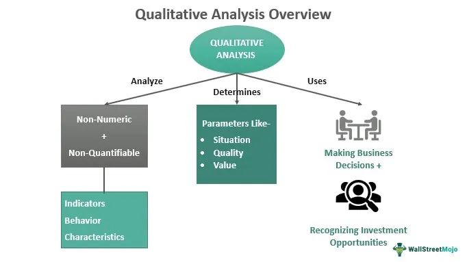

In today's data-centric environment, data analysis is foundational to a multitude of fields, encompassing both qualitative research and algorithmic trading (algo trading). The integration of qualitative research methodologies within data analysis is essential for extracting insightful, non-numeric data that enhances understanding and decision-making processes. This article explores the intersection of data analysis, qualitative research methodologies, and algo trading, providing a comprehensive overview of each domain's core principles and their interconnections.

Data analysis involves systematically applying statistical or logical techniques to interpret and evaluate data, serving as a critical component of strategic decision-making across various sectors. It enables organizations to discern patterns and trends within complex datasets, thereby informing evidence-based decisions. Algo trading, a sophisticated financial trading strategy, relies heavily on data-driven approaches, leveraging algorithms to execute trades at remarkable speeds with minimal human intervention.



Qualitative research, on the other hand, focuses on understanding the underlying reasons and mechanisms of human behavior through subjective analysis. Techniques such as interviews, ethnographies, and focus groups are used to gather nuanced insights, offering depth and context that purely quantitative methods may overlook. By integrating these qualitative insights into data analysis, businesses can obtain a more comprehensive understanding of phenomena such as company culture and customer satisfaction.

This synthesis of disciplines yields substantial benefits, particularly in forming robust financial and research strategies. By the conclusion of this article, readers will appreciate how combining data analysis with qualitative research methodologies and algo trading strategies creates a more nuanced and effective approach to interpreting financial markets and conducting research.

## Table of Contents

## Understanding Data Analysis

Data analysis is a discipline that employs systematic statistical or logical techniques to describe, evaluate, and interpret data. It serves as a fundamental component of decision-making processes across various industries, enabling organizations to decipher complex datasets and make informed decisions. Within this realm, data is categorized into two primary types: quantitative and qualitative.

Quantitative data refers to information that can be quantified and is typically numerical. It includes metrics such as sales figures, market trends, and demographic [statistics](/wiki/bayesian-statistics). Techniques used to analyze quantitative data involve statistical methods such as regression analysis, hypothesis testing, and time series analysis. For instance, regression analysis can help identify relationships between variables and forecast future trends, providing precise insights for strategic decisions.

On the other hand, qualitative data encompasses non-numeric information that offers deeper insights through textual or visual content, often derived from interviews, focus groups, or observations. Methods such as thematic analysis, content analysis, and narrative analysis are employed to study qualitative data. These methods help in understanding underlying reasons, motivations, and patterns, adding a layer of context that purely quantitative analysis might miss.

In the financial sector, data analysis plays a pivotal role, particularly in [algorithmic trading](/wiki/algorithmic-trading) (algo trading). Algo trading involves the use of complex algorithms to make trading decisions at speeds and frequencies that would be impossible for human traders. Here, data is not just consumed but is the backbone of strategic decision-making. Financial markets generate vast amounts of data, including stock prices, trading volumes, and economic indicators, which are analyzed using sophisticated techniques to identify trading opportunities.

Algo trading typically relies on quantitative data due to its structured nature and ease of processing by algorithms. However, the integration of qualitative insights, such as investor sentiment analysis and news content analysis, is becoming increasingly valuable. By incorporating both quantitative and qualitative data, trading algorithms can be refined to consider broader market dynamics, enhancing their robustness and effectiveness.

To illustrate, consider an algo trading strategy that uses [machine learning](/wiki/machine-learning) algorithms to forecast stock price movements. By integrating sentiment analysis of news articles or social media trends, the algorithm can adjust its trading strategies based on changes in market sentiment or unexpected news events, offering a more comprehensive view of market behavior.

In summary, data analysis is indispensable in understanding and interpreting the vast amounts of data generated in today's digital economy. Its application in financial sectors, especially in algo trading, underscores its significance in making strategic, data-driven decisions.

## Qualitative Research Methodology

Qualitative research methodology is a vital tool for understanding the nuanced aspects of human behavior, focusing on the 'why' and 'how' rather than numerical data alone. This approach prioritizes deep insights through subjective analysis, making it an invaluable component of fields where human perspectives and interactions are key.

Fundamental techniques in qualitative research include interviews, ethnographies, and focus groups. Interviews can be structured, semi-structured, or unstructured, allowing researchers to gain in-depth viewpoints from participants. Ethnographies involve the comprehensive study of people and cultures in their natural environment, providing a holistic picture of the societal context that quantitative data might miss. Focus groups facilitate group discussions where participants can express their thoughts and opinions, revealing collective social dynamics and shared experiences.

These qualitative methodologies enhance data analysis by adding context and depth. Unlike quantitative methods, which often rely on numerical data and statistical analysis, qualitative research captures the nuanced understandings of human experiences. For example, when analyzing customer feedback, qualitative insights from interviews can uncover underlying customer sentiments and motivations that numerical ratings alone might not reveal.

In business settings, qualitative research is essential for evaluating areas such as company culture and customer satisfaction. Understanding company culture through qualitative methods can inform organizational change initiatives and improve employee satisfaction. Similarly, qualitative studies on customer satisfaction can identify areas for improvement by comprehensively capturing the customer journey and emotional responses.

Overall, qualitative research methodologies provide a critical layer of context that enriches data analysis, offering deeper insights that are crucial for interpreting complex human behaviors and interactions. Their application in business not only aids in understanding internal dynamics and customer experiences but also supports strategic decision-making by illuminating areas that quantitative data might overlook.

## Integration of Qualitative Research in Algo Trading

Algorithmic trading, commonly known as algo trading, leverages advanced algorithms to execute trading strategies at high speeds and often with minimal human intervention. While these algorithms predominantly rely on quantitative data to make swift and efficient decisions, the incorporation of qualitative research can significantly enhance market understanding and strategy development.

### Enhancing Algorithmic Strategies with Qualitative Insights

Qualitative research focuses on understanding the underlying motives and sentiments that drive market movements. Incorporating qualitative insights into algorithmic trading involves analyzing textual data from news reports, social media, financial forums, and company filings to assess market sentiment and potential trend shifts. This approach can be captured through techniques like sentiment analysis and natural language processing (NLP).

**Sentiment Analysis and NLP**: These techniques extract sentiment from narrative data, quantifying it in a manner that algorithms can process. For example, a sudden surge in positive sentiments about a particular stock on social media platforms can be detected and used to adjust trading strategies accordingly.

### Challenges in Integration

Integrating qualitative insights into algorithmic models presents several challenges. The primary difficulty lies in the subjective nature of qualitative data, which can vary significantly based on context and interpretation. Additionally, converting qualitative inputs into a quantifiable format compatible with algorithmic systems can be challenging. This requires robust NLP algorithms and sentiment analysis tools capable of accurately classifying and understanding nuanced human expressions.

**Data Quality and Reliability**: Ensuring data reliability is another challenge, as qualitative sources can be prone to biases and misinformation. Implementing effective data validation and cross-referencing mechanisms is crucial to mitigate erroneous data that could adversely impact trading decisions.

### Opportunities and Real-World Applications

Despite these challenges, the integration of qualitative insights offers numerous opportunities, enhancing the predictive power of algorithmic models. Several firms have successfully applied this dual approach, gaining a competitive edge.

**Case Example**: A notable instance is BlackRock's use of sentiment analysis to complement its quantitative strategies. By monitoring social media and news outlets, BlackRock enhances its understanding of market sentiments, allowing for more resilient investment strategies.

**Python Integration Example**: To illustrate a basic integration of qualitative data using Python, consider a sentiment analysis model employing libraries such as TextBlob or Vader to process news headlines:

```python
from textblob import TextBlob

def analyze_sentiment(text):
    analysis = TextBlob(text)
    if analysis.sentiment.polarity > 0:
        return 'positive'
    elif analysis.sentiment.polarity == 0:
        return 'neutral'
    else:
        return 'negative'

headline = "Stock XYZ sees significant breakthrough in tech innovation"
print(analyze_sentiment(headline))
```

This simple example highlights how sentiments derived from news can be classified and factored into trading strategies, offering a richer perspective on market conditions than quantitative data alone.

### Conclusion

The fusion of qualitative insights with quantitative algorithms in trading not only enhances the depth of market analysis but also offers a more comprehensive understanding of the factors influencing market dynamics. Future advancements in analytical techniques and machine learning models are expected to further optimize this integration, enabling more robust and adaptive trading strategies.

## Case Studies and Examples

In recent years, several companies have effectively combined qualitative analysis with data-driven strategies to gain a competitive edge in algorithmic trading. By embracing a hybrid approach that integrates qualitative insights, these organizations have been able to navigate complex market dynamics with greater precision.

One prominent example is the use of sentiment analysis by hedge funds. Sentiment analysis, a qualitative research technique, assesses public mood reflected in news articles, social media, and financial reports to predict market movements. Hedge funds have developed sophisticated algorithms that incorporate this qualitative data alongside quantitative metrics, allowing them to anticipate market trends that purely numerical data might miss. For instance, a sudden surge of negative sentiment about a particular stock can signal potential downturns, prompting preemptive measures that safeguard investments.

A case study illustrating the impact of this approach involves Kensho, a financial technology company. Kensho utilizes qualitative data from various media sources to inform their algorithmic trading systems. By analyzing how media narratives evolve and impact investor perception, Kensho's algorithms can better forecast market shifts. This integration of qualitative analysis fundamentally enhances Kensho's ability to react to market changes with speed and accuracy, providing a substantial advantage over competitors relying solely on quantitative data.

Another notable instance is Renaissance Technologies, a pioneer in [quantitative trading](/wiki/quantitative-trading). Renaissance Technologies employs advanced mathematical models to inform trading decisions. However, by incorporating qualitative inputs such as geopolitical events and policy changes, they have refined their algorithms to mitigate risks associated with unexpected market disruptions. This broader perspective, achieved through qualitative analysis, has contributed significantly to the firm's longstanding success and profitability.

Moreover, JP Morgan has successfully integrated qualitative research into their trading strategies. By employing ethnographic studies and expert interviews, JP Morgan gains insights into investor behaviors and preferences. These insights allow the creation of algorithms that not only respond to market fluctuations but also anticipate shifts based on investor sentiment and behavior patterns. This proactive approach has reinforced JP Morgan's competitive position in financial markets, demonstrating the efficacy of combining qualitative research with data-driven strategies.

These cases underscore the significance of adopting a hybrid approach to algorithmic trading. By leveraging qualitative insights, companies can enhance their predictive capabilities, manage risks more effectively, and ultimately achieve a competitive advantage in the fast-paced world of financial trading.

## Challenges and Considerations

Despite the benefits offered by integrating qualitative research into areas such as algorithmic trading, several challenges must be addressed to ensure the reliable and effective use of this approach. One of the primary issues is the inherently subjective nature of qualitative data. Unlike quantitative data, which is often numerical and objective, qualitative data is typically descriptive and interpretative, capturing complex nuances of human behavior and sentiments. This subjectivity can lead to variations in data interpretation and inconsistencies when attempting to derive standardized insights. 

Another significant challenge is the quantification of qualitative insights for algorithmic models. Algorithmic trading relies heavily on precise, quantitative input to function effectively, typically using mathematical models and automated systems to execute trades at high speeds. Translating qualitative data—obtained from methods like interviews and focus groups—into a format that can be processed by these systems is not straightforward. This translation requires robust frameworks and methodologies to ensure that the essence of qualitative insights is not lost during quantification. Techniques such as sentiment analysis using natural language processing (NLP) can be employed; however, these are still evolving and may not fully capture the rich, context-driven insights qualitative data offers.

Maintaining data integrity and reliability when combining qualitative and quantitative approaches also poses challenges. It is crucial to ensure that the integration process does not compromise the authenticity of either data type. This requires careful consideration of how qualitative insights can be aligned with quantitative models without distortion. For instance, weighting qualitative factors appropriately within a quantitative framework is critical to preserve their meaningful contribution to decision-making processes. 

Moreover, the algorithmic models must accommodate qualitative data without introducing biases or increasing complexity unnecessarily. It demands innovative solutions, possibly leveraging machine learning techniques that can adaptively learn from both qualitative and quantitative data streams. Ensuring that such models remain transparent and interpretable is vital for maintaining trust and credibility, especially in high-stakes environments like financial trading.

In sum, while merging qualitative research with data-centric practices holds great potential to enhance decision-making, it is accompanied by non-trivial challenges. Addressing these issues requires interdisciplinary strategies that can successfully bridge the gap between qualitative richness and quantitative precision, ensuring reliable and valuable outcomes.

## Conclusion

In summary, data analysis predominantly relies on quantitative metrics, focusing on numerical data to derive insights and support decision-making processes. However, incorporating qualitative research methods provides invaluable depth and context that purely quantitative approaches may overlook. This added layer of understanding is crucial in interpreting the complex narratives behind raw data, offering a more comprehensive view of market dynamics and human behaviors.

In the fast-paced world of algorithmic trading (algo trading), qualitative insights play a pivotal role in enhancing trading strategies. These insights, which stem from understanding investor sentiments and market trends, can help create more resilient and comprehensive trading algorithms. By integrating qualitative data, traders can better anticipate and respond to market shifts, thereby improving the robustness of their strategies.

The combination of qualitative and quantitative approaches underscores the need for a diverse methodology in data analysis within financial markets. This hybrid approach facilitates a more rounded understanding of market phenomena, acknowledging both the numeric and narrative aspects of data.

Looking ahead, future trends indicate a greater fusion of qualitative insights with quantitative models, paving the way for innovative solutions in financial analysis and beyond. As technology advances, the capacity to seamlessly integrate these diverse data types will likely expand, leading to more sophisticated and nuanced analysis frameworks. This evolution signifies an era where qualitative narratives enhance the predictive power of quantitative data, driving smarter and more adaptive decision-making in financial markets.

## References & Further Reading

[1]: Bergstra, J., Bardenet, R., Bengio, Y., & Kégl, B. (2011). ["Algorithms for Hyper-Parameter Optimization."](https://papers.nips.cc/paper/4443-algorithms-for-hyper-parameter-optimization) Advances in Neural Information Processing Systems 24.

[2]: ["Advances in Financial Machine Learning"](https://www.amazon.com/Advances-Financial-Machine-Learning-Marcos/dp/1119482089) by Marcos Lopez de Prado

[3]: ["Evidence-Based Technical Analysis: Applying the Scientific Method and Statistical Inference to Trading Signals"](https://www.amazon.com/Evidence-Based-Technical-Analysis-Scientific-Statistical/dp/0470008741) by David Aronson

[4]: ["Machine Learning for Algorithmic Trading"](https://github.com/stefan-jansen/machine-learning-for-trading) by Stefan Jansen

[5]: ["Quantitative Trading: How to Build Your Own Algorithmic Trading Business"](https://www.amazon.com/Quantitative-Trading-Build-Algorithmic-Business/dp/1119800064) by Ernest P. Chan

[6]: Yin, R. K. (2011). ["Qualitative Research from Start to Finish"](https://psycnet.apa.org/record/2010-26770-000). The Guilford Press.

[7]: Krueger, R. A., & Casey, M. A. (2015). ["Focus Groups: A Practical Guide for Applied Research"](https://books.google.com/books/about/Focus_Groups.html?id=APtDBAAAQBAJ). SAGE Publications.