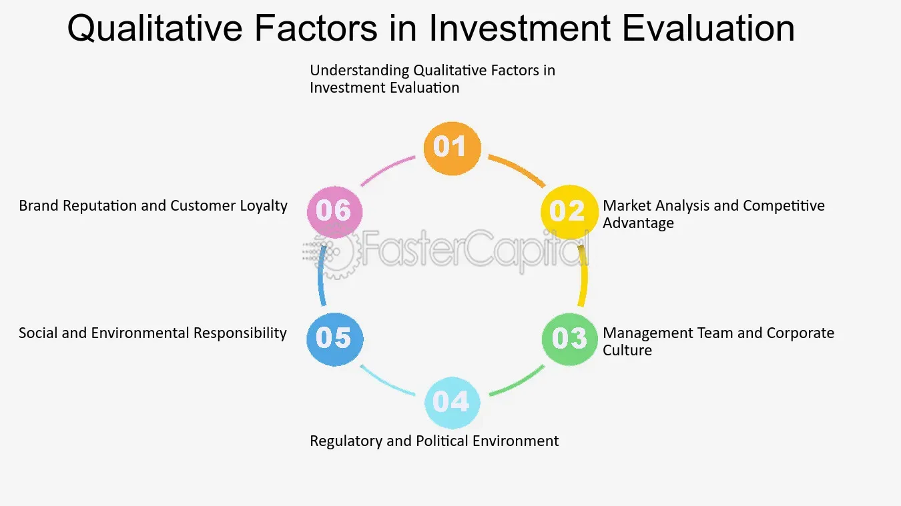

## Table of Contents

## What are qualitative factors in the context of evaluating company excellence?

Qualitative factors are important when evaluating how excellent a company is. These factors are not about numbers or data, but about things you can see and feel. For example, the company culture is a big qualitative factor. A good company culture means employees are happy and work well together. Another qualitative factor is the company's reputation. If people think highly of the company, it can attract better customers and employees.

Leadership is another important qualitative factor. Good leaders can make a big difference in how well a company does. They can inspire employees and make smart decisions. Customer satisfaction is also a key qualitative factor. If customers are happy with the company's products or services, they are more likely to come back and tell others about it. These qualitative factors help show how excellent a company really is, even if they don't show up in financial reports.

## How do qualitative factors differ from quantitative factors in company evaluation?

Qualitative factors and quantitative factors are two different ways to evaluate a company. Qualitative factors are about things you can't measure with numbers. They include things like the company's culture, reputation, leadership quality, and customer satisfaction. These factors give you a sense of how the company feels and operates from the inside out. For example, a company might have a great culture where employees feel valued and happy, which can lead to better teamwork and productivity.

On the other hand, quantitative factors are all about numbers and data. They include things like financial performance, sales figures, profit margins, and market share. These factors help you see the hard facts about how well a company is doing financially. For instance, you can look at a company's revenue growth over the past year to see if it's making more money. While quantitative factors give you clear, measurable data, qualitative factors provide a deeper understanding of the company's overall health and potential for success.

## Can you list some common qualitative factors used to assess a company's performance?

When people want to know how good a company is, they often look at qualitative factors. These are things you can't measure with numbers. One big qualitative [factor](/wiki/factor-investing) is the company's culture. A good culture means employees are happy and work well together. Another important factor is the company's reputation. If people think highly of the company, it can attract better customers and employees. Leadership also matters a lot. Good leaders can inspire employees and make smart decisions that help the company grow.

Customer satisfaction is another key qualitative factor. If customers are happy with the company's products or services, they are more likely to come back and tell others about it. The company's innovation is also important. If a company is always coming up with new ideas and products, it can stay ahead of its competitors. Finally, the company's social responsibility can affect its performance. If a company is seen as doing good things for the community or the environment, it can improve its image and attract more support.

## Why are qualitative factors important in evaluating a company's long-term success?

Qualitative factors are really important when thinking about a company's long-term success. These factors, like company culture, leadership, and customer satisfaction, help show how healthy the company is inside. A good culture means employees are happy and work well together, which can lead to better teamwork and more ideas. Strong leadership can guide the company through tough times and make smart choices for the future. If customers are happy, they keep coming back and tell others about the company, which helps it grow over time.

These qualitative factors also affect how people see the company from the outside. A good reputation can attract better employees and more customers. If a company is known for being innovative and socially responsible, it can stand out from its competitors. Over time, these things build trust and loyalty, which are key for long-term success. While numbers and data are important, qualitative factors give a deeper understanding of what makes a company great and likely to succeed in the future.

## How can a company's corporate culture be evaluated as a qualitative factor?

A company's corporate culture can be evaluated by looking at how employees feel about their workplace. You can talk to employees or have them fill out surveys to see if they feel happy, valued, and supported at work. If employees say good things about their job and the company, it's a sign of a strong culture. You can also look at how well people work together and if there's a lot of teamwork. If everyone helps each other and works towards the same goals, that shows a positive culture.

Another way to evaluate corporate culture is by looking at how the company treats its employees. Do they offer good benefits, training, and chances to grow in their jobs? If the company takes care of its employees, it shows that the culture values them. You can also see the culture in action by watching how leaders behave and communicate. If leaders are open, honest, and care about their team, it helps create a good culture. All these things together help you understand if the company's culture is strong and positive, which is important for long-term success.

## What role does leadership quality play in the qualitative assessment of a company?

Leadership quality is a big part of figuring out how good a company is. Good leaders can make a big difference. They can inspire people to work hard and come up with new ideas. They also make smart choices that help the company grow. If leaders are honest and care about their team, it makes the company a better place to work. This can make employees happier and more likely to stay with the company.

Leaders also set the tone for the whole company. If they show good values and treat people well, it can make the company's culture strong. A strong culture helps everyone work together better. On the other hand, if leaders are not good, it can make the company weak. Bad leaders might make people feel unhappy or not valued, which can hurt the company in the long run. So, looking at how good the leaders are is a key part of understanding how well a company is doing.

## How do customer satisfaction and brand reputation contribute to qualitative evaluation?

Customer satisfaction is a big part of figuring out how good a company is. When customers are happy with what they get from a company, they are more likely to come back and buy more. They might also tell their friends and family about the company, which can bring in new customers. Happy customers can make the company grow over time. If a company listens to its customers and tries to make them happy, it shows that the company cares about doing a good job. This can make the company stronger and more successful in the long run.

Brand reputation is also important for understanding a company's quality. If people think highly of a company, it can attract better customers and employees. A good reputation means that the company is known for doing things well and treating people right. This can help the company stand out from others and be more successful. On the other hand, if a company has a bad reputation, it can lose customers and have a hard time growing. So, a strong brand reputation can help a company do well over time by building trust and loyalty with people.

## What methods can be used to gather data on qualitative factors for company analysis?

One way to gather data on qualitative factors is by talking to people. This can mean having interviews or focus groups with employees, customers, or even industry experts. When you talk to employees, you can learn about the company's culture and how they feel about their jobs. Customers can tell you if they are happy with the company's products or services. Industry experts might give you a big picture view of the company's reputation and how it compares to others. All these conversations help you understand things like leadership quality, customer satisfaction, and brand reputation.

Another way to gather qualitative data is by using surveys and questionnaires. These can be sent to employees or customers to get their thoughts and feelings about the company. Surveys can ask about things like how happy employees are at work or how satisfied customers are with what they bought. The answers can show you patterns and trends in how people see the company. You can also look at online reviews and social media comments to see what people are saying about the company. This can give you a sense of the company's reputation and how it's seen by the public.

## How can qualitative factors be integrated into a comprehensive company evaluation framework?

To include qualitative factors in a full company evaluation, you need to mix them with the numbers and data that show how well the company is doing financially. Start by gathering information on qualitative things like company culture, leadership, customer satisfaction, and brand reputation. You can do this by talking to employees and customers, using surveys, and looking at online reviews. Once you have this information, you can see how these qualitative factors affect the company's overall health and future success. For example, a happy workforce might lead to better teamwork and more ideas, which can help the company grow.

After you collect the qualitative data, you can put it together with the quantitative data, like sales numbers and profits. This gives you a complete picture of the company. You can see if the company's strong culture and good reputation help it make more money or attract more customers. By looking at both the numbers and the feelings about the company, you get a better understanding of its strengths and weaknesses. This helps you make smarter decisions about the company's future and how it can keep improving.

## What are some challenges in accurately measuring qualitative factors in company performance?

Measuring qualitative factors like company culture, leadership quality, and customer satisfaction can be hard because these things are not easy to put into numbers. People's feelings and opinions can change a lot, and what one person thinks might be different from what another person thinks. For example, one employee might love the company culture while another might not feel the same way. This makes it tough to get a clear picture of how the company is doing in these areas. Also, it can be hard to compare qualitative data from different companies because each company is unique and what works for one might not work for another.

Another challenge is that qualitative data often relies on what people say in interviews, surveys, or online reviews. These methods can be affected by who is answering and how they feel at the time. Someone might give a different answer on a good day than on a bad day. It's also possible that people might not want to share their true feelings, especially if they think it could affect their job or relationship with the company. This means the data you collect might not always be completely accurate or representative of everyone's experiences. Despite these challenges, qualitative factors are still very important for understanding a company's overall health and potential for long-term success.

## How do industry-specific qualitative factors affect the evaluation of company excellence?

Industry-specific qualitative factors are important when figuring out how good a company is. Different industries have their own special things that matter a lot. For example, in the tech industry, being innovative and having a good team of smart people is really important. If a tech company is always coming up with new ideas and has a team that works well together, it can do better than other companies. In the healthcare industry, trust and how well patients are taken care of are big factors. If a healthcare company has a good reputation for taking care of people and making them feel safe, it can be seen as excellent.

These industry-specific factors can change how we see a company's performance. For example, a restaurant might be judged on how happy its customers are and how good its food tastes. If customers love the food and keep coming back, it shows the restaurant is doing well. But in the construction industry, safety and how well projects are managed are more important. If a construction company is known for keeping its workers safe and finishing projects on time, it can be seen as excellent. So, knowing what matters in each industry helps us understand what makes a company stand out and do well.

## Can you discuss advanced qualitative analysis techniques used by experts to evaluate company excellence?

Experts use advanced qualitative analysis techniques to get a deeper understanding of how excellent a company is. One technique is called thematic analysis. This involves looking at things like interviews, surveys, and even company documents to find common themes or patterns. For example, if many employees talk about feeling valued and supported, this theme shows a strong company culture. Experts can then use this information to see how the company's culture affects its overall performance. Another technique is narrative analysis, where experts look at the stories people tell about their experiences with the company. These stories can show how leadership, customer satisfaction, and other qualitative factors play out in real life.

Another advanced technique is grounded theory, which helps experts build theories about how qualitative factors work within a company. They start by collecting a lot of data and then look for patterns and connections. This can help them understand how things like innovation and social responsibility affect the company's success. Experts might also use case study analysis, where they look at one company in detail to see how its qualitative factors lead to excellence. By studying the company's history, culture, and leadership, they can learn lessons that might help other companies improve. These advanced techniques help experts get a full picture of what makes a company truly excellent.

## References & Further Reading

[1]: McShane, S., & Von Glinow, M. A. (2008). ["Organizational Behavior (4th ed.)"](https://www.amazon.com/M-Organizational-Behavior-Steven-McShane/dp/1260261565) McGraw-Hill Higher Education.

[2]: Gaines, C. (2014). ["Whole Foods: How ERP Software can Help"](https://www.scribd.com/document/341069745/CASE-03-Whole-Foods-Market-in-2014-Visio-pdf) ERP News.

[3]: Gittell, J. H. (2003). ["The Southwest Airlines Way: Using the Power of Relationships to Achieve High Performance"](https://www.researchgate.net/publication/37152850_The_Southwest_Airlines_Way_Using_the_Power_of_Relationships_to_Achieve_High_Performance) McGraw-Hill Education.

[4]: Tsai, C. L., Lin, C. H., Yeh, J. H. (2013). ["Quantitative vs. Qualitative Approaches: Researchers Need to View Trading From Different Angles."](https://www.sciencedirect.com/science/article/pii/S1359645413003431) SAGE Open.

[5]: Lawrence, L. (2010). ["Qualitative Methods in Research on Risk: Challenges and Potentials."](https://www.academia.edu/15494640/Are_We_There_Yet_Data_Saturation_in_Qualitative_Research) Journal of Risk Research.