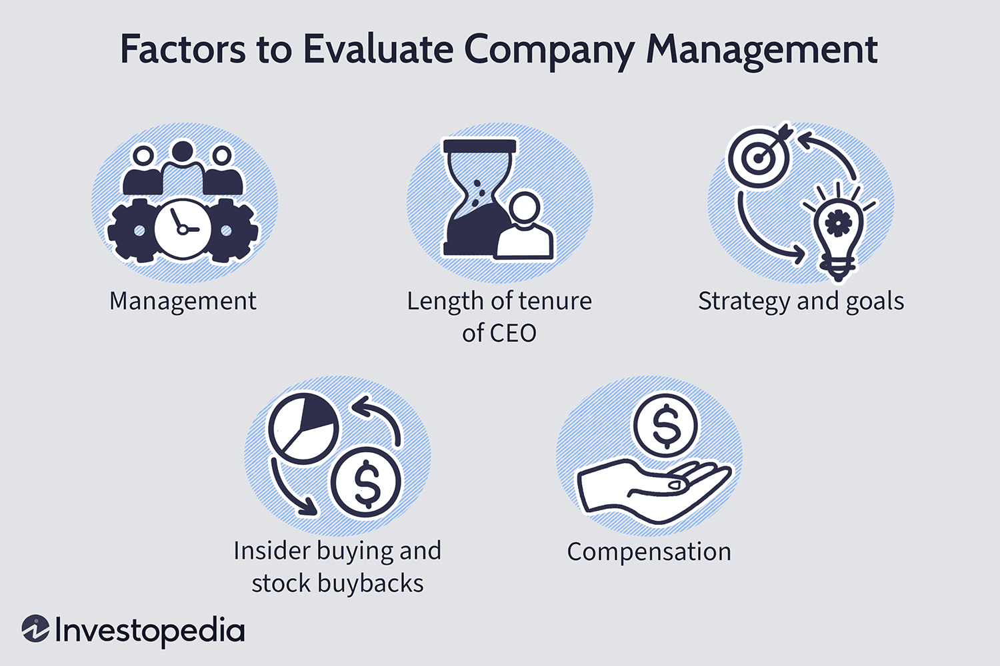

Qualitative analysis is a crucial component in evaluating the greatness of a business, especially in the dynamic field of algorithmic trading. In an industry predominantly driven by data and numbers, the allure of quantitative metrics often overshadows the nuanced understanding that qualitative analysis provides. This form of analysis investigates into non-quantifiable factors that can significantly influence a company’s performance and potential, such as the quality of management, strength of brand, and customer satisfaction. These are elements that cannot simply be distilled into numerical data but require a subtler approach to fully appreciate their impact.

Algorithmic trading, with its reliance on automated systems for trade execution, is no exception to the benefits of qualitative analysis. Although algorithms thrive on quantitative data inputs, incorporating qualitative insights can offer a competitive edge. Factors such as leadership vision, corporate culture, and adaptability to market conditions are integral to the long-term success of any company involved in algorithmic trading. Understanding these aspects can help traders and investors make informed decisions, anticipate market movements, and enhance the precision of trading strategies.



This article explores the vital role of qualitative analysis in the context of algo trading, emphasizing the need to balance numerical data with qualitative insights. By integrating these soft metrics into business evaluations, stakeholders are equipped with a comprehensive view of a company's potential. As algorithmic trading continues to evolve, recognizing and valuing qualitative factors alongside hard data will become increasingly crucial for sustained success in this competitive landscape.

## Table of Contents

## Understanding Qualitative Analysis

Qualitative analysis is an integral part of comprehending the comprehensive landscape of a business, focusing predominantly on intangible factors that influence its trajectory and potential. Unlike quantitative analysis, which derives understanding from measurable and numerical data, qualitative analysis allows for a broader evaluation by examining non-quantifiable elements such as management quality, company culture, and prevailing market conditions.

Management quality is a pivotal component of qualitative analysis. It involves assessing the experience, vision, and competence of the leadership team. Effective leadership can significantly shape strategic direction, influence organizational culture, and drive performance. Analysts often look at past achievements, decision-making processes, and leadership styles to judge the potential impact of management on business success.

Company culture also plays a crucial role in qualitative analysis. A healthy company culture fosters innovation, enhances employee satisfaction, and improves customer service. It can serve as a source of sustainable competitive advantage by promoting alignment between organizational goals and employee behavior. Understanding company culture involves examining employee engagement levels, internal communication practices, and workplace environments.

Market conditions form another critical facet of qualitative analysis. They include industry trends, competitive landscape, and regulatory environment. For example, analyzing market conditions helps identify whether a company is well-positioned to capitalize on emerging trends or if it faces significant regulatory hurdles that could impede growth. It also entails understanding the dynamism of consumer preferences and technological advancements that might affect business operations.

Finally, corporate governance is an essential element of qualitative analysis. It refers to the framework of rules, relationships, systems, and processes within and by which authority is exercised and controlled within organizations. Good governance is indicative of sound ethical principles and contributes to a positive corporate image, reducing risks of fraud and mismanagement. It typically involves evaluating board structures, ownership distribution, and transparency in operations.

In conclusion, while quantitative analysis offers concrete metrics, qualitative analysis delivers insights into the other realms of a business, thereby providing a holistic understanding of its potential for success.

## Key Elements of Qualitative Business Evaluation

In-depth analysis of management and leadership provides valuable insights into a company's strategic vision and execution capabilities. Evaluating management involves assessing their experience, track record, and ability to respond to market changes. Effective leadership is often characterized by transparent communication, innovation, and a strong understanding of industry dynamics. The strategic decisions made by management can profoundly impact a company's trajectory, influencing everything from day-to-day operations to long-term growth potential.

The adaptability of a business model to changing market conditions is critical in maintaining competitive advantages. A robust business model not only outlines how a company creates and captures value but also demonstrates the agility to pivot when necessary. This adaptability is particularly significant in industries subject to rapid technological advancements or volatile consumer preferences. By identifying early signs of market shifts, businesses can proactively modify their models to remain relevant and competitive.

Industry conditions, including the regulatory environment and growth trends, play a significant role in shaping business operations. Regulatory frameworks can impose constraints or offer opportunities, depending on the nature of the industry. Companies must navigate these regulations carefully to ensure compliance and avoid potential penalties. Growth trends, such as technological innovations and demographic shifts, also influence strategic planning. Businesses that align themselves with favorable industry trends are better positioned to capitalize on emerging opportunities. Understanding these external factors is essential for crafting strategies that support sustainable growth and resilience in changing environments.

## Role of Qualitative Analysis in Algo Trading

Qualitative analysis plays a crucial role in [algorithmic trading](/wiki/algorithmic-trading) by providing insights that quantitative models alone cannot capture. While quantitative models rely heavily on historical data and statistical methods to predict market movements, they often fall short in accounting for human behavior and sentiment, which can significantly influence markets. Qualitative analysis addresses this gap by incorporating non-numerical data that contributes to a more comprehensive understanding of market dynamics.

Understanding market sentiment through qualitative analysis is essential for anticipating market movements and refining trading algorithms. Market sentiment reflects the overall attitude of investors toward a particular security or financial market and can be influenced by factors such as economic indicators, news reports, and geopolitical events. By analyzing these elements, traders can gauge investor mood and adapt their strategies accordingly. For instance, sentiment analysis using natural language processing (NLP) techniques on social media data and financial news can uncover trends that may not yet be reflected in quantitative data. Implementation of sentiment analysis in Python could be demonstrated like this:

```python
from textblob import TextBlob

def analyze_sentiment(text):
    blob = TextBlob(text)
    sentiment_score = blob.sentiment.polarity
    return sentiment_score

# Example usage
news_article = "The market is showing signs of bullish behavior with increasing investor confidence."
sentiment = analyze_sentiment(news_article)
print(f"Sentiment score: {sentiment}")
```

This code utilizes the TextBlob library to evaluate the sentiment polarity of a news article, helping traders interpret the potential implications for market movements.

Incorporating qualitative insights requires analyzing a variety of sources such as management interviews, company reports, and news analysis. Management interviews can provide information on strategic direction and leadership vision, which are crucial for gauging a firm's future prospects. Company reports offer insights into corporate culture and governance practices, influencing investor confidence and long-term viability. Moreover, news analysis conducted through automated algorithms can rapidly assess the impact of breaking news on trading strategies.

For example, an algorithm trained to capture the frequency of certain terms in financial reports can efficiently quantify qualitative aspects:

```python
from collections import Counter

def keyword_frequency(document, keywords):
    words = document.lower().split()
    frequency = Counter(words)
    return {word: frequency[word] for word in keywords}

# Example usage
financial_report = "The company focuses on innovation and leadership to drive growth in emerging markets."
keywords = ["innovation", "leadership", "growth"]
frequency = keyword_frequency(financial_report, keywords)
print(f"Keyword frequency: {frequency}")
```

This method helps identify how often critical qualitative factors are mentioned, supporting a more nuanced evaluation of a company's emphasis on key strategic elements.

In summary, qualitative analysis is integral to enhancing the accuracy of decision-making in algorithmic trading by capturing insights that quantitative models might overlook. By merging these insights into trading strategies, traders can better anticipate market shifts and refine algorithms to adapt to both predictable patterns and unexpected changes.

## Case Studies Highlighting Success

The success of companies like Zappos and Whole Foods demonstrates how qualitative factors such as employee and supplier satisfaction play a pivotal role in achieving long-term business success. Zappos, renowned for its exceptional customer service, has built a corporate culture that prioritizes employee happiness, which in turn translates to superior customer experiences. This is achieved through initiatives like comprehensive training programs and robust support systems for staff, fostering an environment where employees are motivated and empowered to exceed customer expectations. According to a study by McShane and Von Glinow (2008), Zappos' emphasis on employee satisfaction significantly contributes to their high customer loyalty and repeat business, reinforcing the company's competitive advantage in the e-commerce sector.

Similarly, Whole Foods Market emphasizes maintaining strong partnerships with suppliers and ensuring employee well-being. Their commitment to ethical sourcing and sustainable practices has cultivated a robust supply chain, ensuring high-quality products that align with consumer values. Whole Foods' decentralized management approach empowers individual stores to adapt to local preferences, enhancing the overall customer shopping experience. This strategy has bolstered Whole Foods' reputation as a leading retailer of natural and organic foods (Gaines, 2014).

JetBlue Airways exemplifies the impact of focusing on employee morale on customer satisfaction and operational performance. By fostering a corporate culture that values open communication and employee engagement, JetBlue has succeeded in enhancing both employee and customer experiences. Initiatives such as crewmember feedback programs and development opportunities have led to increased job satisfaction, directly correlating with improved service quality and customer satisfaction scores (Gittell, 2003).

These cases underscore the significance of qualitative elements like employee satisfaction, corporate culture, and supplier relationships in shaping a company's trajectory in competitive markets. Companies that recognize and invest in these qualitative factors often achieve sustainable success, reinforcing the importance of integrating qualitative insights into business strategies.

## Challenges and Considerations

Qualitative analysis, while essential, inherently faces challenges due to its reliance on subjective judgments and the risk of potential biases. These challenges stem from the difficulty in quantifying non-numerical attributes such as managerial effectiveness and company culture. The subjective nature of qualitative analysis means that it requires individuals to interpret data through personal experiences and perspectives, which can introduce biases and inconsistencies. Furthermore, the lack of standardization in assessing qualitative factors only amplifies these issues, making it harder to ensure reliable and reproducible evaluations.

Investment professionals often undervalue qualitative insights, focusing instead on hard data and quantifiable evidence. The preference for numerical data stems from the perception that quantitative analysis provides a more objective and scientific basis for decision-making. Numbers and formulas give a sense of certainty and rigor, often leading investors to overlook qualitative indicators that could be critical in predicting future performance. This undervaluation can lead to an incomplete understanding of a company’s potential and risks, thereby affecting investment decisions negatively.

To address these challenges, a comprehensive evaluation approach that integrates qualitative analysis with quantitative methods can be effective. This combined strategy helps mitigate inherent biases by providing a more balanced perspective. By leveraging the strengths of both analyses, investors and analysts can achieve a fuller picture of a company's potential. For instance, qualitative insights into management quality can inform adjustments in quantitative models that predict company performance.

Consider a scenario in Python where sentiment analysis is conducted on company reports to quantify qualitative insights. Such an approach can bridge the gap between qualitative and quantitative data:

```python
from textblob import TextBlob

def analyze_sentiment(document):
    # Assuming 'document' is a string of company report text
    analysis = TextBlob(document)
    # Return the sentiment polarity score, ranging from -1 to 1
    return analysis.sentiment.polarity

# Example usage:
company_report = "The management demonstrated a strong commitment to innovation and community engagement."
sentiment_score = analyze_sentiment(company_report)
print("Sentiment Score:", sentiment_score)
```

This example illustrates how qualitative data, such as text from company reports, can be translated into numerical sentiment scores that contribute to the overall evaluation framework. The blending of qualitative insights with quantitative models can thus create a more robust and less biased foundation for evaluating business greatness, particularly in fields like algorithmic trading where both qualitative and quantitative factors are crucial for success.

## Conclusion

Qualitative analysis serves as a vital instrument for assessing company excellence, particularly in the rapidly changing domain of algorithmic trading. Traditional reliance on quantitative data alone can be limiting in capturing the full spectrum of a business's potential. By incorporating qualitative insights, investors and strategists acquire a more comprehensive understanding of a company's strengths and vulnerabilities. These "soft metrics" include evaluations of management proficiency, corporate culture dynamics, and industry-specific conditions that are often overlooked in purely quantitative assessments.

For those engaged in algorithmic trading, the successful synthesis of qualitative and quantitative analysis can significantly enhance predictive accuracy and strategic decision-making. Quality of leadership, employee satisfaction, and corporate governance are among the elements that qualitative analysis scrutinizes, offering a more nuanced perspective that complements numerical data. Investors who integrate these insights into their trading algorithms can potentially achieve a competitive edge through refined models that anticipate market movements more effectively.

The future prosperity of algorithmic trading largely depends on acknowledging the importance of qualitative factors alongside traditional quantitative methods. As markets grow more complex, this dual approach becomes essential, allowing for adaptive strategies that respond to both measurable trends and qualitative dimensions. Recognizing the inherent value of qualitative analysis could, therefore, be pivotal for sustained success in the evolution of algorithmic trading strategies.

## References & Further Reading

[1]: McShane, S., & Von Glinow, M. A. (2008). ["Organizational Behavior (4th ed.)"](https://www.amazon.com/M-Organizational-Behavior-Steven-McShane/dp/1260261565) McGraw-Hill Higher Education.

[2]: Gaines, C. (2014). ["Whole Foods: How ERP Software can Help"](https://www.scribd.com/document/341069745/CASE-03-Whole-Foods-Market-in-2014-Visio-pdf) ERP News.

[3]: Gittell, J. H. (2003). ["The Southwest Airlines Way: Using the Power of Relationships to Achieve High Performance"](https://www.researchgate.net/publication/37152850_The_Southwest_Airlines_Way_Using_the_Power_of_Relationships_to_Achieve_High_Performance) McGraw-Hill Education.

[4]: Tsai, C. L., Lin, C. H., Yeh, J. H. (2013). ["Quantitative vs. Qualitative Approaches: Researchers Need to View Trading From Different Angles."](https://www.sciencedirect.com/science/article/pii/S1359645413003431) SAGE Open.

[5]: Lawrence, L. (2010). ["Qualitative Methods in Research on Risk: Challenges and Potentials."](https://www.academia.edu/15494640/Are_We_There_Yet_Data_Saturation_in_Qualitative_Research) Journal of Risk Research.