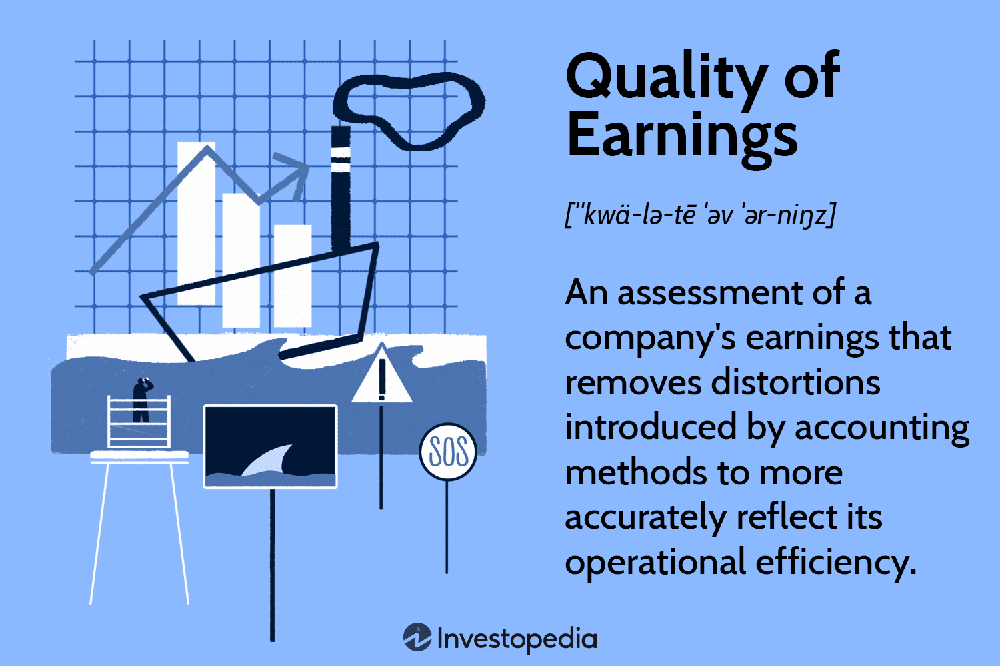

In today's rapidly evolving financial landscape, grasping key concepts such as investment earnings quality, financial analysis, and algorithmic trading is essential for making informed decisions. Investment earnings quality reflects the authenticity of a company's financial reports, distinguishing sustainable earnings from those influenced by temporary or manipulative accounting practices. High-quality earnings are transparent, consistent, and indicative of a company's genuine economic performance.

Financial analysis plays a pivotal role in evaluating these earnings, allowing investors to discern the true financial health of a company. By employing various analytical tools, such as ratio analysis and trend evaluation, stakeholders can identify anomalies or one-time events that may inflate earnings. These insights are critical for strategic planning and effective risk management.



Algorithmic trading, a key component in modern finance, also benefits substantially from incorporating earnings quality analysis. Algorithms that assess earnings quality can rapidly process financial data, enhancing decision-making and strategy formulation. This precision not only mitigates potential market risks but also identifies opportunities for profitable trades.

This article focuses on the importance of earnings quality and its influence on financial decisions and algorithmic trading strategies. It provides insights into evaluating earnings quality and harnessing it for successful investment outcomes, thereby equipping readers with vital knowledge to thrive in the financial sector.

## Table of Contents

## Understanding Investment Earnings Quality

Earnings quality is a fundamental measure in financial analysis, scrutinizing the extent to which reported income captures the true economic performance of a company. It is essential for investors to differentiate between earnings generated from the core operations and those influenced by accounting practices that might temporarily boost financial results.

Sustainable earnings arise from a company's primary business activities, reflecting ongoing, predictable revenue streams that investors value for their consistency and reliability. For instance, revenues from product sales or service contracts represent core operational earnings. On the other hand, earnings boosted by accounting maneuvers may include non-operational gains such as asset sales or restructuring that do not indicate a company's everyday performance capabilities.

High-quality earnings are characterized by several features:

1. **Consistency**: Earnings should demonstrate a stable performance over time, free from significant fluctuations that suggest volatility or financial manipulation. Investors should examine past earnings reports to establish patterns and gauge reliability.

2. **Transparency**: Companies with high earnings quality present their financial data clearly, with ample disclosure and minimal complexity. Transparency allows stakeholders to gain insight into the financial statements, ensuring nothing is obscured.

3. **Absence of Anomalies**: High-quality earnings lack unusual, transitory items that are unlikely to recur. These may include one-time gains or losses, such as litigation settlements or natural disaster impacts, which do not reflect the regular earnings capacity of a business.

By focusing on these attributes, investors can gain a better understanding of a company's financial reality, distinguishing genuine growth from figures that are temporarily elevated by non-sustainable factors. Analyzing earnings quality requires diligent attention to detailed disclosures within financial statements, aided by metrics such as the cash flow to net income ratio or the quality of earnings ratio, which can quantify the tangible nature of reported profits.

## Importance of Earnings Quality in Financial Analysis

Earnings quality is a vital determinant in financial analysis, serving as a foundation for making well-informed investment decisions and steering clear of financially precarious companies. High earnings quality denotes the reliability and sustainability of earnings that truly reflect a company’s operational efficiency and economic performance. This attribute is essential in discerning between sustainable earnings from core business operations and those that might be inflated or distorted through accounting tactics or one-off events.

A crucial aspect of earnings quality lies in its ability to offer a transparent and accurate portrayal of a company’s financial health. When investors assess a firm’s earnings quality, they gain insight into potential earnings sustainability and the degree of risk associated with the company’s financial practices. For instance, a company with high earnings quality is generally characterized by its consistent performance, adherence to accounting standards like Generally Accepted Accounting Principles (GAAP), and minimal reliance on accounting adjustments for financial representation. Consequently, this consistency aids investors in strategizing for risk management and future planning, ultimately leading to more prudent investment choices.

Analysts often rely on various metrics and indicators to evaluate and predict a company’s future performance, utilizing earnings quality as a predictor of potential financial success or distress. Key metrics might include the analysis of non-operating items, the [volatility](/wiki/volatility-trading-strategies) of earnings, and the ratio between cash flows and reported net income. Such indicators are instrumental in ensuring compliance with accounting standards, thereby providing a safeguard against manipulative financial reporting practices.

Moreover, understanding earnings quality can mitigate risks associated with financial misrepresentation. Earnings that are consistently aligned with cash flows and adhere to GAAP are considered a benchmark for financial stability and integrity. This alignment helps analysts and investors forecast earnings more accurately, assess corporate governance quality, and determine the likelihood of long-term growth. As a result, high earnings quality can significantly enhance the strategic decision-making process, enabling investors to allocate resources more effectively and achieve sustainable returns.

In summary, earnings quality is indispensable in financial analysis, offering a refined lens through which investors can evaluate the true financial standing of a company. By focusing on reliable and transparent earnings metrics, investors are better equipped to make informed decisions, manage risks, and strategically plan for future growth, ensuring compliance and financial prudence.

## Methods for Evaluating Earnings Quality

Analysts utilize various methodologies to evaluate the quality of a company's earnings, providing crucial insights into its financial integrity and performance. Among the primary methods employed are ratio analysis, trend analysis, and audit reviews.

Ratio analysis is a fundamental technique used to assess earnings quality. This involves examining financial ratios that reveal the relationship between different elements of a company's financial statements. A vital ratio in this context is the accruals ratio, which measures the extent of earnings derived from accruals rather than cash flow. The formula for the accruals ratio is:

$$
\text{Accrual Ratio} = \frac{\text{(Net Income - Cash Flow from Operations)}}{\text{Total Assets}}
$$

A high accruals ratio may indicate that a significant portion of earnings is not derived from cash operations, suggesting lower earnings quality.

Trend analysis further aids in evaluating earnings quality by examining financial data over multiple periods to identify patterns affecting earnings sustainability. Analysts look for consistency in earnings figures, noting any significant fluctuations or one-time items that could distort the true economic performance of a company.

Audit reviews provide an additional layer of scrutiny. Through these expert examinations, the accuracy of financial statements is verified, ensuring compliance with accounting standards and detecting any manipulative reporting.

Technological advancements have introduced tools and platforms that streamline the process of earnings evaluation. These platforms offer real-time data feeds and sophisticated analytics to enhance the accuracy and speed of financial assessments. Algorithms can process vast amounts of financial data quickly, identifying trends and anomalies that might be missed through manual analysis. By leveraging such technology, analysts can improve precision in evaluating earnings quality.

Collectively, these methods allow for a comprehensive assessment of earnings quality, equipping investors and analysts with reliable metrics to inform their financial decisions.

## Earnings Quality and Algorithmic Trading

Algorithmic trading has evolved significantly with the incorporation of earnings quality analysis, offering traders a sophisticated tool for enhancing decision-making and formulating strategies. This approach leverages advanced AI algorithms to process and evaluate vast amounts of financial data efficiently, pinpointing companies with high-quality earnings and mitigating potential market risks associated with firms exhibiting poor earnings quality.

AI algorithms are particularly adept at handling diverse data sets, including earnings reports, balance sheets, and cash flow statements, to identify patterns and anomalies indicative of earnings quality. For algorithmic traders, integrating these insights enables the development of robust trading models that [factor](/wiki/factor-investing) in both quantitative metrics and qualitative assessments of earnings performance. By identifying high-quality earnings, traders can filter potential investments, focusing on companies with sustainable and transparent financial practices.

Python, with its extensive libraries such as NumPy, pandas, and scikit-learn, provides a powerful platform for implementing earnings quality assessments in an [algorithmic trading](/wiki/algorithmic-trading) context. For instance, [machine learning](/wiki/machine-learning) models can be trained using historical earnings data and corresponding market performance to predict future stock movements. An example Python snippet for loading and processing financial data might look like this:

```python
import pandas as pd

# Load earnings data
financial_df = pd.read_csv('financial_data.csv')

# Calculate key earnings quality metrics
financial_df['accrual_ratio'] = (financial_df['net_income'] - financial_df['cash_from_operations']) / financial_df['total_assets']

# Define a function to identify high-quality earnings based on certain thresholds
def identify_high_quality_earnings(df):
    quality_earnings = df[
        (df['accrual_ratio'] < 0.1) & 
        (df['cash_from_operations'] > df['net_income'])
    ]
    return quality_earnings

# Apply the function to filter the high-quality earnings
high_quality_df = identify_high_quality_earnings(financial_df)
```

With these capabilities, algorithmic trading systems can integrate earnings quality metrics into their predictive models, enhancing accuracy and identifying profitable opportunities. The robust analysis aids in discerning between companies with genuine financial health and those whose earnings may be misleading due to aggressive accounting practices.

The integration of earnings quality analysis into algorithmic trading aligns with the increasing demand for transparency and sustainability in investment strategies. As financial markets grow more complex, combining earnings quality metrics with algorithmic trading represents a forward-thinking approach, optimizing both risk management and potential returns. The continual advancement of AI technologies and computational finance tools further strengthens this synergy, making it an invaluable part of modern trading strategies.

## Challenges in Assessing Earnings Quality

Evaluating earnings quality presents several challenges, primarily due to aggressive accounting practices that can obscure the true financial performance of a company. One significant issue is the potential manipulation of earnings, where companies may engage in techniques like income smoothing or premature revenue recognition to present a more favorable financial position. Such practices can mislead investors and analysts, affecting their assessment of the company's economic health.

Another challenge arises from non-recurring items that may distort the earnings picture. These include one-time events such as asset sales, legal settlements, or restructuring costs, which can inflate or deflate earnings figures temporarily. Investors must exercise caution in distinguishing sustainable earnings from these irregular items to avoid misjudging a company's operational success.

To navigate these complexities, continuous education is vital for investors and financial analysts. Understanding the latest accounting standards, such as the Generally Accepted Accounting Principles (GAAP) modifications, helps in recognizing aggressive accounting tactics. For example, if a company frequently changes its accounting policies or estimates, it might be an indicator of potential earnings manipulation.

Additionally, leveraging advanced analytics and technological tools can enhance the evaluation process. Computational models and machine learning algorithms can analyze large datasets to detect anomalies in financial statements swiftly. For instance, Python libraries such as NumPy and Pandas can be used to perform detailed financial ratio analysis and trend assessments. Here is a basic example of how one might use Python to analyze a company's financial data for anomalies:

```python
import pandas as pd

# Load financial data into a DataFrame
data = pd.read_csv('financial_statements.csv')

# Calculate accrual ratios to evaluate earnings quality
data['Accrual_Ratio'] = (data['Net_Income'] - data['Cash_Flow_Operations']) / data['Total_Assets']

# Identify potential red flags for earnings manipulations
threshold = 0.2
suspect_entries = data[data['Accrual_Ratio'].abs() > threshold]

print(suspect_entries)
```

This code snippet calculates an accrual ratio, an essential metric for assessing earnings quality. Entries with accrual ratios exceeding a certain threshold signal potential financial statement manipulations or aggressive accounting.

Investors must remain vigilant, consistently applying robust analytical methods and embracing technological advancements to uncover and understand the true quality of earnings. This proactive approach is crucial in mitigating the risks associated with misleading financial reporting.

## Conclusion

Earnings quality is a fundamental component in financial analysis, deeply affecting both investment decisions and strategies for algorithmic trading. High-quality earnings provide a clearer view of a company's financial health, aiding investors in minimizing risks and optimizing returns. As the financial landscape becomes increasingly complex, the emphasis on reliable earnings metrics becomes even more critical.

Emphasizing robust earnings quality metrics empowers investors to make informed decisions that align with their financial goals. Metrics such as accrual ratios and cash flow consistency illuminate the sustainability of earnings, offering insights into a company’s long-term viability. These indicators help distinguish genuine financial performance from figures that may be artificially inflated by one-time gains or manipulative accounting practices.

The integration of technological advancements further enhances the evaluation of earnings quality. Tools leveraging [artificial intelligence](/wiki/ai-artificial-intelligence) and machine learning analyze vast amounts of financial data swiftly and accurately. These technologies identify patterns and anomalies in earnings reports, offering investors and traders a competitive edge in the market. By refining the process of earnings analysis, technology aids in crafting data-driven strategies that increase the potential for success while mitigating exposure to poorly performing stocks.

Continuous adaptation to innovative technologies will be crucial for investors aiming to maintain relevance and achieve financial success in a market characterized by rapid change. As assessment capabilities evolve, the strategic use of comprehensive earnings quality analysis stands to play a pivotal role in the pursuit of improved financial outcomes.

## References & Further Reading

[1]: ["Higher Quality Earnings and Better Stock Returns: Does it Pay to Shun Income Smoothing?"](https://www.researchgate.net/publication/24103556_Earnings_Quality_and_Stock_Returns) Journal of Accounting and Economics.

[2]: ["Quality of Earnings"](https://www.investopedia.com/terms/q/qualityofearnings.asp) by Thornton L. O'glove

[3]: ["Financial Statement Analysis and Security Valuation"](https://www.amazon.com/Financial-Statement-Analysis-Security-Valuation/dp/0073379662) by Stephen Penman

[4]: ["Earnings Management: The Truth Behind the Numbers"](https://fastercapital.com/content/Earnings-Quality--Earnings-Quality--The-Truth-Behind-the-Numbers-in-Equity-Research.html) by Thomas E. McKee

[5]: ["The Impact of Earnings Quality on Investors' and Analysts' Reactions"](https://vtechworks.lib.vt.edu/bitstreams/8c44d967-8967-436d-aacc-2b1622bc62ac/download) Journal of Economic Behavior & Organization.

[6]: ["Quantitative Momentum: A Practitioner's Guide to Building a Momentum-Based Stock Selection System"](https://www.amazon.com/Quantitative-Momentum-Practitioners-Momentum-Based-Selection/dp/111923719X) by Wesley R. Gray and Jack Vogel

[7]: ["Python for Finance: Mastering Data-Driven Finance"](https://www.amazon.com/Python-Finance-Mastering-Data-Driven/dp/1492024333) by Yves Hilpisch