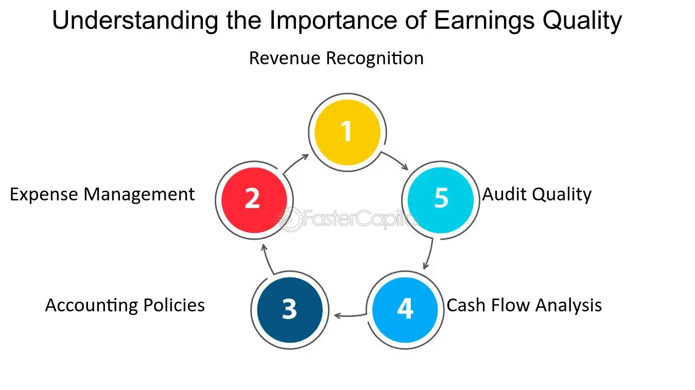

## Table of Contents

## What is meant by 'Quality of Earnings'?

Quality of Earnings refers to how reliable and sustainable a company's earnings are over time. It looks at whether the profits a company reports are coming from its main business activities or if they are being boosted by one-time events or accounting tricks. Investors and analysts care about this because they want to know if the company can keep making money in the future.

For example, if a company's earnings are high because it sold a piece of land, that's not as good as if the earnings came from selling more products or services. The first case might not happen again, while the second case shows the company is doing well in its core business. By looking at the quality of earnings, people can get a better idea of how healthy the company really is and make smarter decisions about investing in it.

## Why is the quality of earnings important for investors?

The quality of earnings is really important for investors because it tells them if a company's profits are real and likely to continue. If a company's earnings are high just because of a one-time event, like selling a building, that's not as good as if the earnings come from selling more of what the company usually does. Investors want to know if the company can keep making money in the future, not just have a good year because of something that won't happen again.

When investors look at the quality of earnings, they can make better choices about where to put their money. If a company's earnings are from its main business and are likely to keep coming, that's a good sign. It means the company is strong and healthy. But if the earnings are not from the main business and might not last, it could be a warning sign. So, understanding the quality of earnings helps investors pick companies that are more likely to do well over time.

## How can the quality of earnings be assessed in financial statements?

To assess the quality of earnings from financial statements, investors should look at where the money is coming from. They need to check if most of the earnings are from the company's main business activities, like selling products or services. If a big part of the earnings comes from one-time events, like selling a piece of land or a lawsuit settlement, that might mean the quality of earnings is not so good. It's also important to look at the cash flow statement to see if the earnings are turning into real cash. If the company is showing profits but not getting much cash, that could be a red flag.

Another way to check the quality of earnings is to look at the company's accounting practices. Some companies might use tricks to make their earnings look better than they really are. For example, they might change how they count their inventory or when they record sales. Investors should look at the notes in the financial statements to see if the company is doing anything unusual. If the earnings seem too good to be true, they might be. By looking at these things, investors can get a better idea of whether the company's earnings are real and likely to last.

## What are the common indicators of high-quality earnings?

High-quality earnings come from a company's main business activities, like selling products or services. If most of the money a company makes comes from what it usually does, that's a good sign. For example, if a car company makes most of its money from selling cars, that shows strong earnings quality. It means the company is doing well in its core business and can likely keep making money in the future.

Another sign of high-quality earnings is when the profits match up with the cash flow. If a company shows profits on its income statement and also has a lot of cash coming in, that's a good thing. It means the earnings are real and not just numbers on paper. Investors like to see that the money a company says it's making is actually coming in as cash.

Lastly, high-quality earnings are usually not affected by one-time events or accounting tricks. If a company's earnings are steady and come from regular business, without big boosts from selling assets or changing how they count things, that's a good indicator. It shows the company's earnings are reliable and sustainable over time.

## What are the red flags that might indicate poor quality of earnings?

One big red flag for poor quality of earnings is when a company's profits come from one-time events, not from its main business. For example, if a company sells a building or wins a lawsuit and that's where most of its money comes from, that's not good. These things might not happen again, so the earnings might not last. Investors want to see money coming from what the company usually does, like selling products or services. If the earnings are mostly from other stuff, it's a warning sign.

Another red flag is when the profits on the income statement don't match up with the cash flow. If a company says it's making a lot of money but not much cash is coming in, that's a problem. It might mean the company is using accounting tricks to make its earnings look better than they really are. For example, they might be changing how they count inventory or when they record sales. If the earnings seem too good to be true, they might be. So, it's important to look at the cash flow statement to see if the profits are real.

Lastly, if a company's earnings are going up and down a lot, that can be a sign of poor quality. Steady earnings usually come from a strong, stable business. But if the earnings are all over the place, it might mean the company is relying on things that won't last. It could also mean they're using accounting tricks to make the numbers look better some years. So, if the earnings are not consistent, that's something investors should be careful about.

## How do accounting policies and practices affect the quality of earnings?

Accounting policies and practices can really change how a company's earnings look. If a company uses tricks to make its earnings look better, that can make the quality of earnings worse. For example, a company might change how it counts its inventory or when it records sales to make its profits seem higher. This can fool investors into thinking the company is doing better than it really is. But if the earnings are not real and won't last, that's a problem. So, it's important for investors to look at the notes in the financial statements to see if the company is doing anything unusual with its accounting.

On the other hand, if a company uses honest and clear accounting practices, that can show good quality of earnings. When a company follows the rules and doesn't try to trick anyone, the earnings are more likely to be real and come from its main business. This makes it easier for investors to trust the numbers and believe that the company can keep making money in the future. So, understanding how a company does its accounting can help investors figure out if the earnings are high quality or not.

## Can you explain the difference between cash-based and accrual-based earnings in terms of quality?

Cash-based earnings are when a company only counts money when it actually comes in or goes out. This can make the earnings look more real because you can see the actual cash moving. But it can also make the earnings look uneven because sometimes the money comes in later than when the sale happens. For example, if a company sells something in December but doesn't get paid until January, the earnings for December might look low even though the company did well. So, cash-based earnings can show good quality because they're real, but they might not show the full picture of how the business is doing.

Accrual-based earnings are when a company counts money when it earns it or owes it, not just when the cash moves. This means if a company sells something in December, it counts that sale in December even if it gets paid in January. This can make the earnings look smoother and more like what's really happening in the business. But it can also be tricky because a company might use this to make its earnings look better than they really are. If the company is not careful, it might show profits that don't turn into real cash later. So, accrual-based earnings can show good quality if done right, but they need to be checked carefully to make sure they're not hiding problems.

## What role does earnings management play in the quality of earnings?

Earnings management is when a company changes its accounting to make its earnings look better or smoother. This can make the quality of earnings worse because the numbers might not show what's really happening in the business. If a company uses tricks to make its earnings look good, it might fool investors into thinking the company is doing better than it really is. But if the earnings are not real and won't last, that's a problem. So, earnings management can hide the true health of a company and make it hard for investors to trust the numbers.

On the other hand, if a company is honest and follows the rules, the quality of earnings can be better. When a company doesn't try to trick anyone and shows its earnings as they really are, investors can trust that the numbers are real. This means the earnings are more likely to come from the company's main business and be sustainable over time. So, understanding if a company is managing its earnings can help investors figure out if the earnings are high quality or not.

## How do analysts use ratios and metrics to evaluate the quality of earnings?

Analysts use different ratios and metrics to check the quality of earnings. One important ratio is the cash flow from operations to net income ratio. This ratio shows how much of the company's profits are turning into real cash. If this ratio is high, it means the earnings are good quality because the company is getting a lot of cash from its main business. But if the ratio is low, it might mean the company is using tricks to make its earnings look better than they really are. Another useful metric is the earnings before interest, taxes, depreciation, and amortization (EBITDA) to net income ratio. This helps analysts see if the company's earnings are coming from its core business activities or from other things like selling assets.

Another ratio analysts look at is the current ratio, which compares a company's current assets to its current liabilities. A high current ratio can show that the company has enough cash to cover its short-term debts, which is a good sign for the quality of earnings. Analysts also use the gross profit margin, which shows how much money the company makes from selling its products or services after paying for the costs of making them. A stable or growing gross profit margin can mean the company's earnings are high quality because it's doing well in its main business. By looking at these ratios and metrics, analysts can get a better idea of whether a company's earnings are real and likely to last.

## What are some advanced techniques for forensic analysis of earnings quality?

Forensic analysis of earnings quality involves digging deep into a company's financial statements to find out if the earnings are real or if the company is using tricks to make them look better. One advanced technique is called "trend analysis," where analysts look at the company's financial data over time to see if there are any unusual patterns or big changes that don't make sense. For example, if a company's earnings suddenly jump a lot without a good reason, that could be a red flag. Analysts also use "ratio analysis" to compare different numbers in the financial statements, like comparing the cash flow to net income. If these ratios are way off from what's normal for the industry, it might mean the company is playing with the numbers.

Another technique is called "Benford's Law," which helps analysts check if the numbers in the financial statements look natural. Benford's Law says that in a set of real numbers, certain digits should show up more often than others. If the numbers in a company's financial statements don't follow this pattern, it could mean someone is making up the numbers. Analysts also look at "related party transactions" to see if the company is doing business with people or other companies that are connected to it in some way. If a lot of the company's earnings come from these related parties, it might mean the earnings are not as good as they seem. By using these advanced techniques, analysts can find out if a company's earnings are high quality or if there's something fishy going on.

## How does the quality of earnings impact a company's valuation and stock price?

The quality of earnings can really change how much a company is worth and how its stock price moves. If a company's earnings are high quality, meaning they come from its main business and are likely to keep coming, investors will think the company is strong and healthy. This makes them want to buy the company's stock, which can push the stock price up. When investors believe in a company's earnings, they might also be willing to pay more for the company if someone wants to buy it. So, good quality earnings can make a company more valuable and its stock price higher.

On the other hand, if a company's earnings are low quality, meaning they come from one-time events or accounting tricks, investors might not trust the numbers. This can make them less interested in buying the company's stock, which can push the stock price down. If a company's earnings are not real and won't last, investors might not want to pay as much for the company if someone wants to buy it. So, poor quality earnings can make a company less valuable and its stock price lower.

## What are the regulatory and ethical considerations surrounding the reporting of earnings quality?

When companies report their earnings, they have to follow rules set by groups like the Securities and Exchange Commission (SEC) in the U.S. These rules are there to make sure companies tell the truth about their earnings. If a company lies or uses tricks to make its earnings look better, it can get in big trouble. The company might have to pay fines, and the people in charge might even go to jail. So, it's really important for companies to be honest and follow the rules when they report their earnings.

Besides following the rules, companies also need to think about what's right and wrong. It's not just about avoiding fines or jail time; it's about being fair to investors and other people who care about the company. If a company uses tricks to make its earnings look good, it's not being fair to the people who trust it. This can hurt the company's reputation and make people less likely to invest in it in the future. So, companies should always try to report their earnings in an honest way, even if it means showing lower profits sometimes.

## What are the methods for evaluating earnings quality?

Analysts utilize various methodologies to evaluate the quality of a company's earnings, providing crucial insights into its financial integrity and performance. Among the primary methods employed are ratio analysis, trend analysis, and audit reviews.

Ratio analysis is a fundamental technique used to assess earnings quality. This involves examining financial ratios that reveal the relationship between different elements of a company's financial statements. A vital ratio in this context is the accruals ratio, which measures the extent of earnings derived from accruals rather than cash flow. The formula for the accruals ratio is:

$$
\text{Accrual Ratio} = \frac{\text{(Net Income - Cash Flow from Operations)}}{\text{Total Assets}}
$$

A high accruals ratio may indicate that a significant portion of earnings is not derived from cash operations, suggesting lower earnings quality.

Trend analysis further aids in evaluating earnings quality by examining financial data over multiple periods to identify patterns affecting earnings sustainability. Analysts look for consistency in earnings figures, noting any significant fluctuations or one-time items that could distort the true economic performance of a company.

Audit reviews provide an additional layer of scrutiny. Through these expert examinations, the accuracy of financial statements is verified, ensuring compliance with accounting standards and detecting any manipulative reporting.

Technological advancements have introduced tools and platforms that streamline the process of earnings evaluation. These platforms offer real-time data feeds and sophisticated analytics to enhance the accuracy and speed of financial assessments. Algorithms can process vast amounts of financial data quickly, identifying trends and anomalies that might be missed through manual analysis. By leveraging such technology, analysts can improve precision in evaluating earnings quality.

Collectively, these methods allow for a comprehensive assessment of earnings quality, equipping investors and analysts with reliable metrics to inform their financial decisions.

## References & Further Reading

[1]: ["Higher Quality Earnings and Better Stock Returns: Does it Pay to Shun Income Smoothing?"](https://www.researchgate.net/publication/24103556_Earnings_Quality_and_Stock_Returns) Journal of Accounting and Economics.

[2]: ["Quality of Earnings"](https://www.investopedia.com/terms/q/qualityofearnings.asp) by Thornton L. O'glove

[3]: ["Financial Statement Analysis and Security Valuation"](https://www.amazon.com/Financial-Statement-Analysis-Security-Valuation/dp/0073379662) by Stephen Penman

[4]: ["Earnings Management: The Truth Behind the Numbers"](https://fastercapital.com/content/Earnings-Quality--Earnings-Quality--The-Truth-Behind-the-Numbers-in-Equity-Research.html) by Thomas E. McKee

[5]: ["The Impact of Earnings Quality on Investors' and Analysts' Reactions"](https://vtechworks.lib.vt.edu/bitstreams/8c44d967-8967-436d-aacc-2b1622bc62ac/download) Journal of Economic Behavior & Organization.

[6]: ["Quantitative Momentum: A Practitioner's Guide to Building a Momentum-Based Stock Selection System"](https://www.amazon.com/Quantitative-Momentum-Practitioners-Momentum-Based-Selection/dp/111923719X) by Wesley R. Gray and Jack Vogel

[7]: ["Python for Finance: Mastering Data-Driven Finance"](https://www.amazon.com/Python-Finance-Mastering-Data-Driven/dp/1492024333) by Yves Hilpisch