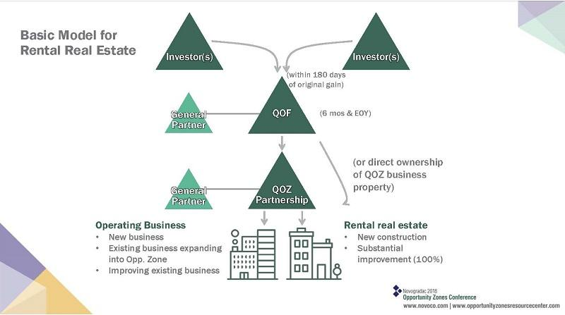

## Table of Contents

## What is a Quality Opportunity Fund?

A Quality Opportunity Fund is a type of investment fund that focuses on buying high-quality companies. These companies are usually well-managed and have strong financial performance. The goal of the fund is to grow the money invested over time by choosing companies that are likely to do well in the future.

Investors put their money into the fund, and the fund managers use that money to buy shares in these quality companies. This can be a good choice for people who want to invest their money but don't want to pick individual companies themselves. The fund spreads the risk by investing in a variety of companies, which can make it safer than investing in just one or two stocks.

## Who can invest in a Quality Opportunity Fund?

Anyone who wants to invest can put their money into a Quality Opportunity Fund. You don't need to be rich or a financial expert to invest. As long as you have some money to spare and are looking for a way to grow it over time, you can join the fund.

These funds are open to individual investors, families, and even businesses. The main thing you need to do is to check the minimum investment amount required by the fund. This amount can vary, so make sure it fits with how much money you can invest. Once you're in, the fund managers will take care of choosing the right companies to invest in, making it easier for you to grow your savings.

## What are the main objectives of a Quality Opportunity Fund?

The main goal of a Quality Opportunity Fund is to help investors grow their money by choosing to invest in high-quality companies. These companies are usually well-run and have a strong track record of making profits. By focusing on such companies, the fund aims to increase the value of the investors' money over time. This can be a good choice for people who want to invest but don't want to pick individual companies themselves.

Another important objective is to spread the risk for investors. Instead of putting all the money into one or two companies, the fund invests in a variety of quality companies. This way, if one company doesn't do well, the impact on the overall fund is smaller. It's like not putting all your eggs in one basket. This approach can make investing safer and more stable for people who join the fund.

## How does a Quality Opportunity Fund differ from other investment funds?

A Quality Opportunity Fund is different from other investment funds because it focuses on buying shares in high-quality companies. These companies are picked because they are well-managed and have a strong history of making profits. Other funds might focus on different things, like investing in new or small companies, or in companies that might be risky but could grow a lot. A Quality Opportunity Fund, on the other hand, aims for steady growth by choosing companies that are already doing well and are likely to keep doing well.

Another way a Quality Opportunity Fund stands out is its approach to risk. While some funds might try to make big gains quickly by taking big risks, a Quality Opportunity Fund tries to spread the risk by investing in a variety of strong companies. This means that if one company doesn't do well, it won't hurt the whole fund as much. This can make it a safer choice for people who want to grow their money but don't want to take big risks.

## What types of assets are typically included in a Quality Opportunity Fund?

A Quality Opportunity Fund typically includes stocks of high-quality companies. These companies are chosen because they have good management and a strong history of making profits. They are often in industries that are stable and likely to grow over time. The fund might invest in companies from different sectors, like technology, healthcare, or consumer goods, to spread the risk and increase the chances of steady growth.

In addition to stocks, a Quality Opportunity Fund might also hold some cash or cash equivalents. This is to make sure the fund can take advantage of new investment opportunities when they come up. The focus, though, is mainly on stocks of quality companies, as the goal is to grow the investors' money over time by choosing companies that are likely to do well in the future.

## What are the potential benefits of investing in a Quality Opportunity Fund?

Investing in a Quality Opportunity Fund can help your money grow over time. The fund picks companies that are well-managed and have a good track record of making profits. This means your investment has a better chance of going up in value because the fund is focusing on strong, stable companies. If you're looking for a way to invest your money without [picking](/wiki/asset-class-picking) individual stocks yourself, a Quality Opportunity Fund can be a good choice.

Another benefit is that the fund spreads the risk for you. Instead of putting all your money into one or two companies, the fund invests in a variety of quality companies. This way, if one company doesn't do well, it won't hurt your whole investment as much. It's like not putting all your eggs in one basket. This can make investing feel safer and more stable, which is good if you want to grow your money without taking big risks.

## What are the risks associated with a Quality Opportunity Fund?

Even though a Quality Opportunity Fund focuses on high-quality companies, there are still risks involved. One risk is that the stock market can go down, and this can affect the value of the fund. If the companies the fund invests in don't do well, or if something big happens in the economy, the price of the stocks in the fund can drop. This means your investment could lose value, even if the companies are usually strong.

Another risk is that the fund managers might make bad choices. They pick the companies to invest in, and if they choose the wrong ones, it can hurt the fund's performance. Even though they try to pick the best companies, no one can predict the future perfectly. So, there's always a chance that their choices won't turn out as well as expected.

## How is the performance of a Quality Opportunity Fund measured?

The performance of a Quality Opportunity Fund is usually measured by looking at how much the value of the fund has gone up or down over time. This is often shown as a percentage, which tells you how much the fund has grown or shrunk. For example, if the fund's value went up by 10% in a year, that means it did well. People also compare the fund's performance to other funds or to the stock market as a whole to see if it's doing better or worse than average.

Another way to measure the performance is by looking at the returns after fees. Funds charge fees for managing your money, so it's important to see how much you're actually making after these costs. If the fund makes 10% but the fees are 1%, your real return would be 9%. This helps you understand if the fund is a good investment for you, considering all the costs involved.

## What are the tax implications of investing in a Quality Opportunity Fund?

When you invest in a Quality Opportunity Fund, you need to think about taxes. If the fund makes money by selling stocks at a higher price than they bought them, this is called a capital gain. The fund might have to pay taxes on these gains, and this can lower the amount of money that comes back to you. Also, if the fund gives you money, like dividends, you might have to pay taxes on that money too. The exact taxes you pay can depend on where you live and how long you've had the investment.

It's a good idea to talk to a tax expert or financial advisor to understand how taxes will affect your investment in a Quality Opportunity Fund. They can help you figure out the best way to handle your taxes and maybe even find ways to lower what you owe. Remember, the tax rules can change, so keeping up with them can help you make smarter choices about your investments.

## How can one evaluate the quality of a Quality Opportunity Fund?

To evaluate the quality of a Quality Opportunity Fund, you should first look at its past performance. This means checking how much the fund has grown over time. You can find this information in the fund's reports or on financial websites. It's helpful to compare the fund's performance to other similar funds or to the overall stock market. If the fund has done better than average, it might be a good sign that it's a high-quality fund. But remember, past performance doesn't guarantee future results, so it's just one part of the picture.

Another way to evaluate a Quality Opportunity Fund is by looking at the fees it charges. Funds charge fees for managing your money, and these fees can eat into your returns. A good fund will have lower fees, which means more of the money you make stays with you. You should also check who manages the fund and what their track record is. Experienced and successful managers can make a big difference in how well the fund does. Finally, reading reviews and ratings from other investors and financial experts can give you a sense of the fund's quality and whether it's a good fit for you.

## What role does diversification play in a Quality Opportunity Fund?

Diversification is important in a Quality Opportunity Fund because it helps spread the risk. Instead of putting all the money into just one or two companies, the fund invests in many different high-quality companies. This way, if one company doesn't do well, it won't hurt the whole fund too much. It's like not putting all your eggs in one basket. By having a mix of different companies, the fund can protect your investment better and make it more likely to grow steadily over time.

The fund might choose companies from different industries, like technology, healthcare, or consumer goods. This variety means that if one industry has a tough time, the other industries might still do well. This can help keep the fund stable and reduce the ups and downs that come with investing in just one type of company. Diversification makes the fund safer and can give you peace of mind knowing that your money is spread out across many strong companies.

## What advanced strategies can be used to maximize returns from a Quality Opportunity Fund?

To maximize returns from a Quality Opportunity Fund, one strategy is to use dollar-cost averaging. This means you invest a fixed amount of money into the fund at regular times, like every month. By doing this, you buy more shares when the price is low and fewer when the price is high. Over time, this can help you get a better average price for your shares and increase your returns. It's a simple way to invest without trying to guess when the market will go up or down.

Another strategy is to reinvest any dividends or capital gains the fund gives you back into the fund. Instead of taking the money out, you use it to buy more shares. This can help your investment grow faster because you're using the money the fund makes to buy more of the fund. It's like planting a seed and then using the fruit to plant more seeds. Over time, this can lead to bigger returns because your money is working harder for you.

## References & Further Reading

[1]: ["The Intelligent Investor"](https://www.goodreads.com/book/show/106835.The_Intelligent_Investor) by Benjamin Graham

[2]: ["A Random Walk Down Wall Street"](https://www.amazon.com/Random-Walk-Down-Wall-Street/dp/0393358380) by Burton G. Malkiel

[3]: ["Algorithmic Trading: Winning Strategies and Their Rationale"](https://www.wiley.com/en-us/Algorithmic+Trading%3A+Winning+Strategies+and+Their+Rationale-p-9781118460146) by Ernest P. Chan

[4]: ["Advances in Financial Machine Learning"](https://www.wiley.com/en-us/Advances+in+Financial+Machine+Learning-p-9781119482086) by Marcos Lopez de Prado

[5]: ["Global FinTech Report 2019"](https://www.pwc.com/gx/en/industries/financial-services/assets/pwc-global-fintech-report-2019.pdf) by PwC

[6]: Deloitte. ["2022 Investment Management Outlook."](https://www2.deloitte.com/us/en/insights/industry/financial-services/financial-services-industry-outlooks/investment-management-industry-outlook-2022.html)

[7]: ["Algorithmic Trading"](https://www.investopedia.com/terms/a/algorithmictrading.asp) by the University of Oxford via Coursera.

[8]: QuantStart. ["Algorithmic Trading Course."](https://www.quantstart.com/)

[9]: Bloomberg. ["Latest News."](https://www.bloomberg.com/news/articles/2024-11-13/china-s-copper-market-needs-more-stimulus-says-top-importer)

[10]: Reuters. ["Markets."](https://www.reuters.com/markets/)