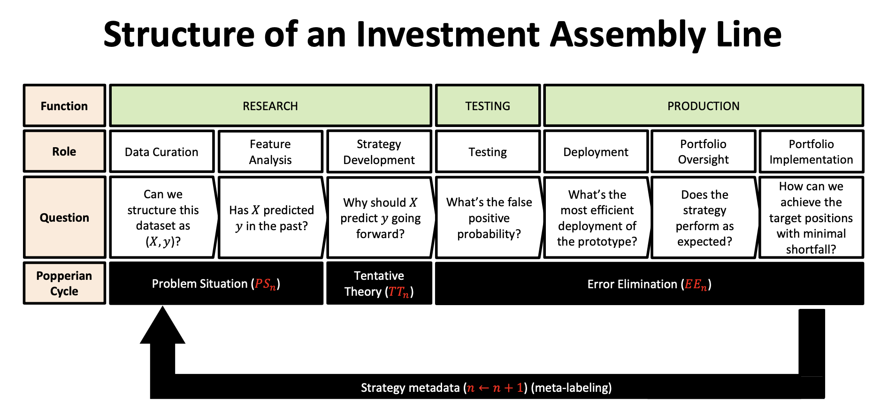
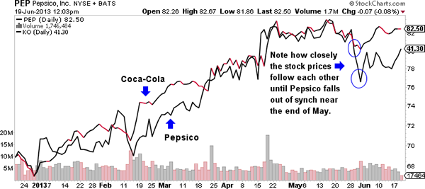
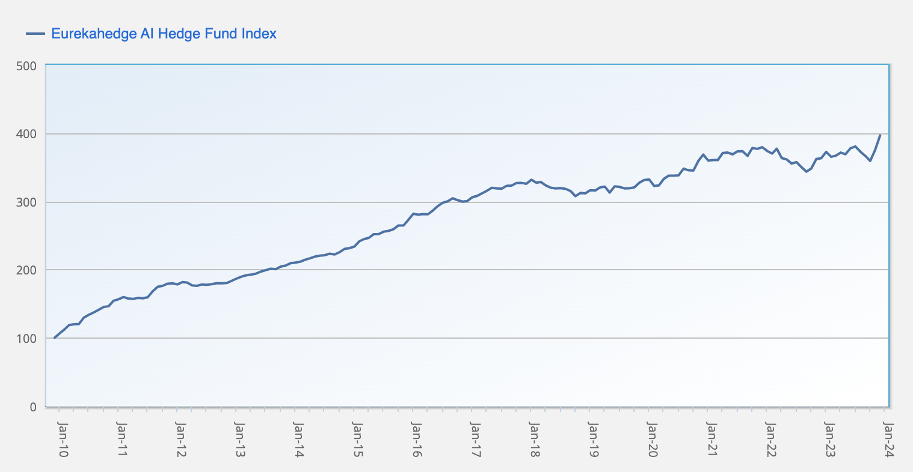

A quantitative (quant) hedge fund is a type of investment fund that relies primarily on complex mathematical models and algorithms to identify trading opportunities. These models are designed to analyze large datasets and execute trades at a high speed, often capitalizing on small price discrepancies in the market. The essence of quant hedge funds lies in their systematic, technology-driven approach, which contrasts significantly with the more subjective strategies employed in traditional hedge funds.

The evolution of quant hedge funds has been marked by rapid growth and innovation, particularly with advancements in computing power and data analytics. Originating in the late 20th century, these funds have significantly evolved from basic statistical models to sophisticated algorithms that incorporate machine learning and artificial intelligence. This evolution has been driven by a combination of technological progress and an increasing amount of available financial data. Today, quant hedge funds represent a significant and influential segment of the hedge fund industry, continuously pushing the boundaries of finance and technology.

## Table of Contents

## Understanding Quant Hedge Funds

### How Quant Hedge Funds Work

Quant hedge funds, at their core, employ sophisticated mathematical models to make investment decisions. These models are designed to identify opportunities that human traders might miss. The mechanics of these funds revolve around the use of advanced algorithms and computational techniques to analyze vast quantities of data. This data can range from price and volume information to economic indicators and even social media trends.

The strategies employed by quant funds are diverse but often fall into a few broad categories:

1. **Statistical Analysis**: This involves using statistical methods to find patterns and correlations in market data that can signal trading opportunities. For instance, a quant fund might use regression analysis to predict future price movements based on historical data.
2. **Algorithmic Trading**: Algorithms are used to execute trades at a speed and frequency beyond human capability. These algorithms are programmed to act on specific market conditions and can adjust to new data in real-time.
3. **Machine Learning and Artificial Intelligence**: Increasingly, quant funds are incorporating machine learning and AI to improve their models. These technologies allow funds to adapt and learn from new data, enhancing their predictive capabilities.
4. **Risk Management Algorithms**: Quant funds also heavily rely on algorithms to manage risk. These algorithms can dynamically adjust the fund’s portfolio to maintain a desired level of risk exposure, depending on market conditions.

The strategies of quant funds are often shrouded in secrecy, as they represent a significant competitive advantage. However, they are known for their reliance on technology, data, and mathematical precision, setting them apart from more traditional investment approaches.

### Comparison with Traditional Hedge Funds

Quantitative hedge funds, often known as "quant funds," differ significantly from traditional hedge funds in their approach and methodology. The key differences are rooted in their decision-making processes, investment strategies, and the use of technology.

1. **Investment Decision Process**: Traditional hedge funds often rely on the expertise and intuition of fund managers and analysts to make investment decisions. In contrast, quant funds use data-driven algorithms and models. These models are typically based on mathematical and statistical analyses, free from human emotions or biases.
2. **Use of Technology and Data**: Quant funds are heavily dependent on advanced technology, including artificial intelligence and machine learning. They process vast amounts of data, ranging from market data to alternative data sets, to identify trading opportunities. Traditional funds, while they may use technology for analysis, don't usually employ it to the same extent in their decision-making process.
3. **Trading Speed and Volume**: Quant funds are known for high-frequency trading, executing a large number of trades at a speed impossible for human traders. This is in contrast to traditional funds, where trading is often less frequent and more based on longer-term analysis and trends.
4. **Risk Management**: Quant funds often have more sophisticated risk management algorithms. These algorithms can quickly adjust a fund's exposure to various market factors, while traditional funds might rely more on set risk limits and manual oversight.
5. **Strategy Diversity**: Traditional hedge funds might focus on a range of strategies from global macro to distressed assets, largely influenced by the fund manager's expertise. Quant funds, however, can quickly pivot and adapt to different strategies as their models identify new patterns and opportunities.
6. **Transparency and Understandability**: Traditional hedge funds' strategies, based on fundamental analysis, might be more understandable to the average investor. In contrast, the complex algorithms of quant funds can often be a 'black box' even to sophisticated investors.

Understanding these differences is crucial for investors considering allocations to hedge funds, as the risk profiles, investment horizons, and potential returns can vary significantly between traditional and quant approaches.

## Key Components of Quant Hedge Funds

### Quantitative Trading Models

Quantitative trading models are at the heart of quant hedge funds, driving their investment decisions and strategies. These models are complex algorithms developed by financial engineers and data scientists, and they leverage a vast array of mathematical techniques. Here’s an overview of some common types of models and algorithms used in quant funds:

1. **Statistical Models**: These models use statistical methods to predict market movements. They might include regression analysis, time-series analysis, and mean reversion strategies. Statistical models aim to identify and exploit patterns or anomalies in market prices.
2. **Machine Learning Algorithms**: Many modern quant funds employ machine learning algorithms to predict market movements. These include methods like neural networks, decision trees, and ensemble methods. Machine learning models can adapt to new data, making them particularly powerful in evolving market conditions.
3. **High-Frequency Trading (HFT) Algorithms**: These are designed to execute trades at extremely high speeds, often in milliseconds or microseconds. HFT algorithms can exploit very small price differences and are usually found in strategies like market making or arbitrage.
4. **Arbitrage Algorithms**: These look for price discrepancies across different markets or securities. For example, pairs trading algorithms identify two historically correlated securities and take opposing positions when their price relationship deviates from the norm.
5. **Sentiment Analysis Models**: These models use natural language processing to analyze news articles, social media, and financial reports to gauge market sentiment. They then use this information to predict market movements.
6. **Risk Management Algorithms**: Quant funds also employ sophisticated algorithms to manage risk. These models assess portfolio risk in real time and adjust positions to maintain desired risk levels.
7. **Optimization Algorithms**: These are used to find the optimal asset allocation for a portfolio. Techniques like mean-variance optimization and Monte Carlo simulation are commonly used.

Each of these models requires extensive data to be effective. Quant funds collect and analyze vast amounts of market data, as well as alternative data sources like satellite images or internet traffic data, to feed into these algorithms. The sophistication and effectiveness of these models are key differentiators for quant funds in the competitive landscape of hedge funds.

### Team Structure

The team structure within a quant hedge fund is a critical component that drives its success. It typically consists of a diverse mix of professionals whose expertise spans various disciplines. Here's an overview of the key roles within a quant fund:

1. **Quantitative Researchers/Analysts**: These individuals are the backbone of the fund, responsible for developing and refining the quantitative models that drive trading decisions. They usually have advanced degrees in fields like mathematics, physics, computer science, or engineering. Their role involves extensive data analysis, model testing, and research to identify market inefficiencies.
2. **Traders**: In a quant fund, traders often have a different role compared to traditional hedge funds. They primarily execute trades based on the signals provided by the quantitative models. Traders in quant funds need a strong understanding of both the markets and the complex algorithms that drive trading decisions.
3. **Developers and Engineers**: These technology experts are tasked with building and maintaining the sophisticated trading systems. They ensure that the algorithms and models created by the quantitative researchers are accurately implemented and that the trading platforms operate efficiently and securely.
4. **Risk Managers**: Risk management is crucial in quant funds due to the high leverage and complexity of strategies employed. Risk managers oversee the fund’s risk exposure and ensure that the strategies align with the fund’s risk tolerance. They use various quantitative methods to monitor and manage risk.
5. **Portfolio Managers**: These professionals oversee the fund's investment portfolio. They make high-level strategy decisions, allocate capital among different strategies, and ensure that the fund's objectives are met.
6. **Data Scientists**: Given the reliance on big data, data scientists play a vital role in quant funds. They are responsible for sourcing, cleaning, and analyzing large datasets that the fund uses to inform its trading models.
7. **Operations and Compliance Team**: This team ensures that the fund operates within regulatory guidelines and handles the operational aspects of the fund, including trade settlement, liquidity management, and investor relations.

The collaboration between these diverse professionals, each bringing their expertise to the table, is what enables quant funds to develop innovative strategies and adapt to the rapidly changing market environments. The interplay between finance, technology, and data science within these teams is a defining characteristic of quant funds and is critical to their success.

## Strategies Employed by Quant Funds

### Statistical Arbitrage

Statistical Arbitrage, often referred to as Stat Arb, represents a pivotal strategy employed by many quant hedge funds. It's a complex, quantitative approach to trading that seeks to exploit price discrepancies identified through statistical and computational methodologies. Here's a closer look at how Statistical Arbitrage works in the realm of quant hedge funds:

1. **Principles of Statistical Arbitrage**: At its core, Statistical Arbitrage involves using statistical models to identify trading opportunities that offer a high probability of profit. The strategy is based on the concept that prices will eventually move towards a historical or predicted mean. Traders use statistical techniques to find these deviations and place trades that profit when the prices revert to their mean.
2. **Utilizing Advanced Algorithms**: Quant hedge funds employ sophisticated algorithms that analyze historical price data and other financial indicators to identify short-term trading opportunities. These algorithms can process vast amounts of data at high speeds, a task unfeasible for human traders.
3. **Pair Trading**: A common method within Statistical Arbitrage is pair trading. This involves identifying two securities whose prices have historically moved together and are currently misaligned. The fund would go long on the undervalued security and short on the overvalued one, betting on the convergence of their prices.
4. **Market Efficiency and Mispricings**: Statistical Arbitrage is grounded in the belief that markets are efficient most of the time but not always. By capitalizing on brief moments of inefficiency, where securities become mispriced due to various factors like market sentiment or liquidity constraints, quant funds aim to generate returns.
5. **Risk Management**: Due to the nature of this strategy, quant funds employing Statistical Arbitrage must have rigorous risk management practices. These include limits on exposure to specific sectors, use of stop-loss orders, and constant monitoring of the positions to mitigate potential losses.
6. **High-Frequency Trading (HFT)**: Some quant funds combine Statistical Arbitrage with high-frequency trading, executing a large number of orders at very high speeds. HFT allows these funds to exploit arbitrage opportunities that exist only for fractions of a second.
7. **Challenges and Adaptability**: Statistical Arbitrage is not without its challenges. The strategy requires constant adaptation of models to changing market conditions. Moreover, with more players in the market, arbitrage opportunities are becoming rarer and more competitive to capture.
8. **Technological Advancements**: The continuous evolution of technology, including machine learning and artificial intelligence, is playing a significant role in enhancing the statistical models used in arbitrage strategies, offering the potential for even more sophisticated and efficient trading methodologies.

In summary, Statistical Arbitrage is a key strategy for quant hedge funds, leveraging mathematical models and high-speed computing to identify and profit from temporary market inefficiencies. Its success hinges on sophisticated algorithms, rigorous risk management, and the ability to adapt quickly to the dynamic financial markets.

### Market Neutral Strategies

Market Neutral Strategies are a cornerstone in the arsenal of quant hedge funds, designed to minimize exposure to broad market movements and focus on generating returns from individual securities. Here's a breakdown of what these strategies entail and how they are implemented by quant hedge funds:

1. **Concept of Market Neutrality**: The central idea of market neutral strategies is to maintain a balanced exposure to market movements. This means that the fund's performance is largely independent of whether the market is rising or falling. The objective is to generate positive returns regardless of the overall market direction.
2. **Long/Short Equity Strategy**: A common approach within market neutral strategies is the long/short equity strategy. This involves taking long positions in undervalued securities while simultaneously shorting overvalued securities. The aim is to profit from both rising and declining stocks in a way that overall market movement is neutralized.
3. **Pair Trading**: Another technique often used is pair trading, where two highly correlated securities are chosen. When their price relationship deviates, one is bought long and the other is sold short, betting on the convergence of their price ratio to its historical average.
4. **Quantitative Analysis**: Quant hedge funds employ sophisticated quantitative models to identify these opportunities. These models analyze historical price data and other financial metrics to ascertain undervalued and overvalued securities.
5. **Risk Management**: A critical aspect of market neutral strategies is rigorous risk management. Funds carefully monitor their exposure to different sectors, geographic regions, and other risk factors to ensure that the portfolio remains market neutral.
6. **Leverage Use**: Quant funds often use leverage in market neutral strategies to amplify returns. However, this also increases the potential for larger losses, necessitating strict control and monitoring systems.
7. **Arbitrage Opportunities**: Some market neutral strategies involve arbitrage – taking advantage of price discrepancies between related securities. This could be in the form of merger arbitrage, convertible arbitrage, or other forms of statistical arbitrage.
8. **Technology-Driven**: Advanced technology, including machine learning and artificial intelligence, is increasingly being used to enhance the effectiveness of market neutral strategies. These technologies allow for more accurate modeling and faster reaction to market changes.
9. **Impact of Market Conditions**: While designed to be unaffected by market trends, market neutral strategies can still be influenced by extreme market conditions, liquidity constraints, and changing correlations between assets.
10. **Performance Metrics**: Success in market neutral strategies is often measured by the fund’s ability to achieve a consistent positive return with low volatility, rather than outperforming a market benchmark.

In essence, market neutral strategies are all about exploiting individual investment opportunities while mitigating broad market risks. Quant hedge funds leverage their technological and analytical prowess to implement these strategies effectively, aiming to deliver stable returns regardless of market conditions.

### Managed Futures/CTAs

Managed Futures, commonly associated with Commodity Trading Advisors (CTAs), form a critical strategy in the domain of quant hedge funds. These strategies are primarily focused on trading futures contracts across a diverse array of markets, including commodities, currencies, interest rates, and indices. Here’s a closer look at how they operate:

1. **Diversification across Markets**: Managed futures strategies are known for their wide-ranging market coverage. They can trade in numerous markets, thus providing diversification benefits that are not typically found in traditional stock or bond portfolios. This broad market exposure allows for potential gains in varied economic conditions.
2. **Trend Following**: The most prevalent strategy in managed futures is trend following. Quant hedge funds utilize sophisticated algorithms to identify and capitalize on market trends. These algorithms can analyze vast amounts of market data to pinpoint emerging trends in different asset classes.
3. **Quantitative Models**: The core of managed futures strategies lies in their reliance on quantitative models. These models are designed to detect patterns, price anomalies, or trends based on historical data, and they can adapt to changing market conditions.
4. **Risk Management**: An integral component of managed futures strategies is robust risk management. This includes setting predefined risk parameters for each trade, employing stop-loss orders, and dynamically adjusting portfolio exposure based on market volatility.
5. **Leverage Utilization**: Managed futures often involve the use of leverage, which means borrowing capital to amplify potential returns. While this can increase profits, it also raises the risk level, making risk management practices even more crucial.
6. **Flexibility in Market Conditions**: One of the key strengths of managed futures is their ability to profit in both rising and falling markets. These strategies can take long positions in rising markets and short positions in declining markets, offering a level of flexibility that is not usually available in traditional investment strategies.
7. **Liquidity**: Futures markets are generally highly liquid, allowing for the easy entry and exit of positions. This liquidity is essential for quant funds, as it facilitates the implementation of high-frequency trading models and rapid adjustments to the portfolio.
8. **Systematic Approach**: Managed futures strategies are typically systematic, meaning they are based on following a set of rules defined by their quantitative models. This systematic approach helps to remove emotional biases and maintain discipline in trading.
9. **Performance in Different Market Cycles**: The performance of managed futures/CTAs can vary significantly across different market cycles. While they have the potential to deliver strong returns during periods of market distress or significant trends, they may underperform during range-bound or choppy market conditions.
10. **Regulatory Environment**: CTAs are subject to regulatory oversight, which ensures a level of transparency and investor protection. This includes registration with regulatory bodies and adherence to specific reporting and operational standards.

Managed futures/CTAs are a significant part of the quant hedge fund landscape, offering a unique blend of diversification, trend-following capabilities, and systematic, quantitative-driven trading. Their ability to navigate different market conditions makes them an attractive strategy for investors seeking non-correlated returns to traditional asset classes.

### Quant Macro and Global Asset Allocation

Quant Macro and Global Asset Allocation strategies represent a significant area within quant hedge funds, known for their analytical approach to global economic trends and asset allocation. These strategies are distinct in their comprehensive view of the financial landscape, considering a range of macroeconomic variables and geopolitical events. Here’s an insight into their mechanics and implementation:

1. **Global Economic Analysis**: At the heart of quant macro strategies is the analysis of global economic data. Funds utilize quantitative models to process and interpret vast amounts of economic indicators, including GDP growth rates, inflation, interest rates, and employment figures, among others.
2. **Incorporating Geopolitical Events**: These strategies also factor in geopolitical developments that can impact markets. This includes analyzing political stability, regulatory changes, trade policies, and international relations. Advanced algorithms are used to predict how these factors might influence various asset classes.
3. **Asset Allocation Decisions**: Based on the economic and geopolitical analysis, quant macro funds make strategic asset allocation decisions. This involves determining the optimal distribution of investments across different asset classes, regions, and currencies to maximize returns and minimize risk.
4. **Diverse Investment Instruments**: Quant macro funds invest in a wide array of instruments such as equities, bonds, currencies, commodities, and derivatives. This diversity allows them to capitalize on opportunities in various markets and asset classes.
5. **Utilization of Derivatives**: These funds often use derivatives like futures, options, and swaps for hedging and to gain leveraged exposure to certain assets or markets. Derivatives allow them to manage risk more effectively and enhance potential returns.
6. **Dynamic Rebalancing**: Quant macro strategies involve dynamic portfolio rebalancing. Based on their models’ outputs, the funds adjust their holdings to align with changing market conditions and economic forecasts. This dynamic approach helps in responding promptly to new opportunities or risks.
7. **Risk Management**: Effective risk management is crucial for quant macro funds, given their exposure to a wide range of global markets and economic factors. They employ advanced risk management techniques to monitor and mitigate various types of risks, including market, credit, liquidity, and geopolitical risks.
8. **Long-Term Focus**: While some quant macro strategies can be short-term in nature, many focus on long-term macroeconomic trends and cycles. This long-term perspective can provide more stable and consistent returns over time, albeit with periods of volatility.
9. **Quantitative Techniques**: Advanced statistical and mathematical techniques are employed to build predictive models. These techniques include machine learning, econometric modeling, and data mining, among others.
10. **Adaptability to Market Conditions**: A key strength of quant macro and global asset allocation strategies is their adaptability. They can quickly adjust to new economic data, changing market conditions, and shifts in investor sentiment.

Quant Macro and Global Asset Allocation strategies in quant hedge funds offer a sophisticated, data-driven approach to understanding and capitalizing on global economic trends and market dynamics. They play a pivotal role in the broader landscape of quantitative investing, offering diversification and potential for strong risk-adjusted returns.

### Alternative Risk Premia

Alternative Risk Premia (ARP) strategies are an essential component in the toolbox of quant hedge funds, offering a distinct approach to generating returns. These strategies involve systematic investment in various risk factors across asset classes, aiming to harvest premia that are different from traditional market risks. Let’s dive into the key elements of ARP in quant hedge funds:

1. **Risk Factor Investment**: ARP strategies focus on a range of risk factors such as value, momentum, carry, and volatility. Each factor represents a specific risk-return profile that is distinct from broad market movements.
2. **Diversification Across Asset Classes**: These strategies typically span multiple asset classes, including equities, fixed income, commodities, and foreign exchange. The diversification allows for the capture of risk premia across a broader investment universe.
3. **Systematic Approach**: Like other quant strategies, ARP relies on systematic, model-driven methods to identify and exploit these risk factors. The use of algorithms ensures a disciplined approach and helps mitigate emotional or biased decision-making.
4. **Non-Correlation with Traditional Assets**: One of the appeals of ARP strategies is their potential to offer returns that are not closely correlated with traditional equity or bond markets. This characteristic makes them attractive for diversification purposes.
5. **Quantitative Research Foundation**: The identification and exploitation of alternative risk premia are grounded in extensive quantitative research. This involves analyzing historical data to uncover factors that have provided consistent, risk-adjusted returns over time.
6. **Exploiting Market Anomalies and Behavioral Biases**: ARP strategies often aim to capitalize on market anomalies and behavioral biases that are not explained by traditional market models. For example, they might exploit the tendency of investors to underreact or overreact to news or market events.
7. **Dynamic Risk Management**: Given the dynamic nature of financial markets, ARP strategies require robust risk management practices. These include stress testing, liquidity risk assessment, and adaptive portfolio rebalancing to manage exposure to various risk factors.
8. **Long/Short Investment Stances**: ARP strategies often involve taking long and short positions in different assets or factors, thereby aiming to benefit from both rising and falling market scenarios.
9. **Cost-Effectiveness and Efficiency**: The systematic nature of ARP allows for operational efficiency and potentially lower costs compared to more discretionary investment approaches. This is particularly appealing in a low-yield environment.
10. **Challenges and Complexity**: While ARP strategies can offer attractive risk-adjusted returns, they are not without challenges. They require sophisticated understanding and management of complex risk factors, as well as the capability to adapt to changing market conditions.

In conclusion, Alternative Risk Premia strategies represent a sophisticated and nuanced approach within quant hedge funds. By systematically investing in a range of risk factors across various asset classes, these strategies seek to generate consistent returns, distinct from traditional market risks. Their role in a quant fund’s strategy mix underscores the advanced analytical capabilities and innovative nature of these investment vehicles.

## Quant Hedge Fund Performance

Quant hedge funds, known for their sophisticated mathematical models and algorithm-driven strategies, have shown a diverse range of performances over the years. Historically, these funds have experienced phases of significant success, particularly during times when market conditions favored algorithmic and statistical approaches. However, they have also faced challenges, especially in market environments characterized by unpredictability and low volatility, which can disrupt their models.

In recent times, the performance of quant hedge funds has been a mixed bag. On one hand, some funds have demonstrated exceptional returns, capitalizing on market inefficiencies and anomalies detected by their complex algorithms. These successes are often attributed to advanced machine learning techniques and increased computational power, allowing for more accurate predictions and efficient execution of trades.

On the other hand, there are instances where quant funds have underperformed. This underperformance can be linked to several factors. Firstly, the crowded nature of trades in the quant space often leads to diminished returns, as many funds may be chasing similar strategies. Secondly, the adaptability of these funds in rapidly changing markets can be a challenge. While traditional funds can quickly shift their strategies based on human judgment, quant funds may require time to adjust their models to new market conditions.

Another critical factor influencing performance is the data dependency of these funds. The quality, uniqueness, and relevance of the data used in their models significantly affect their ability to generate alpha (excess returns). With the increasing accessibility of data, it's become more challenging for quant funds to find unique datasets that provide them with an edge.

Moreover, macroeconomic factors and geopolitical events also play a role in the performance of quant funds. These events can lead to market conditions that are at odds with the historical data the models are based on, leading to unexpected losses. Additionally, regulatory changes and shifts in market structure, such as the rise of electronic and high-frequency trading, have also impacted their performance.

In conclusion, while quant hedge funds have shown the potential for high returns, their performance is highly dependent on a variety of factors, including the efficacy of their algorithms, the quality of their data, market conditions, and their ability to adapt to an ever-changing financial landscape.

## Risks and Challenges

Quant hedge funds, while innovative and often profitable, are not without their risks and challenges. One of the primary risks involves the reliance on historical data for predictive modeling. These models may not always accurately forecast future market behaviors, especially in unprecedented scenarios or black swan events, leading to significant losses.

Another challenge is the **risk of overfitting**. Quant funds often use complex algorithms to find patterns in market data. However, there's a danger of creating models that are too finely tuned to past data, which may not be replicable in future market conditions, leading to poor performance.

**Market dynamics** also pose a significant challenge. Quant strategies can be disrupted by sudden market shifts that algorithms may not anticipate or adapt to quickly. The high-speed nature of trading in these funds means that such disruptions can lead to rapid losses before corrective actions are taken.

The **competitive landscape** is another risk factor. As more players enter the quant space, the strategies that once provided an edge may become less effective. The overcrowding of certain strategies can lead to reduced profitability and increased correlation risk, where similar strategies lead to similar vulnerabilities across funds.

**Liquidity risk** is also a concern, especially for strategies that trade in less liquid markets or assets. In times of market stress, exiting positions can become challenging, potentially exacerbating losses.

**Operational risks**, including technological failures, software bugs, and cybersecurity threats, are also significant. The heavy reliance on technology means that quant funds are vulnerable to these issues, which can disrupt trading or lead to data breaches.

**Regulatory risks** are ever-present in the financial industry. Changes in financial regulations can impact the strategies employed by quant funds, forcing them to adapt or abandon certain trades, potentially at a cost.

In terms of navigating these risks, quant funds often employ various strategies. These include robust back-testing regimes to avoid overfitting, diversification of strategies to reduce market and correlation risk, and sophisticated risk management systems to monitor and mitigate potential losses. They also invest heavily in technology and cybersecurity to protect against operational risks and comply with evolving regulatory demands.

In essence, while quant hedge funds leverage advanced technology and algorithms to generate returns, they must continuously evolve and adapt their strategies and risk management practices to navigate the complex and ever-changing financial landscape effectively.

## Quant Hedge Funds in the Financial Industry

Quantitative hedge funds have significantly reshaped the hedge fund industry. Their emergence and evolution represent a major shift towards a more technology-driven, algorithmic approach in financial markets. These funds employ sophisticated mathematical models and advanced computing to exploit market inefficiencies, often operating at speeds and scales unattainable by human traders. This has led to a new competitive landscape where the ability to process information and execute trades rapidly is as valuable as traditional investment acumen.

In terms of their role, quant hedge funds have become substantial players in the industry. They contribute to market liquidity and can help stabilize markets by providing diversified trading strategies. However, their complex, opaque strategies can also introduce systemic risks, particularly if many funds adopt similar models, leading to potential market disruptions.

Currently, the trend in the quant hedge fund space leans heavily towards the **integration of machine learning and artificial intelligence**. Funds are increasingly leveraging these technologies to analyze vast datasets, identify new trading opportunities, and refine their strategies. This shift has sparked a new arms race in the industry for talent and technology, with funds seeking the brightest minds in data science and computer engineering to gain an edge.

Another emerging trend is the **democratization of quant strategies**. Once the exclusive domain of large institutions with significant resources, technological advancements have made these strategies more accessible to smaller firms and individual investors. This trend is not only diversifying the industry but also challenging traditional quant funds to innovate continually.

**Environmental, Social, and Governance (ESG) factors** are also becoming increasingly important in the quant space. As investor demand for responsible investing grows, quant funds are integrating ESG criteria into their algorithms, balancing the pursuit of financial returns with social and environmental considerations.

Furthermore, the rise of **alternative data** is revolutionizing the way quant funds operate. Beyond traditional financial indicators, these funds are now analyzing data points ranging from satellite imagery to social media trends to inform their trading models. This proliferation of data sources, however, raises questions about data quality, privacy, and the potential for data-driven market manipulation.

In summary, quant hedge funds play a pivotal role in the modern hedge fund industry, driving innovation and competition through their technology-centric approach. As they continue to evolve, embracing new technologies and trends, they are set to remain at the forefront of the financial industry, reshaping markets and investment strategies.

## Career in Quant Hedge Funds

### Roles and Responsibilities

In the realm of quant hedge funds, a diverse array of roles and responsibilities is crucial to their operation and success. At the core are quantitative analysts, often referred to as **quants**. These individuals specialize in developing complex mathematical models that form the backbone of trading strategies. They apply techniques from fields like statistics, data science, and machine learning to analyze market data, identify trends, and predict market movements.

Another vital role is that of the **traders**. In quant funds, traders often work closely with quants, using the models developed to execute trades. However, unlike traditional trading, their decisions are heavily guided by algorithmic strategies. This requires a deep understanding of both the markets and the underlying algorithms to effectively manage and execute trades.

**Developers** and software engineers are also integral to quant hedge funds. They are responsible for building and maintaining the advanced trading platforms and infrastructure that support high-frequency trading activities. Their work involves coding the trading algorithms, ensuring the robustness of the systems, and constantly updating them to integrate new models and strategies.

**Risk managers** in quant funds play a critical role in overseeing the risk profiles of investments. They use statistical and analytical methods to monitor and mitigate risks associated with the trading algorithms and investment strategies. Their goal is to balance the pursuit of returns against the potential risks, ensuring the fund's exposure remains within acceptable limits.

**Portfolio managers** oversee the overall investment portfolio, making decisions about asset allocation, strategy implementation, and performance optimization. They must understand the various strategies employed by the fund and how they fit into the broader market context.

**Data scientists** are increasingly becoming a part of the team structure in quant funds. They specialize in handling large datasets, extracting insights, and identifying patterns that could inform trading strategies. Their role often overlaps with that of quantitative analysts but is more focused on data handling and processing.

**Operations and compliance** professionals ensure that the fund operates within the regulatory framework and industry standards. They manage administrative tasks, oversee compliance with legal and regulatory requirements, and ensure smooth day-to-day operations of the fund.

A quant hedge fund brings together a multidisciplinary team comprising quantitative analysts, traders, developers, risk managers, portfolio managers, data scientists, and operations and compliance staff. Each plays a unique and crucial role in the fund’s operation, contributing to its overall strategy and success in the dynamic and complex world of quantitative finance.

### Skills and Education

Success in the field of quant hedge funds hinges on a unique blend of education and skill sets, reflecting the highly technical and analytical nature of the industry. Educationally, a strong foundation in mathematics, statistics, computer science, or a related quantitative field is almost mandatory. Advanced degrees, particularly in fields like financial engineering, applied mathematics, or computational finance, are highly valued. These educational backgrounds provide the theoretical understanding necessary to develop complex models and algorithms.

In terms of skills, proficiency in programming languages such as Python, R, C++, or Java is essential. These skills are crucial for developing trading algorithms, data analysis, and implementing models. A deep understanding of machine learning and artificial intelligence has also become increasingly important, as these technologies are at the forefront of current and future trading strategies.

Analytical and statistical skills are the bedrock of a career in quant hedge funds. Professionals in this field must be able to interpret vast amounts of data, discern patterns, and make calculated predictions about market movements. This requires not only statistical knowledge but also the ability to apply these concepts in practical, real-world scenarios.

Financial acumen is another critical skill. While deep quantitative skills are essential, understanding financial markets, instruments, and trading strategies is equally important. This includes knowledge of derivatives, risk management practices, and an understanding of the broader economic and financial landscape.

Problem-solving skills and creativity are also vital. The ability to think critically, develop innovative solutions to complex problems, and adapt to rapidly changing markets is what differentiates the top performers in this field.

Soft skills, such as communication and teamwork, are often overlooked but are increasingly important. The ability to articulate complex quantitative concepts to non-technical stakeholders, work collaboratively with team members from diverse backgrounds, and present findings clearly is crucial in a field that is becoming more interdisciplinary.

Lastly, a commitment to continuous learning is essential in a rapidly evolving field like quantitative finance. Keeping abreast of new technologies, algorithmic strategies, regulatory changes, and market developments is crucial for long-term success in this dynamic and competitive sector.

### Salary and Career Path

The career path in quant hedge funds is not only intellectually stimulating but also financially rewarding. Compensation in this field is among the highest in the finance sector, reflecting the high demand for these specialized skills and the significant impact these roles have on fund performance.

Starting salaries for quantitative analysts and developers in quant hedge funds are typically high, often exceeding those in more traditional finance roles. Entry-level quants can expect salaries starting from $100,000 to $150,000 annually, with bonuses linked to personal and fund performance potentially doubling this figure.

As professionals progress in their careers, moving into senior roles like lead analyst or portfolio manager, compensation can increase substantially. Senior roles in quant hedge funds can command salaries ranging from $200,000 to over $500,000, with bonuses and profit sharing potentially pushing total compensation into the millions, especially in successful funds.

The career path in quant hedge funds often involves a steep learning curve. Early career stages focus on technical skill development, model building, and understanding of financial markets. Mid-career roles typically involve more strategic responsibilities, including developing new trading strategies and managing larger segments of the portfolio. Senior positions often encompass a broader range of responsibilities, including fund management, strategic decision-making, and team leadership.

The lifestyle in quant hedge funds can be demanding. The high-pressure environment, driven by the fast pace of financial markets and the complexity of the work, requires long hours and a high level of commitment. However, this is often balanced by intellectually rewarding work, the opportunity to work with cutting-edge technologies and methodologies, and the satisfaction of solving complex problems.

Additionally, the field offers substantial opportunities for personal and professional growth. As technology and financial markets evolve, professionals in this space must continually learn and adapt, making it an exciting field for those who thrive on challenge and innovation.

In summary, a career in quant hedge funds offers lucrative financial rewards, rapid career progression, and the opportunity to work at the forefront of financial technology and innovation. However, it also demands a high level of expertise, commitment, and adaptability to navigate the challenges and pressures of the industry.

## Investor Perspective

For individual investors, quant hedge funds represent an opportunity to diversify their investment portfolios with strategies that are markedly different from traditional investment approaches. These funds use complex algorithms and models to identify and exploit market inefficiencies, often resulting in uncorrelated returns compared to conventional asset classes. This means that during periods when traditional markets might be underperforming, quant funds can potentially offer positive returns, thereby providing a hedge against market volatility.

However, investing in quant hedge funds comes with its own set of considerations. One key factor is the level of risk involved. While these funds can offer high returns, their strategies can also be risky, especially if the investor does not fully understand the methodologies employed. The use of leverage and derivative instruments in some quant strategies can amplify both gains and losses, making it essential for investors to assess their risk tolerance.

Transparency is another important consideration. Quant funds are often criticized for their lack of transparency, as the proprietary nature of their strategies can make it difficult for investors to understand exactly where their money is being invested. This opacity requires a high level of trust in the fund managers and their expertise.

Additionally, the minimum investment and fee structures of quant hedge funds can be prohibitive for some individual investors. These funds typically require large initial investments and charge significant management and performance fees. Investors should carefully consider these factors against the potential returns and their own investment goals.

It's also vital for investors to conduct due diligence on the fund's track record, the experience and expertise of the management team, and the overall reputation of the fund. This includes examining past performance, although it's important to remember that past success is not always indicative of future results, especially in the rapidly changing world of quantitative finance.

Finally, investors should consider the liquidity of their investment. Quant hedge funds often require investors to lock in their capital for a set period, making it difficult to withdraw funds on short notice. Understanding these terms is crucial for effective portfolio planning and management.

While quant hedge funds can be a valuable addition to an investment portfolio, offering potential for high returns and diversification, they also come with unique risks and considerations. It's essential for individual investors to thoroughly understand these factors and align them with their investment objectives and risk appetite.

## Future of Quant Hedge Funds

The future of quant hedge funds appears poised for significant evolution, driven by technological advancements and changing market dynamics. One key area of development is the integration of artificial intelligence (AI) and machine learning (ML) into quantitative trading strategies. These technologies offer the potential to analyze vast datasets more effectively, identify complex patterns, and execute trades with greater speed and precision. This could lead to more sophisticated and adaptive trading models, capable of navigating increasingly complex and fast-paced financial markets.

Blockchain and distributed ledger technology are also expected to impact the industry. These technologies could revolutionize how transactions are recorded and verified, leading to increased transparency and reduced operational costs. This might attract a new segment of investors who are looking for more transparent and efficient investment platforms.

However, the rapid pace of technological innovation also brings challenges. There's the risk of over-reliance on technology, where funds may become overly dependent on algorithms, potentially missing out on nuanced human insights or failing to respond adequately to unpredictable market events. Additionally, the increasing complexity of algorithms and the use of esoteric data sources can make these funds less transparent and harder to understand for investors and regulators alike.

Another potential challenge is market saturation. As more players enter the quant space, the competition for alpha (excess returns) becomes fiercer. This could lead to diminishing returns for certain strategies, particularly those that are widely known and employed. Quant funds will need to continuously innovate and find new edges to maintain their competitiveness.

From an investor's perspective, the evolving landscape of quant hedge funds presents both opportunities and risks. On the one hand, these funds offer the potential for high returns and diversification away from traditional asset classes. On the other hand, the complexity and opacity of their strategies can make due diligence and risk assessment challenging.

Regulatory changes are also likely to shape the future of quant funds. As these funds become more prominent players in the financial markets, they may attract more regulatory scrutiny. Changes in regulations could impact the strategies these funds can employ, their reporting requirements, and their overall operational landscape.

## Conclusion

Quant hedge funds, employing quantitative and algorithmic methods, have emerged as a dynamic and influential segment of the financial landscape. These funds use complex mathematical models and advanced technologies to identify and capitalize on market inefficiencies, setting them apart from traditional hedge funds.

The key components of quant hedge funds include sophisticated quantitative trading models and a diverse team structure that encompasses quantitative analysts, traders, developers, and risk managers. They employ a variety of strategies such as statistical arbitrage, market neutral strategies, managed futures, quant macro strategies, and alternative risk premia to achieve their investment goals.

Historically, quant funds have shown both impressive successes and notable challenges, with their performance influenced by factors like algorithmic precision, data quality, market conditions, and competition. They face unique risks, including over-reliance on historical data, model overfitting, market saturation, and regulatory changes.

In the broader financial industry, quant hedge funds have been instrumental in introducing new technologies and approaches to trading, contributing significantly to market liquidity and efficiency. However, their complex strategies and lack of transparency can pose challenges for investors and regulators alike.

For those considering a career in this field, it requires a combination of highly specialized skills in mathematics, programming, finance, and data science, along with a continual willingness to adapt to new technologies and market developments.

From an investor's perspective, quant funds offer opportunities for diversification and potentially high returns, but they also come with higher risks and complexities. Investors need to carefully consider these factors, along with their own investment goals and risk tolerance.

Looking to the future, quant hedge funds are poised for further evolution, driven by advancements in AI, machine learning, and blockchain technology. While these developments promise to enhance fund strategies and performance, they also bring new challenges and risks.

## References & Further Reading

To deepen understanding and stay informed about the evolving world of quant hedge funds, a range of resources is available. These include authoritative books, insightful articles, and specialized websites, each offering different perspectives and levels of detail.

#### Reading List

1. [**"Quantitative Finance for Dummies" by Steve Bell**](https://www.amazon.com/Quantitative-Finance-Dummies-Steve-DPhil/dp/1118769465) – An excellent starting point for those new to the field, offering a clear introduction to the basics of quantitative finance.
2. [**"The Quants" by Scott Patterson**](https://www.amazon.com/Quants-Whizzes-Conquered-Street-Destroyed/dp/0307453383) – Provides a narrative on how quantitative analysts revolutionized Wall Street, leading to the rise of quant hedge funds.
3. [**"Inside the Black Box: A Simple Guide to Quantitative and High Frequency Trading" by Rishi K. Narang**](https://www.amazon.com/Inside-Black-Box-Quantitative-Frequency/dp/1118362411) – This book demystifies quantitative trading strategies, making them accessible to a broader audience.
4. [**"Machine Learning for Asset Managers" by Marcos López de Prado**](https://www.amazon.com/Machine-Learning-Managers-Elements-Quantitative/dp/1108792898) – Focuses on the application of machine learning in asset management, highly relevant for understanding modern quant funds.
5. [**"Algorithmic Trading: Winning Strategies and Their Rationale" by Ernie Chan**](https://www.amazon.com/Algorithmic-Trading-Winning-Strategies-Rationale/dp/1118460146) – Offers an in-depth look into algorithmic trading strategies, useful for understanding the mechanics behind quant fund operations.

#### Useful Websites

1. [**QuantStart**](https://www.quantstart.com/) – Provides articles, guides, and lessons on quantitative finance, algorithmic trading, and related technologies.
2. [**Risk.net**](http://risk.net/) – Features news and analysis on risk management, derivatives, and complex financial products, often covering the quantitative aspects.
3. [**The Financial Times – Alphaville**](https://www.ft.com/alphaville) – Offers insightful commentary and analysis on market trends, including topics related to quant funds and algorithmic trading.
4. [**AQR Insights**](https://www.aqr.com/Insights) – AQR is a leading quant fund, and their insights section offers articles and papers on various quantitative investment strategies and market analyses.

These resources provide a comprehensive overview and in-depth knowledge of quant hedge funds, their strategies, and the industry's future outlook. They are invaluable for professionals, investors, and students interested in the rapidly evolving field of quantitative finance.