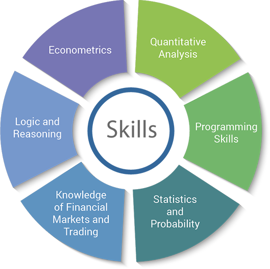

In recent years, quantitative news analysis has become a pivotal component of algorithmic trading. This emerging trend capitalizes on the ability to process and analyze vast amounts of textual data, allowing for the formulation of trading decisions with minimal human intervention. As financial markets become increasingly complex and fast-paced, the need for timely and accurate data-driven insights has never been more critical.

Quantitative news analysis utilizes advanced technologies such as natural language processing (NLP) and machine learning to transform qualitative news data into quantitative signals that inform trading strategies. By examining news articles, earnings reports, and social media activity, traders can gain a deeper understanding of market sentiment and its potential impact on asset prices. This capability enables market participants to respond swiftly to market-moving events and achieve a competitive edge.



This article will explore recent advancements in quantitative news analytics and its role in reshaping the landscape of algorithmic trading. We will discuss the key components and methodologies involved in this process, alongside the future potential of integrating quant news into trading algorithms. Through an understanding of these concepts, both novice and experienced traders can augment their strategies, enhancing their ability to navigate financial markets effectively and profitably.

## Table of Contents

## What is Quant News?

Quant news refers to the quantitative analysis of news data aimed at predicting stock market trends. This innovative approach harnesses the power of algorithms and [machine learning](/wiki/machine-learning) techniques to systematically analyze and interpret an extensive range of data sources, including news articles, social media posts, and financial earnings reports. By converting qualitative news information into quantifiable data points, quant news offers valuable insights that can be integrated into trading models, making it a crucial element in the development of sophisticated trading strategies.

The process of quantifying news involves several key steps, beginning with data collection. An efficient data collection system ingests large volumes of news data from various sources, enabling traders to capture a holistic view of the market's sentiment and potential influencers. Subsequently, natural language processing (NLP) techniques are employed to analyze the textual data, extracting relevant features such as sentiment, entities, and key events. For instance, sentiment analysis can be used to assess the overall tone of a news item, categorizing it as positive, negative, or neutral depending on the context and language used.

Once the qualitative data has been transformed into numerical values, machine learning models can be applied to identify patterns and correlations that may assist in predicting market movements. Algorithms such as logistic regression, support vector machines, or neural networks might be utilized to evaluate the impact of news sentiment on stock prices. A common approach is to build predictive models where the input features include sentiment scores, frequency of mention, and recency of news articles, while the output is a predicted market trend or price movement.

An illustrative example of a basic sentiment analysis in Python might involve the use of libraries such as `TextBlob` or `NLTK`:

```python
from textblob import TextBlob

def get_sentiment(text):
    analysis = TextBlob(text)
    return analysis.sentiment.polarity

news_article = "Company XYZ reported a significant increase in quarterly profits, far exceeding expectations."

sentiment_score = get_sentiment(news_article)
print(f"Sentiment Score: {sentiment_score}")
```

In this example, the sentiment score derived from the news article can serve as an input to a more extensive trading system, impacting buy or sell decisions.

Quant news is increasingly vital to [algorithmic trading](/wiki/algorithmic-trading), allowing traders to act swiftly on news-driven signals with minimal human intervention. By systematically evaluating qualitative data, quant news provides a framework for making informed trading decisions, facilitating the development of models that are both economically sound and operationally effective. As the market continues to evolve, the strategies guided by quant news are expected to become more nuanced and prevalent, significantly shaping the future of financial trading.

## Advancements in Quant News Technology

Advancements in natural language processing (NLP) and machine learning are pivotal in the analysis of news data for algorithmic trading. NLP technologies enable traders to transform qualitative text into quantified insights, enhancing the ability to make informed trading decisions. Through techniques such as sentiment analysis, algorithms can evaluate the tone of news articles, social media posts, and earnings reports to predict market trends.

Recent developments in [artificial intelligence](/wiki/ai-artificial-intelligence) (AI) have significantly improved the ability of models to detect market sentiment. AI-powered algorithms utilize [deep learning](/wiki/deep-learning) techniques to interpret complex linguistic patterns, allowing for the differentiation between positive and negative news more accurately than traditional methods. For instance, sentiment scoring models can assign values to textual data, such as classifying the sentiment of a statement on a scale from -1 to 1, where -1 indicates negative sentiment and 1 indicates positive sentiment.

Timeliness and relevance of information are crucial aspects in competitive trading environments. Real-time processing of news data is a breakthrough, allowing traders to react almost instantaneously to market-moving events. Technologies such as streaming data platforms enable the continuous integration of news updates into trading algorithms. Python libraries like `nltk` and `spaCy` can be used to process and analyze large volumes of text data efficiently, while machine learning frameworks like TensorFlow and PyTorch facilitate the development of sophisticated predictive models.

The integration of NLP and AI technologies into news analysis for trading continues to evolve, providing traders with increasingly accurate and timely data for strategic decision-making. These advancements are reshaping the landscape of algorithmic trading by offering more effective tools for understanding and interpreting large-scale textual information in dynamic market conditions.

## Applications in Algorithmic Trading

Quant news significantly impacts various algorithmic trading strategies, providing a data-driven approach to capitalize on market movements. One key application of quant news is in [momentum](/wiki/momentum) trading, where traders exploit trends in stock prices driven by news events. By analyzing the sentiment and frequency of news stories, traders can identify upward or downward price trends and make informed decisions about entry and [exit](/wiki/exit-strategy) points in the market.

In [arbitrage](/wiki/arbitrage) strategies, quant news is utilized to recognize price discrepancies across different markets or financial instruments that may arise from news-driven investor reactions. Traders can implement news data into algorithms designed to swiftly take advantage of these discrepancies before the market corrects itself. This approach reduces latency and enhances the precision of arbitrage opportunities.

Pair trading also benefits from quant news by evaluating the correlation between two or more stocks. By integrating sentiment analysis from news articles, these strategies can determine when the historical correlation is likely to diverge due to a news event, thus offering a trading opportunity. For instance, if news negatively impacts one stock in a historically correlated pair, the trader might short that stock while long on the correlating stock, expecting the spread to revert.

Sentiment analysis is crucial for many quant news strategies, where the focus is on deriving sentiment scores from news data to make trading decisions. Text mining and natural language processing (NLP) techniques are employed to classify the sentiment of news content as positive, negative, or neutral. These sentiment scores can be quantified and integrated into trading models using the formula:

$$
\text{Sentiment Score} = \sum (\text{positive counts} - \text{negative counts}) / \text{total words}
$$

This approach helps traders anticipate market reactions and adjust their positions proactively.

Event-driven trading is another application of quant news strategies, exploiting market [volatility](/wiki/volatility-trading-strategies) induced by news events such as earnings reports, mergers, or geopolitical events. Algorithms monitor news feeds for relevant events and initiate trades based on the predicted impact on asset prices. The timeliness of data processing in this strategy is crucial, as the market can react rapidly to news events, and the ability to act swiftly can mean the difference between profit and loss.

In summary, quant news plays a transformative role in algorithmic trading, offering innovative ways to leverage news data for a variety of strategies. By utilizing sentiment analysis and real-time news processing, traders can enhance prediction models, manage risks effectively, and exploit market opportunities with increased accuracy.

## Popular Tools and Resources

Tools like EODhistoricaldata.com provide financial news APIs that enable traders to access real-time news feeds, efficiently tagged by ticker codes. These feeds allow for the analysis of current events and financial news, significantly enhancing the capability to incorporate timely information into trading algorithms [1]. EODhistoricaldata.com serves as an essential resource for those seeking comprehensive and up-to-date market information.

Quant platforms such as Quantpedia compile vast data sets and resources, assisting traders in incorporating quantitative news analysis into their strategies. Quantpedia's offerings include a variety of trading strategies backed by empirical research, which often leverage news data to anticipate market movements. For traders aiming to optimize their algorithms with quantitative news, Quantpedia provides a valuable repository of insights and strategic frameworks [2].

Interactive platforms like QuantInsti focus on education in algorithmic trading and data analysis. These platforms offer courses and certifications that cover the application of quantitative news analysis in trading. Through a mix of theoretical instruction and practical exercises, QuantInsti equips traders with the skills necessary to interpret news data effectively and implement it into algorithmic strategies. This educational resource helps traders understand the substantial impact of news sentiment and events on market trends [3].

With these tools and resources, traders and analysts can better leverage quantitative news analysis, enabling them to stay competitive and well-informed in the fast-paced environment of financial markets.

---

[1] EOD Historical Data. (n.d.). Financial APIs for Stock, Forex and Cryptocurrency Data. Retrieved from https://eodhistoricaldata.com

[2] Quantpedia. (n.d.). The Encyclopedia of Quantitative Trading Strategies. Retrieved from https://quantpedia.com

[3] QuantInsti. (n.d.). The Leading Algorithmic Trading Education Company. Retrieved from https://www.quantinsti.com

## Challenges and Limitations

Quantitative news analysis, while innovative and promising, is not without its challenges. One of the primary obstacles is data overload, as the sheer [volume](/wiki/volume-trading-strategy) of news articles, social media feeds, and other textual information can be overwhelming. Processing this vast amount of data in real-time requires sophisticated algorithms and significant computational resources. If systems fail to handle the influx efficiently, critical insights may be missed, potentially leading to suboptimal trading decisions.

The reliability of news sources and the presence of noise are other substantial issues. Unlike traditional datasets, news data can include misinformation, bias, and irrelevant content that can skew analysis and result in inaccurate predictions. Ensuring the integrity and accuracy of this data is crucial, yet challenging. Traders often depend on sophisticated filtering techniques and source validation processes to mitigate these issues. However, even with advanced methods, the risk of noise interference remains, potentially affecting the quality of trading insights.

Moreover, the dynamic nature of financial markets necessitates continuous adaptation. Traders must regularly update their models and systems to keep pace with evolving market conditions and changes in data landscapes. This requires not only technical expertise but also a proactive approach to system maintenance and development. Frequent updates are essential to ensure that trading algorithms remain effective and relevant in a fast-paced trading environment.

These challenges underscore the need for robust infrastructure, continuous monitoring, and algorithmic refinement to make the most of quant news analysis in algorithmic trading. Addressing these limitations effectively can lead to more reliable and actionable trading strategies.

## Future Trends in Quant News

The future of quant news in trading is expected to be significantly shaped by advancements in artificial intelligence (AI) and the integration of more diverse data sources. Enhanced AI capabilities, particularly in areas like machine learning and natural language processing (NLP), promise to elevate the accuracy and efficiency of quantitative news analysis. By improving algorithms' ability to interpret complex datasets, traders can derive more precise actionable insights, reducing human error and bias in trading decisions.

As data integration becomes increasingly sophisticated, trading algorithms can utilize a broader spectrum of datasets. This integration includes not only traditional financial news and reports but also [alternative data](/wiki/best-alternative-data) sources such as social media sentiment analysis and satellite imagery. Social media platforms, through the vast amount of user-generated content, provide real-time, crowdsourced data that can offer insights into public sentiment and market shifts. Analyzing such data requires advanced sentiment analysis algorithms that can parse text for emotional indicators and potential market-moving opinions.

Satellite imagery, as an alternative data source, offers unique insights into macroeconomic and sector-specific trends. For example, monitoring the number of cars in retail parking lots or the volume of oil stored at refineries can provide tangible data points for economic activity assessments. Utilizing advanced machine learning models, these data types can be processed to forecast potential trends in asset prices or to detect anomalies that might signal investment opportunities.

Moreover, as computational capacity increases and cost decreases, real-time data processing becomes more accessible to a broader range of market participants. This technological progress can substantially reduce latency in trading decisions, allowing traders to respond almost instantaneously to news events that impact the financial markets. The continuous enhancement of cloud computing technologies and the development of edge computing also support this trend by enabling faster data processing directly where the data is generated.

Overall, these developments promise a future where quant news analysis is not only faster and more accurate but also more inclusive of diverse forms of data that reflect the multifaceted nature of global markets. Traders adopting these advancements are likely to achieve a significant competitive advantage, navigating market complexities with improved data-driven strategies.

## Conclusion

Quant news is revolutionizing algorithmic trading by providing traders with timely and actionable insights derived from vast arrays of news data. This innovative approach capitalizes on advanced technologies, such as natural language processing and machine learning, transforming qualitative information into quantitative data that can be seamlessly integrated into trading algorithms. As these technologies continue to evolve, the role of quant news in trading strategies will only grow in significance.

The dynamic nature of financial markets demands that traders stay ahead of the curve, and quant news provides a distinct advantage by offering real-time analysis of market sentiment and event-driven data. By integrating these insights, traders are better equipped to make informed decisions, manage risks, and capitalize on emerging opportunities. The result is a more proactive approach to trading, where strategies are continually refined based on the latest data inputs.

As the complexity of data sources increases, the potential for enhanced market analysis also rises. Developments in artificial intelligence and the incorporation of alternative data sources promise to enrich the datasets available for analysis, broadening the perspective on market movements and trends. Traders who adapt to these advancements will likely find themselves with a competitive edge, navigating the intricate landscape of financial markets more effectively.

In conclusion, the integration of quant news into algorithmic trading stands as a transformative force, elevating the efficiency and precision of trading strategies. Embracing these technological advancements is not just a pathway to enhanced trading performance but a necessary step for maintaining competitiveness in an ever-evolving market environment.

## References & Further Reading

[1]: Bergstra, J., Bardenet, R., Bengio, Y., & Kégl, B. (2011). ["Algorithms for Hyper-Parameter Optimization."](https://papers.nips.cc/paper/4443-algorithms-for-hyper-parameter-optimization) Advances in Neural Information Processing Systems 24.

[2]: ["Advances in Financial Machine Learning"](https://www.amazon.com/Advances-Financial-Machine-Learning-Marcos/dp/1119482089) by Marcos Lopez de Prado

[3]: ["Evidence-Based Technical Analysis: Applying the Scientific Method and Statistical Inference to Trading Signals"](https://www.amazon.com/Evidence-Based-Technical-Analysis-Scientific-Statistical/dp/0470008741) by David Aronson

[4]: ["Machine Learning for Algorithmic Trading"](https://github.com/PacktPublishing/Machine-Learning-for-Algorithmic-Trading-Second-Edition) by Stefan Jansen

[5]: ["Quantitative Trading: How to Build Your Own Algorithmic Trading Business"](https://books.google.com/books/about/Quantitative_Trading.html?id=j70yEAAAQBAJ) by Ernest P. Chan