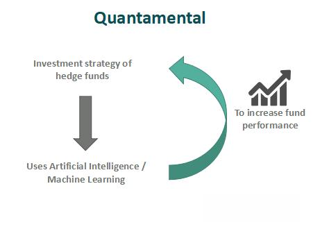

## Table of Contents

## What is the Quantamental approach?

The Quantamental approach is a way of investing that mixes two styles: quantitative and fundamental analysis. Quantitative analysis uses math and computer programs to look at lots of data and find patterns. Fundamental analysis is about looking closely at a company's financial health, its business model, and how it's run. By using both methods together, investors hope to make better decisions and find good investment opportunities that they might miss if they only used one method.

In the Quantamental approach, investors start by using quantitative tools to sort through huge amounts of data quickly. This helps them find companies that look promising based on numbers and trends. Then, they use fundamental analysis to take a deeper look at these companies. They check things like the company's earnings, its debts, and how well it's managed. By combining these two approaches, investors can get a fuller picture of a company and make more informed choices about where to put their money.

## How does the Quantamental approach differ from traditional quantitative and fundamental analysis?

The Quantamental approach is different from traditional quantitative and fundamental analysis because it uses both methods together, while the traditional approaches use them separately. Quantitative analysis focuses on using math and computers to look at lots of data and find patterns. It's great for quickly sorting through huge amounts of information, but it might miss important details about a company's health or management. On the other hand, fundamental analysis dives deep into a company's financials, business model, and leadership. It's thorough but can be slow and might overlook broader market trends or data patterns that quantitative analysis can spot.

In the Quantamental approach, investors start by using quantitative tools to quickly identify promising companies based on data and trends. Then, they use fundamental analysis to take a closer look at these companies, checking their financial health and other important details. This combination helps investors make more informed decisions by using the strengths of both methods. Traditional quantitative analysis might miss the detailed insights that fundamental analysis provides, and traditional fundamental analysis might miss the big picture that quantitative analysis can reveal. By blending the two, the Quantamental approach aims to give a more complete view of potential investments.

## What are the key components of a Quantamental strategy?

The key components of a Quantamental strategy include using computers and math to look at lots of data quickly, and then taking a closer look at the companies that seem promising. First, investors use quantitative analysis to sort through huge amounts of information. They look for patterns and trends in the data that can help them find good investment opportunities. This part of the strategy helps them narrow down their choices and focus on companies that seem to have potential based on numbers and trends.

Next, investors use fundamental analysis to dive deeper into the companies they found using quantitative methods. They check the company's financial health, like its earnings and debts, and look at how well it's managed. This part of the strategy helps them understand if the company is really a good investment. By combining these two methods, the Quantamental strategy aims to give investors a fuller picture of potential investments, using the strengths of both quantitative and fundamental analysis to make better decisions.

## Can you provide examples of how Quantamental analysis is applied in investment decisions?

Imagine an investor wants to find good stocks to buy. They start by using a computer program to look at lots of data from many companies. The program helps them see which companies are doing well based on numbers like sales growth and stock prices. This is the quantitative part of the Quantamental approach. It helps the investor quickly find a list of companies that seem promising.

Next, the investor takes a closer look at the companies on their list. They read the company's financial reports and learn about its business model and management team. This is the fundamental part of the Quantamental approach. For example, they might find a company that looks good based on the numbers, but when they look closer, they see it has a lot of debt or a new CEO who might not be good for the company. By using both quantitative and fundamental analysis, the investor can make a smarter decision about whether to buy the stock or not.

In another example, a fund manager might use Quantamental analysis to pick stocks for a portfolio. They start by using quantitative tools to find companies with strong earnings growth and good stock performance. Then, they use fundamental analysis to check if these companies are really as good as they seem. They might find a company that looks great on paper but has a risky business model or is in a declining industry. By combining both methods, the fund manager can build a portfolio that balances the insights from data with a deep understanding of each company's strengths and weaknesses.

## What are the advantages of using a Quantamental approach in investing?

Using a Quantamental approach in investing helps investors make better decisions by combining the strengths of both quantitative and fundamental analysis. Quantitative analysis lets investors quickly look at lots of data from many companies. It helps them find patterns and trends that can point to good investment opportunities. This is great because it saves time and can spot things that might be hard to see without computers and math. But, quantitative analysis alone might miss important details about a company's health or how it's run.

That's where fundamental analysis comes in. It lets investors take a closer look at the companies they found using quantitative methods. They can check the company's financial reports, understand its business model, and see how well it's managed. This deeper look helps investors decide if a company is really a good investment. By using both methods together, investors get a fuller picture of potential investments. They can find opportunities they might miss if they only used one method, and make smarter choices about where to put their money.

## What are the potential challenges or limitations of implementing a Quantamental strategy?

Implementing a Quantamental strategy can be tricky because it needs a lot of different skills and tools. You need to be good at using computers and math for the quantitative part, and also good at understanding financial reports and business models for the fundamental part. It can be hard to find people who are experts in both areas. Plus, the tools and data you need for this approach can be expensive and hard to get. You might need special software and lots of data to do the quantitative analysis right, and that can cost a lot of money.

Another challenge is that the two parts of the Quantamental approach might not always agree. The quantitative analysis might say a company looks good based on numbers and trends, but when you look closer with fundamental analysis, you might find problems that make it a bad investment. It can be hard to decide which part to trust more when they give different answers. Also, the whole process can take a lot of time. You need to do the quick quantitative analysis first, and then the slower fundamental analysis, which can slow down your decision-making.

## How can data science and machine learning enhance the Quantamental approach?

Data science and machine learning can make the Quantamental approach even better. They help with the quantitative part by letting investors look at even more data faster. With machine learning, computers can find patterns and trends in the data that might be hard for people to see. This can help investors find good investment opportunities quicker and more accurately. For example, machine learning can look at lots of different things about a company, like its sales, stock price, and even what people are saying about it on social media. This gives investors a lot more information to work with.

But data science and machine learning can also help with the fundamental part of the Quantamental approach. They can help investors look at financial reports and other information about a company in new ways. For example, machine learning can help predict how a company might do in the future based on its past performance and other data. This can give investors a better idea of whether a company is a good investment. By using data science and machine learning, investors can get a fuller picture of potential investments and make smarter choices about where to put their money.

## What skills are necessary to effectively implement a Quantamental strategy?

To effectively implement a Quantamental strategy, you need to be good at both quantitative and fundamental analysis. For the quantitative part, you need to know how to use computers and math to look at lots of data quickly. This means you should be skilled in programming languages like Python or R, and understand [statistics](/wiki/bayesian-statistics) and machine learning. These skills help you find patterns and trends in the data that can point to good investment opportunities.

For the fundamental part, you need to be able to read and understand financial reports, and know how to look at a company's business model and how it's run. This means you should be good at financial analysis, understanding things like earnings, debts, and management quality. You also need to be able to combine the insights from both the quantitative and fundamental parts of the analysis. This means being able to see the big picture and make smart decisions about where to invest your money.

Putting all these skills together can be hard. You might need to work with a team of people who are experts in different areas, or spend time learning new skills yourself. It can also be expensive because you need special software and lots of data. But if you can do it well, a Quantamental strategy can help you make better investment decisions by using the strengths of both quantitative and fundamental analysis.

## How has the adoption of Quantamental strategies evolved in the financial industry?

The use of Quantamental strategies in the financial industry has grown a lot over the years. At first, most investors used either quantitative or fundamental analysis on their own. But as computers and data got better, more investors started to see the benefits of using both methods together. They realized that combining the quick data analysis of quantitative methods with the deep company insights from fundamental analysis could help them make better investment choices. This led to more investment firms and funds starting to use Quantamental strategies.

Today, Quantamental strategies are more common in the financial world. Many big investment firms now have teams that are good at both quantitative and fundamental analysis. They use special software and lots of data to find good investment opportunities. Even though it can be hard and expensive to set up, more and more investors are seeing the value in using a Quantamental approach. It helps them get a fuller picture of potential investments and make smarter decisions about where to put their money.

## Can you discuss a case study where a Quantamental approach led to significant investment success?

A good example of a Quantamental approach leading to big investment success is the story of Two Sigma Investments. They are a big [hedge fund](/wiki/hedge-fund-trading-strategies) that uses both quantitative and fundamental analysis to pick stocks. They started by using computers and math to look at lots of data from many companies. This helped them find patterns and trends that pointed to good investment opportunities. For example, they might see that companies in a certain industry were doing really well, or that a company's stock price was going up because of good sales growth.

After finding these promising companies, Two Sigma's team took a closer look using fundamental analysis. They read the company's financial reports and learned about its business model and management team. This helped them understand if the company was really a good investment. By combining both methods, Two Sigma was able to make smart investment choices that led to big profits. Their success shows how using a Quantamental approach can help investors find and take advantage of good investment opportunities that they might miss if they only used one method.

## What are the future trends or developments expected in the Quantamental field?

In the future, we can expect the Quantamental field to keep growing and changing. More investors will start using both quantitative and fundamental analysis together because they see how it can help them make better investment choices. Computers and data will get even better, which means investors can look at more information faster. They will use new tools like [artificial intelligence](/wiki/ai-artificial-intelligence) and machine learning to find patterns and trends that are hard to see with just numbers. This will make the quantitative part of the Quantamental approach even stronger.

Also, investors will find new ways to use fundamental analysis to take a closer look at the companies they find with quantitative methods. They might use new kinds of data, like social media or environmental impact reports, to understand a company's health and future potential. As more people use Quantamental strategies, we might see new kinds of investment products and services that help make this approach easier and more affordable. Overall, the future of the Quantamental field looks bright, with lots of new ideas and tools to help investors make smart choices.

## How can an investor start integrating Quantamental techniques into their existing investment process?

To start using Quantamental techniques in your investment process, you first need to learn about both quantitative and fundamental analysis. For the quantitative part, you'll need to get good at using computers and math to look at lots of data. This means learning how to program in languages like Python or R, and understanding things like statistics and machine learning. These skills will help you find patterns and trends in the data that can point to good investment opportunities. You can start by using free online courses or tools to learn these skills, and then try them out on real data to see what you can find.

Once you have the quantitative part down, you need to learn about fundamental analysis. This means understanding how to read and analyze a company's financial reports, and knowing how to look at its business model and management team. You can start by reading [books](/wiki/algo-trading-books) or taking courses on financial analysis, and then practicing by looking at the reports of companies you're interested in. After you're comfortable with both parts, you can start combining them. Use the quantitative analysis to find promising companies, and then use fundamental analysis to take a closer look and decide if they're good investments. This way, you can make smarter choices about where to put your money.

## What is the difference between Quantitative and Fundamental Investing?

Quantitative investing is a strategy that employs algorithms, mathematical models, and extensive datasets to identify market anomalies and facilitate data-driven trading decisions. The essence of quantitative investing is its reliance on systematic and computational methods to detect patterns and trends in market data, which may not be apparent through traditional means. Advanced statistical techniques, including regression analysis, [machine learning](/wiki/machine-learning) models, and neural networks, are commonly used to analyze vast quantities of financial data in real-time. For example, a simple moving average strategy might utilize a formula such as:

$$
SMA_n = \frac{1}{n} \sum_{i=0}^{n-1} P_{t-i}
$$

where $SMA_n$ is the simple moving average over $n$ periods, and $P_t$ is the price at time $t$.

In contrast, fundamental investing is predicated on the detailed examination of individual companies by assessing factors such as earnings, cash flows, the quality of management, industry conditions, and overall market positioning. This approach seeks to evaluate the intrinsic value of a company, considering both qualitative and quantitative aspects. Fundamental analysts delve into financial statements, competitor positioning, and broader economic indicators to ascertain whether a security is over- or undervalued, thus informing investment decisions.

Traditional hedge funds frequently merge these methodologies to bolster their strategies, using quantitative data to enhance their qualitative evaluations. By integrating statistical trends with a [fundamental analysis](/wiki/fundamental-analysis) of a company’s operational health, hedge funds aim to construct more resilient and adaptive trading strategies.

The quantamental approach encapsulates this synthesis of strategies, combining the structured, data-intensive orientation of quantitative analysis with the nuanced, detail-oriented nature of fundamental analysis. The objective is to harness the strengths of both techniques to yield superior risk-adjusted returns. Quantamental strategies leverage the precision of quantitative models to process large datasets while employing fundamental insights to understand the contextual significance of the results, thus reducing exposure to unforeseen risks and generating more consistent returns. This hybrid approach reflects an evolving landscape in investment strategies that increasingly requires a blend of data analytics and traditional company evaluation.

## References & Further Reading

[1]: Bergstra, J., Bardenet, R., Bengio, Y., & Kégl, B. (2011). ["Algorithms for Hyper-Parameter Optimization."](https://papers.nips.cc/paper/4443-algorithms-for-hyper-parameter-optimization) Advances in Neural Information Processing Systems 24.

[2]: ["Advances in Financial Machine Learning"](https://www.amazon.com/Advances-Financial-Machine-Learning-Marcos/dp/1119482089) by Marcos Lopez de Prado

[3]: ["Evidence-Based Technical Analysis: Applying the Scientific Method and Statistical Inference to Trading Signals"](https://www.amazon.com/Evidence-Based-Technical-Analysis-Scientific-Statistical/dp/0470008741) by David Aronson

[4]: ["Machine Learning for Algorithmic Trading"](https://github.com/stefan-jansen/machine-learning-for-trading) by Stefan Jansen

[5]: ["Quantitative Trading: How to Build Your Own Algorithmic Trading Business"](https://books.google.com/books/about/Quantitative_Trading.html?id=j70yEAAAQBAJ) by Ernest P. Chan