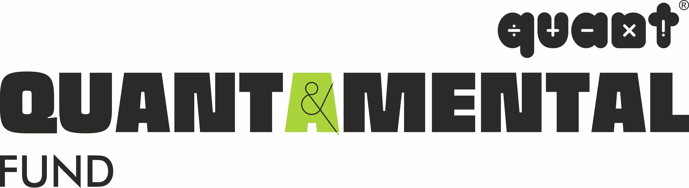

## Table of Contents

## What are quantamental funds?

Quantamental funds are a type of investment fund that combines traditional fundamental analysis with quantitative methods. Fundamental analysis involves looking at a company's financial health, management, and market position to decide if it's a good investment. Quantitative methods use math and computer models to find patterns and make predictions. By using both approaches, quantamental funds try to make better investment decisions.

These funds are popular because they mix the best of both worlds. Investors like them because they can use detailed data analysis to spot trends and opportunities that might be missed by just looking at financial statements. At the same time, they still consider important factors like a company's leadership and industry position. This blend helps quantamental funds aim for higher returns while managing risk more effectively.

## How do quantamental funds differ from traditional quantitative and fundamental investment strategies?

Quantamental funds are different from traditional quantitative funds because they don't just rely on numbers and computer models. Traditional quantitative funds use math to find patterns and make investment decisions, often without looking at the company's story or the people running it. Quantamental funds, on the other hand, add a human touch by also considering the company's fundamentals, like its financial health and management quality. This means they use both data and human judgment to make smarter investment choices.

Compared to traditional fundamental strategies, quantamental funds go beyond just reading financial statements and talking to company leaders. Traditional fundamental investing focuses a lot on understanding a company's business model, its industry, and its future growth. Quantamental funds take this information and combine it with powerful data analysis tools. This allows them to spot trends and opportunities that might be missed by just looking at the company's numbers and story. By blending these approaches, quantamental funds try to get the best of both worlds, aiming for better returns while managing risk.

## What are the key components of a quantamental investment approach?

A quantamental investment approach combines the best parts of two different ways to pick investments: quantitative and [fundamental analysis](/wiki/fundamental-analysis). Quantitative analysis uses numbers and computer programs to find patterns and make predictions about which stocks might do well. This part of the approach looks at big data and uses math to spot trends that might not be easy to see just by reading a company's financial reports. Fundamental analysis, on the other hand, looks at a company's financial health, the quality of its leaders, and its place in the market. It's about understanding the story behind the numbers and figuring out if the company is a good investment based on its overall situation.

By mixing these two methods, quantamental funds try to make smarter investment choices. They use the power of data and computers to find opportunities that might be missed if they only looked at the company's story. At the same time, they don't ignore the important details about a company's management and industry position, which can be crucial for making good investment decisions. This blend helps quantamental funds aim for better returns while also trying to manage risk more effectively.

## Who typically uses quantamental funds and why?

Quantamental funds are often used by big investors like pension funds, endowments, and wealthy individuals. These investors have a lot of money to invest and want to use smart strategies to grow their money. Quantamental funds appeal to them because they combine the power of computers and data with the human touch of understanding a company's story. This mix helps these investors find good investments that might be missed by just looking at numbers or just reading financial reports.

These investors choose quantamental funds because they want to make better decisions and get higher returns while also managing risk. By using both quantitative and fundamental analysis, quantamental funds can spot trends and opportunities that traditional methods might overlook. This approach helps big investors feel more confident in their investment choices, knowing they're using the best of both worlds to grow their money safely.

## What are the advantages of using quantamental funds for investment?

Quantamental funds offer several advantages for investors. They combine the power of computers and big data with the human touch of understanding a company's story. This mix helps investors find good investments that might be missed if they only looked at numbers or just read financial reports. By using both quantitative and fundamental analysis, quantamental funds can spot trends and opportunities that traditional methods might overlook. This approach helps investors feel more confident in their investment choices, knowing they're using the best of both worlds to grow their money safely.

Another advantage of quantamental funds is that they can help manage risk better. Because they use both data and human judgment, these funds can make smarter decisions about which investments to avoid. This can lead to more stable returns over time, which is important for big investors like pension funds and endowments who need to protect their money while also trying to grow it. By blending these two methods, quantamental funds aim to give investors a safer way to achieve higher returns.

## What are the potential risks and challenges associated with quantamental funds?

One potential risk of quantamental funds is that they can be complex and hard to understand. These funds mix computer models with human judgment, which can make it tough for investors to know exactly why certain choices are made. If the computer models are wrong or the people running the fund make bad guesses about a company, the fund might lose money. This complexity can also make it harder for investors to figure out if the fund is doing a good job or not.

Another challenge is that quantamental funds can be expensive to run. They need smart people to do the fundamental analysis and fancy computer systems for the quantitative part. All these costs can add up, and the fund might need to charge higher fees to cover them. If the fund doesn't make enough money to cover these costs, the investors might end up with lower returns than they expected. 

Lastly, there's always the risk that the blend of quantitative and fundamental analysis might not work as well as hoped. Sometimes, the data might suggest one thing, but the company's story might suggest something else. If the fund managers can't balance these two approaches well, they might miss good investment opportunities or make bad choices. This can lead to lower returns or even losses for the investors.

## How do quantamental funds utilize data and technology in their strategies?

Quantamental funds use data and technology to make smart investment choices. They look at a lot of information, like stock prices, company reports, and news, to find patterns and trends. Computers help them do this quickly and accurately. By using special math formulas and computer programs, these funds can spot opportunities that might be hard to see just by reading reports or talking to company leaders.

At the same time, quantamental funds don't just rely on computers. They also use technology to help with the human side of investing. For example, they might use tools to keep track of what company leaders are saying or to analyze how the company is doing compared to others in its industry. By combining this information with the data from their computer models, quantamental funds can make better decisions about which companies to invest in. This mix of data and human judgment helps them aim for higher returns while trying to manage risk.

## Can you provide examples of successful quantamental funds or strategies?

One example of a successful quantamental fund is AQR Capital Management's Applied Fundamental Research (AFR) strategy. This fund uses both computer models and human judgment to pick stocks. They look at a lot of data to find patterns and trends, but they also read company reports and talk to leaders to understand the company's story. By mixing these two approaches, AQR's AFR strategy has been able to find good investments and manage risk well, leading to strong returns for their investors.

Another example is the Renaissance Technologies' Medallion Fund. While it's known more for its quantitative approach, it also uses some fundamental analysis. The fund uses complex math and computer programs to find patterns in the market, but the people running it also look at company details and industry trends. This blend has helped the Medallion Fund achieve amazing returns, often beating the market by a lot. It shows how combining data and human insights can lead to great success in investing.

## How do quantamental fund managers balance quantitative data with qualitative analysis?

Quantamental fund managers balance quantitative data with qualitative analysis by using both computers and human judgment. They use computers to look at a lot of numbers and find patterns that might be hard to see otherwise. This helps them spot trends and opportunities that might be missed if they only read company reports. But they don't stop there. They also talk to company leaders and read news to understand the story behind the numbers. By combining what the computers tell them with what they learn from talking to people, they can make smarter investment choices.

This balance is important because it helps them make better decisions. Sometimes the numbers might suggest one thing, but the company's story might suggest something else. If they only used computers, they might miss important details about the company's management or its place in the market. On the other hand, if they only used human judgment, they might miss trends that the computers can spot. By using both, quantamental fund managers can find good investments while also managing risk, aiming for higher returns for their investors.

## What role does machine learning play in the operation of quantamental funds?

Machine learning is a big help for quantamental funds. It's a type of computer technology that learns from data to make better predictions. In quantamental funds, [machine learning](/wiki/machine-learning) helps find patterns in big sets of numbers, like stock prices and company reports. This can show the fund managers where good investment opportunities might be. By using machine learning, quantamental funds can quickly look at a lot of information and spot trends that might be hard to see otherwise.

Even though machine learning is good at finding patterns, quantamental funds also use human judgment. The people running the fund read company reports and talk to leaders to understand the company's story. Machine learning helps them with the numbers part, but the human part is still important. By mixing what the computers learn with what people know, quantamental funds can make smarter investment choices. This blend helps them aim for higher returns while also managing risk.

## How have quantamental funds performed historically compared to other investment styles?

Quantamental funds have done well over time, often beating other types of investments. They mix the power of computers and big data with the human touch of understanding a company's story. This mix helps them find good investments that might be missed by just looking at numbers or just reading financial reports. For example, AQR Capital Management's Applied Fundamental Research (AFR) strategy has used this approach to get strong returns for their investors. By using both quantitative and fundamental analysis, quantamental funds can spot trends and opportunities that traditional methods might overlook, leading to better performance.

However, quantamental funds don't always do better than other styles. Sometimes, the market can be hard to predict, and even the best mix of data and human judgment can't always get it right. Traditional quantitative funds, which only use numbers and computer models, can do well when the market follows clear patterns. On the other hand, traditional fundamental funds, which focus on a company's financial health and management, can do well when the market values these details more. So, while quantamental funds have a good track record, their performance can vary depending on market conditions and how well they balance their strategies.

## What future trends or developments can we expect in the field of quantamental investing?

In the future, we can expect quantamental investing to use even more advanced technology. Machine learning and [artificial intelligence](/wiki/ai-artificial-intelligence) will become even better at finding patterns in big sets of data. This will help quantamental funds spot new investment opportunities even faster. They might also use new types of data, like social media posts or satellite images, to learn more about companies and markets. This could make their predictions more accurate and help them find good investments that others might miss.

Another trend we might see is more personalized investing. Quantamental funds could use technology to create investment plans that fit each investor's needs and goals better. This means they might look at things like how much risk an investor is okay with or how long they plan to keep their money invested. By using both computers and human judgment, quantamental funds can make smarter choices that match what each investor wants. This could make investing more successful and satisfying for people.

## References & Further Reading

[1]: Bergstra, J., Bardenet, R., Bengio, Y., & Kégl, B. (2011). ["Algorithms for Hyper-Parameter Optimization."](https://proceedings.neurips.cc/paper/2011/file/86e8f7ab32cfd12577bc2619bc635690-Paper.pdf) Advances in Neural Information Processing Systems 24.

[2]: ["Advances in Financial Machine Learning"](https://www.amazon.com/Advances-Financial-Machine-Learning-Marcos/dp/1119482089) by Marcos Lopez de Prado

[3]: ["Evidence-Based Technical Analysis: Applying the Scientific Method and Statistical Inference to Trading Signals"](https://www.amazon.com/Evidence-Based-Technical-Analysis-Scientific-Statistical/dp/0470008741) by David Aronson

[4]: ["Machine Learning for Algorithmic Trading"](https://github.com/stefan-jansen/machine-learning-for-trading) by Stefan Jansen

[5]: ["Quantitative Trading: How to Build Your Own Algorithmic Trading Business"](https://books.google.com/books/about/Quantitative_Trading.html?id=j70yEAAAQBAJ) by Ernest P. Chan