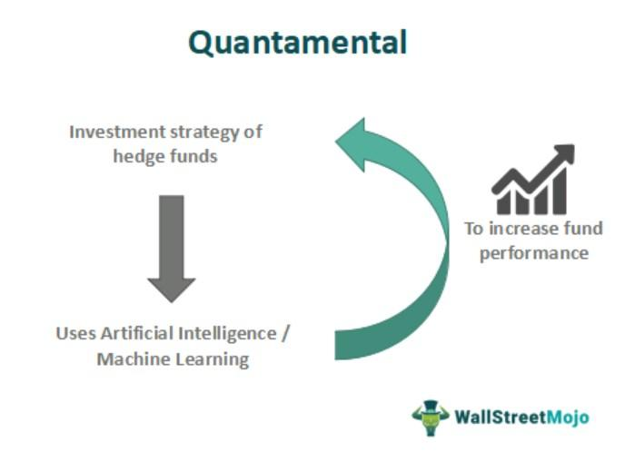

## Table of Contents

## What is quantamental trading?

Quantamental trading is a way of investing that mixes two different approaches: quantitative and fundamental analysis. Quantitative analysis uses math and computers to look at lots of data and find patterns that can help predict how investments will do. Fundamental analysis, on the other hand, looks at the basic health and value of a company by studying things like its financial reports, the people running it, and what's happening in the world around it.

By combining these two methods, quantamental trading tries to get the best of both worlds. It uses the power of computers and data to spot trends quickly and accurately, while also considering the deeper insights that come from understanding a company's story and its place in the market. This approach can help investors make smarter decisions by using both numbers and human judgment.

## How does quantamental trading combine quantitative and fundamental analysis?

Quantamental trading mixes the power of computers with the insights of human analysis. It uses quantitative methods, which involve math and big data, to find patterns and trends in the market. This helps investors spot opportunities quickly and make decisions based on hard numbers. For example, a computer can analyze tons of stock prices and trading volumes to predict how a stock might move in the future.

On the other hand, quantamental trading also relies on fundamental analysis, where people look at a company's financial health, its management team, and what's happening in the world around it. This helps investors understand the story behind the numbers and make more informed decisions. By combining these two approaches, quantamental trading aims to get a fuller picture of an investment's potential, using both data-driven insights and human judgment to guide investment choices.

## What are the key components of a quantamental trading strategy?

A quantamental trading strategy includes using computers and math to look at a lot of data. This is called quantitative analysis. It helps find patterns and trends in the market. Traders use special computer programs to analyze things like stock prices, trading volumes, and other numbers. This part of the strategy makes decisions based on hard data, which can help spot opportunities quickly and accurately.

The other important part is fundamental analysis. This means looking at a company's financial health, its leaders, and what's happening in the world that might affect it. Traders study reports, news, and other information to understand the story behind the numbers. By combining this with quantitative data, a quantamental strategy gets a fuller picture of an investment. It uses both computer power and human judgment to make smarter investment choices.

These two parts work together to make a strong trading strategy. The quantitative side helps find quick opportunities, while the fundamental side adds deeper understanding. By using both, traders can make decisions that are based on a lot of information and a good understanding of the market.

## Who can benefit from using a quantamental trading strategy?

People who want to make smart investment choices can benefit from using a quantamental trading strategy. This approach is good for both big investors, like hedge funds and institutional investors, and smaller investors who want to do better in the market. By mixing computer analysis with a deep understanding of companies, quantamental trading helps everyone see the full picture of an investment. This can lead to better decisions and possibly higher returns.

Even people who are new to investing can find value in a quantamental strategy. It breaks down complex market information into something easier to understand. With tools and data that are easier to access, beginners can use quantamental methods to learn and grow their investments. Overall, anyone looking to improve their investment strategy can benefit from the blend of data-driven insights and fundamental analysis that quantamental trading offers.

## What are the basic steps to implement a quantamental trading strategy?

To start using a quantamental trading strategy, you first need to gather a lot of data. This includes things like stock prices, trading volumes, and financial reports of companies. You'll use computer programs to look at this data and find patterns or trends that can help predict how investments might do in the future. This is the quantitative part of the strategy. It's important to use good tools and software that can handle big amounts of data and do the math for you.

Next, you need to do the fundamental analysis. This means studying the companies you're interested in more deeply. Look at their financial health, read about their leaders, and keep up with news that might affect them. This helps you understand the story behind the numbers and see if a company is a good investment. By combining the patterns you found with the computer with your understanding of the company, you can make smarter investment choices. This mix of computer power and human insight is what makes a quantamental strategy work well.

## How does data play a role in quantamental trading?

Data is really important in quantamental trading. It's like the building blocks that help traders make smart choices. In this strategy, traders use computers to look at tons of data, like stock prices and trading volumes. This helps them find patterns and trends that might not be easy to see just by looking. By using this data, traders can predict how investments might do in the future and make quick decisions based on numbers.

But data isn't the whole story in quantamental trading. Traders also use data to help them understand the bigger picture of a company. They look at financial reports, news, and other information to see how healthy a company is and what might affect it. By combining this detailed information with the patterns found by computers, traders get a full view of an investment. This mix of data-driven insights and human understanding helps them make better decisions.

## What are some common tools and technologies used in quantamental trading?

In quantamental trading, traders use special computer programs to look at lots of data. These programs are called data analysis software, and they help find patterns in things like stock prices and trading volumes. Some popular tools include Python, which is a programming language that's good for working with numbers, and R, another language that's great for statistics. Traders also use platforms like Bloomberg Terminal, which gives them real-time data and news to help make quick decisions.

Another important tool is machine learning. This is a type of computer technology that can learn from data and get better over time. Traders use machine learning to make predictions about the market and find new investment opportunities. They also use databases to store all their data, and data visualization tools like Tableau to make charts and graphs that help them see what's going on more clearly. By using these tools together, traders can mix the power of computers with their own understanding of companies to make smart investment choices.

## What are the advantages of quantamental trading over traditional trading methods?

Quantamental trading has some big advantages over traditional ways of trading. One of the main benefits is that it uses computers to look at a lot of data very quickly. This means traders can find patterns and trends in the market that they might miss if they were just looking at numbers by hand. It also helps them make decisions based on hard data, which can lead to better predictions about how investments will do in the future. This can give traders an edge in the market because they can act faster and with more information than people using older methods.

Another advantage is that quantamental trading mixes the power of computers with the insights that come from understanding companies more deeply. While traditional trading might focus more on just looking at numbers or just understanding a company's story, quantamental trading uses both. This means traders can see the full picture of an investment, combining the quick analysis from computers with the thoughtful understanding of a company's health and future. This can lead to smarter investment choices and potentially higher returns, making it a powerful tool for anyone looking to do better in the market.

## What are the potential risks and challenges associated with quantamental trading?

Quantamental trading can be tricky because it relies a lot on computers and data. If the data you're using is wrong or not complete, your predictions might be off. Also, the computer programs and models you use might have mistakes or might not work well with new situations. This can lead to bad investment choices. Another challenge is that it can be hard to find and use the right tools and technology. These tools can be expensive, and not everyone knows how to use them well. This means you might need to spend a lot of time and money learning how to do quantamental trading properly.

Another risk is that markets can change quickly, and what worked in the past might not work in the future. Even with a lot of data and good computer models, it's hard to predict everything. Sometimes, human judgment can be wrong too, especially when trying to understand the bigger picture of a company. This mix of data and human insight can be powerful, but it also means there's a lot that can go wrong. It's important to keep learning and adjusting your strategy to stay ahead in the market.

## How can one evaluate the performance of a quantamental trading strategy?

To evaluate the performance of a quantamental trading strategy, you need to look at how well it does over time. This means checking if the strategy is making money and if it's doing better than just putting money in a savings account or following the stock market. You can use numbers like return on investment (ROI) to see how much money you're making compared to how much you started with. Another important thing to look at is the risk you're taking. A good strategy should balance making money with not losing too much if things go wrong. You can use measures like the Sharpe ratio, which tells you how much return you're getting for the risk you're taking.

It's also helpful to compare your quantamental strategy to other ways of trading. This can give you a sense of how well it's doing compared to simpler methods. You can also keep track of how often your predictions are right and how well your computer models and human judgments are working together. Over time, you might need to adjust your strategy based on what you learn from these evaluations. By regularly checking and tweaking your approach, you can make sure your quantamental trading strategy stays strong and keeps helping you make smart investment choices.

## Can you provide case studies or examples of successful quantamental trading strategies?

One example of a successful quantamental trading strategy is the approach used by Renaissance Technologies, a hedge fund known for its Medallion Fund. They use computers to analyze huge amounts of data, looking for patterns that can help predict how investments will do. But they also use fundamental analysis to understand the bigger picture of companies. By combining these two methods, Renaissance Technologies has been able to make a lot of money for their investors. Their strategy shows how mixing data-driven insights with human judgment can lead to great results in the market.

Another example is the quantamental approach taken by Two Sigma, another successful hedge fund. Two Sigma uses advanced computer models to look at data from many different sources, like stock prices and news articles. They also have experts who study companies in detail, looking at things like financial health and management. By using both computer power and human insight, Two Sigma has been able to find good investment opportunities and make smart decisions. Their success shows that a quantamental strategy can help traders do well in a changing market.

## What advanced techniques can be used to enhance a quantamental trading strategy?

To make a quantamental trading strategy even better, you can use something called machine learning. This is when computers learn from data and get better at making predictions over time. By using machine learning, you can find patterns in the market that are hard to see with just regular computer programs. It can also help you adjust your strategy as the market changes, so you're always using the most up-to-date information. This can lead to smarter investment choices and possibly higher returns.

Another advanced technique is using alternative data. This means looking at information that's not usually used in trading, like social media posts, satellite images, or credit card transactions. By adding this kind of data to your analysis, you can get a fuller picture of what's happening in the market and with companies. It can help you spot trends and opportunities that others might miss. Combining alternative data with the numbers from traditional data sources can make your quantamental strategy even stronger.

## References & Further Reading

[1]: Bergstra, J., Bardenet, R., Bengio, Y., & Kégl, B. (2011). ["Algorithms for Hyper-Parameter Optimization."](https://papers.nips.cc/paper/4443-algorithms-for-hyper-parameter-optimization) Advances in Neural Information Processing Systems 24.

[2]: ["Advances in Financial Machine Learning"](https://www.amazon.com/Advances-Financial-Machine-Learning-Marcos/dp/1119482089) by Marcos Lopez de Prado.

[3]: ["Evidence-Based Technical Analysis: Applying the Scientific Method and Statistical Inference to Trading Signals"](https://www.amazon.com/Evidence-Based-Technical-Analysis-Scientific-Statistical/dp/0470008741) by David Aronson.

[4]: ["Machine Learning for Algorithmic Trading"](https://github.com/stefan-jansen/machine-learning-for-trading) by Stefan Jansen.

[5]: ["Quantitative Trading: How to Build Your Own Algorithmic Trading Business"](https://books.google.com/books/about/Quantitative_Trading.html?id=j70yEAAAQBAJ) by Ernest P. Chan.