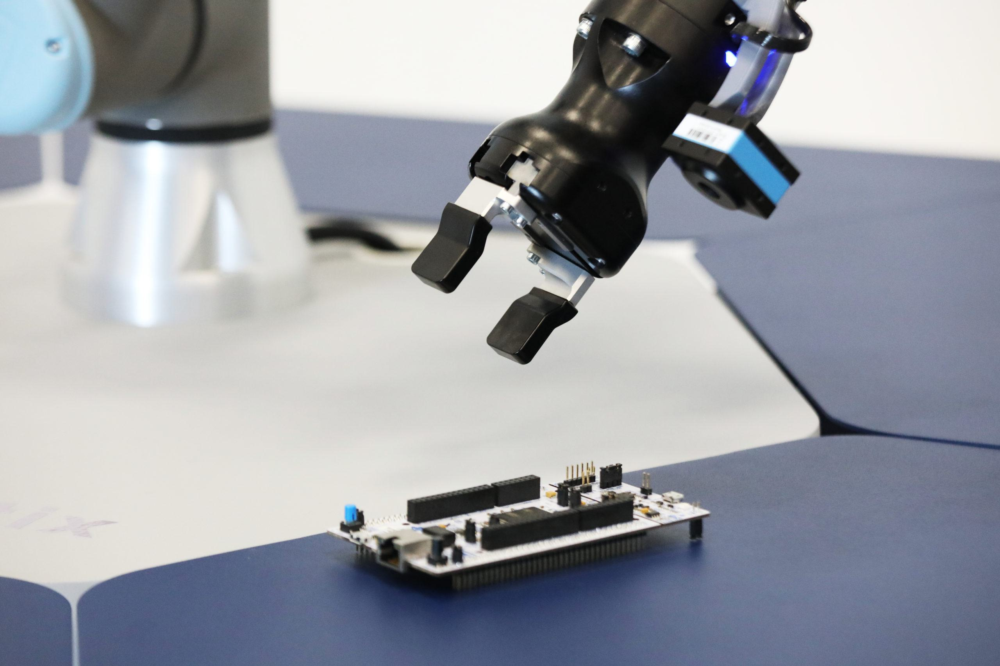

Quantbot Technologies is a prominent player in the domain of algorithmic trading, a sector that has revolutionized the financial markets through the use of sophisticated computer algorithms to execute trades at speeds and efficiencies beyond human capacity. Algorithmic trading refers to the process where algorithms, which are sets of predefined rules often established by complex mathematical models, are used to automate trading transactions in the financial markets. This methodology plays an increasingly vital role as it enhances the capability to process large volumes of data at great speeds, thereby optimizing trading strategies and minimizing human errors.

In the modern financial landscape, algorithmic trading is of critical importance. It not only facilitates higher accuracy in trading decisions due to its data-driven nature but also significantly reduces the emotional bias that can plague human traders. The automation allows for trades to be executed in microseconds, providing a competitive edge in markets where timing is crucial. Investors and financial institutions lean towards algorithmic trading to improve operational efficiency, decrease costs, and gain better access to vast streams of market data, making it indispensable in current trading environments.

Quantbot Technologies sets itself apart by offering state-of-the-art algorithmic trading solutions designed to leverage the speed and accuracy afforded by modern computational technologies. The company prides itself on providing accessible and user-friendly platforms fortified with industry-leading security measures. Quantbot’s trading solutions enable users to harness advanced data analysis tools, effectively optimizing trading strategy execution while mitigating associated risks.

This article aims to provide a comprehensive exploration of Quantbot Technologies, emphasizing its strategic role and contributions to the algorithmic trading sector. It will detail the innovations and operational features that distinguish Quantbot, its market reach, leadership, and history. Furthermore, readers will gain insights into the advantages offered by Quantbot’s solutions and the potential challenges that financial entities might encounter when integrating these solutions into their trading frameworks. Through this analysis, the article seeks to illuminate the transformative impact Quantbot Technologies has on advancing trading technologies and its strategic vision for future growth. Readers can expect to gain a deeper understanding of Quantbot Technologies’ potential benefits and opportunities in the ever-evolving trading market.

## Table of Contents

## Understanding Algorithmic Trading

Algorithmic trading, often referred to as algo trading, involves the use of computer algorithms to execute trading orders based on predetermined criteria and market conditions. This approach leverages mathematical models and statistical analyses to generate trading signals and determine the optimal timing and pricing for execution, minimizing human intervention and potential errors. The concept of algorithmic trading dates back to the 1970s, when the New York Stock Exchange began to use it for order management and execution. Since then, it has evolved significantly, especially with the introduction of electronic trading platforms in the 1990s.

The fundamental principle of algorithmic trading is to automate the trading process to achieve greater efficiency and effectiveness. Algorithms are designed to follow quantitative criteria, such as price movements or trading volumes, and they can execute orders at speeds and frequencies that are impossible for a human trader. The speed of execution is crucial, as even a millisecond delay can impact the profitability of trades. For instance, algorithms can analyze market conditions using complex computational methods and place trades in fractions of a second, far surpassing human capabilities.

One of the significant advantages of [algorithmic trading](/wiki/algorithmic-trading) is its ability to eliminate the emotional component from trading decisions. Human traders are often swayed by emotions, leading to decision-making errors and biases, such as panic selling or over-trading. Algorithms, in contrast, execute trades based strictly on logic and predefined rules, enhancing accuracy and consistency.

In the algo trading world, there are several well-known strategies that traders employ. Among them, [arbitrage](/wiki/arbitrage) strategies exploit price differences across various markets or instruments. For example, an algorithm might notice that the price of a stock on one exchange is marginally lower than on another and execute simultaneous buy and sell orders to capture the difference. Another prevalent strategy is [trend following](/wiki/trend-following), where algorithms identify and ride prevailing market trends by analyzing signals such as moving averages or price [momentum](/wiki/momentum).

The industry is also seeing substantial technological advancements, the most prominent being the use of [artificial intelligence](/wiki/ai-artificial-intelligence) (AI) and [machine learning](/wiki/machine-learning) (ML). These technologies enable the development of algorithms that learn and adapt to changing market conditions, potentially leading to more robust and profitable trading systems. AI-driven models can identify complex patterns and correlations in vast datasets, enhancing predictive accuracy and enabling swift market entry and [exit](/wiki/exit-strategy).

In conclusion, algorithmic trading has revolutionized financial markets by introducing speed, precision, and objectivity, paving the way for a more efficient trading ecosystem. The ongoing advancements in technology continue to shape its evolution, with newer and more sophisticated strategies emerging as AI and ML technologies mature.

## About Quantbot Technologies

Quantbot Technologies is a prominent firm specializing in algorithmic trading, with a mission to revolutionize the way trading is conducted through advanced technological solutions. Established to leverage cutting-edge technology, Quantbot aims to provide sophisticated, high-performance trading algorithms that enable efficient and effective [liquidity](/wiki/liquidity-risk-premium) management in the financial markets.

The history of Quantbot Technologies is marked by a consistent focus on innovation and strategic growth in the algorithmic trading sector. Since its inception, the company has been grounded in foundational principles that emphasize technological excellence, robust risk management, and continuous adaptation to market changes. This approach ensures that Quantbot stays at the forefront of the algorithmic trading industry.

The leadership team at Quantbot Technologies is composed of experienced professionals from diverse backgrounds in finance, technology, and quantitative research. This multidisciplinary team drives the company's vision of creating advanced algorithmic trading platforms that cater to a wide range of financial instruments. The leadership's commitment to fostering a culture of innovation plays a significant role in maintaining Quantbot's competitive edge.

Quantbot Technologies operates in key financial markets globally, with a strong presence in major trading hubs such as New York, London, Hong Kong, and Tokyo. This widespread geographic reach allows the company to engage with a diverse clientele, including hedge funds, institutional traders, and proprietary trading firms, providing them with tailored algorithmic trading solutions.

Over the years, Quantbot Technologies has received numerous awards and recognitions within the financial industry, highlighting its contributions to the advancement of algorithmic trading technologies. These accolades serve as a testament to the firm's commitment to excellence, innovation, and the delivery of value to its clients. Quantbot's reputation as a leader in the field is further underscored by these achievements, reflecting its status as a key player in the evolution of modern trading practices.

## Key Features of Quantbot Technologies' Algo Trading Solutions

Quantbot Technologies offers a comprehensive suite of algorithmic trading solutions designed to enhance trading performance for both institutional and individual traders. At the core of Quantbot's offerings is a robust architecture that integrates advanced machine learning models and big data analytics, providing users with highly efficient trading algorithms. These algorithms are capable of processing and analyzing vast amounts of data in real time, allowing traders to make informed decisions quickly.

Technical features that distinguish Quantbot Technologies include its sophisticated predictive analytics, which use historical and live market data to predict price movements with high accuracy. These analytics are supported by Quantbot's proprietary algorithms, which are continually optimized using machine learning techniques. Moreover, Quantbot's systems are designed to minimize latency, a critical [factor](/wiki/factor-investing) in modern trading environments where milliseconds can impact trade outcomes. This is achieved through state-of-the-art infrastructure and technologies such as co-located servers, ensuring high-speed data transmission.

The user interface of Quantbot's trading platforms is intuitive and customizable, enabling traders to tailor their trading environments to their specific needs. The platforms offer comprehensive charting tools, real-time data feeds, and advanced order management systems, ensuring a seamless and efficient trading experience. The user experience is further enhanced by interactive and responsive dashboards that provide clear and concise information, facilitating faster decision-making processes.

Security is a paramount concern for Quantbot Technologies. The company employs advanced encryption protocols and multi-factor authentication to safeguard user data and trading operations. Regular security audits and updates ensure that Quantbot's systems remain robust against potential cyber threats. Additionally, Quantbot Technologies is committed to maintaining high reliability and uptime, with redundant systems and failover strategies in place to guarantee continuous operation even in the event of technical issues.

Quantbot Technologies has demonstrated the effectiveness of its solutions through various case studies. For instance, a notable example involved a [hedge fund](/wiki/hedge-fund-trading-strategies) that saw a significant increase in its return on investment after implementing Quantbot's algorithmic solutions. The fund benefited from the enhanced data-driven insights provided by Quantbot, enabling it to optimize its trading strategies and reduce risks effectively.

In sum, Quantbot Technologies' algorithmic trading solutions offer a unique combination of cutting-edge technology, robust security measures, and user-friendly interfaces, positioning the company as a leader in the algorithmic trading sector.

## Benefits of Leveraging Quantbot Technologies for Algo Trading

Quantbot Technologies offers significant benefits to those engaging in algorithmic trading through its advanced platform and suite of tools, ensuring both efficiency and cost-effectiveness in trading activities. The primary advantage lies in the optimization of trading strategies facilitated by Quantbot's technology. By leveraging sophisticated algorithms, Quantbot minimizes trading risks by providing data-driven insights and reducing the impact of human emotions on trading decisions. This precise execution leads to enhanced decision-making and increased profitability.

The platform offers seamless access to comprehensive data analysis tools and resources, positioning users to make informed decisions based on quantitative metrics. These tools enable traders to process vast amounts of market data rapidly, identify patterns, and act on opportunities that manual trading might miss. In particular, Quantbot’s ability to handle high-frequency trading scenarios allows traders to capitalize on small price discrepancies with unparalleled speed.

Efficiency is further highlighted in Quantbot Technologies' cost-benefit analysis. The use of automation and data-driven strategies reduces operational costs, as fewer human resources are needed for trading execution and analysis. This translates into better allocation of capital and resources, enabling investors to focus on strategy rather than execution logistics.

Additionally, customer testimonials reflect the reliability and effectiveness of Quantbot's services. Users frequently cite the intuitive user interface and robust performance as key factors that enhance their trading experience. The platform’s scalability is also praised, which allows traders to efficiently handle increased trading volumes without compromising on speed or accuracy.

Strategic partnerships formed through collaboration with Quantbot Technologies yield additional advantages. These partnerships often lead to shared insights and technological advancements, supporting continuous improvement and innovation in trading strategies. The collaborative nature of these partnerships can lead to mutually beneficial outcomes, including improved market access and enhanced technology solutions.

In conclusion, Quantbot Technologies provides an array of benefits that appeal to traders seeking to enhance efficiency, optimize strategies, and reduce costs. Through innovative solutions and strategic partnerships, it offers a competitive edge in the fast-paced world of algorithmic trading.

## Challenges and Considerations

Integrating Quantbot Technologies into existing trading operations encompasses several challenges and considerations that need careful navigation. One primary challenge lies in harmonizing Quantbot’s sophisticated algorithmic models with a firm's established systems. Existing infrastructure may require significant modification to accommodate Quantbot's advanced trading platforms, potentially involving both hardware and software upgrades. This can lead to increased initial investment costs and a learning curve for staff aiming to fully utilize the new system's capabilities.

Legal and regulatory considerations are paramount when implementing algorithmic trading solutions. The financial industry is subject to stringent regulations worldwide, such as the Markets in Financial Instruments Directive II (MiFID II) in Europe and the Dodd-Frank Wall Street Reform and Consumer Protection Act in the United States. These regulations demand transparency, risk management, and reporting, necessitating that Quantbot Technologies and the firms utilizing their solutions ensure compliance to avoid penalties. This includes maintaining robust audit trails and implementing compliance checks within the trading algorithms themselves.

Risk management is another critical area, as algo trading can amplify both profits and losses due to its high-speed nature. Firms need to establish thorough risk management protocols, incorporating stop-loss controls and stress testing to handle market volatilities effectively. Ensuring system reliability and resilience against cyber threats is essential, as any technological failure or breach could result in substantial financial and reputational damage.

Technical challenges, like platform migration, can pose significant obstacles. Migrating from existing systems to those provided by Quantbot Technologies requires meticulous planning to prevent data loss and ensure data integrity. A phased implementation strategy is often recommended, allowing teams to acclimate to changing workflows gradually and systems to be tested thoroughly at each stage before full deployment.

Future-proofing trading operations with Quantbot Technologies involves fostering adaptability to technological advancements. As emerging technologies like artificial intelligence and machine learning continue to evolve, integrating these advancements into Quantbot’s platforms can optimize trading strategies and enhance performance. Staying updated with Quantbot's ongoing developments ensures that operations capitalize on cutting-edge tools and methodologies, maintaining a competitive edge in the rapidly evolving financial markets. 

Continuous investment in staff training and development will be critical, ensuring personnel are proficient in both current and forthcoming technologies, thereby enabling smoother transitions and sustained operational efficiency.

## Future of Algo Trading and Quantbot Technologies

Predicting the future trends in algorithmic trading involves considering advancements in technology, market structure changes, and regulatory shifts. The next phase is likely to be characterized by increased automation, the integration of artificial intelligence (AI) and machine learning, and a heightened focus on real-time data analytics. Algorithmic trading firms are expected to enhance their algorithms' adaptability and precision, utilizing [deep learning](/wiki/deep-learning) models for pattern recognition and predictive analytics.

Quantbot Technologies is at the forefront of these developments, leveraging its technological prowess to shape the future landscape of algo trading. By embracing AI and machine learning, Quantbot aims to refine its trading algorithms, enhancing their efficiency and adaptability. The use of AI can be reflected in improved data processing capabilities, ensuring that large volumes of market data are analyzed swiftly and accurately. This promotes faster decision-making and better risk management, potentially leading to increased profitability and reduced operational risks.

Potential developments on Quantbot's roadmap include the enhancement of algorithmic models to incorporate more sophisticated machine learning techniques, such as [reinforcement learning](/wiki/reinforcement-learning) and neural networks. These methodologies can help algorithms learn from market changes and improve their predictive capabilities over time. Additionally, Quantbot may focus on refining its risk management tools, using AI to better predict and mitigate potential market fluctuations.

Emerging technologies like distributed ledger technology (DLT) and quantum computing could further impact Quantbot’s solutions. DLT can offer more transparency and reliability in trade verification, while quantum computing promises unprecedented computation speeds, which can significantly accelerate data processing and analysis.

Quantbot Technologies might explore expansion strategies focusing on emerging markets with growing financial infrastructures. Asia and Africa could represent new growth areas due to their increasing adoption of digital financial services. Furthermore, Quantbot could develop partnerships with fintech and data analytics firms to expand its technological capabilities and market reach.

In summary, the future of algorithmic trading appears promising with advancements driven by AI, machine learning, and other emerging technologies. Quantbot Technologies is well-positioned to lead these innovations, potentially redefining the landscape of algorithmic trading through enhanced solutions and strategic market expansions.

## Conclusion

Quantbot Technologies has emerged as a significant player in the field of algorithmic trading, offering innovative solutions that address the growing demands of modern financial markets. By leveraging advanced algorithms, Quantbot Technologies enhances trading efficiency, accuracy, and speed, thereby providing a competitive edge to its users. The company's commitment to minimizing human emotional interference in trading decisions and its ability to offer scalable strategies have made it a preferred choice among traders worldwide.

Throughout this article, we have explored the fundamental aspects of algorithmic trading, Quantbot Technologies' contributions, and its distinct features that differentiate it from other tech firms in the industry. The company's technical innovations, such as robust data analysis tools and secure trading platforms, demonstrate its dedication to advancing trading technologies. Quantbot's involvement in shaping the future of algorithmic trading is underscored by its potential expansion into new markets and its embrace of emerging technologies like AI and machine learning.

As the algorithmic trading landscape continues to evolve, Quantbot Technologies is poised to remain at the forefront of innovation. Its solutions are adaptable and forward-thinking, equipping traders with the necessary tools to future-proof their operations. The seamless integration of Quantbot's offerings into various trading platforms will likely enhance operational efficiency and strategy optimization for traders seeking cutting-edge solutions.

For those interested in exploring the next level of algorithmic trading, Quantbot Technologies presents a compelling opportunity. Further research and inquiry into their offerings could yield valuable insights and strategic advantages for trading professionals. As the company continues to innovate and expand its reach, stakeholders are encouraged to consider Quantbot Technologies as a key partner in their trading journey.

## References & Further Reading

[1]: ["Advances in Financial Machine Learning"](https://www.amazon.com/Advances-Financial-Machine-Learning-Marcos/dp/1119482089) by Marcos Lopez de Prado

[2]: ["Quantitative Trading: How to Build Your Own Algorithmic Trading Business"](https://www.amazon.com/Quantitative-Trading-Build-Algorithmic-Business/dp/0470284889) by Ernest P. Chan

[3]: ["Algorithmic Trading: Winning Strategies and Their Rationale"](https://books.google.com/books/about/Algorithmic_Trading.html?id=WAlFDwAAQBAJ) by Ernest P. Chan

[4]: Hasbrouck, J. (2003). ["Intraday Price Formation in U.S. Equity Markets."](https://onlinelibrary.wiley.com/doi/10.1046/j.1540-6261.2003.00609.x) The Journal of Finance, 58(6), 2485-2513.

[5]: ["Machine Learning for Algorithmic Trading: Predictive models to extract signals from market and alternative data for systematic trading strategies with Python"](https://www.amazon.com/Machine-Learning-Algorithmic-Trading-alternative/dp/1839217715) by Stefan Jansen