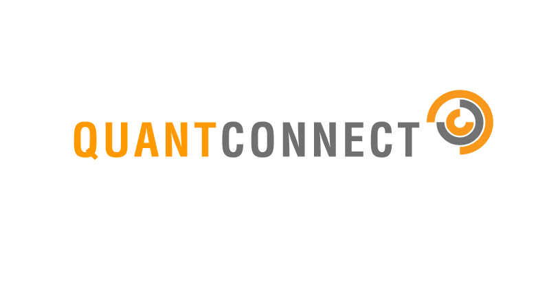

## Table of Contents

## What is QuantConnect and what does it offer to traders and developers?

QuantConnect is a platform that helps people who want to trade stocks, forex, and other financial instruments by using computer programs. It is designed for both traders and developers who want to create and test their own trading strategies without needing to know a lot about programming. The platform allows users to write their trading algorithms in a language called C# and provides a lot of data and tools to help them make better trading decisions.

One of the main things QuantConnect offers is a feature called backtesting. This means users can test their trading strategies using historical market data to see how well they would have performed in the past. This helps traders see if their strategies are good before they use real money. Additionally, QuantConnect has a community where users can share ideas, get help, and learn from each other. This makes it easier for beginners to start trading and for experienced users to improve their strategies.

## How do you set up a QuantConnect account and start using the platform?

To set up a QuantConnect account, you first need to visit their website and click on the "Sign Up" button. You will be asked to enter your email address and create a password. After that, you'll need to fill out a short form with some basic information about yourself. Once you submit the form, you'll receive an email to verify your account. Click on the verification link in the email, and you'll be all set to log in and start using QuantConnect.

Once you're logged in, you can start exploring the platform. To begin using it, click on the "New Algorithm" button to create your first trading strategy. You'll see a coding window where you can write your algorithm in C#. QuantConnect provides many tutorials and examples to help you get started, so don't worry if you're new to coding. You can also join the community forums to ask questions and learn from other users. As you get more comfortable, you can start [backtesting](/wiki/backtesting) your strategies with historical data to see how they would have performed in the past.

## What are the basic concepts of algorithmic trading that one should know before using QuantConnect?

Before using QuantConnect, it's helpful to know some basic ideas about [algorithmic trading](/wiki/algorithmic-trading). Algorithmic trading means using computer programs to buy and sell things like stocks or [forex](/wiki/forex-system) automatically. These programs, called algorithms, follow a set of rules to decide when to trade. They can look at lots of data very quickly, which is something humans can't do as fast. This can help find good times to buy or sell, and it can also help avoid making decisions based on feelings.

Another important concept is backtesting. This is when you test your trading strategy using old market data to see how it would have worked in the past. It's like a practice run to see if your idea is good before using real money. Backtesting helps you find mistakes and improve your strategy. QuantConnect has tools to make backtesting easier, so it's good to understand this idea before you start using the platform.

Lastly, it's useful to know about risk management. This means having ways to protect your money while trading. You can set limits on how much you're willing to lose on a trade, and you can also spread your money across different investments to lower the risk. Understanding these basic ideas will help you use QuantConnect more effectively and make smarter trading decisions.

## How do you create your first algorithm on QuantConnect?

To create your first algorithm on QuantConnect, start by logging into your account. Once you're in, click on the "New Algorithm" button. You'll see a coding window where you can write your trading strategy in C#. If you're new to coding, don't worry—QuantConnect has lots of examples and tutorials to help you. For your first algorithm, you might want to start with something simple, like buying a stock when its price goes up and selling it when it goes down. You can use the examples provided by QuantConnect as a guide to write your own code.

After you've written your algorithm, you can test it using backtesting. This means you'll run your strategy using old market data to see how it would have worked in the past. To do this, click on the "Backtest" button and choose the time period you want to test. QuantConnect will then show you how your strategy would have performed, including how much money you would have made or lost. If your strategy didn't work well, you can go back and change your code to make it better. Once you're happy with your algorithm, you can move on to using real money, but for now, backtesting is a safe way to practice and learn.

## What programming languages are supported by QuantConnect and which one should a beginner start with?

QuantConnect supports mainly C# for writing trading algorithms. This language is powerful and widely used in the platform's community. Besides C#, QuantConnect also supports Python, which has become more popular lately because it's easier to learn and read. Both languages have their own strengths, but they can do similar things when it comes to creating trading strategies.

For beginners, it's best to start with Python. It's simpler and more like how we speak every day, so it's easier to pick up if you're new to coding. QuantConnect has lots of tutorials and examples in Python, which can help you learn faster. Once you get the hang of Python, you can move to C# if you want to use more advanced features or join the bigger C# community on QuantConnect.

## How can you backtest your algorithms on QuantConnect and what are the key considerations for effective backtesting?

To backtest your algorithms on QuantConnect, start by writing your trading strategy in the coding window. Once you're happy with your code, click on the "Backtest" button. You'll need to choose the time period you want to test, like the last year or the last five years. QuantConnect will then run your strategy using old market data to see how it would have worked. After the backtest is done, you'll see a report showing how much money you would have made or lost, and other details like how often you traded and how risky your strategy was. This helps you see if your strategy is good before using real money.

For effective backtesting, it's important to use a long enough time period to make sure your strategy works in different market conditions. If you only test for a short time, you might miss how your strategy does during big market changes. Also, make sure to use realistic settings, like real trading costs and limits on how much you can trade at once. This makes your backtest more like real trading. Lastly, don't just look at how much money you made. Check other things like how risky your strategy is and how often it trades. This gives you a better idea of how well your strategy might work in the real world.

## What are QuantConnect's data sources and how can you access and utilize them in your algorithms?

QuantConnect gives you lots of data to use in your trading algorithms. They have data on stocks, forex, futures, and even crypto. This data comes from places like Quandl, IEX, and Oanda. You can use this data to see how prices have changed over time and make better trading decisions. QuantConnect makes it easy to get this data right in your code, so you don't have to go looking for it yourself.

To use this data in your algorithms, you just need to add a few lines of code. For example, if you want to use stock data, you can tell your algorithm to look at a specific stock and time period. Then, your code can check the prices and decide when to buy or sell. QuantConnect also lets you use different types of data, like news or economic reports, to make your strategies even smarter. By using all this data, you can create algorithms that work well in the real world.

## How do you optimize your trading algorithms on QuantConnect to improve performance?

To optimize your trading algorithms on QuantConnect and make them work better, you need to look at how they perform during backtesting. Start by changing different parts of your strategy, like when to buy or sell, and see how these changes affect your results. You can also try different settings for things like how much money to use for each trade or how long to hold onto a stock. QuantConnect has tools that help you test many different versions of your strategy at once, which can save you a lot of time. By trying out lots of different ideas, you can find the best way to make your algorithm perform well.

Another important thing to do is to make sure your algorithm can handle different market conditions. Markets can change a lot, so your strategy should work well whether prices are going up, down, or staying the same. You can use QuantConnect's data to test your algorithm in different times and see how it does. Also, think about how much risk you're taking. You might make more money with a riskier strategy, but you could also lose more. By balancing risk and reward, you can make your algorithm safer and more reliable. Keep testing and tweaking your strategy until you're happy with how it performs.

## What are some advanced features in QuantConnect, such as machine learning integration, and how can they be implemented?

QuantConnect has some advanced features that can make your trading algorithms even smarter. One of these is [machine learning](/wiki/machine-learning) integration. Machine learning lets your algorithm learn from data and make better decisions over time. You can use it to predict how prices might move based on past data. To use machine learning in QuantConnect, you need to add special libraries to your code. These libraries help you train models that can spot patterns in the market. Once your model is trained, you can use it in your trading strategy to decide when to buy or sell. QuantConnect makes it easy to add these machine learning tools to your algorithms, so you don't need to be an expert to get started.

Another cool feature in QuantConnect is the ability to use cloud computing. This means you can run your backtests and algorithms on powerful computers in the cloud. This can make your tests run much faster, especially if you're working with a lot of data. To use cloud computing, you just need to set up your algorithm to use the cloud resources. QuantConnect handles the rest, so you don't have to worry about the technical details. This can save you a lot of time and let you focus on making your trading strategies better. By using these advanced features, you can take your trading to the next level and make more informed decisions.

## How can you use QuantConnect's live trading capabilities and what are the risks involved?

To use QuantConnect's live trading capabilities, you first need to set up a brokerage account with one of their supported brokers, like [Interactive Brokers](/wiki/interactive-brokers-api) or Oanda. Once your brokerage account is ready, you can link it to your QuantConnect account. Then, you can take your backtested algorithm and switch it to live trading mode. This means your algorithm will start trading with real money based on the rules you've set. QuantConnect will show you how your trades are doing in real time, so you can keep an eye on things and make changes if you need to.

Live trading comes with some risks that you should know about. The biggest one is that you can lose money. Even if your algorithm did well in backtesting, the real market can be different and things might not go as planned. Another risk is that markets can move very quickly, and your algorithm might not be able to react fast enough. This can lead to losses if the market changes suddenly. It's important to start with a small amount of money and use good risk management, like setting limits on how much you're willing to lose on each trade. By understanding these risks and being careful, you can use live trading to try and make money, but always remember that it's not guaranteed.

## What are the best practices for managing and scaling your algorithms on QuantConnect?

When managing and scaling your algorithms on QuantConnect, it's important to keep testing and improving them. Start by running lots of backtests with different settings to see what works best. You might change how much money you use for each trade or how long you hold onto a stock. By trying out many different ideas, you can find the best way to make your algorithm perform well. Also, make sure your algorithm can handle different market conditions. Markets can change a lot, so your strategy should work well whether prices are going up, down, or staying the same. Keep testing and tweaking your strategy until you're happy with how it performs.

To scale your algorithms, you can use QuantConnect's cloud computing features. This lets you run your backtests and algorithms on powerful computers in the cloud, which can make your tests run much faster. This is especially helpful if you're working with a lot of data. To use cloud computing, you just need to set up your algorithm to use the cloud resources. QuantConnect handles the rest, so you don't have to worry about the technical details. This can save you a lot of time and let you focus on making your trading strategies better. By using these tools, you can manage and scale your algorithms more effectively.

## How can you integrate QuantConnect with other platforms and tools to enhance your trading strategy?

You can make your trading better by connecting QuantConnect with other platforms and tools. For example, you can link QuantConnect to data services like Quandl or Alpha Vantage to get more information about the market. This extra data can help you make smarter decisions in your algorithms. You can also use tools like Excel to analyze your trading results and find ways to improve your strategy. By pulling data from QuantConnect into Excel, you can create charts and reports that help you see how well your algorithm is doing.

Another way to enhance your trading strategy is by using QuantConnect with a risk management tool like Riskalyze. This can help you understand how much risk you're taking with your trades and make sure you're not putting too much money on the line. You can also connect QuantConnect to social media platforms to see what people are saying about the market. This can give you new ideas for your trading strategies. By combining QuantConnect with these other tools, you can make your trading more effective and safer.

## References & Further Reading

[1]: Bergstra, J., Bardenet, R., Bengio, Y., & Kégl, B. (2011). ["Algorithms for Hyper-Parameter Optimization."](https://papers.nips.cc/paper/4443-algorithms-for-hyper-parameter-optimization) Advances in Neural Information Processing Systems 24.

[2]: ["Advances in Financial Machine Learning"](https://www.amazon.com/Advances-Financial-Machine-Learning-Marcos/dp/1119482089) by Marcos Lopez de Prado

[3]: ["Evidence-Based Technical Analysis: Applying the Scientific Method and Statistical Inference to Trading Signals"](https://www.amazon.com/Evidence-Based-Technical-Analysis-Scientific-Statistical/dp/0470008741) by David Aronson

[4]: ["Machine Learning for Algorithmic Trading"](https://github.com/stefan-jansen/machine-learning-for-trading) by Stefan Jansen

[5]: ["Quantitative Trading: How to Build Your Own Algorithmic Trading Business"](https://books.google.com/books/about/Quantitative_Trading.html?id=j70yEAAAQBAJ) by Ernest P. Chan