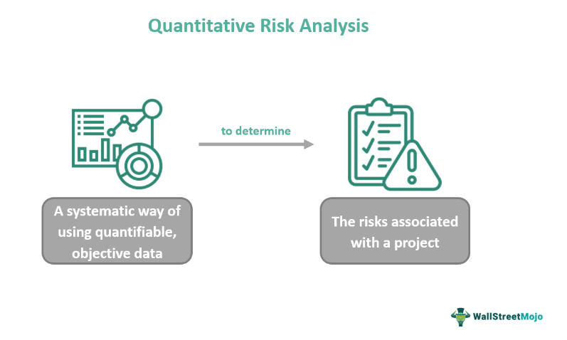

In the world of finance, understanding and managing risk is crucial for success. Financial modeling plays a vital role in risk quantification, providing investors with a structured way to assess potential outcomes. This process allows for the mathematical representation of financial performance, aiding in predicting future scenarios and evaluating investment choices. Investment risk quantification serves as an essential component for both individual and institutional investors, enabling them to understand the potential for loss and the probability of positive returns, thereby aligning investment strategies with their risk tolerance.

Algo trading, or algorithmic trading, introduces another layer of complexity and opportunity in managing financial risks. It employs sophisticated algorithms to analyze vast amounts of data and execute trades at optimal conditions, thus enhancing trading efficiency and reducing human error. This approach not only capitalizes on market inefficiencies but also necessitates robust risk management strategies to mitigate unique risks associated with automated trading systems.



This article explores the intersection of financial modeling, risk quantification, investment risk, and algorithmic trading. It emphasizes the critical nature of integrating these elements to foster a more informed and strategic approach to investing and trading in a volatile market environment.

## Table of Contents

## Understanding Financial Modeling

Financial modeling involves creating a mathematical representation of a company's financial situation. This process is fundamental for analyzing various financial scenarios, aiding decisions related to valuation, risk management, and strategic planning. At its core, financial modeling is utilized to forecast a company's future financial performance by simulating different scenarios that may affect its financial status.

Models vary in complexity, but they generally include essential financial statements like income statements, balance sheets, and cash flow statements. These components serve as the backbone of a financial model, offering insights into a company's financial health and operational efficiency.

**Income Statements:** These statements provide a summary of a company’s revenues and expenses over a specific period, offering insights into profitability. The equation for an income statement can be represented as:
$$
\text{Net Income} = \text{Revenue} - \text{Expenses}
$$

**Balance Sheets:** A snapshot of a company's financial position at a given point in time, detailing assets, liabilities, and shareholders’ equity. The balance sheet equation is:
$$
\text{Assets} = \text{Liabilities} + \text{Shareholders' Equity}
$$

**Cash Flow Projections:** These projections estimate the future flow of cash in and out of a business, crucial for understanding liquidity and financial flexibility. Various components include operating, investing, and financing cash flows.

**Sensitivity Analysis:** This analysis assesses how different values of an independent variable affect a particular dependent variable under a given set of assumptions. It helps in understanding uncertainties and potential risks associated with the financial model. 

Advanced financial models often integrate complex algorithms to increase the accuracy and reliability of their predictions. These algorithms can analyze vast datasets, recognizing patterns and trends that might not be apparent through manual analysis. Incorporating techniques such as Monte Carlo simulations, econometric models, or [machine learning](/wiki/machine-learning) algorithms can further refine the predictions of future performance.

For instance, Python is frequently used in the construction and testing of these models due to its powerful libraries for numerical computation and data analysis. A basic Python example for financial modeling could involve the use of libraries like `pandas`, `numpy`, or `scikit-learn` to manipulate financial data and create predictive models.

```python
import numpy as np
import pandas as pd
from sklearn.linear_model import LinearRegression

# Sample data for illustration
data = {'Revenue': [1000, 2000, 3000], 'Expenses': [500, 1000, 1500]}
df = pd.DataFrame(data)

# Performing a simple linear regression to predict future revenues
X = df[['Expenses']]
y = df['Revenue']

model = LinearRegression().fit(X, y)
future_expenses = np.array([[2000]])
predicted_revenue = model.predict(future_expenses)
print(f"Predicted Revenue: {predicted_revenue[0]}")
```

In this example, a simple linear regression model is used to predict future revenues based on past revenues and expenses. Such models are instrumental in strategic planning by estimating future financial outcomes and aiding decision-makers in optimizing business strategies. 

Thus, financial modeling not only serves as a tool for forecasting but also as a framework for various strategic financial decisions, enriched by technological advancements in computing and data science.

## The Role of Risk Quantification in Investments

Risk quantification involves measuring and analyzing the potential risks associated with an investment. This process is integral to understanding the likelihood of both losses and gains in financial ventures. By effectively assessing risks, investors are equipped to make informed decisions and to align their investment strategies with their personal risk tolerance.

Tools and techniques for risk quantification play a pivotal role in this process. Value at Risk (VaR) is one prevalent method, offering a statistical measure of the potential loss in value of a portfolio over a defined period for a given confidence interval. VaR is calculated using historical data, [volatility](/wiki/volatility-trading-strategies) estimations, and correlation with other market factors, often implemented via Monte Carlo simulations or variance-covariance models.

Stress testing is another significant tool, utilized to evaluate how investment portfolios respond under extreme market conditions. It simulates crises, such as market crashes or [interest rate](/wiki/interest-rate-trading-strategies) spikes, to project potential impacts on investment portfolios. By identifying vulnerabilities through stress testing, investors can proactively adjust their portfolios to withstand adverse conditions.

Scenario analysis further complements these tools by examining the potential effects of different hypothetical situations on investment outcomes. Unlike stress testing, which focuses on extreme conditions, scenario analysis evaluates a broader range of possible developments, both favorable and unfavorable. This comprehensive examination supports more robust portfolio management by providing insights into various "what-if" scenarios.

Effective risk quantification is crucial for mitigating unnecessary exposures, thereby optimizing portfolio returns. It requires a sophisticated understanding of both quantitative tools and the qualitative nuances of market behavior. As markets are inherently dynamic, investors must continually reassess and refine their risk quantification strategies, ensuring they remain aligned with ever-changing market conditions and personal financial goals. By systematically applying these techniques, investors can improve portfolio performance and enhance their ability to navigate uncertainty.

## Investment Risk: Types and Management Strategies

Investment risk is an intrinsic element of all financial activities, stemming from both general market conditions and specific attributes of the assets involved. The multifaceted nature of investment risk can be broadly categorized into several types: market risk, credit risk, [liquidity](/wiki/liquidity-risk-premium) risk, operational risk, and legal risks.

1. **Market Risk**: This is the possibility of losses due to changes in market prices, which can affect equities, interest rates, and foreign exchange rates. Market risk is often driven by macroeconomic factors such as inflation rates, economic growth, and geopolitical events, which can impact the broader market environment.

2. **Credit Risk**: It refers to the risk that a borrower will not meet their contractual obligations, leading to financial loss for the lender. This type of risk is especially pertinent in bond markets and for companies offering credit lines. Default probability and loss given default are key metrics used to evaluate credit risk.

3. **Liquidity Risk**: Liquidity risk arises when an asset cannot be traded quickly enough in the market to prevent a loss or to meet financial obligations. This can occur in times of financial stress when market participants are unwilling or unable to transact.

4. **Operational Risk**: This involves the risk of loss due to failures in internal processes, systems, or from external events. Operational risk can include technical failures, human errors, or fraud.

5. **Legal Risks**: Legal risks occur when changes in legislation or regulatory requirements affect an investment’s return. These risks require that investors stay informed about potential legal changes and incorporate this understanding into their investment strategies.

Managing investment risk effectively involves adopting several strategic approaches:

- **Diversification**: By allocating investments across various asset classes, sectors, and geographies, investors can mitigate unsystematic risk, which is specific to a single asset or firm.

- **Hedging**: This involves using financial instruments such as options, futures, or swaps to offset potential losses in an investment portfolio. Hedging is a tactical approach that can reduce exposure to certain risks.

- **Derivatives**: Utilizing derivatives allows investors to speculate on price movements and hedge against potential adverse changes without needing to hold the underlying asset itself. 

Continuous monitoring and adjustment of portfolios are fundamental. This requires investors to keep abreast of economic indicators, market trends, and policy changes. Regular portfolio rebalancing ensures that investment strategies remain aligned with risk tolerance levels and financial goals. 

Technological advancements, notably in AI and machine learning, have greatly enhanced risk management capabilities. These technologies facilitate the analysis of large data sets to identify risk factors more accurately and swiftly. Machine learning algorithms can predict market movements and assess risks in real-time, enabling more responsive risk management strategies. Such integration of technology helps streamline decision-making processes and can significantly improve the precision of risk assessments, ultimately leading to more robust investment performance. 

In conclusion, a comprehensive approach to managing investment risk involves understanding its types, employing diverse management strategies, and leveraging technology. This integrated framework provides a foundation for sustainable financial returns in a fluctuating market landscape.

## Algorithmic Trading: The Intersection of Technology and Investment Risk

Algorithmic trading, often referred to as algo trading, utilizes automated and sophisticated algorithms to execute trades in financial markets. This modern trading approach harnesses historical data and predictive models to perform transactions under optimal conditions, aiming to maximize trading efficiency while reducing the likelihood of human error. By automating decision-making processes, algo trading seeks to capitalize on market inefficiencies that might be missed by manual trading.

Despite its potential advantages, [algorithmic trading](/wiki/algorithmic-trading) introduces a distinct set of risks, among which model risk is prominent. Model risk arises from the possibility that the models used may be based on incorrect assumptions or data, leading to suboptimal trading outcomes. Additionally, algo trading is vulnerable to technical failures, such as system outages or software bugs, which can disrupt trading operations and result in financial loss. Market impact risk is another concern; rapid transactions can influence market prices unfavorably, especially in less liquid markets.

Balancing these benefits and risks necessitates robust algorithm development alongside comprehensive real-time monitoring and risk management frameworks. Effective algo trading systems require continuous evaluation and refinement of algorithms to ensure they operate correctly under varied market conditions. Real-time monitoring allows for the prompt identification and rectification of anomalies, thus minimizing potential disruptions.

Moreover, risk management frameworks play a critical role in overseeing algorithm performance and decision-making processes. Such frameworks often incorporate fail-safes and redundancies to safeguard against unexpected eventualities, ensuring the trading system remains reliable and resilient. In summary, the integration of technology in trading offers substantial advantages but also demands a vigilant approach to risk management to safeguard against its inherent challenges.

## Integrating Risk Quantification in Financial Modeling for Algo Trading

Integrating risk quantification into financial modeling is crucial for enhancing the effectiveness of algorithmic trading strategies. By combining risk modeling with financial models, traders gain comprehensive insights into potential trading scenarios along with their associated risks. This integration aids in developing more robust strategies that can withstand the volatility of financial markets.

Risk models, essential for quantifying uncertainties, play a pivotal role in this integration. They assess potential losses using various statistical measures and simulations. For instance, Value at Risk (VaR) and Conditional Value at Risk (CVaR) are commonly employed in these models to estimate potential losses over specific time frames and confidence levels. The formula for VaR can be expressed as:

$$
\text{VaR}_\alpha(X) = \inf \{ x \in \mathbb{R} : P(X \leq x) \geq \alpha \}
$$

where $X$ represents the portfolio return and $\alpha$ is the confidence level.

Incorporating risk quantification facilitates model calibration and sensitivity analysis, both vital for ensuring accuracy and stability in financial models. Calibration involves adjusting model parameters so that the model output aligns with observed data. Sensitivity analysis examines how the output of a model is affected by variations in input parameters. Together, they enable the identification and scrutiny of key variables impacting trading outcomes, allowing traders to refine models to achieve better predictability and reliability.

Consistent risk evaluation is indispensable for adapting trading algorithms to changing market conditions. High-frequency and algorithmic trading solutions depend heavily on real-time data analysis, which allows for immediate reactions to market shifts. As markets are inherently dynamic, models that integrate risk quantification must continuously update and adjust to maintain their efficacy. This necessitates not only technological prowess but also a keen understanding of market signals and economic indicators.

Investors and traders must emphasize the continual refinement of models to manage risks effectively. With the rapid advancement in technology and emergence of machine learning tools, there is an opportunity to refine financial models continually. Employing machine learning techniques can enhance predictive capabilities by identifying patterns and correlations that traditional models might miss.

For instance, using Python and libraries such as scikit-learn, users can implement machine learning models to optimize trading strategies. An example using Python for model calibration might look like this:

```python
from sklearn.model_selection import GridSearchCV
from sklearn.ensemble import RandomForestRegressor

# Define the model
rf_model = RandomForestRegressor()

# Define parameters for calibration
param_grid = {
    'n_estimators': [100, 200, 300],
    'max_depth': [10, 20, 30],
    'min_samples_split': [2, 5, 10]
}

# Setup the grid search
grid_search = GridSearchCV(estimator=rf_model, param_grid=param_grid, cv=5)

# Fit the model
grid_search.fit(X_train, y_train)

# Best parameters
best_params = grid_search.best_params_
```

In this example, fine-tuning a Random Forest Regressor allows for optimizing certain parameters, adjusting the model to better align with the risk quantification process.

In conclusion, integrating risk quantification with financial modeling provides traders with a comprehensive framework for evaluating and managing risks. By employing continuous model refinement and leveraging technology, investors can remain agile in the face of an ever-evolving market environment.

## Conclusion

The intersection of financial modeling, risk quantification, investment risk, and algorithmic trading presents a complex landscape, yet one rich with opportunity. Effective risk management remains central to securing long-term financial success amid ever-present market volatility. By precisely quantifying risk and utilizing sophisticated financial models, investors and traders are better equipped to make informed decisions and adjust strategies in response to changing conditions.

Technological advancements continually reshape the tools available for financial analysis and strategy execution. The integration of [artificial intelligence](/wiki/ai-artificial-intelligence), machine learning, and real-time data analytics empowers market participants to identify and exploit market inefficiencies while managing associated risks. Investors leveraging these techniques gain a strategic edge, enabling them to navigate the uncertainties inherent in financial markets more effectively.

Ultimately, the synergy of financial modeling, risk quantification, and algorithmic trading fosters an environment where a strategic and informed approach to investing and trading is not only possible but essential. This integration ensures adaptability and resilience, equipping market participants to thrive by making data-driven, calculated decisions that balance opportunity with risk.

## References & Further Reading

[1]: Bergstra, J., Bardenet, R., Bengio, Y., & Kégl, B. (2011). ["Algorithms for Hyper-Parameter Optimization."](https://dl.acm.org/doi/10.5555/2986459.2986743) Advances in Neural Information Processing Systems 24.

[2]: ["Advances in Financial Machine Learning"](https://www.amazon.com/Advances-Financial-Machine-Learning-Marcos/dp/1119482089) by Marcos Lopez de Prado

[3]: ["Evidence-Based Technical Analysis: Applying the Scientific Method and Statistical Inference to Trading Signals"](https://www.amazon.com/Evidence-Based-Technical-Analysis-Scientific-Statistical/dp/0470008741) by David Aronson

[4]: ["Machine Learning for Algorithmic Trading"](https://github.com/PacktPublishing/Machine-Learning-for-Algorithmic-Trading-Second-Edition) by Stefan Jansen

[5]: ["Quantitative Trading: How to Build Your Own Algorithmic Trading Business"](https://www.amazon.com/Quantitative-Trading-Build-Algorithmic-Business/dp/0470284889) by Ernest P. Chan