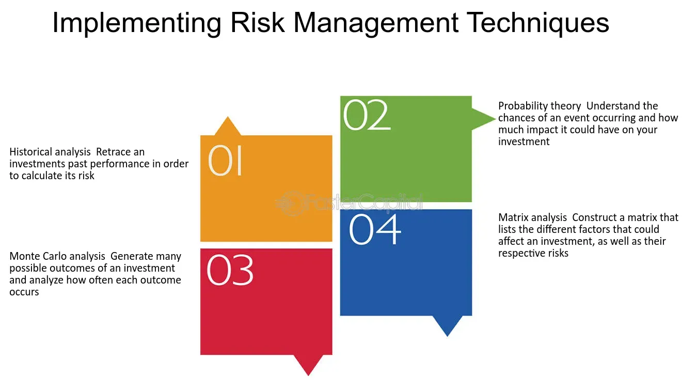

## Table of Contents

## What is investment risk?

Investment risk is the chance that you might lose some or all of the money you put into an investment. It's like a gamble where you hope to gain more money, but there's always the possibility that things won't go as planned. Different types of investments have different levels of risk. For example, putting money in a savings account is usually safer than buying stocks, but the potential reward might be smaller too.

Understanding risk is important because it helps you make better choices about where to put your money. If you're okay with the possibility of losing some money for the chance of earning a lot more, you might choose riskier investments. But if you want to keep your money safe, even if it means smaller gains, you'll pick safer options. It's all about finding the right balance that fits your comfort level and financial goals.

## Why is it important to quantify investment risk?

Quantifying investment risk is important because it helps you understand how much money you could lose. When you know the risk, you can make smarter choices about where to put your money. If you see that an investment has a high risk of losing money, you might decide it's not worth it, or you might only put in a small amount that you're okay with losing. On the other hand, if the risk is low, you might feel more comfortable investing more money.

It also helps you compare different investments. By putting a number on the risk, you can see which investments are safer and which ones are riskier. This way, you can choose investments that match how much risk you're willing to take. It's like having a map that shows you the safest paths to your financial goals. Knowing the risk numbers helps you plan better and feel more confident about your investment decisions.

## What are the basic types of investment risks?

There are several basic types of investment risks that you should know about. One type is market risk, which is the risk that the whole market will go down and take your investments with it. This can happen because of things like economic downturns or big events that shake up the market. Another type is interest rate risk, which happens when changes in interest rates affect the value of your investments, like bonds. If interest rates go up, the value of your bonds might go down.

Another important risk is inflation risk, which is when the prices of things you buy go up faster than the money you're making from your investments. This means your money won't buy as much in the future. Then there's liquidity risk, which is the risk that you won't be able to sell your investment quickly enough or at a fair price when you need to. Lastly, there's credit risk, which is the chance that the person or company you've lent money to won't be able to pay you back. Understanding these different types of risks can help you make better choices about where to put your money.

## How can beginners start measuring their investment risk?

For beginners, measuring investment risk can start with understanding the basics of what risk means for different types of investments. You can begin by looking at the historical performance of an investment. This means checking how it did in the past, like if it went up or down a lot. Stocks, for example, can be riskier because their prices can change a lot, while savings accounts are usually safer but with smaller gains. You can also look at something called the standard deviation, which is a way to see how much an investment's returns might swing around. A higher standard deviation means more risk.

Another way to measure risk is by using tools like a risk assessment questionnaire. These are often available on investment websites or from financial advisors. They ask you questions about your goals, how long you plan to invest, and how you feel about losing money. Based on your answers, they can give you a risk score that helps you understand how much risk you're comfortable with. This can guide you to choose investments that match your risk level. Remember, the key is to start simple and learn as you go, so you can make better decisions about where to put your money.

## What is the difference between systematic and unsystematic risk?

Systematic risk is the kind of risk that affects the whole market or a big part of it. It's like a storm that hits everyone, no matter what they're invested in. This type of risk comes from things like economic downturns, changes in interest rates, or big events like a war or a global health crisis. You can't get rid of systematic risk by just picking different investments because it's tied to the overall market. It's the risk you take just by being in the market.

Unsystematic risk, on the other hand, is the risk that comes from specific companies or industries. It's like a storm that only hits one house, not the whole neighborhood. This type of risk can come from things like bad management decisions, a company's product not selling well, or problems within a specific industry. The good news is that you can reduce unsystematic risk by spreading your money across different investments, a strategy known as diversification. By not putting all your eggs in one basket, you can protect yourself from the risks that come from one company or industry.

## How do financial metrics like standard deviation and beta help in quantifying risk?

Standard deviation is a way to see how much an investment's returns can go up and down. It's like measuring how wild a ride an investment might be. If an investment has a high standard deviation, it means the returns can swing a lot, which means it's riskier. On the other hand, a low standard deviation means the returns are more steady, so it's less risky. By looking at the standard deviation, you can get a sense of how much risk you're taking on with an investment. It's a simple number that helps you understand the ups and downs you might face.

Beta is another useful number that helps you measure risk, but it's different from standard deviation. Beta tells you how much an investment moves compared to the overall market. If an investment has a beta of 1, it moves the same way as the market. A beta higher than 1 means the investment is more sensitive to market changes and could be riskier. A beta lower than 1 means it's less sensitive, so it's less risky. Beta is great for understanding how an investment might react to big market swings, helping you see if it's more or less risky than the market as a whole.

## What role does the Sharpe Ratio play in assessing investment risk?

The Sharpe Ratio is a tool that helps you understand how much risk you're taking to get a certain level of return on your investment. It looks at the return of your investment and compares it to the risk-free return, like what you'd get from a savings account. Then, it divides the difference by the standard deviation of the investment's returns. This gives you a number that tells you how much extra return you're getting for each unit of risk you're taking on. A higher Sharpe Ratio means you're getting more return for the risk you're taking, which is good. A lower Sharpe Ratio means you're not getting much extra return for the risk, which might make you think twice about the investment.

Using the Sharpe Ratio can help you compare different investments to see which ones give you the best bang for your buck in terms of risk and return. If you have two investments with the same return, the one with the higher Sharpe Ratio is better because it's giving you that return with less risk. It's like choosing between two rides at an amusement park: if they both get you to the same place, you'd pick the one that's less bumpy. The Sharpe Ratio is a simple way to make sure you're not taking on more risk than you need to for the returns you want.

## How can Value at Risk (VaR) be used to quantify potential losses?

Value at Risk (VaR) is a way to guess how much money you might lose from an investment over a certain time. It's like saying, "There's a 5% chance you could lose this much money in the next month." It helps you understand the worst-case scenario, so you can plan better. To figure out VaR, you look at past data and use math to predict what might happen. It's a number that gives you a clear idea of the risk you're taking.

Even though VaR is helpful, it's not perfect. It doesn't tell you how bad things could get if they go really wrong, just what's likely to happen most of the time. But knowing your VaR can still make you feel more ready for what might come. It's like having a safety net that helps you decide if an investment is worth the risk. By using VaR, you can make smarter choices about where to put your money and how much you're willing to lose.

## What advanced statistical models are used for risk quantification in investments?

Advanced statistical models help investors understand and manage risk better. One popular model is the Monte Carlo simulation. It's like playing out many different scenarios to see what might happen to your investments. By running these scenarios thousands of times, you can see all the possible outcomes and how likely they are. This helps you get a good picture of the risks you're taking and prepare for different situations. It's like having a crystal ball that shows you many possible futures, so you can plan better.

Another model is the GARCH (Generalized Autoregressive Conditional Heteroskedasticity) model. This one is a bit more complex, but it helps you understand how the risk of your investments changes over time. It looks at how the ups and downs of your investment's returns can get bigger or smaller. By using this model, you can see how the risk might grow or shrink, which is really useful for planning your investments. It's like having a weather forecast for your money, so you know when to expect storms or calm seas.

These models are powerful tools that give you a deeper understanding of risk. They help you make smarter decisions by showing you what might happen and how likely it is. Even though they sound complicated, they're just ways to look at the future of your investments from different angles, helping you stay one step ahead.

## How does stress testing contribute to understanding investment risk?

Stress testing helps you understand how your investments might do in really tough times. It's like practicing for a big game by playing against a really strong team. You take your investments and see how they would handle bad situations, like a big drop in the market or a sudden economic crisis. By doing this, you can see if your investments are strong enough to survive hard times or if they might fall apart when things get rough.

Knowing how your investments handle stress can help you make better choices. If you see that your investments do poorly in a stress test, you might decide to change them or spread your money around to different types of investments. This way, you can be more prepared for whatever the future brings. Stress testing is like a safety check that helps you feel more confident about your investments, even when the world around you is shaky.

## What are the limitations of current risk quantification methods?

Current risk quantification methods have some limitations that investors should know about. One big problem is that these methods often look at past data to guess what might happen in the future. But the future isn't always like the past. Big events that nobody saw coming, like a global health crisis or a sudden economic crash, can throw off these predictions. So, even though these methods give you a good idea of what might happen, they can't predict everything, especially the really unexpected stuff.

Another limitation is that these methods can be pretty complicated. They use a lot of math and statistics that can be hard to understand if you're not an expert. This means that sometimes, even if you get a number or a prediction, it might not be easy to figure out what it really means for your investments. Plus, different methods might give you different answers about the same investment, which can make things confusing. So, while these tools are helpful, they're not perfect, and it's good to use them along with your own common sense and maybe some advice from a financial expert.

## How can an investor integrate risk quantification into their overall investment strategy?

An investor can integrate risk quantification into their overall investment strategy by first understanding their own comfort level with risk. This means figuring out how much money they're okay with losing and how much they want to earn. They can use tools like risk assessment questionnaires to get a sense of their risk tolerance. Once they know this, they can look at different investments and see how much risk each one carries using metrics like standard deviation, beta, and the Sharpe Ratio. By comparing these numbers, they can choose investments that fit their risk level and financial goals.

After picking their investments, investors can use more advanced methods like Value at Risk (VaR), Monte Carlo simulations, and stress testing to keep an eye on their portfolio. These tools help them see how their investments might do in different situations, including really bad ones. By regularly checking these risk measures, investors can make adjustments to their strategy if needed. For example, if an investment starts looking too risky, they might decide to sell it or buy something safer. This way, they can stay on track with their goals and feel more confident about their money, even when the market gets bumpy.

## How can risk quantification be integrated into financial modeling for algo trading?

Integrating risk quantification into financial modeling is crucial for enhancing the effectiveness of algorithmic trading strategies. By combining risk modeling with financial models, traders gain comprehensive insights into potential trading scenarios along with their associated risks. This integration aids in developing more robust strategies that can withstand the volatility of financial markets.

Risk models, essential for quantifying uncertainties, play a pivotal role in this integration. They assess potential losses using various statistical measures and simulations. For instance, Value at Risk (VaR) and Conditional Value at Risk (CVaR) are commonly employed in these models to estimate potential losses over specific time frames and confidence levels. The formula for VaR can be expressed as:

$$
\text{VaR}_\alpha(X) = \inf \{ x \in \mathbb{R} : P(X \leq x) \geq \alpha \}
$$

where $X$ represents the portfolio return and $\alpha$ is the confidence level.

Incorporating risk quantification facilitates model calibration and sensitivity analysis, both vital for ensuring accuracy and stability in financial models. Calibration involves adjusting model parameters so that the model output aligns with observed data. Sensitivity analysis examines how the output of a model is affected by variations in input parameters. Together, they enable the identification and scrutiny of key variables impacting trading outcomes, allowing traders to refine models to achieve better predictability and reliability.

Consistent risk evaluation is indispensable for adapting trading algorithms to changing market conditions. High-frequency and algorithmic trading solutions depend heavily on real-time data analysis, which allows for immediate reactions to market shifts. As markets are inherently dynamic, models that integrate risk quantification must continuously update and adjust to maintain their efficacy. This necessitates not only technological prowess but also a keen understanding of market signals and economic indicators.

Investors and traders must emphasize the continual refinement of models to manage risks effectively. With the rapid advancement in technology and emergence of machine learning tools, there is an opportunity to refine financial models continually. Employing machine learning techniques can enhance predictive capabilities by identifying patterns and correlations that traditional models might miss.

For instance, using Python and libraries such as scikit-learn, users can implement machine learning models to optimize trading strategies. An example using Python for model calibration might look like this:

```python
from sklearn.model_selection import GridSearchCV
from sklearn.ensemble import RandomForestRegressor

# Define the model
rf_model = RandomForestRegressor()

# Define parameters for calibration
param_grid = {
    'n_estimators': [100, 200, 300],
    'max_depth': [10, 20, 30],
    'min_samples_split': [2, 5, 10]
}

# Setup the grid search
grid_search = GridSearchCV(estimator=rf_model, param_grid=param_grid, cv=5)

# Fit the model
grid_search.fit(X_train, y_train)

# Best parameters
best_params = grid_search.best_params_
```

In this example, fine-tuning a Random Forest Regressor allows for optimizing certain parameters, adjusting the model to better align with the risk quantification process.

In conclusion, integrating risk quantification with financial modeling provides traders with a comprehensive framework for evaluating and managing risks. By employing continuous model refinement and leveraging technology, investors can remain agile in the face of an ever-evolving market environment.

## References & Further Reading

[1]: Bergstra, J., Bardenet, R., Bengio, Y., & Kégl, B. (2011). ["Algorithms for Hyper-Parameter Optimization."](https://dl.acm.org/doi/10.5555/2986459.2986743) Advances in Neural Information Processing Systems 24.

[2]: ["Advances in Financial Machine Learning"](https://www.amazon.com/Advances-Financial-Machine-Learning-Marcos/dp/1119482089) by Marcos Lopez de Prado

[3]: ["Evidence-Based Technical Analysis: Applying the Scientific Method and Statistical Inference to Trading Signals"](https://www.amazon.com/Evidence-Based-Technical-Analysis-Scientific-Statistical/dp/0470008741) by David Aronson

[4]: ["Machine Learning for Algorithmic Trading"](https://github.com/PacktPublishing/Machine-Learning-for-Algorithmic-Trading-Second-Edition) by Stefan Jansen

[5]: ["Quantitative Trading: How to Build Your Own Algorithmic Trading Business"](https://www.amazon.com/Quantitative-Trading-Build-Algorithmic-Business/dp/0470284889) by Ernest P. Chan