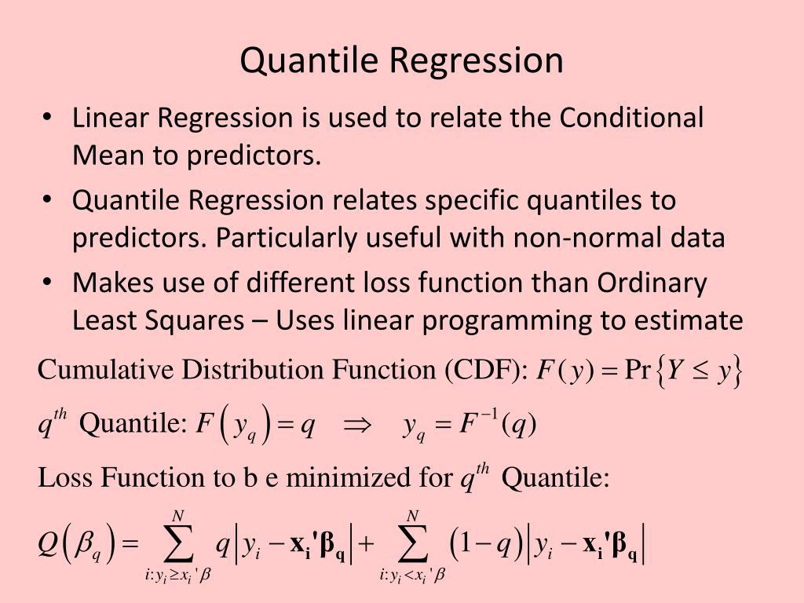

Quantile regression is a flexible and robust tool in statistical modeling that provides several benefits over traditional regression methods. Unlike traditional approaches that focus on estimating the mean of the response variable, quantile regression enables the modeling and prediction of different quantiles within the distribution of a dependent variable. This capability is particularly advantageous in algorithmic trading, where understanding the full distribution of asset returns is crucial for developing effective trading strategies.

In algorithmic trading, quantile regression allows traders to model and predict the entire distribution of asset returns, rather than focusing solely on average outcomes. This broader perspective supports more informed decision-making by highlighting potential outcomes across different conditions, which is crucial for optimizing trading strategies and improving their resilience to market volatility.



This article will discuss the application of quantile regression in algorithmic trading frameworks. It will address the benefits of using quantile regression over traditional regression techniques, particularly in terms of risk management and decision-making efficiency. By modeling various quantiles, traders can better anticipate price movement scenarios, offering them an enhanced ability to manage risks, particularly tail risks, which play a significant role in risk management. The implementation process of quantile regression in algo trading will also be explored, encompassing data collection, preprocessing, and modeling aspects critical to the integration of this method within trading systems.

Furthermore, the role of quantile regression in improving trading strategies will be discussed. Through its application, traders can gain a competitive advantage by creating more robust strategies that are adaptable to different market conditions. This article aims to establish the importance of quantile regression in trading by addressing its potential to refine decision-making processes and manage risks effectively.

## Table of Contents

## Understanding Quantile Regression

Quantile regression extends the capabilities of traditional linear regression by focusing on estimating the conditional quantiles of the response variable, rather than just the mean. This allows for a more nuanced analysis of the data, offering insights into the underlying distribution of the dependent variable. In contrast to ordinary least squares (OLS) regression, which minimizes the sum of squared residuals to model the central tendency of the data, quantile regression minimizes a sum that gives different weights to positive and negative residuals, specifically the absolute deviations weighted by a function of the quantile. This is formally defined for the quantile τ as:

$$
\text{minimize} \sum_{i=1}^n \rho_\tau(y_i - \mathbf{x}_i^T\beta)
$$

where $\rho_\tau(u) = u(\tau - \mathbb{I}(u < 0))$ is the quantile loss function, and $\mathbb{I}$ is the indicator function.

The primary distinction lies in its objective function. While OLS is concerned with predictions near the mean, quantile regression provides a more detailed picture across different quantiles such as the median, lower quartile, or upper quartile. This makes it particularly powerful for understanding variability in the data and identifying the extremes.

Mathematically, suppose we are interested in the τ-th quantile. For a given dataset with response variable $y_i$ and predictors $\mathbf{x}_i$, the quantile regression solves:

$$
\min_{\beta} \sum_{i=1}^n \rho_\tau(y_i - \mathbf{x}_i^\top \beta)
$$

where $\beta$ is the vector of coefficients. The solution to this optimization problem provides estimates that characterize various quantiles of the response variable, offering insights into different segments of the data distribution.

A crucial advantage of quantile regression is its robustness to outliers. Since it focuses on quantiles, rather than the mean, extreme values in the dataset do not disproportionately influence the estimation of the regression coefficients. This robustness makes quantile regression a valuable tool in datasets that deviate from normality or contain heteroscedasticity where the variance of the error terms varies.

Furthermore, quantile regression is effective at capturing the variations in the impact of predictor variables across different points of the response distribution. For instance, a predictor may have little effect on the median response but a significant impact on the upper or lower quantiles. This can help in distinguishing systematic patterns that remain hidden when using only mean regression, providing insights into potential structural changes in the relationships modeled.

In summary, quantile regression enhances traditional analytical frameworks by delivering a comprehensive perspective on the possible outcomes of the dependent variable. Its ability to offer detailed insights into different quantiles of the response distribution makes it an indispensable tool in various applications where the understanding of the entire conditional distribution is pivotal, such as in risk management and decision-making processes in trading systems.

## Application of Quantile Regression in Algo Trading

Quantile regression is a critical tool in the realm of [algorithmic trading](/wiki/algorithmic-trading), where it plays a substantial role in modeling and predicting the distribution of asset prices and returns. This technique allows traders to anticipate various price movement scenarios, thus enhancing the robustness of their trading strategies.

### Practical Applications

One of the paramount applications of quantile regression in algorithmic trading is risk assessment. By estimating multiple quantiles of returns, it becomes possible to evaluate potential risks more accurately than with conventional methods. This is particularly crucial when assessing tail risk—the risk of extreme outcomes—which can significantly impact strategic decisions in high-stakes trading environments.

In portfolio optimization, quantile regression is used to model the return distributions of multiple assets. This allows for the creation of portfolios that optimize not just for expected return but across different quantiles of the return distribution. By doing so, traders and analysts can construct portfolios that are resilient to varying market conditions, thereby improving long-term performance. For instance, a portfolio could be optimized to minimize the conditional [value at risk](/wiki/var-value-at-risk) (CVaR), which is a risk measure that looks beyond the standard deviation to focus on extreme losses.

Furthermore, quantile regression supports informed decision-making by equipping traders with insights into price movement scenarios beyond the mean. By providing predictions at various quantiles, it offers a detailed view of potential outcomes, enabling traders to plan strategies under different market states effectively. This comprehensive understanding can enhance the timing of entry and [exit](/wiki/exit-strategy) points in trades and inform the allocation of resources during different [volatility](/wiki/volatility-trading-strategies) regimes.

### Case Studies and Examples

Quantile regression's real-world applicability is evidenced by various case studies and examples in live trading environments. For instance, a trading algorithm might employ quantile regression to predict the future price distribution of a stock, estimating the likelihood of prices falling within designated quantiles over a given period. These predictions can then be used to automate trades that capitalize on forecasted price movements, optimizing for maximum profit across different risk levels.

In algorithmic frameworks where [backtesting](/wiki/backtesting) is vital, quantile regression can be used to test the resilience of trading algorithms under simulated market conditions that include rare but severe market events. A simple example in Python might involve training a quantile regression model using data from historical returns:

```python
import numpy as np
import pandas as pd
from sklearn.model_selection import train_test_split
from statsmodels.regression.quantile_regression import QuantReg

# Example data
np.random.seed(0)
data = pd.DataFrame({
    'features': np.random.randn(1000),
    'returns': np.random.randn(1000)
})

# Train-test split
X_train, X_test, y_train, y_test = train_test_split(data[['features']], data['returns'], test_size=0.2, random_state=42)

# Quantile regression at the 0.5 quantile (median)
model = QuantReg(y_train, X_train)
result = model.fit(q=0.5)

# Predictions
predictions = result.predict(X_test)

print(predictions.head())
```

In this example, the model is trained to predict the median return based on certain features. When applied across various quantiles, such models allow traders to develop strategies that hedge against different risk levels while maintaining profitability.

In conclusion, the application of quantile regression in algorithmic trading extends far beyond traditional risk measures, offering enhanced predictive power and adaptability across diverse market conditions. This makes it an indispensable tool for traders looking to develop robust strategies that can withstand the complexities and volatilities inherent in financial markets.

## Advantages of Quantile Regression in Trading

Quantile regression offers substantial benefits in trading environments, primarily due to its capacity to adeptly handle non-normal distributions prevalent in financial returns. Traditional regression models often rely on assumptions of normality, which can fall short when financial data exhibits skewness or heavy tails. By estimating various quantiles of a distribution, quantile regression provides a detailed understanding of potential asset return scenarios, facilitating a more nuanced risk assessment.

Modeling multiple quantiles allows traders to scrutinize the distribution of returns beyond merely the average outcome, which is a critical component in risk management. For instance, a trader interested in the lower quantiles can effectively evaluate tail risks—the extreme values of the loss distribution that are central to stress testing and risk management. This capability enables more informed decisions about holding, buying, or selling assets based on a probabilistic understanding of potential losses, thus aligning trading strategies more closely with their risk tolerance.

In terms of predictive performance, quantile regression enhances the robustness of trading strategies. By not solely focusing on mean predictions, it accounts for the variability in asset returns distribution and helps anticipate market conditions under uncertainty. This adaptability is particularly useful for stress testing under diverse market conditions, which is pivotal during volatile periods when market assumptions may not hold.

Quantile regression also provides a competitive edge by capturing the entire distribution of asset returns, allowing traders to create strategies that are better optimized for varying market states. This capability leads to more resilient trading approaches that can thrive under different financial environments, thus offering an enhancement in both the quality and sustainability of trading strategies.

By leveraging the methodological strengths of quantile regression, trading systems can better accommodate the inherent unpredictability and dynamism of financial markets, paving the way for more sophisticated and adaptive trading strategies.

## Quantile Regression vs Other Regression Models in Finance

Quantile regression stands out as a versatile tool in financial data analysis, especially when compared to traditional regression models such as linear and logistic regression. Unlike these traditional approaches, which primarily focus on estimating the mean value of the response variable given the predictors, quantile regression estimates multiple quantiles of the dependent variable. This characteristic allows traders and analysts to examine the effects of predictors across the entire distribution of the response variable, providing a more comprehensive view of potential outcomes.

One of the notable distinctions between quantile regression and linear regression lies in their approach to estimating relationships within the data. Linear regression tends to perform well when the assumptions of homoscedasticity and normality hold, but financial data often violate these assumptions due to heteroscedasticity and fat-tailed distributions. Quantile regression, however, is robust to such violations as it doesn't assume constant variance across the data. Instead, it models the conditional quantiles, offering insights into different points on the outcome distribution, such as the median or the extremes (e.g., 5th or 95th percentile), which are particularly valuable for risk assessment and stress testing in finance.

In comparison to regularization-based models like ridge and lasso regression, quantile regression does not primarily focus on feature selection or the management of multicollinearity, although it can be combined with these techniques to enhance model performance and interpretability. Ridge and lasso regression are effective in penalizing the coefficients to prevent overfitting, making them useful in scenarios with high-dimensional data. Quantile regression, however, shines when the goal is to understand the impact of predictors across different quantiles of the response distribution, providing deeper insights into scenarios characterized by skewness or kurtosis in the financial data.

Time series regression, another commonly used approach in finance, focuses on predicting future data points by leveraging past values in a temporal context. While capable of capturing temporal dynamics, time series models might struggle with capturing the full range of potential outcomes when the variance of returns isn't constant over time. Quantile regression complements time series analysis by providing an alternative view of the underlying data distribution's tails, which is vital for decision-making in volatile markets.

Despite its advantages, quantile regression is not without challenges. Computational complexity is a potential hurdle, especially when dealing with large datasets or complex models. It often requires more computation time than linear regression due to the need to solve optimization problems for each quantile of interest. Additionally, the interpretation of multiple quantile estimates can be challenging, as it necessitates contextual understanding of each quantile's implications in the financial context.

To effectively leverage quantile regression in trading and financial analysis, one needs to consider these limitations and balance them with technological advancements in computational power and optimization techniques. Quantile regression remains a powerful tool for uncovering insights about financial data distributions that other models might overlook, making it an essential component of risk management and strategic decision-making in finance.

## Implementing Quantile Regression in Trading Systems

Implementing quantile regression in trading systems requires a thorough understanding of the algorithmic environment and the data that will feed the models. This section outlines the implementation process, encompassing data collection, preprocessing, model selection, validation, and deployment. Such an approach ensures that quantile regression can be effectively integrated into algorithmic trading systems.

### Data Collection and Preprocessing

The implementation begins with data collection, which is crucial for constructing a robust model. Traders should gather historical price data, trading volumes, and any relevant financial indicators. It's essential to ensure the data is high-quality, with minimal errors and gaps, to enhance model accuracy.

Preprocessing the data is the next critical step. This involves cleaning the data by handling missing values and outliers, which can skew model predictions if not properly addressed. Data normalization or standardization may also be required to ensure that different feature scales do not distort the model's predictions.

```python
import pandas as pd
from sklearn.preprocessing import StandardScaler

# Example of loading and preprocessing data
data = pd.read_csv('financial_data.csv')
data.fillna(method='ffill', inplace=True) # Fill missing values
scaler = StandardScaler()
scaled_features = scaler.fit_transform(data.drop('target', axis=1))
```

### Model Selection

Choosing the appropriate quantile regression model is fundamental. Quantile regression allows for the estimation of various quantiles, providing a comprehensive view of potential outcomes. The selection of quantiles (e.g., 0.1, 0.5, 0.9) should align with specific trading objectives, such as risk assessment for extreme market conditions.

### Model Validation

Once a model is fitted, it's essential to validate it to ensure its predictive reliability. Cross-validation techniques can be employed to evaluate model performance across different sample subsets. It is crucial to assess the model's accuracy at predicting specific quantiles and its ability to generalize across unseen data.

```python
from sklearn.model_selection import train_test_split
from sklearn.linear_model import QuantileRegressor

# Splitting the data
X_train, X_test, y_train, y_test = train_test_split(scaled_features, data['target'], test_size=0.2, random_state=42)

# Model training
model = QuantileRegressor(quantile=0.5)
model.fit(X_train, y_train)

# Validation
y_pred = model.predict(X_test)
```

### Deployment

Deploying the quantile regression model into a trading system involves integrating it into the decision-making framework. This step requires continual monitoring and updates to account for changes in market conditions and data structure. Automating this process wherever possible enhances efficiency.

### Software Tools

Python offers several libraries that facilitate implementation. Statsmodels and scikit-learn are widely used for regression tasks, including quantile regression. These tools provide functions for model fitting and prediction, making them suitable for complex trading systems.

In summary, implementing quantile regression in trading systems demands meticulous attention to data and model considerations, ensuring robust and reliable trading decisions. By following these guidelines, traders can effectively harness the potential of quantile regression in algorithmic environments.

## Challenges and Limitations

Quantile regression, while offering numerous advantages for financial modeling, presents several challenges that traders must consider to ensure effective implementation. One significant challenge is computational complexity. Unlike ordinary least squares (OLS) regression, which can be computed relatively efficiently, quantile regression requires solving a linear programming problem for each quantile of interest. This computational burden increases with the number of quantiles and data size, potentially straining resources, especially in high-frequency trading environments where swift execution is critical.

Interpreting the outputs of quantile regression can also be more complex than traditional regression models. Traditional regression provides a single estimate of the average effect of predictors, making interpretation straightforward. However, quantile regression produces multiple estimates corresponding to different parts of the distribution, which can complicate the synthesis of results and strategies. Understanding and communicating the variation in effects across quantiles require additional expertise, emphasizing the importance of domain knowledge and experience in handling quantile-specific insights.

Data requirements pose another challenge in implementing quantile regression effectively. The method's sensitivity to data quality and the presence of outliers demand rigorous preprocessing and cleansing. Moreover, larger datasets, necessary for reliable estimation at multiple quantiles, increase data handling requirements and impose constraints on processing capabilities.

To address these challenges, traders can adopt several best practices and optimization techniques. For managing computational complexity, practitioners can utilize modern hardware accelerations such as Graphics Processing Units (GPUs), which significantly enhance computational speed for large-scale problems. Additionally, software libraries such as `QuantReg` in Python's `statsmodels` offer optimized algorithms suited for large datasets.

Improving interpretability involves the use of visualization tools that map the relationships at various quantiles, helping traders visualize outcomes more intuitively. For instance, plotting coefficient estimates across quantiles can elucidate how predictors affect different outcome levels, allowing for more refined strategy development. Leveraging frameworks for automated report generation can also aid in translating complex results into actionable insights.

In terms of data requirements, adopting robust data processing workflows is essential. Implementing outlier detection and data smoothing techniques can improve the quality of inputs, yielding more reliable quantile regression models. Employing advanced data management systems can facilitate efficient data handling, including real-time processing capabilities necessary for responding to rapid market changes.

By adopting these strategies, traders can effectively integrate quantile regression into their frameworks, mitigating challenges while harnessing its potential to improve predictive performance and risk management in trading systems.

## Conclusion and Future Directions

Quantile regression remains an indispensable tool for quantitative analysts, offering profound applications in algorithmic trading. By focusing on various quantiles rather than just the mean, quantile regression provides a more comprehensive understanding of potential market behaviors, leading to more resilient trading strategies. Its robustness against outliers and ability to model the distribution of asset returns enhances traders' capacity to manage risk and adapt to volatile market conditions effectively.

The potential of quantile regression in shaping future trading strategies is immense. As financial markets evolve, the need for advanced modeling techniques becomes increasingly critical. Emerging trends in finance, such as high-frequency trading and AI-driven strategies, demand innovative methods to predict price movements and assess risk. Quantile regression fits well into this landscape by offering nuanced insights into the distribution of returns, thereby informing strategies that can weather diverse market scenarios, including those with fat tails and skewed distributions.

Furthermore, ongoing research continues to explore the integration of quantile regression with [machine learning](/wiki/machine-learning) and big data analytics. For instance, combining quantile regression with techniques such as artificial neural networks or gradient boosting machines could yield more accurate predictive models. Additionally, advancements in computational power and optimization algorithms are expected to reduce the computational complexity traditionally associated with quantile regression, making it even more accessible for real-time applications in trading systems.

In conclusion, the utility of quantile regression in quantitative finance is set to grow as traders and analysts strive for more sophisticated models to anticipate and react to market dynamics. Its ability to capture the full spectrum of potential outcomes makes it a valuable asset in crafting robust strategies. As financial markets become more complex and data-driven, quantile regression will remain at the forefront of algorithmic trading, contributing to the continuous evolution of quantitative strategies. The future promises exciting developments where quantile regression will not only enhance risk assessment and decision-making processes but also pave the way for new methodologies in financial modeling.

## References & Further Reading

[1]: Koenker, R., & Bassett, G. (1978). ["Regression Quantiles."](https://gib.people.uic.edu/RQ.pdf) Econometrica, 46(1), 33-50.

[2]: Hao, L., & Naiman, D. (2007). ["Quantile Regression."](https://methods.sagepub.com/book/mono/quantile-regression/toc) Sage Publications.

[3]: Yu, K., & Moyeed, R. A. (2001). ["Bayesian Quantile Regression."](https://www.sciencedirect.com/science/article/pii/S0167715201001249) Journal of the Royal Statistical Society: Series B (Statistical Methodology), 63(3), 391-410.

[4]: Li, Y., & Zhu, G. (2008). ["A Quantile Regression Approach to Parameter Estimation and Value-at-Risk."](https://www.tandfonline.com/doi/abs/10.1198/106186008X289155) Journal of Business & Economic Statistics, 26(1), 67-77.

[5]: Koenker, R. (2005). ["Quantile Regression."](https://www.cambridge.org/core/books/quantile-regression/C18AE7BCF3EC43C16937390D44A328B1) Cambridge University Press.

[6]: Tsay, R. S. (2010). ["Analysis of Financial Time Series."](https://onlinelibrary.wiley.com/doi/book/10.1002/9780470644560) John Wiley & Sons.

[7]: Lo, A., & MacKinlay, C. (1999). ["A Non-Random Walk Down Wall Street."](https://www.jstor.org/stable/j.ctt7tccx) Princeton University Press.

[8]: Fan, Y., & Zhang, J. (2008). ["Statistical Methods for Financial Engineering."](https://pubmed.ncbi.nlm.nih.gov/18978950/) Chapman & Hall/CRC.