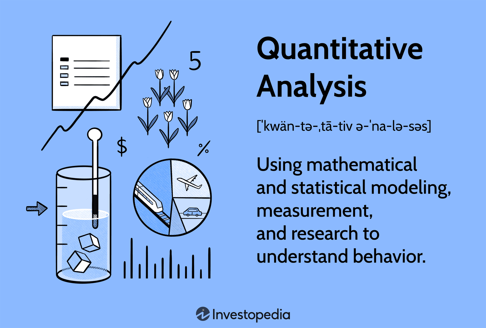

## Table of Contents

## What is quantitative analysis in finance?

Quantitative analysis in finance is a way of using numbers and math to make decisions about money. It involves looking at data and using special methods to understand things like how much risk there is in an investment, or how likely it is that a stock's price will go up or down. People who do this kind of work, called quantitative analysts or "quants," use computers and complex formulas to help them figure out the best ways to invest money.

This kind of analysis is important because it helps people make smarter choices with their money. For example, a quant might use historical data to predict how a stock will perform in the future. They might also use math to figure out the best mix of investments to reduce risk while still making good returns. By using numbers and data, quants can help investors understand the market better and make more informed decisions.

## How does quantitative analysis differ from qualitative analysis in finance?

Quantitative analysis and qualitative analysis are two different ways to look at investments in finance. Quantitative analysis uses numbers and math to understand things like how much money you might make or lose, and how risky an investment is. It looks at data, like stock prices and financial reports, and uses special formulas and computer programs to make predictions. This kind of analysis helps investors make decisions based on hard facts and numbers.

On the other hand, qualitative analysis looks at things that are harder to measure with numbers. It focuses on things like the quality of a company's management, its brand reputation, or how well it might do in the future because of new products or changes in the market. This type of analysis often involves reading news articles, talking to experts, and using your own judgment to decide if an investment is a good idea. While it doesn't use numbers in the same way, it still helps investors make smart choices by considering factors that numbers alone can't capture.

Both types of analysis are important in finance. Quantitative analysis gives you a clear picture of the numbers, while qualitative analysis helps you understand the bigger picture and the things that might not show up in a spreadsheet. By using both, investors can get a more complete view of their investments and make better decisions.

## What are the basic tools and software used in quantitative analysis?

The basic tools and software used in quantitative analysis include programming languages and statistical software. One of the most popular programming languages for quants is Python. Python is easy to learn and has many libraries, like Pandas and NumPy, that help with data analysis and math. Another commonly used language is R, which is specifically designed for statistical computing and graphics. Both of these languages are powerful tools for handling and analyzing large amounts of data.

In addition to programming languages, quants often use specialized software for financial analysis. Bloomberg Terminal is a well-known platform that provides real-time financial data, news, and analytics. It's used by many professionals to track markets and make investment decisions. Another tool is MATLAB, which is great for mathematical modeling and data visualization. MATLAB helps quants create models to predict how investments will perform. These tools, along with programming languages, make it easier for quants to do their work and make smart investment choices.

## Can you explain the role of statistics in quantitative financial analysis?

Statistics plays a big role in quantitative financial analysis. It helps quants understand and predict how investments will do. They use [statistics](/wiki/bayesian-statistics) to look at past data and see patterns. For example, they might use something called regression analysis to see how different things, like interest rates or company earnings, affect stock prices. By understanding these patterns, quants can make better guesses about what might happen in the future.

Another important part of statistics in finance is figuring out risk. Quants use statistical measures like standard deviation and variance to see how much an investment's value might go up or down. This helps them understand how risky an investment is. They also use something called probability to figure out how likely it is that an investment will make or lose money. By using these statistical tools, quants can help investors make smarter choices and manage their money better.

## What are some common quantitative models used in financial markets?

One common quantitative model used in financial markets is the Capital Asset Pricing Model (CAPM). This model helps investors figure out how much return they should expect from an investment based on how risky it is. It looks at the overall market's performance and compares it to the investment's risk. By using CAPM, investors can decide if an investment is worth the risk or if they should look for something safer.

Another popular model is the Black-Scholes Model, which is used to price options. Options are contracts that give you the right to buy or sell something at a certain price. The Black-Scholes Model uses math to figure out how much an option should cost based on things like the price of the underlying asset, how long until the option expires, and how much the price might change. This helps traders know if an option is a good deal or not.

A third model is the Arbitrage Pricing Theory (APT). This model looks at how different factors, like inflation or interest rates, affect the price of an investment. It helps investors understand why an investment's price might go up or down. By using APT, investors can find investments that might be undervalued and could be a good buy.

## How is quantitative analysis applied in risk management?

Quantitative analysis is really important for managing risk in finance. It helps people figure out how much risk there is in an investment by looking at numbers and data. For example, quants use something called Value at Risk (VaR) to estimate how much money an investment might lose over a certain time. By doing this, they can tell investors how much risk they are taking on and help them make choices that fit their comfort level with risk.

In addition to VaR, quants use other tools like stress testing to see how an investment would do in bad situations, like a big drop in the stock market. They also look at how different investments move together, which is called correlation. If two investments tend to go up and down at the same time, they might be riskier to own together. By using these methods, quants can help investors build a portfolio that spreads out the risk and protects their money better.

## What is the importance of data quality in quantitative finance?

Data quality is really important in quantitative finance because it helps quants make better decisions. If the data is good, it means the numbers and information are accurate and complete. This makes the predictions and models that quants use more reliable. For example, if a quant is trying to predict how a stock will do, they need to have the right data on things like past prices and company earnings. If the data is wrong or missing, the predictions could be way off, which could lead to bad investment choices.

Having good data also helps quants manage risk better. They use data to figure out how much risk there is in an investment. If the data is not good, they might think an investment is safer than it really is. This could mean investors take on more risk than they want. By making sure the data is high quality, quants can help investors understand the risks better and make smarter choices with their money.

## How do quantitative analysts use time series analysis in finance?

Quantitative analysts use time series analysis to understand how things change over time in finance. They look at data like stock prices or interest rates to see patterns and trends. By studying this data, they can make predictions about what might happen in the future. For example, if a stock's price has been going up steadily over the past few months, a quant might use time series analysis to guess if it will keep going up or if it's time to sell.

Time series analysis also helps quants figure out how much an investment might go up or down. They use special math formulas to see how much the price of something might change. This is important for managing risk because it helps investors know how much they might lose. By using time series analysis, quants can help investors make better choices and protect their money.

## What are advanced techniques like machine learning and AI bringing to quantitative finance?

Advanced techniques like [machine learning](/wiki/machine-learning) and AI are bringing new ways to understand and predict financial markets. They help quants look at huge amounts of data quickly and find patterns that might be hard to see with regular methods. For example, machine learning can be used to predict stock prices by learning from past data. It can also help find out which news stories might affect the market the most. This means quants can make better guesses about what might happen next and help investors make smarter choices.

These techniques also make it easier to manage risk. AI can look at lots of different things at once, like how different investments move together or how the economy is doing. By doing this, it can help quants figure out how much risk there is in a portfolio and suggest ways to make it safer. This helps investors protect their money better and feel more confident in their choices.

## How can quantitative analysis be used to optimize investment portfolios?

Quantitative analysis helps investors make their investment portfolios better by using numbers and math to figure out the best mix of investments. It looks at things like how much risk there is in each investment and how they might do in the future. By using special formulas and computer programs, quants can find out which investments will help the portfolio grow while keeping the risk low. This means investors can have a good chance of making money without losing too much if things go wrong.

For example, quants might use something called mean-variance optimization to find the best mix of stocks and bonds. This method looks at how much each investment might make and how much it might go up or down. By balancing these things, quants can suggest a portfolio that fits what the investor wants. Whether the investor wants to grow their money fast or just keep it safe, quantitative analysis can help them find the right investments to meet their goals.

## What are the challenges and limitations of quantitative analysis in finance?

One big challenge with quantitative analysis in finance is that it depends a lot on the data being right. If the data is wrong or missing, the predictions and models that quants use can be way off. This can lead to bad investment choices and big losses. Also, the markets can change quickly because of things like new laws or unexpected events. These changes can make the models less useful because they are based on past data, which might not be a good guide for the future.

Another limitation is that quantitative analysis can miss important things that are hard to measure with numbers. For example, it might not be able to tell if a company's leaders are good at their jobs or if a new product will be a hit. These things can have a big impact on how well an investment does, but they are hard to put into a model. So, even though quantitative analysis is really helpful, it's important to use it along with other ways of looking at investments, like talking to experts and reading news articles.

## How do regulatory frameworks impact the practice of quantitative analysis in finance?

Regulatory frameworks can have a big impact on how quants do their work in finance. These rules are made by governments and other groups to make sure that the financial markets are fair and safe. For example, rules like the Dodd-Frank Act in the U.S. require banks to use certain methods to measure risk. This means quants have to follow these rules when they build their models, which can limit what they can do. If the rules change, quants might have to update their models quickly, which can be hard and take a lot of time.

Also, regulatory frameworks can affect what kind of data quants can use. Some rules might say that certain data can't be used or shared, which can make it harder for quants to get the information they need. This can make their predictions less accurate. But, these rules are important because they help keep the markets honest and protect investors. So, while they can make things more difficult for quants, they also help make sure that everyone is playing by the same rules.

## What is the Essence of Quantitative Analysis in Finance?

Quantitative analysis in finance encompasses the use of mathematical and statistical techniques to dissect financial data, thereby offering a robust framework for decision-making in financial markets. This method is indispensable for the evaluation of financial instruments, enabling analysts and traders to predict market trends and efficiently manage risk. By providing objective insights derived from data, quantitative analysis stands in contrast to qualitative methods, which are often influenced by subjective judgement.

Prominent techniques in quantitative analysis include regression analysis, time series forecasting, and Monte Carlo simulations. These methodologies play a crucial role in the financial sector. Regression analysis, for instance, is used to identify the relationship between variables, thereby helping analysts to forecast trends and assess the impact of certain factors on stock prices. The general form of a simple linear regression is given by:

$$
Y = \beta_0 + \beta_1X + \epsilon
$$

where $Y$ is the dependent variable, $X$ is the independent variable, $\beta_0$ is the intercept, $\beta_1$ is the slope of the line, and $\epsilon$ is the error term.

Time series forecasting involves analyzing historical data to predict future values by identifying underlying patterns. This method is particularly useful for predicting stock prices or economic indicators. Techniques such as ARIMA (Autoregressive Integrated Moving Average) models and exponential smoothing are commonly used in these predictions.

Monte Carlo simulations offer a different approach by using random sampling and statistical modeling to estimate probabilistic outcomes. This technique is valuable for assessing risk and uncertainty in financial and operational decision-making processes. In finance, Monte Carlo simulations can help in evaluating the risk and valuation of complex instruments, such as derivatives.

These quantitative tools collectively aid in uncovering hidden patterns within financial data, allowing market participants to make more precise predictions about market movements. The insights gleaned from such analyses are crucial for developing strategies that can withstand volatile market conditions, ultimately providing a competitive edge in the financial industry.

## What is Financial Analysis: A Quantitative Perspective?

Financial analysis using quantitative methods involves a systematic and detailed examination of a company's financial statements and market data to gain comprehensive insights into its economic standing. By leveraging mathematical models and statistical tools, analysts can objectively evaluate a company’s performance metrics, such as [liquidity](/wiki/liquidity-risk-premium), profitability, and solvency. 

One of the fundamental techniques employed is ratio analysis, which involves the computation of key financial ratios derived from a firm's financial statements. Common ratios include the current ratio, which is calculated as:

$$
\text{Current Ratio} = \frac{\text{Current Assets}}{\text{Current Liabilities}}
$$

This ratio assesses a company's ability to cover its short-term obligations with its short-term assets. Similarly, profitability ratios, such as the return on equity (ROE), provide insights into a company's efficiency in generating profits from shareholders' investments:

$$
\text{ROE} = \frac{\text{Net Income}}{\text{Shareholders' Equity}}
$$

Another crucial quantitative method is cash flow modeling. This involves forecasting the future cash inflows and outflows to assess the company’s liquidity over time. By modeling cash flows, analysts can determine a company's capability to maintain operations and invest in growth opportunities without external financing.

Quantitative financial analysis transcends basic assessments by developing predictive models that utilize historical financial data to forecast future performance. For instance, using regression analysis, one can identify trends and correlations that aid in predicting a company’s future earnings or market position. The use of Python for such modeling, using libraries like pandas for data manipulation and sklearn for building predictive models, is prevalent.

```python
import pandas as pd
from sklearn.linear_model import LinearRegression

# Sample data preparation
data = {'Year': [2018, 2019, 2020, 2021],
        'Earnings': [50, 55, 53, 60]}
df = pd.DataFrame(data)

# Linear regression model
X = df[['Year']]
y = df['Earnings']
model = LinearRegression().fit(X, y)

# Prediction
future_year = [[2022]]
predicted_earnings = model.predict(future_year)
```

By quantifying financial data, analysts develop robust models that guide investment decisions, reducing subjective judgment and enhancing the objectivity and accuracy of financial evaluations. This data-driven approach not only aids in mitigating investor biases but also provides a scientific basis for strategic financial planning and investment. Through quantitative analysis, finance professionals can harness the power of data to drive more precise and informed decision-making processes.

## References & Further Reading

[1]: Bergstra, J., Bardenet, R., Bengio, Y., & Kégl, B. (2011). ["Algorithms for Hyper-Parameter Optimization."](https://papers.nips.cc/paper/4443-algorithms-for-hyper-parameter-optimization) Advances in Neural Information Processing Systems 24.

[2]: ["Advances in Financial Machine Learning"](https://www.amazon.com/Advances-Financial-Machine-Learning-Marcos/dp/1119482089) by Marcos Lopez de Prado

[3]: ["Evidence-Based Technical Analysis: Applying the Scientific Method and Statistical Inference to Trading Signals"](https://www.amazon.com/Evidence-Based-Technical-Analysis-Scientific-Statistical/dp/0470008741) by David Aronson

[4]: ["Machine Learning for Algorithmic Trading"](https://github.com/stefan-jansen/machine-learning-for-trading) by Stefan Jansen

[5]: ["Quantitative Trading: How to Build Your Own Algorithmic Trading Business"](https://www.amazon.com/Quantitative-Trading-Build-Algorithmic-Business/dp/1119800064) by Ernest P. Chan