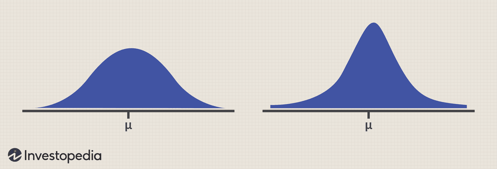

## Table of Contents

## What is quantitative analysis in the context of hedge funds?

Quantitative analysis in hedge funds involves using math and computer models to make investment decisions. Instead of relying on gut feelings or traditional research, hedge fund managers use numbers and data to find patterns and predict how investments will perform. This approach helps them make more objective decisions and can uncover opportunities that might be missed by other investors.

In practice, quantitative analysts, often called "quants," collect large amounts of data from various sources like stock prices, economic reports, and company financials. They then use this data to build complex models that can simulate different market scenarios and test investment strategies. By doing this, hedge funds can manage risk better and aim for higher returns, although the models are not always perfect and can sometimes lead to unexpected results.

## How does quantitative analysis help in evaluating hedge fund performance?

Quantitative analysis helps evaluate hedge fund performance by using numbers and data to measure how well the fund is doing. Instead of guessing or using opinions, it looks at things like returns, risk, and how the fund compares to others. This helps investors see if the fund is making money and if it's doing better than other funds or the market as a whole. By using numbers, it's easier to tell if the fund's strategies are working and if it's worth investing in.

Another way quantitative analysis helps is by looking at risk. It uses math to figure out how risky the fund's investments are and how likely it is to lose money. This is important because investors want to know if the fund is taking too many risks or if it's managing risks well. By understanding the risk, investors can decide if the potential rewards are worth it. Overall, quantitative analysis gives a clear, numbers-based picture of a [hedge fund](/wiki/hedge-fund-trading-strategies)'s performance, making it easier for investors to make smart choices.

## What are the key metrics used in quantitative analysis for assessing hedge fund risk?

When looking at how risky a hedge fund is, one of the main things to check is the fund's volatility. Volatility is just a fancy word for how much the fund's value goes up and down over time. If a fund's value jumps around a lot, it's more risky because you never know if it will go up or down next. Another important thing to look at is the fund's Value at Risk (VaR). VaR tells you the most money you could lose over a certain time, like a day or a week, with a certain chance, like 95% or 99%. This helps you understand the worst-case scenario and plan for it.

Another key metric is the Sharpe Ratio, which tells you how much return you're getting for the risk you're taking. A higher Sharpe Ratio means the fund is doing a good job of making money without taking too much risk. Beta is also important because it shows how much the fund moves with the market. If a fund has a high beta, it means it's very sensitive to what the market is doing, which can be riskier. Lastly, the Sortino Ratio is similar to the Sharpe Ratio but focuses only on the bad kind of risk, the risk of losing money. This can give a better picture of how the fund handles the risk that really matters to investors.

## Can you explain the difference between alpha and beta in hedge fund performance?

Alpha and beta are two important numbers that help us understand how well a hedge fund is doing. Alpha is all about how much better the fund is doing compared to what you would expect from the market. If a fund has a high alpha, it means the fund managers are doing something special to make more money than just following the market. It shows the skill of the fund managers in [picking](/wiki/asset-class-picking) investments that do better than everyone else.

Beta, on the other hand, tells us how much the fund moves with the market. If a fund has a beta of 1, it means it moves exactly the same way as the market. A beta higher than 1 means the fund goes up and down more than the market, which can be riskier. A beta lower than 1 means the fund is less affected by what the market is doing, which can be safer but might also mean less chance for big gains. So, while alpha shows the fund's unique performance, beta shows how closely tied the fund is to the overall market movements.

## What role does the Sharpe ratio play in analyzing hedge fund performance?

The Sharpe ratio is a key tool for figuring out how well a hedge fund is doing. It helps you see if the fund is making good money compared to the risk it's taking. The way it works is by looking at the fund's return and then subtracting the return you could get from a safe investment, like a savings account. Then, it divides that number by how much the fund's returns jump around, which we call volatility. A higher Sharpe ratio means the fund is doing a great job of making money without taking too much risk.

Investors use the Sharpe ratio to compare different hedge funds and decide which ones are the best. If one fund has a higher Sharpe ratio than another, it means that fund is giving you more return for the risk you're taking. This makes it easier to pick funds that are likely to do well in the future. But remember, the Sharpe ratio is just one piece of the puzzle. It's important to look at other things like how the fund has done over time and what kinds of investments it's making.

## How do hedge funds use quantitative models to manage and mitigate risk?

Hedge funds use quantitative models to manage and mitigate risk by analyzing lots of data to understand how risky their investments are. These models look at things like how much the value of investments goes up and down, which is called volatility, and how much money they might lose in a bad situation, which is called Value at Risk (VaR). By understanding these risks, hedge funds can adjust their strategies to avoid big losses. For example, if a model shows that a certain investment is too risky, the fund might decide to sell it or buy something safer instead.

Another way hedge funds use quantitative models is by running lots of different scenarios to see what might happen in the future. These models can simulate how the market might change and how those changes would affect the fund's investments. By doing this, hedge funds can prepare for different outcomes and make plans to reduce risk. For instance, if the model predicts a market downturn, the fund might use options or other financial tools to protect their investments. This way, even if the market goes down, the fund can limit how much money it loses.

## What are some common quantitative strategies employed by hedge funds?

Hedge funds often use a strategy called statistical [arbitrage](/wiki/arbitrage), which involves looking at lots of numbers to find small differences in the prices of similar investments. They use computers to quickly buy the cheaper one and sell the more expensive one, hoping to make a profit when the prices get back to normal. This strategy relies on the idea that prices will eventually even out, and it needs fast computers to work because the price differences are usually very small and don't last long.

Another common strategy is called [trend following](/wiki/trend-following), where hedge funds use numbers to spot patterns in how prices are moving. If they see that a price is going up, they might buy more of that investment, hoping it will keep going up. If they see a price going down, they might sell it or even bet against it, hoping to make money when the price keeps falling. This strategy can work well in markets that keep moving in the same direction for a while, but it can be risky if the trends suddenly change.

Some hedge funds also use a strategy called risk parity, where they try to balance the risk across different types of investments. They use numbers to figure out how risky each investment is and then adjust their portfolio so that no single investment can cause too much trouble. This helps them manage risk better and aim for steady returns, even if the market gets bumpy.

## How can quantitative analysis be used to predict future hedge fund performance?

Quantitative analysis can help predict future hedge fund performance by looking at past data and using math to find patterns. Hedge funds collect a lot of information about how their investments have done in the past, like stock prices, economic reports, and how well their strategies have worked. They use this data to build models that can show what might happen in the future. For example, if a fund sees that certain investments tend to do well during specific times of the year, they might use that information to make better decisions about when to buy or sell.

These models can also run different scenarios to see how the fund might do if the market goes up, down, or stays the same. By testing many different possibilities, hedge funds can get a better idea of what might happen and plan accordingly. While no one can predict the future perfectly, using numbers and data can give hedge funds a better chance of making smart choices and avoiding big surprises. This helps them aim for higher returns and manage risk more effectively.

## What are the limitations of quantitative analysis in hedge fund evaluation?

Quantitative analysis is really helpful for looking at numbers and making predictions, but it has some limits. One big problem is that it depends a lot on past data. If the future is very different from the past, the predictions might be wrong. Also, markets can be affected by things like new laws, big news events, or even people's feelings, which are hard to put into numbers. So, even the best models can miss important stuff that doesn't show up in the data.

Another issue is that quantitative analysis can be tricky to use because it needs a lot of math and computer skills. If the people using the models don't understand them well, they might make mistakes or use the wrong models for the job. Plus, sometimes the models can be too complicated, and it's hard to explain why they make certain predictions. This can make investors nervous because they want to know why they should trust the numbers.

## How do advanced statistical techniques enhance quantitative analysis in hedge funds?

Advanced statistical techniques help hedge funds do better at looking at numbers and making predictions. These techniques, like machine learning and big data analysis, let hedge funds handle huge amounts of information quickly. They can find patterns and connections that might be too hard to see with simpler methods. For example, machine learning can learn from past data to predict how investments might do in the future, even if the market changes in new ways. This helps hedge funds make smarter choices about what to buy or sell.

These advanced methods also help hedge funds manage risk better. By using techniques like Monte Carlo simulations, hedge funds can run many different scenarios to see how their investments might do under different conditions. This gives them a clearer picture of the risks they're taking and helps them plan for different outcomes. While these techniques can make predictions more accurate, they're not perfect. Markets can still be affected by unexpected events, but advanced [statistics](/wiki/bayesian-statistics) give hedge funds a powerful tool to understand and navigate the markets better.

## What is the impact of machine learning on quantitative analysis in hedge fund management?

Machine learning has made a big difference in how hedge funds do their quantitative analysis. It helps them look at huge amounts of data quickly and find patterns that might be hard to see otherwise. With machine learning, hedge funds can learn from past data to predict how investments might do in the future. This means they can make better choices about what to buy or sell, even if the market changes in new ways. Machine learning also helps hedge funds find new ways to make money that they might not have thought of before.

Another way machine learning helps is by making risk management easier. It can run lots of different scenarios to see how investments might do under different conditions. This helps hedge funds understand the risks they're taking and plan for different outcomes. While machine learning can't predict everything perfectly because markets can still be affected by unexpected events, it gives hedge funds a powerful tool to understand and navigate the markets better.

## How do regulatory requirements influence the use of quantitative analysis in hedge funds?

Regulatory requirements can change how hedge funds use quantitative analysis. Rules from places like the Securities and Exchange Commission (SEC) make hedge funds keep good records and report their activities clearly. This means they have to use numbers and data to show what they're doing and how they're managing risks. Sometimes, these rules can make it harder for hedge funds to use very new or complicated ways of analyzing data because they have to explain everything clearly to regulators.

Even though rules can make things trickier, they also push hedge funds to use better and more careful quantitative methods. For example, rules about how much risk a fund can take make them use numbers to check and control their risks better. This can lead to more stable and safer investments. So, while regulations can limit some of the fancy stuff hedge funds might want to do, they also help make sure that the funds are using good, reliable ways to analyze data and manage their money.

## What is the role of risk assessment in hedge fund performance?

Understanding and managing risk are crucial components of hedge fund success, and quantitative methods substantially augment these capabilities. In finance, numerous metrics are employed to quantify and assess risk, with standard deviation, Value at Risk (VaR), skewness, and kurtosis being among the most essential.

**Standard Deviation and Risk Volatility**

Standard deviation is a fundamental measure of risk, used to quantify the amount of variation or [dispersion](/wiki/dispersion-trading) in a set of financial data points. It represents the extent to which each data point differs from the mean, providing insights into the [volatility](/wiki/volatility-trading-strategies) of asset returns. A higher standard deviation indicates greater risk due to increased variability in returns. For hedge funds, maintaining a low standard deviation can signal consistency and stability in performance.

$$
\text{Standard Deviation} = \sqrt{\frac{\sum_{i=1}^{n}(x_i - \bar{x})^2}{n}}
$$

where $x_i$ is each individual return, $\bar{x}$ is the mean of the returns, and $n$ is the number of observations.

**Value at Risk (VaR)**

Value at Risk (VaR) is a statistical technique used to gauge the potential loss in value of a portfolio over a specific period for a given confidence interval. It is a standard measure for risk management in hedge funds and helps in understanding the largest loss a portfolio might suffer within a particular timeframe under normal market conditions.

For instance, a daily VaR of 5% with a confidence level of 95% suggests that there is a 5% chance that the loss will exceed the computed VaR on a given day.

**Skewness and Kurtosis**

Skewness and kurtosis are additional statistical metrics providing deeper insights into the distribution characteristics of hedge fund returns. Skewness indicates the asymmetry of the probability distribution, revealing whether the returns are skewed towards higher or lower values. A positively skewed distribution suggests more frequent small losses and fewer large gains, while a negative skew helps identify rare but potential significant losses. Kurtosis measures the "tailedness" of a distribution, where higher kurtosis indicates more outliers and extreme values, thus alerting funds to potential high-risk scenarios.

**Stress Testing**

Quantitative risk assessment in hedge funds is further enhanced through stress testing. This process simulates various unfavorable market conditions to project their potential impacts on portfolio performance. Stress tests assess how extreme scenarios, which include sudden market drops or spikes, geopolitical events, or economic crises, could detrimentally affect funds, ensuring preparedness against unforeseen events.

**Strategic Risk Management**

Effective risk management strategies in hedge funds not only aim to protect against short-term losses but also support long-term investment goals. By integrating these quantitative techniques into their decision-making processes, hedge funds can refine their strategies to minimize risks while optimizing returns. This continuous evaluation and adjustment of risk parameters are vital in sustaining hedge fund longevity and achieving consistent performance in volatile financial markets. 

By leveraging sophisticated models and data-driven risk assessments, hedge funds can make informed decisions that align investment objectives with prevailing market dynamics, thereby safeguarding capital and enhancing potential gains over time.

## What is the relationship between Algorithmic Trading and Hedge Fund Strategy?

Algorithmic trading is a significant innovation within hedge fund strategy, facilitating the execution of trades via sophisticated quantitative models. This technology-driven approach enables hedge funds to swiftly react to market dynamics, executing trades with precision and efficiency far surpassing manual trading capabilities. The fundamental advantage of [algorithmic trading](/wiki/algorithmic-trading) is its ability to minimize human error and enhance transaction speed, thereby significantly enhancing hedge fund performance.

High-frequency trading ([HFT](/wiki/high-frequency-trading-strategies)) and [statistical arbitrage](/wiki/statistical-arbitrage) are prominent strategies within algorithmic trading frameworks. High-frequency trading, for example, leverages high-speed data feeds and sophisticated algorithms to make rapid trading decisions, often executing thousands of orders in mere seconds (Aldridge, 2013). The primary goal of HFT is to capitalize on small price discrepancies that exist for only a fraction of a second across various markets. This requires an extensive technological infrastructure capable of processing large volumes of financial data at unprecedented speeds, creating a competitive edge in market conditions characterized by volatility.

Similarly, statistical arbitrage employs complex mathematical models to exploit inefficiencies between related financial instruments. By statistically modeling historical price relationships, hedge funds can predict future price movements and systematically execute trades to profit from expected convergences or divergences. A basic example of a statistical arbitrage model is:

$$

\text{Signal} = \alpha + \beta_1 X_1 + \beta_2 X_2 + \epsilon 
$$

where $\alpha$ is the intercept, $X_1$ and $X_2$ are the variables representing the price movements of two assets, $\beta_1$ and $\beta_2$ are the coefficients estimated through regression of past data, and $\epsilon$ is the error term. When the actual price diverges significantly from the expected price given by this model, a trading signal is generated.

These algorithmic strategies are underpinned by robust quantitative analysis, which involves the processing and interpretation of immense volumes of financial data using advanced statistical techniques and [machine learning](/wiki/machine-learning) algorithms. An example of a Python code snippet used in algorithmic trading for calculating simple moving averages, a basic component of many trading strategies, might look like this:

```python
import pandas as pd

# Load historical price data
data = pd.read_csv('historical_prices.csv')

# Calculate a simple moving average (SMA)
data['SMA'] = data['Close'].rolling(window=20).mean()

# Trading signal: Buy when price > SMA, Sell when price < SMA
data['Signal'] = 0
data['Signal'][data['Close'] > data['SMA']] = 1
data['Signal'][data['Close'] < data['SMA']] = -1
```

The interaction between algorithmic trading systems and quantitative models grants hedge funds the agility and precision required to sustain competitiveness in erratic financial markets. Moreover, the expansion of machine learning and [artificial intelligence](/wiki/ai-artificial-intelligence) has further enriched the analytic capabilities of these models, enabling the development of increasingly sophisticated trading algorithms and reinforcing the strategic position of hedge funds in the finance industry.

References:
- Aldridge, I. (2013). *High-Frequency Trading: A Practical Guide to Algorithmic Strategies and Trading Systems*. John Wiley & Sons.

## References & Further Reading

[1]: Aldridge, I. (2013). *High-Frequency Trading: A Practical Guide to Algorithmic Strategies and Trading Systems*. John Wiley & Sons.

[2]: López de Prado, M. (2018). ["Advances in Financial Machine Learning"](https://www.amazon.com/Advances-Financial-Machine-Learning-Marcos/dp/1119482089). John Wiley & Sons.

[3]: Aronson, D. R. (2007). ["Evidence-Based Technical Analysis: Applying the Scientific Method and Statistical Inference to Trading Signals"](https://onlinelibrary.wiley.com/doi/book/10.1002/9781118268315). John Wiley & Sons.

[4]: Chan, E. (2009). ["Quantitative Trading: How to Build Your Own Algorithmic Trading Business"](https://github.com/ftvision/quant_trading_echan_book). John Wiley & Sons.

[5]: Jansen, S. (2018). ["Machine Learning for Algorithmic Trading"](https://github.com/stefan-jansen/machine-learning-for-trading). Packt Publishing.