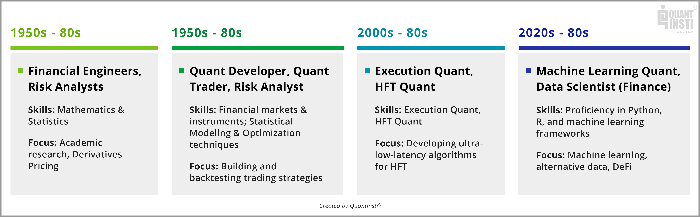

## Table of Contents

## What is a quantitative analyst?

A quantitative analyst, often called a "quant," is a person who uses math and computer skills to help make decisions in finance. They work in areas like banks, investment firms, and insurance companies. Their job is to create models and strategies that can predict how markets will move and how to make money from these predictions. They use numbers and data to find patterns and make smart choices about buying and selling stocks, bonds, and other financial products.

Quants need to be good at math, especially statistics and probability. They also need to know how to program computers to handle large amounts of data quickly. Their work can be very complex, but it's important because it helps companies manage risk and find new ways to invest money. By using their skills, quants can help make financial markets more efficient and help investors make better decisions.

## What are the primary responsibilities of a quantitative analyst?

A quantitative analyst's main job is to use math and computer skills to help make smart decisions in finance. They create models and formulas that predict how markets will behave. These models help companies decide when to buy or sell stocks, bonds, and other financial products. Quants also look at a lot of data to find patterns that others might miss. This helps them come up with new ways to make money and manage risk.

Another important part of a quant's job is to keep their models up to date. Markets change all the time, so quants need to adjust their models to make sure they stay accurate. They also work with other teams, like traders and risk managers, to explain their findings and help make decisions. Sometimes, quants need to write reports or give presentations to show how their models work and why they are useful.

## What educational background is required to become a quantitative analyst?

To become a quantitative analyst, you usually need a strong background in math and computer science. Most quants have at least a bachelor's degree in fields like mathematics, [statistics](/wiki/bayesian-statistics), physics, engineering, or computer science. These subjects help you learn how to solve complex problems and work with numbers, which is very important for a quant's job. Some quants also have master's degrees or PhDs, especially if they want to work on more advanced models or in research roles.

In addition to the right degree, you need to learn specific skills to be a good quant. This includes knowing how to use programming languages like Python, R, or C++ to handle large amounts of data. You also need to understand financial markets and how they work. Many quants start by learning on the job or through internships, where they can apply their math and computer skills to real-world financial problems. Over time, they gain more experience and can take on more complex tasks in their roles.

## How has the role of quantitative analysts evolved over the years?

The role of quantitative analysts has changed a lot over the years. In the beginning, quants were mostly used by big banks and investment firms to help with simple math problems. They used basic models to predict how markets would move and help make decisions about buying and selling stocks. But as computers got better and more data became available, the job of a quant grew. They started using more complex math and computer programs to create detailed models that could handle a lot more information.

Today, quants are very important in finance. They work in many different areas, not just banks, but also in insurance companies and hedge funds. They use advanced math and computer skills to find new ways to make money and manage risk. Quants also work on things like high-frequency trading, where computers make thousands of trades in a second. The job keeps changing as new technology comes out, and quants need to keep learning to stay good at their work.

## What industries commonly employ quantitative analysts?

Quantitative analysts, or quants, work in many different industries. The most common place to find them is in the financial industry, like banks, investment firms, and hedge funds. These companies use quants to help make decisions about buying and selling stocks, bonds, and other financial products. Quants use math and computer skills to create models that predict how markets will move. This helps the companies manage risk and find new ways to make money.

Besides finance, quants also work in the insurance industry. Insurance companies use quants to figure out how much to charge for policies and how much risk they are taking on. Quants help them create models that predict how likely it is for someone to need to use their insurance. This helps the companies set prices that are fair and make sure they can pay out claims when they need to.

## What are the key skills needed to succeed as a quantitative analyst?

To succeed as a quantitative analyst, you need to be really good at math, especially in areas like statistics and probability. These skills help you create models that can predict how markets will move. You also need to know how to use computers well. This means learning programming languages like Python, R, or C++. These tools help you handle a lot of data quickly and build complex models. Being able to think in a logical way and solve problems is also very important. You'll need to look at a lot of numbers and find patterns that others might miss.

Another key skill is understanding how financial markets work. You don't just need to be good at math and computers; you also need to know about things like stocks, bonds, and other financial products. This helps you make models that are useful in the real world. Good communication skills are important too. You'll need to explain your models and findings to other people, like traders and managers. Being able to write reports and give presentations clearly can help your work be understood and used by others.

## How do quantitative analysts use mathematical models in their work?

Quantitative analysts, or quants, use mathematical models to predict how markets will behave. They take a lot of data, like past prices of stocks or how the economy is doing, and put it into their models. These models use math, like statistics and probability, to find patterns in the data. By finding these patterns, quants can guess what might happen next in the market. This helps them decide when to buy or sell things like stocks or bonds to make money or avoid losing it.

Quants also use these models to manage risk. They can figure out how likely it is that something bad will happen, like a big drop in the stock market. By understanding this risk, they can help companies make safer choices. For example, they might suggest buying certain stocks or using other financial tools to protect against losses. The models need to be updated all the time because markets change, so quants are always working to make their models better and more accurate.

## What is the impact of technology on the work of quantitative analysts?

Technology has made a big difference in the work of quantitative analysts. Computers are much faster now, so quants can handle a lot more data than before. They use programs to look at huge amounts of information quickly. This helps them find patterns and make better predictions about how markets will move. Quants also use new tools like [machine learning](/wiki/machine-learning), which lets computers learn from data and make even smarter models. This means they can come up with new ways to make money and manage risk.

Because of technology, the job of a quant has changed a lot. They can now do things like high-frequency trading, where computers make thousands of trades in a second. This was not possible before. Quants also need to keep learning about new technology to stay good at their jobs. The tools they use keep getting better, so they have to keep up. This makes their work more complex, but it also means they can help companies make better decisions in the fast-changing world of finance.

## Can you explain the difference between a quantitative analyst and a data scientist?

A quantitative analyst, or quant, focuses on using math and computer skills to help make decisions in finance. They create models that predict how markets will move and help companies decide when to buy or sell stocks, bonds, and other financial products. Quants need to understand financial markets and use their math skills to manage risk and find ways to make money. Their work is very specific to the finance industry, and they often work in places like banks, investment firms, and insurance companies.

A data scientist, on the other hand, works with data in many different fields, not just finance. They use math and computer skills to find patterns in data and help companies make decisions. Data scientists might work in areas like healthcare, marketing, or technology. They use tools like machine learning to make predictions and help solve problems. While both quants and data scientists use math and data, data scientists have a broader focus and work in more industries than quants, who are more specialized in finance.

## What are some advanced techniques used by quantitative analysts in financial markets?

Quantitative analysts use advanced techniques like machine learning to make better predictions about financial markets. Machine learning lets computers learn from data and find patterns that humans might miss. Quants use this to create models that can predict how stocks, bonds, and other financial products will move. They also use something called neural networks, which are a type of machine learning that can handle very complex data. These tools help quants find new ways to make money and manage risk, even in fast-changing markets.

Another advanced technique is high-frequency trading. This is when computers make thousands of trades in a second, much faster than a human could. Quants use math and computer skills to create algorithms that decide when to buy and sell. These algorithms look at a lot of data very quickly and can take advantage of small changes in the market. High-frequency trading can make a lot of money, but it's also risky because the market can change so quickly. Quants need to keep their models up to date to make sure they work well in this fast-paced environment.

## How do regulatory changes affect the strategies of quantitative analysts?

Regulatory changes can have a big impact on the strategies that quantitative analysts use. When new rules come out, quants have to change their models to make sure they follow the new rules. For example, if the government says banks can't take as much risk, quants might need to adjust their models to predict how much risk is safe to take. This means they might need to change how they decide when to buy or sell stocks, bonds, or other financial products. Keeping up with these changes can be hard, but it's important for quants to make sure their companies stay within the law.

These changes can also create new opportunities for quants. Sometimes, new rules can make certain parts of the market more interesting to invest in. Quants can use their math and computer skills to find new ways to make money that fit with the new rules. For example, if new rules make it easier to trade certain types of bonds, quants might create new models to take advantage of this. By staying on top of regulatory changes, quants can help their companies find new ways to make money and manage risk in a changing world.

## What future trends are expected to influence the role of quantitative analysts?

In the future, technology will keep changing the work of quantitative analysts. Computers will get even faster, and new tools like [artificial intelligence](/wiki/ai-artificial-intelligence) and machine learning will become more important. Quants will use these tools to make even better models that can predict how markets will move. They will be able to handle more data and find patterns that are too hard for humans to see. This means they can help companies make smarter decisions about buying and selling stocks, bonds, and other financial products.

Another trend is that more industries will start using quants. Right now, they mostly work in finance, but in the future, they might work in places like healthcare, energy, and even sports. Companies in these industries will use quants to help them make decisions based on data. For example, a hospital might use a quant to figure out the best way to manage its resources. As more industries see the value of using data to make decisions, the skills of quants will be in demand in many different places.

## References & Further Reading

[1]: Bergstra, J., Bardenet, R., Bengio, Y., & Kégl, B. (2011). ["Algorithms for Hyper-Parameter Optimization."](https://papers.nips.cc/paper/4443-algorithms-for-hyper-parameter-optimization) Advances in Neural Information Processing Systems 24.

[2]: ["Advances in Financial Machine Learning"](https://www.amazon.com/Advances-Financial-Machine-Learning-Marcos/dp/1119482089) by Marcos Lopez de Prado

[3]: ["Evidence-Based Technical Analysis: Applying the Scientific Method and Statistical Inference to Trading Signals"](https://www.amazon.com/Evidence-Based-Technical-Analysis-Scientific-Statistical/dp/0470008741) by David Aronson

[4]: ["Machine Learning for Algorithmic Trading"](https://github.com/stefan-jansen/machine-learning-for-trading) by Stefan Jansen

[5]: ["Quantitative Trading: How to Build Your Own Algorithmic Trading Business"](https://www.amazon.com/Quantitative-Trading-Build-Algorithmic-Business/dp/1119800064) by Ernest P. Chan