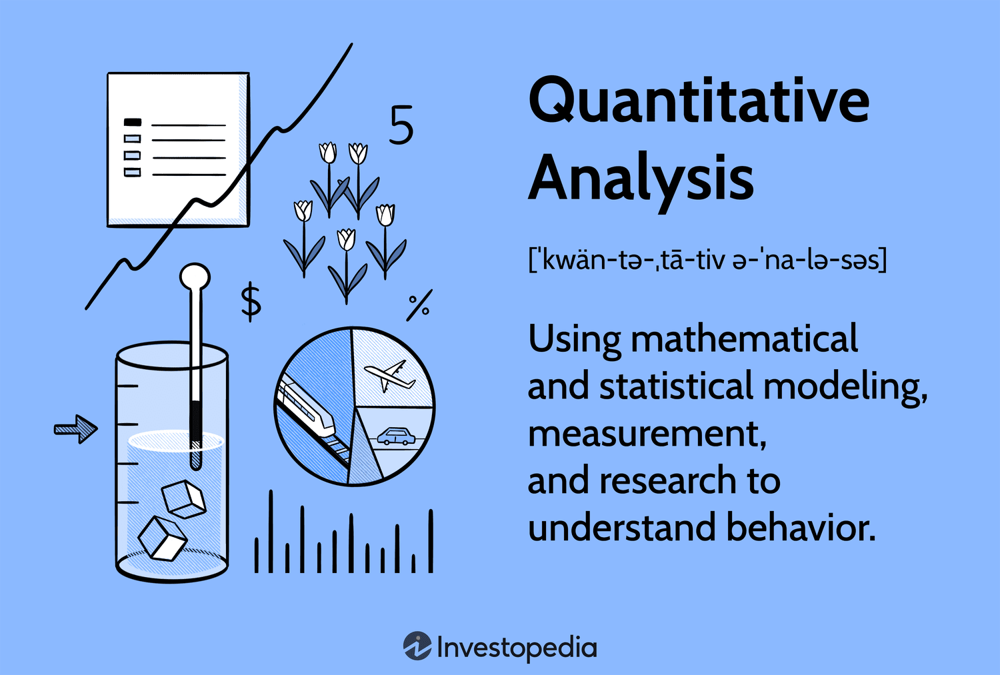

## Table of Contents

## What is quantitative analytics?

Quantitative analytics is a way of using numbers and math to understand and solve problems. It involves collecting data, like numbers or measurements, and then using special methods to analyze this data. People use quantitative analytics in many fields, like business, science, and finance, to make better decisions and predictions. For example, a company might use it to figure out how much of a product to make, or a scientist might use it to understand how a medicine works.

The process of quantitative analytics starts with gathering data, which can come from surveys, experiments, or other sources. Once the data is collected, it is organized and cleaned to make sure it is accurate and useful. Then, different mathematical and statistical tools are used to analyze the data. These tools can help find patterns, trends, and relationships in the data. The results of this analysis can then be used to make informed decisions or to predict what might happen in the future.

## How does quantitative analytics differ from qualitative analysis?

Quantitative analytics and qualitative analysis are two different ways to study things. Quantitative analytics uses numbers and math to understand and solve problems. It involves collecting data, like numbers or measurements, and then using special methods to analyze this data. This type of analysis is good for finding patterns, trends, and making predictions. For example, if you want to know how many people like a certain type of ice cream, you would count the number of people who choose it and use math to understand the results.

On the other hand, qualitative analysis looks at things that are not numbers, like words, feelings, or experiences. It involves gathering information through interviews, observations, or other non-numerical ways. This type of analysis helps to understand the deeper meaning behind things, like why people like a certain type of ice cream. It's more about understanding the 'why' and 'how' rather than the 'how many.'

Both types of analysis are important and can be used together to get a fuller picture of a situation. Quantitative analytics gives you the hard numbers and facts, while qualitative analysis provides the context and deeper understanding. For example, a business might use quantitative analytics to see how many customers they have, and qualitative analysis to understand what those customers think about their products.

## What are the main applications of quantitative analytics in business?

Quantitative analytics is very useful in business because it helps companies make smart decisions based on numbers. One big way it's used is in financial analysis. Companies use it to look at their money, like how much they are making or spending. They can also use it to predict future sales or to see if a new project will make money. This helps them plan better and avoid losing money.

Another important use is in marketing. Businesses use quantitative analytics to understand their customers better. They can look at data to see what people are buying, how often they buy, and what they like. This helps them make better ads and sell more products. For example, if they see that a lot of people are buying a certain type of product, they might decide to make more of it or advertise it more.

Quantitative analytics also helps with operations and supply chain management. Companies can use it to figure out the best way to make their products and get them to customers. They can look at data to see how long it takes to make something, how much it costs, and how to make it faster or cheaper. This helps them run their business more smoothly and save money.

## What are the basic statistical concepts used in quantitative analytics?

In quantitative analytics, some basic statistical concepts are used to make sense of data. One important concept is the mean, which is just the average of a set of numbers. If you want to know the average age of people in a group, you add up all their ages and divide by the number of people. Another concept is the median, which is the middle number when you line up all the numbers from smallest to biggest. The median can be useful if you have some very high or very low numbers that might make the mean misleading. The mode is also important; it's the number that shows up the most often in your data. These three measures help you understand the typical values in your data.

Another key concept is variability, which tells you how spread out your data is. One way to measure variability is the range, which is the difference between the highest and lowest numbers. Another way is the standard deviation, which shows how much the numbers in your data set differ from the mean. If the standard deviation is small, the numbers are close to the mean, and if it's big, the numbers are more spread out. Understanding variability helps you see how consistent your data is. 

Lastly, correlation and regression are important for understanding relationships between different sets of data. Correlation measures how closely two sets of numbers move together. If one goes up when the other goes up, they have a positive correlation. If one goes up when the other goes down, they have a negative correlation. Regression helps you predict one set of numbers based on another set. For example, you might use regression to predict sales based on how much you spend on advertising. These concepts help you see patterns and make predictions based on your data.

## What tools and software are commonly used in quantitative analytics?

In quantitative analytics, people use many different tools and software to help them work with numbers and data. One popular tool is Microsoft Excel, which is easy to use and can do a lot of basic math and data analysis. Another common tool is R, which is a programming language made just for [statistics](/wiki/bayesian-statistics) and data analysis. R is very powerful and can do complex calculations, but it can be hard to learn. Python is also widely used, especially because it has many libraries like Pandas and NumPy that make it easier to work with data. Python is good for both beginners and experts because it's easy to learn but can also do advanced analysis.

There are also special software programs made just for quantitative analytics. For example, SAS (Statistical Analysis System) is used a lot in big companies and research because it can handle very large amounts of data and do many different types of analysis. Another program is SPSS (Statistical Package for the Social Sciences), which is often used in social sciences and business because it's user-friendly and good for analyzing survey data. Tableau is another tool that's great for making charts and graphs to show your data in a way that's easy to understand. All these tools help people in different fields use numbers to make better decisions and understand their data better.

## How can data be collected for quantitative analysis?

Data for quantitative analysis can be collected in many ways. One common way is through surveys and questionnaires. These can be done in person, over the phone, or online. People answer questions, and their answers are turned into numbers. For example, if you ask people to rate something from 1 to 5, you can use those numbers to do your analysis. Another way to collect data is through experiments. Scientists might do an experiment to see how different things affect each other, like how a new medicine affects people's health. They measure things like heart rate or blood pressure and use those numbers for analysis.

Another way to get data is by using existing records. Companies and governments keep a lot of information that can be used for quantitative analysis. For example, a business might look at its sales records to see how much money it made each month. Or a researcher might use data from a government health survey to study how many people have a certain disease. Sometimes, data can also be collected automatically, like when websites track how many people visit them or what pages they look at. This kind of data is called "big data" because there can be a lot of it, and special tools are needed to analyze it.

## What are some common quantitative models used in financial analytics?

In financial analytics, one common quantitative model is the discounted cash flow (DCF) model. This model helps people figure out how much a company or investment is worth by looking at the money it will make in the future. The idea is to take all the future cash flows and bring them back to today's value using a discount rate. This rate shows how much people value money now compared to money later. If a company is expected to make a lot of money in the future, the DCF model might say it's worth a lot now. But if the future cash flows are small or uncertain, the model might say it's not worth as much.

Another important model is the Capital Asset Pricing Model (CAPM). This model helps people understand the relationship between risk and expected return on an investment. It says that the expected return on an investment should be higher if the investment is riskier. The CAPM uses something called the beta, which measures how much an investment's price moves compared to the overall market. If an investment has a high beta, it's more sensitive to market changes and is considered riskier. The CAPM helps investors decide if the expected return on an investment is worth the risk they are taking.

A third model often used is the Black-Scholes model, which is used to price options. Options are financial instruments that give people the right to buy or sell something at a certain price in the future. The Black-Scholes model uses things like the current price of the stock, the option's strike price, the time until the option expires, and the expected [volatility](/wiki/volatility-trading-strategies) of the stock's price to figure out what the option should be worth. This model is very important for people who trade options because it helps them make better decisions about buying and selling them.

## How do you validate the results of a quantitative analysis?

To make sure the results of a quantitative analysis are correct, you need to check them in different ways. One way is to use something called cross-validation. This means you split your data into different parts and use some of it to build your model and the rest to test it. If your model works well on the part you didn't use to build it, you can be more sure that your results are good. Another way to check your results is to compare them with other studies or data. If other people have done similar work and found similar things, it's a good sign that your results are right.

Another important way to validate your results is to look at how you collected your data. You need to make sure your data is accurate and that you didn't make any mistakes when you were gathering it. If your data is good, your results are more likely to be good too. It's also a good idea to use different statistical tests to see if your results are strong. If different tests all point to the same thing, you can be more confident in your findings. By checking your results in these ways, you can make sure your quantitative analysis is reliable and useful.

## What are the challenges faced when implementing quantitative analytics in an organization?

Implementing quantitative analytics in an organization can be tough because it needs a lot of things to work well together. One big challenge is getting the right data. Sometimes, the data an organization has is not good enough or there's not enough of it. It can be hard to collect new data, and it takes time and money. Also, the people in the organization need to know how to use the data. They need to learn new skills and understand how to use special tools and software. If they don't, the data won't help them make better decisions.

Another challenge is making sure everyone in the organization understands and trusts the results of the analytics. Sometimes, people might not believe the numbers or might not know how to use them to make decisions. It's important to explain the results in a way that everyone can understand. Also, the organization needs to have the right technology to do the analytics. This can be expensive, and it might take a long time to set up. If the technology doesn't work well, it can slow down the whole process and make it harder to get good results.

## How can machine learning enhance quantitative analytics?

Machine learning can make quantitative analytics better by finding patterns in big sets of data that people might miss. It can look at a lot of information quickly and find things that are hard to see. For example, [machine learning](/wiki/machine-learning) can help predict what customers will buy next by looking at what they bought before. It can also help find out which ads work best by seeing which ones make people buy more. This makes it easier for businesses to make smart decisions based on numbers.

Another way machine learning helps is by making models that get better over time. As it gets more data, the machine learning model can learn and improve its predictions. This means the more you use it, the better it gets at understanding your data. For example, a bank might use machine learning to decide if someone should get a loan. The more loans it looks at, the better it gets at figuring out who will pay back the loan. This makes quantitative analytics more accurate and useful for making decisions.

## What advanced techniques are used in quantitative analytics for risk management?

In quantitative analytics for risk management, one advanced technique is called Value at Risk (VaR). VaR helps people figure out the most money they could lose in a certain time, like a day or a week, with a certain chance. For example, if a bank uses VaR and finds out that it could lose up to $1 million in a day with a 5% chance, it helps the bank know how much risk it is taking. VaR uses a lot of math and past data to make these predictions. It's a good way to understand risk, but it's not perfect because it can't predict everything, like big surprises in the market.

Another technique is stress testing. This is when people look at what would happen if something really bad happened, like a big drop in the stock market or a sudden change in interest rates. Stress testing helps see how strong a company or a bank is and if it can handle tough times. It uses a lot of different scenarios to see how things might go wrong and how much money could be lost. This helps people plan better and make sure they have enough money saved up to deal with problems. Both VaR and stress testing are important tools that help manage risk by giving a clearer picture of what could happen in the future.

## How do you stay updated with the latest developments in quantitative analytics?

Staying updated with the latest developments in quantitative analytics is important because it helps you use the best and newest methods. One way to do this is by reading journals and magazines that focus on data and analytics. These often have articles about new research and techniques. You can also join groups or go to meetings where people who work in quantitative analytics share what they are doing. These can be online or in person, and they are great places to learn about new ideas and meet other people who are interested in the same things.

Another way to stay updated is by taking classes or doing online courses. Many schools and websites offer classes on the latest tools and methods in quantitative analytics. These can help you learn new skills and keep up with what's changing in the field. Also, following blogs and social media accounts of experts in quantitative analytics can be really helpful. They often share news and tips about new tools and techniques, which can keep you in the loop and help you stay on top of your game.

## References & Further Reading

[1]: Bergstra, J., Bardenet, R., Bengio, Y., & Kégl, B. (2011). ["Algorithms for Hyper-Parameter Optimization."](https://papers.nips.cc/paper/4443-algorithms-for-hyper-parameter-optimization) Advances in Neural Information Processing Systems 24.

[2]: ["Advances in Financial Machine Learning"](https://www.amazon.com/Advances-Financial-Machine-Learning-Marcos/dp/1119482089) by Marcos Lopez de Prado

[3]: ["Evidence-Based Technical Analysis: Applying the Scientific Method and Statistical Inference to Trading Signals"](https://www.amazon.com/Evidence-Based-Technical-Analysis-Scientific-Statistical/dp/0470008741) by David Aronson

[4]: ["Machine Learning for Algorithmic Trading"](https://github.com/stefan-jansen/machine-learning-for-trading) by Stefan Jansen

[5]: ["Quantitative Trading: How to Build Your Own Algorithmic Trading Business"](https://books.google.com/books/about/Quantitative_Trading.html?id=j70yEAAAQBAJ) by Ernest P. Chan