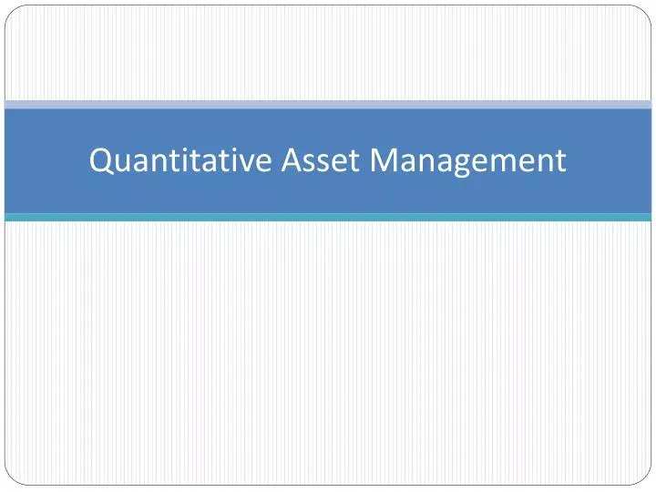

Quantitative Asset Management, often synonymous with Algo Trading, represents a growing segment of financial trading that leverages mathematical models and algorithms to make data-driven trading decisions. This approach blends cutting-edge technology with established financial theories, aiming to optimize trading outcomes. By systematically analyzing vast amounts of data, quantitative strategies seek to identify patterns and inefficiencies in the market, offering an alternative to traditional investment methods that primarily rely on discretionary judgments.

As the financial landscape evolves, understanding the role of quantitative methods in asset management becomes increasingly crucial for modern traders. These strategies provide a framework for maximizing portfolio returns while effectively managing risks. The quantitative approach encompasses various components, including data analysis, risk management, and algorithmic execution, which work collectively to enhance decision-making processes.



This article explores the core components, historical evolution, essential tools, and practical strategies involved in quantitative asset management. In examining these elements, readers will gain insights into quantitative trading's benefits and constraints, thereby equipping them to navigate today's fast-paced financial markets more effectively. From the evolution of quantitative trading models to building robust strategies and recognizing their limitations, the comprehensive exploration encourages a deeper understanding of this dynamic field.

By the conclusion of this article, readers will be better prepared for the challenges and opportunities that quantitative trading presents, armed with a clearer picture of the sophisticated strategies and advanced tools that define modern asset management.

## Table of Contents

## What is Quantitative Asset Management?

Quantitative Asset Management employs advanced computational models to systematically manage financial assets, distinguishing itself from traditional asset management by heavily relying on data analysis and algorithmic strategies. These methodologies identify market inefficiencies and exploit them through precise execution strategies.

At the core of quantitative asset management are several integral components: data analysis, mathematical modeling, risk management systems, and sophisticated trading infrastructure. These elements synergistically function to develop models capable of predicting market movements and executing trades with high precision and speed. 

Data analysis serves as the foundation, providing quantitative models with the crucial market insights required for accurate forecasting and strategic execution. Such analysis often involves collecting and processing large datasets—a task efficiently handled by programming languages such as Python, which boasts robust libraries for data manipulation and statistical analysis, like NumPy and Pandas.

Mathematical models are central to [quantitative trading](/wiki/quantitative-trading), converting data analysis into actionable trading strategies. These models include statistical methodologies and data-driven predictive algorithms that identify potential market opportunities. For instance, a simple moving average, used in [momentum](/wiki/momentum) trading, can be expressed as:

$$
\text{SMA}_t = \frac{1}{n} \sum_{i=0}^{n-1} P_{t-i}
$$

where $\text{SMA}_t$ is the simple moving average at time $t$, $n$ is the number of periods considered, and $P_{t-i}$ represents the price at each period.

Risk management systems ensure that strategies adhere to predefined risk parameters. These systems use metrics like Value at Risk (VaR) and conditional VaR to measure and monitor risk exposure, thus safeguarding the trading portfolio.

Advanced trading infrastructure is vital for executing trades with minimal latency, particularly in high-frequency trading ([HFT](/wiki/high-frequency-trading-strategies)), which requires the capability to make thousands of trades per second. This infrastructure encompasses high-speed data feeds, low-latency networking, and powerful computational services.

Quantitative asset management encompasses various models, each employing different methodologies depending on the trading objective. Statistical [arbitrage](/wiki/arbitrage) involves exploiting price differentials across related markets, while momentum trading capitalizes on the continuance of existing market trends. Meanwhile, high-frequency trading utilizes sophisticated algorithms and rapid execution to profit from minor price discrepancies over short timescales.

By employing these quantitative techniques, traders can achieve execution devoid of emotional biases, reacting swiftly and consistently to market movements while leveraging systematic strategies to optimize their financial outcomes.

## The Evolution of Quantitative Trading

Quantitative trading's evolution traces its origins to the 1970s, a decade marked by the gradual integration of computing power into financial markets. Initial quantitative methods focused on basic statistical analyses, enabled by the transition from manual to electronic order [books](/wiki/algo-trading-books). These early techniques prioritized straightforward calculations such as arbitrage opportunities arising from price discrepancies between different markets or instruments.

The strategic landscape of quantitative trading evolved significantly with technological advancements. The introduction and subsequent ubiquity of high-frequency trading (HFT) transformed trading into a predominantly algorithmic endeavor. High-frequency traders leverage substantial computational power to execute thousands of trades in milliseconds, constantly seeking market inefficiencies. This practice relies on sophisticated algorithms designed to respond to fleeting market signals faster than any human trader could manage.

At the heart of this transformation is the role of [machine learning](/wiki/machine-learning) and cloud computing. Machine learning algorithms assess vast quantities of historical and real-time data to furnish predictive models capable of identifying patterns and opportunities. These models utilize techniques such as supervised learning, unsupervised learning, and [reinforcement learning](/wiki/reinforcement-learning) to dynamically adapt and refine trading strategies over time. Meanwhile, cloud computing offers scalable computational resources, mitigating the need for significant on-premises hardware investments and facilitating real-time data processing and storage.

Furthermore, developments in [backtesting](/wiki/backtesting) environments augment the robustness of quantitative strategies. Backtesting enables traders to simulate a trading strategy using historical data, providing insight into potential performance before deployment in live markets. This process often employs powerful programming languages like Python, which offers libraries such as NumPy and Pandas for efficient data manipulation and analysis. 

For instance, a simple Python snippet for backtesting a moving average crossover strategy might resemble the following:

```python
import pandas as pd

# Load historical price data
data = pd.read_csv('historical_prices.csv')

# Calculate moving averages
data['SMA_50'] = data['Close'].rolling(window=50).mean()
data['SMA_200'] = data['Close'].rolling(window=200).mean()

# Generate trading signals
data['Signal'] = 0
data['Signal'][50:] = np.where(data['SMA_50'][50:] > data['SMA_200'][50:], 1, -1)

# Calculate strategy returns
data['Returns'] = data['Signal'].shift(1) * data['Close'].pct_change()

# Backtest strategy performance
cumulative_returns = (1 + data['Returns']).cumprod()
print(f"Cumulative Returns: {cumulative_returns.iloc[-1]}")
```

The evolution and refinement of quantitative trading methodologies underscore the increasing velocity and intricacy with which traders operate. The rapid execution of trades across various asset classes ensures prompt adaptation to market fluctuations, reshaping the global financial market architecture. Through continued innovation and technological integration, quantitative trading remains a pivotal force, driving efficiency and complexity in asset management and trading.

## Essential Tools for Quantitative Asset Management

Success in quantitative asset management relies heavily on the utilization of appropriate tools that encompass programming languages, data analysis platforms, and trading software. Python emerges as a preferred programming language given its extensive ecosystem of libraries such as NumPy and Pandas, which provide strong support for data processing and statistical analysis. These libraries enable traders to handle large datasets efficiently and perform complex calculations with ease.

NumPy provides functionalities for numerical computing, including advanced array handling and manipulation, which are essential for matrix operations commonly used in quantitative finance. Pandas, on the other hand, offers data structures and tools for effective data manipulation and time-series analysis. Its capabilities for data alignment, aggregation, and cleaning facilitate rigorous analysis necessary for developing robust trading algorithms.

Essential to the success of quantitative asset management is access to comprehensive market data and analytics. Bloomberg Terminal and Reuters Eikon stand out as pivotal data platforms. They provide extensive financial data, news, and analytics, enabling users to gain a deeper understanding of market movements and make informed trading decisions. These platforms support access to real-time and historical data, which is crucial for backtesting and strategy development.

Moreover, having a dependable trading infrastructure is paramount for supporting algorithm deployment and managing trade executions efficiently. This infrastructure includes reliable connectivity to various financial exchanges and systems that ensure low latency and high throughput in trade execution. High-frequency trading, in particular, demands a robust technological setup that can handle thousands of transactions per second.

In Python, deploying algorithms typically involves interfacing with application programming interfaces (APIs) of brokers or exchanges. Here's a simplified example of how one might execute a basic trading strategy using a Python trading library:

```python
import numpy as np
import pandas as pd

# Simulated price data
price_data = pd.Series([100, 102, 101, 105, 108])

# Calculate returns
returns = price_data.pct_change().dropna()

# Simple moving average strategy
short_window = 2
long_window = 3

short_ma = price_data.rolling(window=short_window, min_periods=1).mean()
long_ma = price_data.rolling(window=long_window, min_periods=1).mean()

signals = pd.DataFrame(index=price_data.index)
signals['signal'] = 0
signals['signal'][short_ma > long_ma] = 1
signals['positions'] = signals['signal'].diff()

# Display signals
print(signals)
```

This code snippet demonstrates a basic moving average crossover strategy where buy (1) and sell (0) signals are generated based on short-term and long-term moving average comparisons.

In conclusion, the right combination of advanced programming tools, comprehensive market data access, and a robust trading infrastructure is indispensable for success in quantitative asset management. These tools not only facilitate the development and execution of sophisticated algorithms but also ensure efficient trade operations in today’s highly dynamic financial markets.

## Building a Quantitative Trading Strategy

Creating a successful quantitative trading strategy requires a systematic process that extends beyond mere data analysis. It involves backtesting, optimization, and validation to ensure the strategy's reliability in real market conditions. A comprehensive strategy can be broken down into several critical components: transforming market insights into actionable rules, incorporating data cleaning, transaction cost modeling, risk assessment, and using key performance metrics.

### Transforming Market Insights into Actionable Trading Rules

The first step in building a quantitative trading strategy is to define the trading rules based on market insights. This process involves identifying patterns or anomalies in the market data that can potentially lead to profitable trades. Strategies can be derived from historical price patterns, statistical anomalies, or macroeconomic indicators. The trading rules should be clear, concise, and capable of being quantified and coded into an algorithm.

```python
# Example of a simple moving average crossover strategy in Python
def moving_average_crossover_strategy(prices, short_window, long_window):
    signals = pd.DataFrame(index=prices.index)
    signals['price'] = prices['Close']
    signals['short_mavg'] = prices['Close'].rolling(window=short_window, min_periods=1).mean()
    signals['long_mavg'] = prices['Close'].rolling(window=long_window, min_periods=1).mean()
    signals['signal'] = 0.0
    signals['signal'][short_window:] = np.where(signals['short_mavg'][short_window:] > signals['long_mavg'][short_window:], 1.0, 0.0)
    signals['positions'] = signals['signal'].diff()
    return signals
```

### Data Cleaning and Pre-Processing

Before implementing any strategy, it is crucial to clean and preprocess the raw market data. This involves handling missing values, removing outliers, and adjusting for splits or dividends to ensure data quality and integrity. Accurate data processing helps in making more precise predictions and reducing the risk of strategy failure.

### Transaction Cost Modeling

Transaction costs can significantly impact the net profitability of a trading strategy. These costs include broker fees, bid-ask spreads, and slippage. It is important to model transaction costs accurately when evaluating a strategy's performance. Including realistic transaction cost estimates in backtesting ensures that the strategy is not only theoretically profitable but also practical in real-world scenarios.

### Risk Assessment

Assessing the risk is integral to strategy development. This involves measuring potential losses and determining how much of the portfolio is at risk with each trade. Techniques like Value at Risk (VaR), Stress Testing, and scenario analysis can be employed to evaluate the risk associated with the strategy. 

### Key Performance Metrics

Performance metrics are essential for evaluating and optimizing trading strategies. The Sharpe Ratio is a commonly used metric that indicates the risk-adjusted return of a strategy. It is calculated as:

$$
\text{Sharpe Ratio} = \frac{\text{Average Portfolio Return} - \text{Risk-Free Rate}}{\text{Standard Deviation of Portfolio Return}}
$$

Maximum Drawdown measures the largest peak-to-trough decline, representing potential losses in a worst-case scenario. These metrics help quantify the risk-reward profile of a strategy and guide optimizations.

### Walk-Forward Analysis and Parameter Optimization

To enhance strategy robustness, walk-forward analysis and parameter optimization are employed. Walk-forward analysis involves dividing the data into multiple in-sample and out-of-sample periods to validate the strategy's performance across different market conditions.

Parameter optimization involves fine-tuning the strategy parameters to maximize performance metrics while minimizing overfitting. Machine learning techniques like genetic algorithms or grid search can be used for this purpose.

In conclusion, building a quantitative trading strategy is a multi-faceted process that combines market insight transformation, rigorous data handling, cost modeling, comprehensive risk assessment, and performance evaluation. By integrating these components, traders can devise strategies that are effective and resilient in a dynamic marketplace.

## Common Quantitative Trading Models

Quantitative trading models are vital to the systematic strategies used in asset management, providing a structured approach to identifying and executing trades. These models rely on mathematical algorithms to analyze historical price data and discern patterns, allowing traders to detect and capitalize on market opportunities.

**Mean Reversion Strategies**: This model is built on the premise that asset prices fluctuate around a mean or average value over time. For instance, if a stock price diverges significantly from its historical average, the model predicts a reversion to the mean. This can be expressed mathematically as:

$$
\text{Expected Price Change} = \alpha (\text{Mean Price} - \text{Current Price})
$$

where $\alpha$ is a coefficient representing the speed of price adjustment. Traders implementing mean reversion strategies typically use techniques like Bollinger Bands or moving average convergence to identify potential trades.

**Momentum Trading**: Contrary to mean reversion, momentum trading assumes that trends will continue in the same direction. This model seeks to capitalize on the existing momentum of price movements by buying assets that are increasing in value and selling those decreasing. The strategy relies on indicators such as relative strength index (RSI) and moving average convergence/divergence (MACD) to identify trends and potential reversal points. Momentum can be quantified using:

$$
\text{Momentum} = (\text{Price}_t - \text{Price}_{t-n})
$$

where $n$ is the period over which the momentum is measured. Python can facilitate backtesting of momentum strategies to refine risk and return characteristics.

```python
import pandas as pd

def calculate_momentum(data, n):
    return data['Close'].diff(n)

# Example usage
data['Momentum'] = calculate_momentum(data, 10)
```

**High-Frequency Trading (HFT)**: This model exploits small price discrepancies that occur over extremely short time frames, often milliseconds or microseconds. HFT is heavily reliant on sophisticated algorithms and high-speed data feeds to execute trades at unprecedented speeds. The volume and velocity of trades necessitate substantial computational power and infrastructure, including co-located servers for minimizing latency. Metrics such as fill rates and trading volume are paramount for evaluating HFT strategies.

Each model has unique applications and methodologies, offering advantages and limitations. For instance, mean reversion works well in stable markets, while momentum strategies thrive in trending markets. High-frequency trading requires significant investment in technology and infrastructure but can provide consistency in execution that other models may lack. Understanding these models' methodologies and metrics allows traders to choose strategies aligning with their market conditions and trading styles, enhancing their ability to implement effective quantitative asset management.

## Advantages and Limitations

Quantitative trading offers several distinct advantages, particularly its ability to execute trades without emotional bias, a prevalent issue in traditional trading. By relying on algorithms and predefined models, traders can avoid impulsive decisions that may arise from market [volatility](/wiki/volatility-trading-strategies) or personal sentiments. Furthermore, quantitative trading systems can process vast amounts of data much faster than human counterparts, enabling traders to capitalize on fleeting market opportunities. This rapid data processing also allows for consistent performance, as algorithms can systematically apply trading strategies across various market conditions.

However, these advantages are counterbalanced by several challenges inherent to quantitative trading. The technical complexity of developing and maintaining sophisticated trading models requires significant expertise and resources. High implementation costs can arise from the need for state-of-the-art computational infrastructure and the acquisition of high-quality data. Additionally, quantitative models may have limitations during unpredictable market events, such as flash crashes or unexpected economic announcements. These models are often built on historical data, which might not fully capture future anomalies or rare events, leading to potential inaccuracies in predictions.

The overall effectiveness and performance of quantitative trading strategies are thus influenced by these pros and cons. While the automation and precision of quantitative models can enhance trading efficiency, the inherent risks of model overfitting and data quality issues must be managed carefully. To mitigate these limitations, continuous learning and system optimization are vital. Traders should remain adaptable, regularly updating their models to reflect changing market conditions and emerging data patterns. This might involve incorporating machine learning techniques to improve predictive accuracy or employing robust backtesting to validate model assumptions.

Moreover, regular performance evaluations using key metrics, such as the Sharpe ratio or Maximum Drawdown, can help assess the effectiveness of trading strategies and guide necessary adjustments. By embracing a cycle of constant refinement and adapting to the evolving financial landscape, traders can enhance the sustainability and success of their quantitative strategies. Ultimately, while quantitative trading presents notable advantages, its limitations necessitate diligent oversight and ongoing enhancement to realize its full potential.

## Conclusion

Quantitative asset management is an ever-evolving domain, providing extensive opportunities for traders adept at leveraging data and mathematical models. The advancement of this domain hinges on the effective integration of technological tools and sophisticated strategies, which can overcome existing challenges. As machine learning and [artificial intelligence](/wiki/ai-artificial-intelligence) continue to progress, they are poised to further transform the landscape of quantitative trading, offering more refined and efficient methods for market analysis and prediction.

Both new and experienced traders should remain vigilant in staying updated with industry advancements and continuously refining their strategies. Doing so will enable them to benefit from the dynamic changes and emerging opportunities within financial markets. Maintaining adaptability in strategy development is crucial, as it allows traders to effectively deal with the complexities and uncertainties inherent in market behavior.

Ultimately, quantitative trading represents a frontier replete with potential. Traders who can navigate this complex environment stand to gain significantly from their ability to harness data and model-driven insights. To capitalize on the diversity and depth of quantitative methods, traders should prioritize continuous learning and innovation, ensuring they are well-equipped to tackle the intricate challenges and rewards presented by modern financial landscapes.

## References & Further Reading

[1]: ["Advances in Financial Machine Learning"](https://www.amazon.com/Advances-Financial-Machine-Learning-Marcos/dp/1119482089) by Marcos Lopez de Prado

[2]: ["Machine Learning for Algorithmic Trading"](https://github.com/stefan-jansen/machine-learning-for-trading) by Stefan Jansen

[3]: ["Quantitative Trading: How to Build Your Own Algorithmic Trading Business"](https://www.amazon.com/Quantitative-Trading-Build-Algorithmic-Business/dp/1119800064) by Ernest P. Chan

[4]: Pardo, R. (2011). ["The Evaluation and Optimization of Trading Strategies"](https://onlinelibrary.wiley.com/doi/book/10.1002/9781119196969) John Wiley & Sons.

[5]: Ahn, H., & Gao, B. (2004). ["High frequency trading: New realities for traders, markets, and regulators."](https://books.google.com/books/about/High_frequency_Trading.html?id=pli5oAEACAAJ) CFA Digest, 35(4). 

[6]: Cartea, Á., Jaimungal, S., & Penalva, J. (2015). ["Algorithmic and High-Frequency Trading"](https://assets.cambridge.org/97811070/91146/frontmatter/9781107091146_frontmatter.pdf) Oxford University Press.

[7]: Aronson, D. R. (2006). ["Evidence-Based Technical Analysis: Applying the Scientific Method and Statistical Inference to Trading Signals"](https://www.amazon.com/Evidence-Based-Technical-Analysis-Scientific-Statistical/dp/0470008741) Wiley Trading Series.