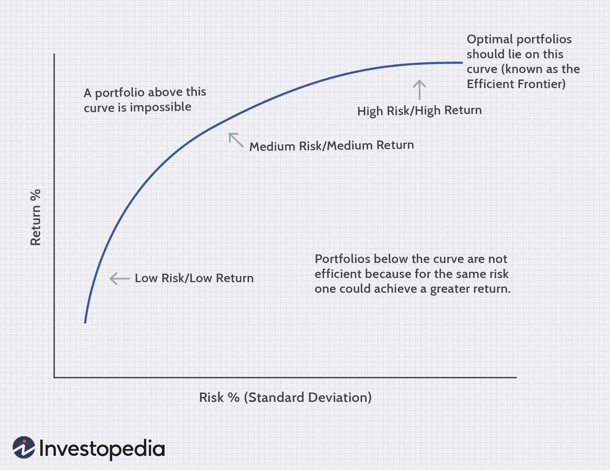

## Table of Contents

## What is quantitative behavioral finance?

Quantitative behavioral finance is a field that combines the study of how people make financial decisions with the use of numbers and data. It looks at why people sometimes make choices that don't seem to make sense, like buying stocks based on feelings rather than facts. By using math and statistics, experts in this field try to understand and predict these behaviors better.

In this area, researchers collect a lot of data about how people invest, spend, and save money. They use this data to find patterns and create models that can help explain why people act the way they do with money. For example, they might find that people are more likely to sell a stock when its price drops, even if it might be a good long-term investment. By understanding these patterns, financial advisors and investors can make better decisions and help people manage their money more wisely.

## How does quantitative behavioral finance differ from traditional finance?

Quantitative behavioral finance and traditional finance look at money and investments in different ways. Traditional finance is all about numbers and logic. It assumes that people always make smart choices based on all the information they have. In traditional finance, the focus is on things like stock prices, interest rates, and economic reports. The goal is to use this information to make the best investment decisions possible.

On the other hand, quantitative behavioral finance adds a human touch to the numbers. It recognizes that people don't always make perfect choices. Sometimes, emotions and personal biases can affect how people handle their money. By using data and statistics, quantitative behavioral finance tries to understand these human behaviors. It looks at patterns in how people invest, spend, and save, and uses this information to predict and improve financial decisions.

In short, while traditional finance sticks to the idea that people are always rational, quantitative behavioral finance knows that real life is messier. It uses numbers to explore and explain the emotional and psychological sides of money management, helping to create better strategies for dealing with the ups and downs of financial markets.

## What are the key principles of behavioral finance?

Behavioral finance is all about understanding how people's feelings and thoughts affect their money choices. One key idea is that people aren't always rational when it comes to money. Instead of making decisions based only on facts and numbers, people often let their emotions and personal biases guide them. For example, someone might hold onto a losing stock because they're hoping it will bounce back, even if the smart move would be to sell it.

Another important principle is that people often make choices based on how they see gains and losses. This is called prospect theory. People feel the pain of losing money much more than the joy of gaining the same amount. So, they might take big risks to avoid a loss, even if it's not the best decision. Behavioral finance also looks at how people can be influenced by what others are doing, a concept known as herd behavior. If everyone is buying a certain stock, people might jump in too, even if they don't fully understand why.

These principles show that understanding human behavior is just as important as understanding numbers when it comes to managing money. By recognizing these patterns, financial advisors and investors can help people make better choices and avoid common pitfalls.

## How can quantitative methods be applied to study behavioral finance?

Quantitative methods help study behavioral finance by using numbers and data to understand how people make money choices. Researchers collect a lot of information about how people invest, spend, and save. They use this data to find patterns and create models that show why people act the way they do with money. For example, they might look at how often people sell stocks when prices drop and use statistics to see if this is a common behavior. By doing this, they can predict how people might react in different financial situations and help them make better decisions.

These methods also help in testing theories about human behavior in finance. For instance, researchers can use surveys and experiments to gather data on how people feel about gains and losses. They then use math to analyze this data and see if it matches ideas like prospect theory, which says people feel losses more than gains. By using numbers, researchers can prove or disprove these theories and learn more about what drives financial decisions. This helps financial advisors give better advice and helps investors understand their own behaviors better.

## What are some common biases and heuristics studied in quantitative behavioral finance?

In quantitative behavioral finance, researchers look at many common biases and shortcuts, called heuristics, that people use when making money decisions. One big bias is overconfidence, where people think they know more than they really do. This can lead them to take big risks with their money, thinking they can predict the market better than others. Another common bias is loss aversion, where people feel the pain of losing money much more than the joy of gaining it. This can make them hold onto losing investments too long, hoping they'll recover, instead of cutting their losses.

Heuristics, or mental shortcuts, also play a big role. One example is the availability heuristic, where people make decisions based on the information that's easiest to remember. If someone hears a lot about a stock doing well, they might think it's a good investment, even if it's not. Another heuristic is anchoring, where people rely too much on the first piece of information they get. For example, if a stock starts at a high price, people might think it's worth more than it really is, even if the price drops later. By studying these biases and heuristics with numbers and data, researchers can help people understand and overcome these common mistakes in their financial decisions.

## Can you explain the role of data analysis in quantitative behavioral finance?

Data analysis is super important in quantitative behavioral finance because it helps us understand how people make money choices. Researchers collect a lot of information about how people invest, spend, and save. They use this data to find patterns and see if people are making decisions based on feelings or facts. For example, they might look at how often people sell stocks when prices drop and use numbers to see if this is a common behavior. By doing this, they can predict how people might react in different financial situations and help them make better choices.

Using data analysis, researchers can also test ideas about human behavior in finance. They might use surveys and experiments to gather information on how people feel about gains and losses. Then, they use math to see if this matches theories like prospect theory, which says people feel losses more than gains. By looking at the numbers, researchers can prove or disprove these theories and learn more about what drives financial decisions. This helps financial advisors give better advice and helps investors understand their own behaviors better.

## What are the main models used in quantitative behavioral finance?

In quantitative behavioral finance, researchers use different models to understand how people make money choices. One important model is the Prospect Theory, which says that people feel the pain of losing money much more than the joy of gaining it. This model helps explain why people might hold onto losing investments too long, hoping they'll recover, instead of selling them. Another model is the Behavioral Portfolio Theory, which looks at how people build their investment portfolios based on their feelings and goals, not just on numbers. This model shows that people might take big risks to avoid losses or to reach certain goals, even if it's not the best financial decision.

Another key model is the Mental Accounting model, which explains how people separate their money into different "accounts" in their minds. For example, someone might treat money from a bonus differently from their regular salary, even though it's all the same money. This can lead to different spending and saving behaviors. The Heuristics and Biases model is also important, as it looks at the shortcuts and mistakes people make when making financial decisions. For example, people might rely too much on the first piece of information they get (anchoring) or make choices based on what's easiest to remember (availability heuristic). By using these models, researchers can better understand and predict how people will act with their money.

## How do quantitative behavioral finance models incorporate psychological factors?

Quantitative behavioral finance models use numbers and data to understand how people's feelings and thoughts affect their money choices. These models look at things like how people feel about gains and losses, which is explained by the Prospect Theory. This theory says that people feel the pain of losing money much more than the joy of gaining it. So, they might hold onto losing investments too long, hoping they'll recover, instead of selling them. Another model, the Behavioral Portfolio Theory, shows how people build their investment portfolios based on their feelings and goals, not just on numbers. This means people might take big risks to avoid losses or to reach certain goals, even if it's not the best financial decision.

Another important model is the Mental Accounting model, which explains how people separate their money into different "accounts" in their minds. For example, someone might treat money from a bonus differently from their regular salary, even though it's all the same money. This can lead to different spending and saving behaviors. The Heuristics and Biases model also plays a big role, as it looks at the shortcuts and mistakes people make when making financial decisions. For example, people might rely too much on the first piece of information they get (anchoring) or make choices based on what's easiest to remember (availability heuristic). By using these models, researchers can better understand and predict how people will act with their money, taking into account the psychological factors that drive their decisions.

## What are the practical applications of quantitative behavioral finance in investment strategies?

Quantitative behavioral finance helps investors make better choices by understanding how feelings and thoughts affect money decisions. For example, knowing about loss aversion can help investors not hold onto losing stocks too long. They might set rules to sell a stock if it drops below a certain price, instead of hoping it will go back up. This can help them avoid big losses. Also, understanding overconfidence can stop investors from taking too many risks. They might use data to check their decisions and not just rely on their gut feelings. This way, they can make more balanced and smart investment choices.

Another practical use is in building investment portfolios. Behavioral Portfolio Theory shows that people often mix safe and risky investments based on their feelings and goals. By knowing this, financial advisors can help clients create portfolios that match their comfort levels and what they want to achieve. For example, if someone is scared of losing money, the advisor might suggest more safe investments. If someone wants to reach a big goal, like buying a house, they might suggest a mix of safe and risky investments. This helps people feel more in control and confident about their money choices.

## How can quantitative behavioral finance help in predicting market trends?

Quantitative behavioral finance can help predict market trends by looking at how people's feelings and actions affect the market. Researchers use numbers and data to find patterns in how people invest, spend, and save. For example, if a lot of people are selling stocks because they're scared of losing money, this might show that the market could go down soon. By understanding these patterns, experts can guess what might happen next in the market. They can see if people are acting out of fear, hope, or overconfidence, and use this information to make better predictions.

Using data analysis, researchers can also test theories about how people behave with money. For instance, they might look at how people react to gains and losses and use this to predict how the market might move. If people are more likely to sell when prices drop a little, this could signal a bigger drop coming. By combining these insights with other financial data, like stock prices and economic reports, experts can get a fuller picture of what might happen in the market. This helps investors and financial advisors make smarter choices and be ready for what's coming.

## What are the limitations and criticisms of quantitative behavioral finance?

Quantitative behavioral finance has some limits and people have criticized it. One big problem is that it's hard to predict how people will act because feelings and thoughts can change a lot. Even with a lot of data, it's tough to make sure the models are always right. Also, the models might not work the same for everyone because people are different. What works for one person might not work for another. This makes it hard to use these models to make perfect predictions about the market.

Another criticism is that quantitative behavioral finance can be too focused on numbers and might miss important things that can't be measured. For example, big events like a new law or a natural disaster can change how people feel about money, but these things are hard to put into numbers. Some people also think that trying to predict the market using these models can be risky because the market can be unpredictable. Even with all the data and models, there's always a chance that something unexpected will happen.

## What advanced techniques are used in quantitative behavioral finance research?

In quantitative behavioral finance research, one advanced technique is machine learning. This is a way of using computers to find patterns in big sets of data. Researchers can use machine learning to look at how people invest, spend, and save money and find out what makes them do these things. For example, machine learning can help see if people are more likely to buy stocks when they hear good news about a company. By using these patterns, researchers can make better guesses about how people will act in the future and help them make smarter money choices.

Another technique is called neurofinance, which mixes finance with brain science. Researchers use special machines to look at people's brains while they make money decisions. This helps them see which parts of the brain are working when someone is feeling happy or scared about money. By understanding how the brain works, researchers can learn more about why people make certain choices with their money. This can help them create better models to predict how people will act in different financial situations.

## References & Further Reading

[1]: Kahneman, D., & Tversky, A. (1979). ["Prospect Theory: An Analysis of Decision under Risk."](http://web.mit.edu/curhan/www/docs/Articles/15341_Readings/Behavioral_Decision_Theory/Kahneman_Tversky_1979_Prospect_theory.pdf) Econometrica, 47(2), 263-291.

[2]: Shiller, R. J. (2003). ["From Efficient Markets Theory to Behavioral Finance."](https://www.aeaweb.org/articles?id=10.1257/089533003321164967) Journal of Economic Perspectives, 17(1), 83-104.

[3]: Barberis, N., & Thaler, R. (2003). ["A Survey of Behavioral Finance."](https://www.nber.org/papers/w9222) Handbook of the Economics of Finance, 1053-1128.

[4]: "Advances in Financial Machine Learning" by Marcos Lopez de Prado

[5]: "Quantitative Trading: How to Build Your Own Algorithmic Trading Business" by Ernest P. Chan

[6]: "Algorithmic Trading: Winning Strategies and Their Rationale" by Ernie Chan

[7]: "Market Mind Games: A Radical Psychology of Investing, Trading and Risk" by Denise Shull

[8]: Raschke, L. B., & Connors, L. R. (1996). "Street Smarts: High Probability Short-Term Trading Strategies."

[9]: Loch, F., & Rodinger, M. (2011). ["Algorithmic Trading: Consideration of the Markets and Participants."](https://onlinelibrary.wiley.com/doi/full/10.1111/j.1540-6261.2010.01624.x) Journal of Trading, 6, 51-66. 

[10]: "Evidence-Based Technical Analysis: Applying the Scientific Method and Statistical Inference to Trading Signals" by David Aronson