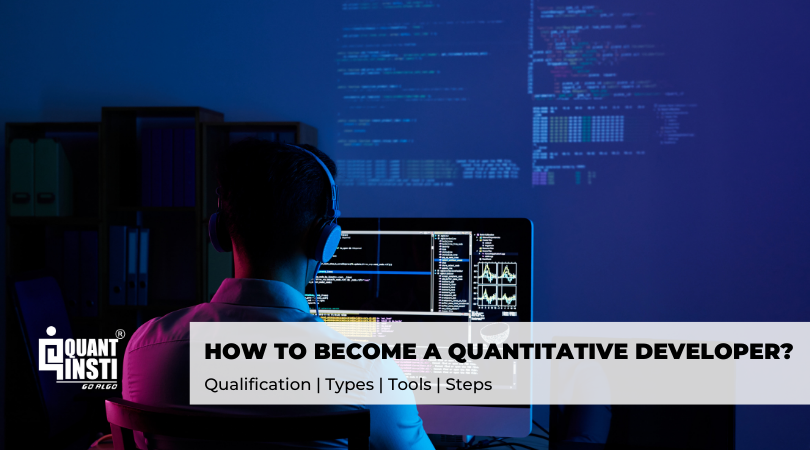

In today's fast-paced financial world, quant developers are instrumental in driving the evolution of algorithmic trading. These professionals leverage their robust blend of expertise in finance, mathematics, and computer science to create sophisticated trading algorithms that can process vast amounts of financial data at remarkable speeds. As the financial industry increasingly relies on automation and data-driven decision-making, the role of the quant developer has become pivotal, enabling institutions to maintain a competitive edge in the marketplace.

This article provides an in-depth exploration of the multifaceted world of quantitative development in trading, offering insights into the essential skills, varied responsibilities, and potential career paths available to those in the field. By examining the role of quant developers, we aim to offer a clear understanding of how they contribute to the dynamism of modern trading environments. Additionally, this guide seeks to equip aspiring developers with the knowledge needed to thrive, focusing on the intersection of finance and technology that defines this occupation.



Throughout the article, we will address key areas, from outlining the nuances of a quant developer’s responsibilities to identifying the technical proficiencies necessary to excel. Moreover, we will explore the diverse career trajectories within the field, providing guidance for those seeking to embark on or advance their journey as a quant developer. Whether you are a burgeoning developer or simply intrigued by the convergence of financial markets and technological innovation, this article promises a comprehensive guide to quant development in algorithmic trading.

## Table of Contents

## Who is a Quant Developer?

A quant developer is a professional tasked with the creation, implementation, and optimization of algorithmic trading strategies. These experts possess a unique amalgamation of skills in finance, mathematics, and computer science, enabling them to develop quantitative solutions that facilitate trading and manage risk effectively. The environment in which quant developers typically operate includes investment banks, hedge funds, and brokerage firms. These settings provide the necessary infrastructure for the intricate tasks that quant developers perform.

The role of a quant developer is inherently collaborative, requiring frequent interaction with traders and analysts. This collaboration is crucial, as it involves translating complex mathematical models and theoretical constructs into efficient, executable code that can be employed in real-world trading scenarios. For instance, a quant developer may work on implementing a stochastic model that predicts stock price movements, which requires a deep understanding of both mathematical concepts and their application in financial markets.

Quant developers must be adept at using multiple programming languages, with Python, C++, and Java being among the most favored. Python, in particular, is preferred due to its robust libraries and frameworks that support complex data analysis and machine learning tasks, such as NumPy for numerical computations and Pandas for data manipulation. Besides programming skills, quant developers leverage mathematical models extensively, including techniques from calculus, linear algebra, and probability theory, to formulate and validate trading strategies.

A typical task might involve writing Python code to assess a potential trading strategy's risk profile based on Monte Carlo simulations:

```python
import numpy as np

def monte_carlo_simulation(prices, num_simulations):
    returns = np.log(prices[1:] / prices[:-1])
    mean_return = np.mean(returns)
    sd_return = np.std(returns)

    simulations = np.zeros(num_simulations)
    for i in range(num_simulations):
        simulated_prices = []
        for j in range(len(prices)):
            simulated_price = prices[-1] * np.exp((mean_return - 0.5 * sd_return**2) + sd_return * np.random.normal())
            simulated_prices.append(simulated_price)
        simulations[i] = simulated_prices[-1]

    return simulations

# Example usage
prices = np.array([100, 101, 102, 100, 99])
simulation_results = monte_carlo_simulation(prices, 1000)
```

In sum, quant developers are integral to the success of [algorithmic trading](/wiki/algorithmic-trading) ventures. Their expertise in bridging complex quantitative theories with practical trading applications ensures the development of robust and optimized strategies that can withstand the dynamic nature of financial markets.

## Key Responsibilities of a Quant Developer

Quant developers play a critical role in the algorithmic trading landscape. Their primary responsibility is to develop and maintain quantitative models and strategies for trading. These strategies are based on complex mathematical models that analyze market data to predict trends, optimize trade execution, and manage risk effectively. Such strategies might involve statistical [arbitrage](/wiki/arbitrage), [market making](/wiki/market-making), or algorithmic execution tactics, each requiring precision and adaptability to changing market conditions.

A key aspect of a [quant developer](/wiki/becoming-a-quant-developer)'s role involves extensive work with data. This process begins with data extraction from various sources, ensuring that the data is both relevant and high-quality. Following extraction, data cleaning is necessary to handle missing or erroneous entries that could skew results. Analysis of this data often involves statistical methods and [machine learning](/wiki/machine-learning) techniques to identify patterns or anomalies. Visualization tools are then used to communicate insights effectively to both technical and non-technical stakeholders.

Quant developers must ensure robust and scalable software development practices for trading systems. This involves writing efficient and clean code that can handle the high-frequency data and transactions typical in algorithmic trading environments. Scalability is crucial; as trading volumes increase, systems must perform consistently without lags or failures. This requires rigorous testing and the use of version control systems to manage code changes and deployments.

Collaboration is another significant responsibility. Quant developers work closely with stakeholders, including traders, analysts, and risk managers, to translate financial theories and strategies into implementable code. This requires effective communication skills and a solid understanding of both financial concepts and technical constraints, allowing developers to bridge the gap between theory and practice.

Finally, quant developers must keep abreast of the latest advancements in quantitative finance and technology. The rapid pace of innovation in this field means continuous learning is essential. This could involve exploring new machine learning algorithms, leveraging novel data sources, or adopting cutting-edge data processing technologies. Staying informed ensures that quant developers can refine and enhance trading strategies, maintaining their firm's competitive edge in the market.

## Types of Quant Developers

Quant developers can be divided into three primary categories, each serving distinct functions within the financial sector: front office developers, middle office developers, and back office developers. Each role is integral to the organization's success, requiring specific expertise and competencies while sharing a common foundation in quantitative finance.

**Front Office Developers**

Front office developers are primarily responsible for crafting and refining trading strategies that require real-time analytics. They directly interact with clients and traders, designing systems that provide immediate market insights necessary for decision-making. These professionals must have a keen understanding of trading mechanisms and actively engage in the development of sophisticated algorithms to exploit market opportunities. Their work often involves implementing high-frequency trading systems that demand low-latency execution and real-time data processing. Consequently, their role necessitates proficiency in programming languages such as C++ or Java, which are optimized for performance-critical applications.

**Middle Office Developers**

Middle office developers focus on creating and maintaining the infrastructure that supports trading activities. They ensure the operational efficiency and risk management procedures are robust enough to handle the complexities of trading operations. Their responsibilities may include building systems for trade capture, managing data flow between the front and back office, and developing tools for portfolio analysis. Middle office developers facilitate the integration of various financial models into existing systems, requiring strong skills in database management and an aptitude for working with APIs and other integration tools. They also play a crucial role in ensuring the technological consistency within the trading framework by enhancing the functionality of trading platforms.

**Back Office Developers**

Back office developers are tasked with ensuring regulatory compliance, model validation, and the management of risk. Their work supports the transactional and logistical aspects of trading, focusing on post-trade activities such as clearing and settlement. This role often involves developing systems that handle the vast amounts of data required for regulatory reporting and compliance audits. Back office developers need to be proficient in data management and possess a thorough understanding of financial regulations and compliance standards. They commonly employ scripting languages like Python to automate data processing tasks and ensure accuracy in reporting.

Each type of quant developer, regardless of their specific focus, relies on a robust foundation in quantitative finance, encompassing a deep understanding of financial markets, mathematical modeling, and statistical analysis. Cross-functional collaboration and adaptability are essential, enabling these professionals to navigate the complexities and evolving nature of the financial industry.

## Skills Required for a Quant Developer

Quantitative development in algorithmic trading demands a diverse skill set that integrates technical, mathematical, and soft skills. Foremost among these is strong programming expertise. Proficiency in languages such as Python, C++, and Java is essential due to their widespread use in the financial industry for building trading systems and algorithms. Python, in particular, is favored for its readability and extensive library ecosystem, including NumPy, Pandas, and SciKit-Learn, which are instrumental for numerical computations and data manipulation.

A foundational understanding of mathematics and [statistics](/wiki/bayesian-statistics) is crucial. This includes knowledge of calculus and probability theory, which underpin many quantitative models and risk assessments. For instance, calculus is employed in the calculation of derivatives and risk metrics, while probability theory is essential for assessing event likelihoods and modeling uncertainties. The mathematical rigor enables quant developers to construct and refine advanced models that are core to algorithmic trading strategies.

Experience with machine learning algorithms is increasingly important as the industry shifts toward data-driven decision-making. Quant developers often implement models that process and learn from large datasets to predict market trends and optimize trading strategies. For example, regression analysis or clustering might be used to identify correlations or classify market conditions.

Effective communication skills are vital for collaborating with analysts, traders, and other team members. Quant developers must be able to translate complex quantitative concepts into understandable insights and actionable trading strategies. This necessitates clear and concise communication, both verbally and in writing, to ensure alignment among diverse teams.

Finally, continuous learning is a critical component of success in quantitative development. The field is characterized by rapid technological advancements and evolving industry trends, requiring professionals to continuously update their knowledge and skills. This could involve mastering new programming languages, staying informed about regulatory changes, or exploring new analytical methodologies.

In essence, the skill set for a quant developer is both comprehensive and dynamic, encompassing technical acumen, analytical prowess, and effective communication, all underpinned by a commitment to lifelong learning.

## Tools and Technologies

Quant developers employ a diverse set of tools designed for efficient data acquisition, analysis, and visualization, which are pivotal in creating and optimizing algorithmic trading strategies. Among these, Python stands out as a leading language due to its flexibility and the rich ecosystem of libraries available for data science and financial analysis. Notable Python libraries include:

- **NumPy**: This is fundamental for numerical computing in Python. NumPy provides support for large, multi-dimensional arrays and matrices, alongside a collection of mathematical functions to operate on these arrays, making it invaluable for quantitative analysis.

- **Pandas**: Renowned for its data manipulation and analysis capabilities, Pandas excels at handling structured data and is essential for tasks involving time series analysis, a common requirement in algorithmic trading.

- **SciKit-Learn**: This library is vital for applying machine learning algorithms. It offers simple and efficient tools for data mining and data analysis and is built on NumPy, SciPy, and Matplotlib.

For accessing real-time financial data, quant developers often rely on industry-standard platforms such as:

- **Bloomberg**: Known for providing comprehensive and timely financial data, Bloomberg is widely used for its analytics tools and its ability to deliver intraday data, historical prices, and news, which are essential for developing trading algorithms.

- **Reuters (Refinitiv)**: Similar to Bloomberg, Reuters offers extensive market data and analytics. The platform supports decision-making with powerful data feeds and robust analytics.

Furthermore, maintaining robust software and ensuring smooth development workflows are crucial, which is why version control systems, such as Git, are standard in the toolkit of quant developers. Git allows for efficient tracking of changes in the codebase and facilitates collaboration among team members.

Additionally, development frameworks and environments such as Jupyter Notebook serve as invaluable tools for prototyping and sharing code. Jupyter Notebook, in particular, supports interactive development, allowing developers to document their code alongside the visual representation of data through graphs and charts.

Cloud computing platforms, such as Amazon Web Services (AWS) and Microsoft Azure, offer scalable infrastructure for deploying and running trading algorithms. These platforms provide the computational power and flexibility needed to handle large data sets and complex computations that are often involved in trading strategies.

To remain competitive, quant developers must stay informed about the latest advancements in these tools and technologies. The landscape is constantly evolving, with new libraries, platforms, and methodologies emerging regularly for optimizing and fine-tuning trading algorithms. Being adept with the latest tools not only strengthens their technical capability but also enhances the efficiency and effectiveness of their trading systems.

## Career Path and Roadmap

An educational background in mathematics, computer science, or a related field is essential for those aiming to become quant developers. A solid foundation in these areas provides the analytical skills required to understand complex financial models and translate them into functional code. Courses focusing on calculus, linear algebra, probability theory, and computer programming form the bedrock of relevant academic training.

Starting with internships or entry-level positions is crucial for gaining practical experience. These roles offer exposure to real-world financial problems and the opportunity to apply theoretical knowledge in a professional setting. It's common to find such positions in investment banks, hedge funds, or fintech companies, where beginners can learn from experienced professionals and gain insights into the day-to-day operations of quantitative finance.

As experience is gained, typically over 3-5 years, professionals can progress to mid-level roles that allow for specialization in specific quantitative areas. These positions might involve developing proprietary trading algorithms, optimizing existing models, or correlating financial instrument prices with market variables. At this stage, quant developers refine their skills in specialized programming languages and tools frequently used in the industry. For example, utilizing Python for algorithm [backtesting](/wiki/backtesting):

```python
import numpy as np
import pandas as pd

# Simple moving average strategy backtesting
def moving_average_strategy(prices, window):
    signals = pd.DataFrame(index=prices.index)
    signals['signal'] = 0.0

    # Create short moving average
    signals['short_mavg'] = prices.rolling(window=window, min_periods=1, center=False).mean()

    # Generate buy/sell signals
    signals['signal'][window:] = np.where(prices[window:] > signals['short_mavg'][window:], 1.0, 0.0)
    signals['positions'] = signals['signal'].diff()

    return signals
```

For career advancement, obtaining certifications like Chartered Financial Analyst (CFA) or Certificate in Quantitative Finance (CQF) is recommended. Such qualifications enhance a quant developer's understanding of financial instruments, portfolio management, and risk, reinforcing their credibility in the industry.

Aspiring quant developers should also contemplate entrepreneurial ventures such as fintech startups or consulting services. These avenues allow for greater independence, innovation, and potential for higher earnings. By leveraging their technical skills and industry knowledge, professionals can address niche market needs or offer specialized consultancy to financial institutions.

Overall, the career path of a quant developer is marked by continuous learning and adaptation. Engaging in lifelong education through MOOCs, professional workshops, and maintaining active participation in industry forums helps maintain a competitive edge in the ever-evolving landscape of quantitative finance.

## Learning Resources and Conclusion

Books, online courses, and coding platforms offer valuable resources for aspiring quant developers. Books such as "Quantitative Finance for Dummies" by Steve Bell and "Python for Finance" by Yves Hilpisch provide foundational knowledge and practical applications in the field of quantitative finance. Online platforms like Coursera, edX, and Khan Academy offer courses ranging from introductory topics to advanced quantitative strategies, some even in collaboration with prestigious universities. Websites such as QuantStart also provide articles and guides specifically targeted at those looking to break into [quantitative trading](/wiki/quantitative-trading) and development.

Engaging in online communities, such as Stack Exchange, LinkedIn groups, and specialized forums like Wilmott, allows aspiring quants to share knowledge, pose questions, and build professional networks. Networking events and webinars organized by professional associations like the International Association for Quantitative Finance (IAQF) offer opportunities to interact with industry experts and gain insights into emerging trends in algorithmic trading.

Continuous learning and adaptation are critical to maintaining relevance in quantitative development. The rapid pace of technological advancement and evolving financial markets require quants to regularly update their skill set. Participating in workshops, attending conferences, and subscribing to industry publications like the Journal of Quantitative Finance can help quants stay informed of new methodologies and technologies.

In conclusion, becoming a successful quant developer necessitates a combination of technical skills, an understanding of financial markets, and a mindset geared towards continual learning. The ability to synthesize knowledge from different disciplines and adapt to new tools and processes is essential for advancing in this dynamic field. Whether one is leveraging [books](/wiki/algo-trading-books), online courses, or community engagement, the journey requires consistent effort and intellectual curiosity to thrive as a quant developer in algorithmic trading.

## References & Further Reading

[1]: Bergstra, J., Bardenet, R., Bengio, Y., & Kégl, B. (2011). ["Algorithms for Hyper-Parameter Optimization."](https://dl.acm.org/doi/10.5555/2986459.2986743) Advances in Neural Information Processing Systems 24.

[2]: ["Advances in Financial Machine Learning"](https://www.amazon.com/Advances-Financial-Machine-Learning-Marcos/dp/1119482089) by Marcos Lopez de Prado

[3]: ["Evidence-Based Technical Analysis: Applying the Scientific Method and Statistical Inference to Trading Signals"](https://www.amazon.com/Evidence-Based-Technical-Analysis-Scientific-Statistical/dp/0470008741) by David Aronson

[4]: ["Machine Learning for Algorithmic Trading"](https://github.com/stefan-jansen/machine-learning-for-trading) by Stefan Jansen

[5]: ["Quantitative Trading: How to Build Your Own Algorithmic Trading Business"](https://books.google.com/books/about/Quantitative_Trading.html?id=j70yEAAAQBAJ) by Ernest P. Chan