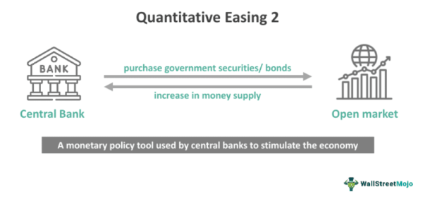

## Table of Contents

## What is Quantitative Easing (QE) and how does it differ from traditional monetary policy?

Quantitative Easing (QE) is a type of monetary policy used by central banks to stimulate the economy when traditional methods aren't working well. When a central bank uses QE, it buys large amounts of government bonds or other financial assets from banks and other financial institutions. This increases the money supply in the economy and lowers interest rates, making it cheaper for people and businesses to borrow money. The goal is to encourage spending and investment, which can help boost economic growth.

Traditional monetary policy, on the other hand, usually involves adjusting the central bank's interest rate to control the money supply and influence economic activity. When the economy is growing too fast and inflation is a concern, the central bank might raise interest rates to cool things down. If the economy is slowing down and needs a boost, the central bank might lower interest rates to encourage borrowing and spending. The key difference between QE and traditional monetary policy is that QE is used when interest rates are already very low and can't be lowered further, so the central bank has to find another way to stimulate the economy.

## What was the specific context that led to the implementation of Quantitative Easing 2 (QE2)?

Quantitative Easing 2 (QE2) was started by the Federal Reserve in November 2010. At that time, the U.S. economy was still recovering from the 2008 financial crisis. Even though the economy was getting better, it was not growing fast enough. Many people were still out of work, and businesses were not spending much money. The Federal Reserve wanted to help the economy grow faster and get more people back to work.

To do this, the Federal Reserve decided to use QE2. They planned to buy $600 billion in government bonds over eight months. By buying these bonds, the Federal Reserve put more money into the economy. This was supposed to make borrowing cheaper and encourage people and businesses to spend more. The hope was that this would help the economy grow faster and create more jobs.

## How does the mechanism of QE2 work, and what are the key steps involved in its implementation?

QE2 works by the Federal Reserve buying government bonds from banks and other financial institutions. When the Federal Reserve buys these bonds, it pays for them by adding money to the banks' accounts at the Federal Reserve. This means there is more money in the banking system. The banks can then use this extra money to lend to people and businesses. When borrowing becomes cheaper, people and businesses are more likely to take out loans to buy things or invest in new projects. This increased spending and investment can help the economy grow faster.

The key steps in implementing QE2 were straightforward. First, the Federal Reserve announced its plan to buy $600 billion in government bonds over eight months. This announcement was important because it let everyone know what the Federal Reserve was going to do, which helped set expectations in the financial markets. Then, the Federal Reserve started buying the bonds. They did this gradually over the eight months, making sure the money went into the economy at a steady pace. By doing this, the Federal Reserve aimed to keep interest rates low and encourage more spending and investment to help the economy recover.

## What are the primary objectives of QE2, and how do they aim to influence the economy?

The main goal of QE2 was to help the U.S. economy grow faster after the 2008 financial crisis. The economy was getting better, but it was not growing as quickly as the Federal Reserve wanted. They wanted to create more jobs and get businesses to spend more money. By buying $600 billion in government bonds, the Federal Reserve put more money into the economy. This was supposed to make borrowing cheaper, so people and businesses would take out more loans to buy things or start new projects.

When people and businesses spend more money, it helps the whole economy. More spending means more demand for goods and services, which can lead to more jobs and higher economic growth. The Federal Reserve hoped that by using QE2, they could get the economy moving faster and help more people find work. By keeping interest rates low and putting more money into the economy, they aimed to encourage the kind of spending and investment that would lead to a stronger recovery.

## How does QE2 affect the money supply and interest rates in the economy?

When the Federal Reserve did QE2, they bought a lot of government bonds from banks. This added more money to the banks' accounts at the Federal Reserve. With more money in their accounts, banks could lend more money to people and businesses. This increase in the money supply means there's more money available for people to borrow and spend.

Because there's more money to lend, interest rates can go down. When interest rates are lower, it's cheaper for people to borrow money. They might decide to take out loans to buy a house or a car, or for businesses to start new projects. Lower interest rates encourage more spending and investment, which helps the economy grow faster.

## What are the potential benefits of QE2 for economic growth and employment?

QE2 can help the economy grow by putting more money into it. When the Federal Reserve buys government bonds, it gives banks more money to lend. This means people and businesses can borrow money more easily and at lower interest rates. When borrowing is cheaper, people might buy more things like houses or cars, and businesses might start new projects. All this spending and investment can make the economy grow faster.

More spending and investment can also lead to more jobs. When businesses see that people are buying more, they might need to hire more workers to keep up with the demand. This can help lower unemployment and get more people working. So, by making borrowing cheaper and encouraging spending, QE2 can help the economy grow and create more jobs.

## What are the risks and potential negative side effects associated with QE2?

QE2 can have some risks and negative side effects. One big worry is that it might cause inflation. When the Federal Reserve puts more money into the economy, there's more money chasing the same amount of goods and services. This can make prices go up, which is bad for people because their money doesn't go as far. If inflation gets too high, it can hurt the economy and make life harder for everyone.

Another risk is that QE2 might not work as well as hoped. If people and businesses don't feel confident about the economy, they might not borrow and spend more even if interest rates are low. This means the extra money from QE2 might just sit in banks instead of helping the economy grow. Also, if people think the Federal Reserve is printing too much money, they might lose trust in the dollar, which can cause more problems.

Lastly, QE2 can lead to bigger gaps between rich and poor. When interest rates are low, people with money to invest can make more money, while people who need to borrow money might not see much benefit. This can make inequality worse, which is not good for society. So, while QE2 can help the economy, it also comes with some big risks that need to be watched carefully.

## How did QE2 impact inflation rates, and what measures were taken to manage these effects?

When the Federal Reserve did QE2, they were worried about inflation. Inflation is when prices go up, and it can happen when there's more money in the economy. During QE2, the Federal Reserve bought a lot of government bonds, which put more money into the economy. This could have made prices go up, but the Federal Reserve watched inflation closely to make sure it didn't get too high. They wanted to help the economy grow without causing too much inflation.

To manage the effects on inflation, the Federal Reserve used different tools. They kept an eye on how fast prices were going up and were ready to change their policies if needed. They also talked to people and businesses to understand how they were feeling about the economy. By doing this, they could adjust their actions to keep inflation under control. Overall, QE2 did not cause a big jump in inflation, thanks to the careful steps the Federal Reserve took.

## What was the impact of QE2 on financial markets, including stock prices and bond yields?

When the Federal Reserve did QE2, it had a big effect on financial markets. By buying a lot of government bonds, the Federal Reserve put more money into the economy. This made interest rates go down, which is good for people who want to borrow money. But it also made bond yields go down because when the Federal Reserve buys bonds, it pushes up their prices, and when bond prices go up, their yields go down. This made it cheaper for the government to borrow money, but it also meant that people who had invested in bonds didn't get as much money from them.

The stock market also felt the impact of QE2. When interest rates are low, people might decide to invest their money in stocks instead of keeping it in bonds or savings accounts. This extra money going into the stock market can push stock prices up. During QE2, the stock market did go up, which made a lot of people happy because their investments were worth more. But it also made some people worry that the stock market might be growing too fast and could crash if something went wrong. So, while QE2 helped the stock market, it also made it a bit riskier.

## How did QE2 influence international trade and exchange rates?

When the Federal Reserve did QE2, it put more money into the U.S. economy. This made the U.S. dollar weaker compared to other countries' money. A weaker dollar means that things made in the U.S. are cheaper for people in other countries to buy. This can help U.S. businesses sell more stuff to other countries, which is good for international trade. But it also means that things from other countries become more expensive for people in the U.S. to buy, which can make some people unhappy.

The weaker dollar from QE2 also had effects on other countries. When the U.S. dollar is weak, other countries' money becomes stronger. This can make it harder for those countries to sell their stuff to the U.S. because their products are more expensive. Some countries didn't like this and worried that it would hurt their own economies. They might even try to make their own money weaker to keep up, which can start a kind of money war. So, while QE2 helped the U.S. in some ways, it also caused some problems for international trade and made things tricky for other countries.

## What are the long-term effects of QE2 on the economy, and how sustainable are these effects?

QE2 had some long-term effects on the economy. By putting more money into the economy, it helped the U.S. grow faster after the 2008 financial crisis. This meant more jobs and more spending, which is good for everyone. But it also made the stock market go up a lot, which can be risky. If the stock market grows too fast, it might crash, and that can hurt a lot of people. Also, QE2 made the U.S. dollar weaker, which helped U.S. businesses sell more stuff to other countries. But it also made things from other countries more expensive for people in the U.S. to buy.

The sustainability of these effects is a big question. QE2 helped the economy in the short term, but it's not clear if it's good for the long term. One worry is that it might cause inflation if there's too much money in the economy. The Federal Reserve has to be careful to keep prices from going up too fast. Another worry is that QE2 might make the gap between rich and poor bigger. People with money to invest can make more money when interest rates are low, but people who need to borrow money might not see much benefit. So, while QE2 helped the economy recover, it's important to keep watching to make sure it doesn't cause more problems down the road.

## How does QE2 compare to other rounds of quantitative easing in terms of scale, impact, and effectiveness?

QE2 was the second round of quantitative easing done by the Federal Reserve. It was smaller than the first round, QE1, which happened right after the 2008 financial crisis. QE1 was a lot bigger because the economy was in really bad shape, and the Federal Reserve bought a lot more bonds to help it. QE2 was about $600 billion, which is still a lot of money, but it was less than QE1. Later, there were more rounds of QE, like QE3, which was even bigger and lasted longer than QE2. Each round of QE was different in how much money was used and how long it lasted, depending on what the economy needed at the time.

When we look at how well QE2 worked compared to other rounds, it did help the economy grow and create jobs, but it wasn't as powerful as QE1. QE1 was like a big shock to the system that helped stop the economy from getting worse. QE2 was more like a booster shot to keep the recovery going. It made borrowing cheaper and helped the stock market go up, but it didn't fix all the problems. Later rounds like QE3 had a bigger impact because they lasted longer and put even more money into the economy. Each round of QE had its own effects, and they all helped in different ways, but they also came with risks like inflation and making the rich richer.

## References & Further Reading

[1]: Bernanke, B. S. (2012). ["The Federal Reserve and the Financial Crisis."](https://archive.org/details/federalreservefi0000bern) Princeton University Press.

[2]: Krishnamurthy, A., & Vissing-Jorgensen, A. (2011). ["The Effects of Quantitative Easing on Interest Rates: Channels and Implications for Policy."](https://www.nber.org/papers/w17555) NBER Working Paper No. 17555.

[3]: Gagnon, J., Raskin, M., Remache, J., & Sack, B. (2010). ["Large-scale asset purchases by the Federal Reserve: Did they work?"](https://www.ijcb.org/journal/ijcb11q1a1.pdf) Brookings Papers on Economic Activity, 2010(2), 41-111.

[4]: Montier, J. (2010). ["The Little Book of Behavioral Investing: How Not to Be Your Own Worst Enemy."](https://archive.org/details/littlebookofbeha0000mont) Wiley.

[5]: Aldridge, I. (2013). ["High-Frequency Trading: A Practical Guide to Algorithmic Strategies and Trading Systems."](https://www.amazon.com/High-Frequency-Trading-Practical-Algorithmic-Strategies/dp/1118343506) Wiley.

[6]: Meyer, L. (2010). ["Quantitative Easing: Near-Term Success but Long-Term Risks."](https://ijbmi.org/papers/Vol(4)11/L04118594.pdf) Federal Reserve Bank of St. Louis Review.